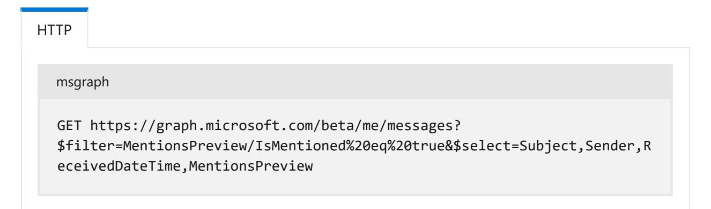
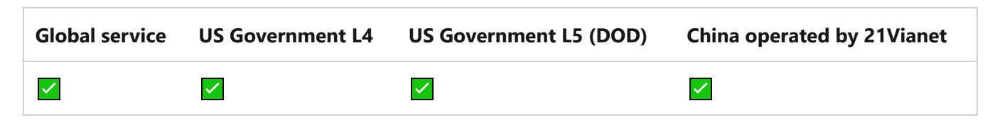
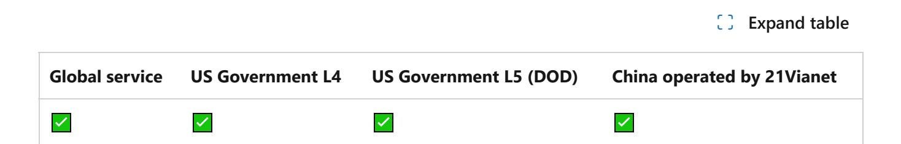
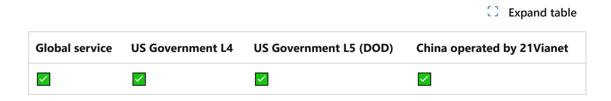
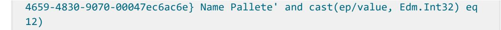
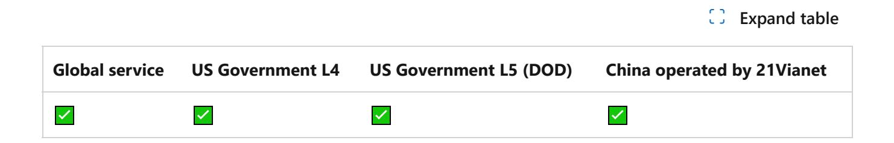
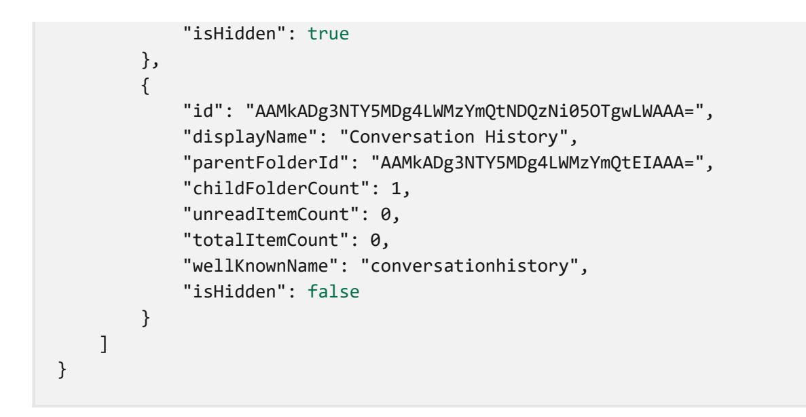
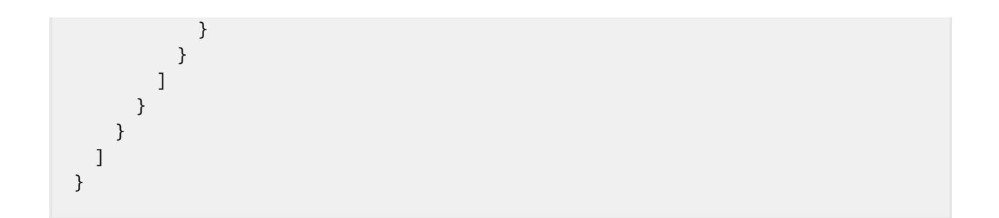
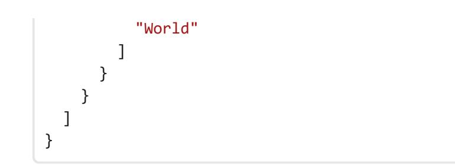

# **Use the Outlook mail REST API**

Article • 08/28/2021

#### ) **Important**

APIs under the /beta version in Microsoft Graph are subject to change. Use of these APIs in production applications is not supported. To determine whether an API is available in v1.0, use the **Version** selector.

Microsoft Graph lets your app get authorized access to a user's Outlook mail data in a personal or organization account. With the appropriate delegated or application mail permissions, your app can access the mail data of the signed-in user or any user in a tenant. For more information on access tokens, app registration, and delegated and application permissions, see Authentication and authorization basics.

The Microsoft Graph API supports accessing data in users' *primary* mailboxes and in shared mailboxes . The data can be calendar, mail, or personal contacts stored in a mailbox in the cloud on Exchange Online as part of Microsoft 365, or on Exchange onpremises in a hybrid deployment.

The API does *not* support accessing in-place archive mailboxes, not on Exchange Online nor on Exchange Server.

# **Using the mail REST API**

Mail API requests are performed on behalf of a user which can be identified by the user's **id** property (a unique GUID), email address, or the me shortcut alias for the signed-in user.

Email messages are represented by the message resource and organized in a mailFolder. Messages and mail folders are identified by their **id** property, obtainable from GET operations.

#### ) **Important**

In general, do not assume that **message** and **mailfolder** IDs are unique and always remain the same within a mailbox. They might change after certain actions such as copy or move. You can choose to use **immutable IDs** to retain the same ID as long as the message remains in the same mailbox, *with the exception of sending a draft message, and a few other scenarios*. See **lifetime of immutable IDs** for details.

Message bodies can be in HTML or text format.

You can use well-known folder names such as Inbox , Drafts , SentItems , or DeletedItems to identify certain mail folders that exist by default for all users. For a list of supported well-known folder names, see mailFolder resource type.

For example, you can get messages in the Outlook **Sent Items** folder of the signed-in user, without first getting the folder ID:

HTTP GET /me/mailFolders('SentItems')/messages?\$select=sender,subject

## **Common use cases**

The **message** resource exposes properties such as **categories**, **conversationId**, **flag**, and **importance** that correspond to features available in the UI, allowing apps to automate or integrate with the built-in Outlook user experience.

The Microsoft Graph API also provides methods and actions that support common use cases of messages.

| Use cases                                                                      | REST resources                  | See also                                           |
|--------------------------------------------------------------------------------|---------------------------------|----------------------------------------------------|
| User-centric actions                                                           |                                 |                                                    |
| Draft, read, reply,<br>forward, send, update,<br>or delete messages            | message                         | Methods of message                                 |
| Delegate another user<br>to send messages on<br>behalf of the mailbox<br>owner | message                         | Set the from and sender<br>properties in a message |
| Let user view more<br>important messages<br>first                              | inferenceClassificationOverride | Focused Inbox                                      |

ノ **Expand table**

| Get the MIME content<br>of a message or<br>message attachment<br>Send messages with<br>MIME content<br>Add, get, or delete<br>attachments of a<br>message | message<br>message<br>attachment,<br>fileAttachment,<br>itemAttachment,<br>referenceAttachment, | Get MIME content<br>Send MIME content<br>Methods of attachment            |
|-----------------------------------------------------------------------------------------------------------------------------------------------------------|-------------------------------------------------------------------------------------------------|---------------------------------------------------------------------------|
| Get language and time<br>zone choices for a user<br>Get or update a user's                                                                                | message<br>localeInfo,<br>timeZoneInformation<br>mailboxSettings,                               | supportedLanguages,<br>supportedTimeZones<br>Get user's mailbox settings, |
| automatic reply, locale,<br>time zone, or working<br>hours<br>Get MailTips of other                                                                       | automaticRepliesSetting,<br>localeInfo,<br>workingHours<br>user,                                | Update user's mailbox settings<br>Get MailTips                            |
| recipients' special<br>status, such as out-of<br>office<br>Alert user if mentioned                                                                        | mailTips<br>mention (preview)                                                                   | Get details of @-mentions in a                                            |
| in other messages<br>(preview)<br>Unsubscribe user from                                                                                                   | message (preview)                                                                               | message<br>Unsubscribe                                                    |
| an email distribution<br>list (preview)<br>Mail and folder                                                                                                |                                                                                                 |                                                                           |
| management                                                                                                                                                |                                                                                                 |                                                                           |
| Organize messages in a<br>mail folder hierarchy                                                                                                           | mailFolder                                                                                      | Methods of mailFolder                                                     |
| Categorize messages                                                                                                                                       | outlookCategory                                                                                 | Methods of outlookCategory                                                |
| Use Inbox rules to<br>automate actions such                                                                                                               | messageRule                                                                                     | Methods of messageRule                                                    |

| Use cases                                                             | REST resources                                                         | See also                                                                       |
|-----------------------------------------------------------------------|------------------------------------------------------------------------|--------------------------------------------------------------------------------|
| as forwarding specific<br>incoming messages                           |                                                                        |                                                                                |
| Get Internet message<br>headers of a message                          | message                                                                | Get the<br>internetMessageHeaders<br>property of a message.                    |
| Search and filter<br>messages                                         | message                                                                | Query parameters                                                               |
| Get notified of changes<br>to messages in a folder                    | subscription                                                           | Working with webhooks in<br>Microsoft Graph                                    |
| Synchronize messages<br>or mail folder hierarchy                      | message                                                                | Get incremental changes to<br>messages in a folder                             |
| App development                                                       |                                                                        |                                                                                |
| Add custom app data<br>as Internet message<br>headers of a message    | message                                                                | Add custom data to the<br>internetMessageHeaders<br>collection of the message. |
| Add custom app data<br>to a message by using<br>extensions            | openTypeExtension,<br>schemaExtension                                  | Add custom data to resources<br>using extensions                               |
| Access custom data for<br>under-exposed<br>Outlook MAPI<br>properties | singleValueLegacyExtendedProperty,<br>multiValueLegacyExtendedProperty | Outlook extended properties<br>overview                                        |

## **Next steps**

The mail API can open up new ways for you to engage with users:

- Outlook mail API overview
- Drill down on the methods, properties, and relationships of the message and mailFolder resources.
- Try the API in the Graph Explorer.

## **Feedback**

**Was this page helpful?**

Provide product feedback

# **message resource type**

Namespace: microsoft.graph

#### ) **Important**

APIs under the /beta version in Microsoft Graph are subject to change. Use of these APIs in production applications is not supported. To determine whether an API is available in v1.0, use the **Version** selector.

A message in a mailbox folder.

The maximum total number of recipients included in the **toRecipients**, **ccRecipients**, and **bccRecipients** properties for a single email message sent from an Exchange Online mailbox is 500. For more information, see sending limits.

This resource supports:

- Adding your own data as custom Internet message headers. Add custom headers only when creating a message, and name them starting with "x-". After the message is sent, you can't modify the headers. To get the headers of a message, apply the \$select query parameter in a get message operation.
- Adding your own data as custom properties as extensions.
- Subscribing to change notifications.
- Using delta query to track incremental additions, deletions, and updates, by providing a delta function.

## **Methods**

ノ **Expand table**

| Method                  | Return type        | Description                                                                                                |
|-------------------------|--------------------|------------------------------------------------------------------------------------------------------------|
|                         |                    |                                                                                                            |
| List messages           | message collection | Get all the messages in the signed-in user's mailbox (including<br>the Deleted Items and Clutter folders). |
| Create draft<br>message | message            | Create a draft of a new message.                                                                           |
| Get message             | message            | Read properties and relationships of message object.                                                       |
| Update<br>message       | message            | Update message object.                                                                                     |

| Create draft to<br>reply<br>Create draft to<br>reply-all | Message<br>Message | Create a draft of a reply message to include a comment or<br>update any message properties all in one createReply call. You<br>can then update or send the draft.<br>Create a draft of a reply-all message to include a comment or<br>update any message properties, all in one createReplyAll call.<br>You can then update or send the draft. |
|----------------------------------------------------------|--------------------|------------------------------------------------------------------------------------------------------------------------------------------------------------------------------------------------------------------------------------------------------------------------------------------------------------------------------------------------|
| Get message<br>delta                                     | message collection | Get a set of messages that were added, deleted, or updated in<br>a specified folder.                                                                                                                                                                                                                                                           |
| Forward<br>message                                       | None               | Forward a message, add a comment or modify any updateable<br>properties all in one forward call. The message is then saved in<br>the Sent Items folder.                                                                                                                                                                                        |
| Move message                                             | Message            | Move the message to a folder. This API creates a new copy of<br>the message in the destination folder.                                                                                                                                                                                                                                         |
| Reply to<br>message                                      | None               | Reply to the sender of a message, add a comment or modify<br>any updateable properties all in one reply call. The message is<br>then saved in the Sent Items folder.                                                                                                                                                                           |
| Reply-all to<br>message                                  | None               | Reply to all the recipients of a message by specifying a<br>comment and modifying any updateable properties for the<br>reply, all by using the replyAll method. The message is then<br>saved in the Sent Items folder.                                                                                                                         |
| Send draft<br>message                                    | None               | Sends a previously created message draft. The message is then<br>saved in the Sent Items folder.                                                                                                                                                                                                                                               |
| Recall message                                           | message            | Recall a message in the specified user's mailbox Sent Items<br>folder.                                                                                                                                                                                                                                                                         |
| Unsubscribe                                              | None               | Send a message using the data and address specified in the<br>first mailto command in the List-Unsubscribe header.                                                                                                                                                                                                                             |
| Permanently<br>delete                                    | None               | Permanently delete a message and place it in the Purges folder<br>in the Recoverable Items folder in the user's mailbox.                                                                                                                                                                                                                       |
| Report message                                           | message            | Report a message as junk, phishing, or not junk, which<br>improves mail filtering.                                                                                                                                                                                                                                                             |

| Method                              | Return type                     | Description                                                                                                                                                                                                                                                                                      |
|-------------------------------------|---------------------------------|--------------------------------------------------------------------------------------------------------------------------------------------------------------------------------------------------------------------------------------------------------------------------------------------------|
| Mark as junk<br>(deprecated)        | message                         | Mark a message as junk. This API adds the sender to the list of<br>blocked senders and moves the message to the Junk Email<br>folder, when moveToJunk is true<br>. This API is deprecated and<br>will stop returning data on December 30, 2025. Going forward<br>use the reportMessage API.      |
| Mark as not<br>junk<br>(deprecated) | message                         | Mark a message as not junk. This API removes the sender from<br>the list of blocked senders and moves the message to the<br>Inbox folder, when moveToInbox is true<br>. This API is<br>deprecated and will stop returning data on December 30,<br>2025. Going forward use the reportMessage API. |
| Attachments                         |                                 |                                                                                                                                                                                                                                                                                                  |
| List attachments                    | Attachment<br>collection        | Get all attachments on a message.                                                                                                                                                                                                                                                                |
| Add attachment                      | Attachment                      | Add a new attachment to a message by posting to the<br>attachments collection.                                                                                                                                                                                                                   |
| Open<br>extensions                  |                                 |                                                                                                                                                                                                                                                                                                  |
| Create open<br>extension            | openTypeExtension               | Create an open extension and add custom properties to a new<br>or existing resource.                                                                                                                                                                                                             |
| Get open<br>extension               | openTypeExtension<br>collection | Get an open extension identified by the extension name.                                                                                                                                                                                                                                          |
| Extended<br>properties              |                                 |                                                                                                                                                                                                                                                                                                  |
| Create single<br>value property     | message                         | Create one or more single-value extended properties in a new<br>or existing message.                                                                                                                                                                                                             |
| Get single-value<br>property        | message                         | Get messages that contain a single-value extended property<br>by using \$expand or \$filter                                                                                                                                                                                                      |
| Create multi<br>value property      | message                         | Create one or more multi-value extended properties in a new<br>or existing message.                                                                                                                                                                                                              |
| Get multi-value<br>property         | message                         | Get a message that contains a multi-value extended property<br>by using \$expand .                                                                                                                                                                                                               |

# **Properties**

| Property          | Type                 | Description                                                                                                                                                                                                                                                                                                                  |
|-------------------|----------------------|------------------------------------------------------------------------------------------------------------------------------------------------------------------------------------------------------------------------------------------------------------------------------------------------------------------------------|
| bccRecipients     | recipient collection | The Bcc: recipients for the message.                                                                                                                                                                                                                                                                                         |
| body              | itemBody             | The body of the message. It can be in HTML<br>or text format. Find out about safe HTML in a<br>message body.                                                                                                                                                                                                                 |
| bodyPreview       | String               | The first 255 characters of the message body.<br>It is in text format. If the message contains<br>instances of mention, this property would<br>contain a concatenation of these mentions as<br>well.                                                                                                                         |
| ccRecipients      | recipient collection | The Cc: recipients for the message.                                                                                                                                                                                                                                                                                          |
| changeKey         | String               | The version of the message.                                                                                                                                                                                                                                                                                                  |
| conversationId    | String               | The ID of the conversation the email belongs<br>to.                                                                                                                                                                                                                                                                          |
| conversationIndex | Edm.Binary           | Indicates the position of the message within<br>the conversation.                                                                                                                                                                                                                                                            |
| createdDateTime   | DateTimeOffset       | The date and time the message was created.                                                                                                                                                                                                                                                                                   |
|                   |                      | The date and time information uses ISO 8601<br>format and is always in UTC time. For<br>example, midnight UTC on Jan 1, 2014 is<br>2014-01-01T00:00:00Z .                                                                                                                                                                    |
| flag              | followupFlag         | The flag value that indicates the status, start<br>date, due date, or completion date for the<br>message.                                                                                                                                                                                                                    |
| from              | recipient            | The owner of the mailbox from which the<br>message is sent. In most cases, this value is<br>the same as the sender property, except for<br>sharing or delegation scenarios. The value<br>must correspond to the actual mailbox used.<br>Find out more about setting the from and<br>sender properties of a message.          |
| hasAttachments    | Boolean              | Indicates whether the message has<br>attachments. This property doesn't include<br>inline attachments, so if a message contains<br>only inline attachments, this property is false.<br>To verify the existence of inline attachments,<br>parse the body property to look for a src<br>attribute, such as </img<> |

| importance<br>inferenceClassification | importance<br>inferenceClassificationType | calendar) to another. To change this behavior,<br>use the Prefer:<br>IdType="ImmutableId" header.<br>See Get immutable identifiers for Outlook<br>resources for more information. Read-only.<br>The importance of the message. The possible<br>values are: low<br>, normal<br>, and high<br>The classification of the message for the user, |
|---------------------------------------|-------------------------------------------|---------------------------------------------------------------------------------------------------------------------------------------------------------------------------------------------------------------------------------------------------------------------------------------------------------------------------------------------|
|                                       |                                           | based on inferred relevance or importance, or<br>on an explicit override. Possible values are:<br>focused , other                                                                                                                                                                                                                           |
| internetMessageHeaders                | internetMessageHeader<br>collection       | A collection of message headers defined by<br>RFC5322<br>. The set includes message headers<br>indicating the network path taken by a<br>message from the sender to the recipient. It<br>can also contain custom message headers<br>that hold app data for the message.<br>Returned only on applying a \$select query<br>option. Read-only. |
| internetMessageId                     | String                                    | The message ID in the format specified by<br>RFC5322<br>. Updatable only if isDraft is true.                                                                                                                                                                                                                                                |
| isDeliveryReceiptRequested            | Boolean                                   | Indicates whether a read receipt is requested<br>for the message.                                                                                                                                                                                                                                                                           |
| isDraft                               | Boolean                                   | Indicates whether the message is a draft. A<br>message is a draft if it hasn't been sent yet.                                                                                                                                                                                                                                               |
| isRead                                | Boolean                                   | Indicates whether the message has been read.                                                                                                                                                                                                                                                                                                |
| isReadReceiptRequested                | Boolean                                   | Indicates whether a read receipt is requested<br>for the message.                                                                                                                                                                                                                                                                           |
| lastModifiedDateTime                  | DateTimeOffset                            | The date and time the message was last<br>changed.                                                                                                                                                                                                                                                                                          |
|                                       |                                           | The date and time information uses ISO 8601<br>format and is always in UTC time. For<br>example, midnight UTC on Jan 1, 2014 is<br>2014-01-01T00:00:00Z .                                                                                                                                                                                   |

| Property         | Type                 | Description                                                                                                                                                                                                                                                                                                                                                                                                                      |
|------------------|----------------------|----------------------------------------------------------------------------------------------------------------------------------------------------------------------------------------------------------------------------------------------------------------------------------------------------------------------------------------------------------------------------------------------------------------------------------|
| mentionsPreview  | mentionsPreview      | Information about mentions in the message.<br>When processing a GET /messages request,<br>the server sets this property and includes it in<br>the response by default. The server returns<br>null if there are no mentions in the message.<br>Optional.                                                                                                                                                                          |
| parentFolderId   | String               | The unique identifier for the message's parent<br>mailFolder.                                                                                                                                                                                                                                                                                                                                                                    |
| receivedDateTime | DateTimeOffset       | The date and time the message was received.                                                                                                                                                                                                                                                                                                                                                                                      |
|                  |                      | The date and time information uses ISO 8601<br>format and is always in UTC time. For<br>example, midnight UTC on Jan 1, 2014 is<br>2014-01-01T00:00:00Z .                                                                                                                                                                                                                                                                        |
| replyTo          | recipient collection | The email addresses to use when replying.                                                                                                                                                                                                                                                                                                                                                                                        |
| sender           | recipient            | The account that is actually used to generate<br>the message. In most cases, this value is the<br>same as the from property. You can set this<br>property to a different value when sending a<br>message from a shared mailbox, for a shared<br>calendar, or as a delegate. In any case, the<br>value must correspond to the actual mailbox<br>used. Find out more about setting the from<br>and sender properties of a message. |
| sentDateTime     | DateTimeOffset       | The date and time the message was sent.                                                                                                                                                                                                                                                                                                                                                                                          |
|                  |                      | The date and time information uses ISO 8601<br>format and is always in UTC time. For<br>example, midnight UTC on Jan 1, 2014 is<br>2014-01-01T00:00:00Z .                                                                                                                                                                                                                                                                        |
| subject          | String               | The subject of the message.                                                                                                                                                                                                                                                                                                                                                                                                      |
| toRecipients     | recipient collection | The To: recipients for the message.                                                                                                                                                                                                                                                                                                                                                                                              |
| uniqueBody       | itemBody             | The part of the body of the message that is<br>unique to the current message. uniqueBody is<br>not returned by default but can be retrieved<br>for a given message by use of the ?<br>\$select=uniqueBody query. It can be in HTML<br>or text format.                                                                                                                                                                            |
| unsubscribeData  | String               | The valid entries parsed from the List                                                                                                                                                                                                                                                                                                                                                                                           |

| Property           | Type    | Description                                                                                                                                                                                                                                                                                                      |
|--------------------|---------|------------------------------------------------------------------------------------------------------------------------------------------------------------------------------------------------------------------------------------------------------------------------------------------------------------------|
|                    |         | mail command in the List-Unsubscribe header<br>if UnsubscribeEnabled property is true.                                                                                                                                                                                                                           |
| unsubscribeEnabled | Boolean | Indicates whether the message is enabled for<br>unsubscribe. Its valueTrue if the list<br>Unsubscribe header conforms to rfc-2369.                                                                                                                                                                               |
| webLink            | String  | The URL to open the message in Outlook on<br>the web.                                                                                                                                                                                                                                                            |
|                    |         | You can append an ispopout argument to the<br>end of the URL to change how the message is<br>displayed. If ispopout is not present or if it is<br>set to 1, then the message is shown in a<br>popout window. If ispopout is set to 0, the<br>browser shows the message in the Outlook on<br>the web review pane. |
|                    |         | The message opens in the browser if you are<br>signed in to your mailbox via Outlook on the<br>web. You are prompted to sign in if you are<br>not already signed in with the browser.                                                                                                                            |
|                    |         | This URL cannot be accessed from within an<br>iFrame.                                                                                                                                                                                                                                                            |

## **Relationships**

#### ノ **Expand table**

| attachments | Attachment collection | The fileAttachment and<br>itemAttachment attachments for<br>the message.                                                                                       |
|-------------|-----------------------|----------------------------------------------------------------------------------------------------------------------------------------------------------------|
| extensions  | Extension collection  | The collection of open<br>extensions defined for the<br>message. Nullable.                                                                                     |
| mentions    | mention collection    | A collection of mentions in the<br>message, ordered by the<br>createdDateTime from the<br>newest to the oldest. By default,<br>a GET /messages does not return |

| Relationship                  | Type                                            | Description                                                                                 |
|-------------------------------|-------------------------------------------------|---------------------------------------------------------------------------------------------|
|                               |                                                 | this property unless you apply<br>\$expand on the property.                                 |
| multiValueExtendedProperties  | multiValueLegacyExtendedProperty<br>collection  | The collection of multi-value<br>extended properties defined for<br>the message. Nullable.  |
| singleValueExtendedProperties | singleValueLegacyExtendedProperty<br>collection | The collection of single-value<br>extended properties defined for<br>the message. Nullable. |

## **JSON representation**

The following is a JSON representation of the resource

| JSON                                                                                                                                                                                                                                                                                                                                                                                                                                                                                                                                                                                                                                                                                                                                                                                                                                                                                                                                                         |
|--------------------------------------------------------------------------------------------------------------------------------------------------------------------------------------------------------------------------------------------------------------------------------------------------------------------------------------------------------------------------------------------------------------------------------------------------------------------------------------------------------------------------------------------------------------------------------------------------------------------------------------------------------------------------------------------------------------------------------------------------------------------------------------------------------------------------------------------------------------------------------------------------------------------------------------------------------------|
| {<br>"bccRecipients": [{"@odata.type": "microsoft.graph.recipient"}],<br>"body": {"@odata.type": "microsoft.graph.itemBody"},<br>"bodyPreview": "string",<br>"categories": ["string"],<br>"ccRecipients": [{"@odata.type": "microsoft.graph.recipient"}],<br>"changeKey": "string",<br>"conversationId": "string",<br>"conversationIndex": "String (binary)",<br>"createdDateTime": "String (timestamp)",<br>"flag": {"@odata.type": "microsoft.graph.followupFlag"},<br>"from": {"@odata.type": "microsoft.graph.recipient"},<br>"hasAttachments": true,<br>"id": "string (identifier)",<br>"importance": "String",<br>"inferenceClassification": "String",<br>"internetMessageHeaders": [{"@odata.type":<br>"microsoft.graph.internetMessageHeader"}],<br>"internetMessageId": "String",<br>"isDeliveryReceiptRequested": true,<br>"isDraft": true,<br>"isRead": true,<br>"isReadReceiptRequested": true,<br>"lastModifiedDateTime": "String (timestamp)", |
| "mentionsPreview": {"@odata.type": "microsoft.graph.mentionsPreview"},                                                                                                                                                                                                                                                                                                                                                                                                                                                                                                                                                                                                                                                                                                                                                                                                                                                                                       |
| "parentFolderId": "string",<br>"receivedDateTime": "String (timestamp)",                                                                                                                                                                                                                                                                                                                                                                                                                                                                                                                                                                                                                                                                                                                                                                                                                                                                                     |
| "replyTo": [{"@odata.type": "microsoft.graph.recipient"}],                                                                                                                                                                                                                                                                                                                                                                                                                                                                                                                                                                                                                                                                                                                                                                                                                                                                                                   |
| "sender": {"@odata.type": "microsoft.graph.recipient"},                                                                                                                                                                                                                                                                                                                                                                                                                                                                                                                                                                                                                                                                                                                                                                                                                                                                                                      |
| "sentDateTime": "String (timestamp)",                                                                                                                                                                                                                                                                                                                                                                                                                                                                                                                                                                                                                                                                                                                                                                                                                                                                                                                        |
| "subject": "string",                                                                                                                                                                                                                                                                                                                                                                                                                                                                                                                                                                                                                                                                                                                                                                                                                                                                                                                                         |

```
 "uniqueBody": {"@odata.type": "microsoft.graph.itemBody"},
 "unsubscribeData": "string",
 "unsubscribeEnabled": true,
 "webLink": "string",
 "attachments": [{"@odata.type": "microsoft.graph.attachment"}],
 "extensions": [{"@odata.type": "microsoft.graph.extension"}],
 "mentions": [{"@odata.type": "microsoft.graph.mention"}],
 "multiValueExtendedProperties": [{"@odata.type": 
"microsoft.graph.multiValueLegacyExtendedProperty"}],
 "singleValueExtendedProperties": [{"@odata.type": 
"microsoft.graph.singleValueLegacyExtendedProperty"}]
}
```

## **Related content**

- Get mailbox settings
- Update mailbox settings
- Use delta query to track changes in Microsoft Graph data
- Get incremental changes to messages in a folder
- Add custom data to resources using extensions
- Add custom data to users using open extensions
- Add custom data to groups using schema extensions

**Last updated on 08/21/2024**

# **List messages**

Article • 08/23/2023

#### Namespace: microsoft.graph

#### ) **Important**

APIs under the /beta version in Microsoft Graph are subject to change. Use of these APIs in production applications is not supported. To determine whether an API is available in v1.0, use the **Version** selector.

Get the messages in the signed-in user's mailbox (including the Deleted Items and Clutter folders).

Depending on the page size and mailbox data, getting messages from a mailbox can incur multiple requests. The default page size is 10 messages. Use \$top to customize the page size, within the range of 1 and 1000.

To improve the operation response time, use \$select to specify the exact properties you need; see example 1 below. Fine-tune the values for \$select and \$top , especially when you must use a larger page size, as returning a page with hundreds of messages each with a full response payload may trigger the gateway timeout (HTTP 504).

To get the next page of messages, simply apply the entire URL returned in @odata.nextLink to the next get-messages request. This URL includes any query parameters you may have specified in the initial request.

Do not try to extract the \$skip value from the @odata.nextLink URL to manipulate responses. This API uses the \$skip value to keep count of all the items it has gone through in the user's mailbox to return a page of message-type items. It's therefore possible that even in the initial response, the \$skip value is larger than the page size. For more information, see Paging Microsoft Graph data in your app.

You can filter on the messages and get only those that include a mention of the signedin user. See an example below. By default, the GET /me/messages operation does not return the **mentions** property. Use the \$expand query parameter to find details of each mention in a message.

There are two scenarios where an app can get messages in another user's mail folder:

If the app has application permissions, or,

If the app has the appropriate delegated permissions from one user, and another user has shared a mail folder with that user, or, has given delegated access to that user. See details and an example.

This API is available in the following national cloud deployments.

|                        | China operated by |
|------------------------|-------------------|
| service<br>L4<br>(DOD) | 21Vianet          |

# **Permissions**

Choose the permission or permissions marked as least privileged for this API. Use a higher privileged permission or permissions only if your app requires it. For details about delegated and application permissions, see Permission types. To learn more about these permissions, see the permissions reference.

ノ **Expand table**

| Permission type                           | Least privileged<br>permissions | Higher privileged<br>permissions |
|-------------------------------------------|---------------------------------|----------------------------------|
| Delegated (work or school<br>account)     | Mail.ReadBasic                  | Mail.ReadWrite, Mail.Read        |
| Delegated (personal Microsoft<br>account) | Mail.ReadBasic                  | Mail.ReadWrite, Mail.Read        |
| Application                               | Mail.ReadBasic.All              | Mail.ReadWrite, Mail.Read        |

# **HTTP request**

To get all the messages in a user's mailbox:

HTTP

```
GET /me/messages
GET /users/{id | userPrincipalName}/messages
```

To get messages in a specific folder in the user's mailbox:

```
HTTP
```

HTTP

```
GET /me/mailFolders/{id}/messages
GET /users/{id | userPrincipalName}/mailFolders/{id}/messages
```

To get all the messages in the user's mailbox that include a **mention** of the user:

```
GET /me/messages?$filter=mentionsPreview/isMentioned eq true
GET /users/{id | userPrincipalName}/messages?
$filter=mentionsPreview/isMentioned eq true
```

# **Optional query parameters**

This method supports the OData Query Parameters to help customize the response.

You can use the \$filter query parameter on the **mentionsPreview** property to get those messages that mention the signed-in user.

## **Using filter and orderby in the same query**

When using \$filter and \$orderby in the same query to get messages, make sure to specify properties in the following ways:

- 1. Properties that appear in \$orderby must also appear in \$filter .
- 2. Properties that appear in \$orderby are in the same order as in \$filter .
- 3. Properties that are present in \$orderby appear in \$filter before any properties that aren't.

Failing to do this results in the following error:

- Error code: InefficientFilter
- Error message: The restriction or sort order is too complex for this operation.

## **Request headers**

| Name<br>Authorization                   | Type<br>string | Description<br>Bearer {token}. Required. Learn more about authentication and                                                                                                                                           |
|-----------------------------------------|----------------|------------------------------------------------------------------------------------------------------------------------------------------------------------------------------------------------------------------------|
|                                         |                | authorization.                                                                                                                                                                                                         |
| Prefer:<br>outlook.body<br>content-type | string         | The format of the body and uniqueBody properties to be returned<br>in. Values can be "text" or "html". If the header is not specified, the<br>body and uniqueBody properties are returned in HTML format.<br>Optional. |

## **Request body**

Don't supply a request body for this method.

## **Response**

If successful, this method returns a 200 OK response code and collection of message objects in the response body.

# **Examples**

## **Example 1: List all messages**

## **Request**

The first example gets the default, top 10 messages in the signed-in user's mailbox. It uses \$select to return a subset of the properties of each message in the response.

|                                                                          | msgraph |  |
|--------------------------------------------------------------------------|---------|--|
| GET https://graph.microsoft.com/beta/me/messages?\$select=sender,subject |         |  |

## **Response**

The following example shows the response. To get the next page of messages, apply the URL returned in @odata.nextLink to a subsequent GET request.

HTTP

```
HTTP/1.1 200 OK
Content-type: application/json
{
 "@odata.context":
"https://graph.microsoft.com/beta/$metadata#users('bb8775a4-4d8c-42cf-a1d4-
4d58c2bb668f')/messages(sender,subject)",
 "value": [
 {
 "@odata.etag": "W/\"CQAAABYAAADHcgC8Hl9tRZ/hc1wEUs1TAAAwR4Hg\"",
 "id": "AAMkAGUAAAwTW09AAA=",
 "subject": "You have late tasks!",
 "sender": {
 "emailAddress": {
 "name": "Microsoft Planner",
 "address": "noreply@Planner.Office365.com"
 }
 }
 }
 ]
}
```

## **Example 2: Use \$filter to get all messages satisfying a specific condition**

### **Request**

The next example filters all messages in the signed-in user's mailbox for those that mention the user. It also uses \$select to return a subset of the properties of each message in the response.

The following example also incorporates URL encoding for the space characters in the query parameter string.



### **Response**

The following example shows the response.

**Note:** The response object shown here might be shortened for readability.

```
HTTP
HTTP/1.1 200 OK
Content-type: application/json
{
"@odata.context":"https://graph.microsoft.com/beta/$metadata#me/messages(sub
ject,sender,receivedDateTime,mentionsPreview)",
 "value":[
 {
 "@odata.id":"https://graph.microsoft.com/beta/users('266efe5a-0fd7-
4edd-877b-b2d1e561f193@ae01a323-3934-4475-a32d-
af1274312bb0')/messages('AQMkADJmMTUAAAgVZAAAA')",
 "@odata.etag":"W/\"CQAAABYAAAAPFhK2FclcRbABBJhCde8iAAAAAATI\"",
 "id":"AQMkADJmMTUAAAgVZAAAA",
 "receivedDateTime":"2016-07-21T07:40:21Z",
 "subject":"Re: Start planning soon",
 "sender":{
 "emailAddress":{
 "name":"Adele Vance",
 "address":"AdeleV@contoso.com"
 }
 },
 "mentionsPreview":{
 "isMentioned":true
 }
 }
 ]
}
```

## **Example 3: Use prefer header to get the message body and uniqueBody is text format**

## **Request**

The third example shows how to use a Prefer: outlook.body-content-type="text" header to get the **body** and **uniqueBody** properties of each message in text format.

HTTP

```
msgraph
```

```
GET https://graph.microsoft.com/beta/me/messages?
$select=subject,body,bodyPreview,uniqueBody
Prefer: outlook.body-content-type="text"
```

### **Response**

The following example shows the response.

HTTP

```
HTTP/1.1 200 OK
Content-type: application/json
{
"@odata.context":"https://graph.microsoft.com/beta/$metadata#users('cd209b0b
-3f83-4c35-82d2-
d88a61820480')/messages(subject,body,bodyPreview,uniqueBody)",
 "value":[
 {
 "@odata.type":"#microsoft.graph.eventMessageRequest",
 "@odata.etag":"W/\"CwAAABYAAABmWdbhEgBXTophjCWt81m9AAAoZYj5\"",
 "id":"AAMkAGIAAAoZCfIAAA=",
 "subject":"Orientation ",
 "bodyPreview":"Dana, this is the time you selected for our
orientation. Please bring the notes I sent you.",
 "body":{
 "contentType":"text",
 "content":"Dana, this is the time you selected for our orientation. 
Please bring the notes I sent you.\r\n"
 },
 "uniqueBody":{
 "contentType":"text",
 "content":"Dana, this is the time you selected for our orientation. 
Please bring the notes I sent you.\r\n"
 }
 }
 ]
}
```

# **Feedback**

Provide product feedback

# **Create Message**

Article • 10/27/2023

#### Namespace: microsoft.graph

#### ) **Important**

APIs under the /beta version in Microsoft Graph are subject to change. Use of these APIs in production applications is not supported. To determine whether an API is available in v1.0, use the **Version** selector.

Create a draft of a new message in either JSON or MIME format.

When using JSON format, you can:

- Include an attachment.
- Use a mention to call out another user in the new message.
- Update the draft later to add content to the **body** or change other message properties.

When using MIME format:

- Provide the applicable Internet message headers and the MIME content , all encoded in **base64** format in the request body.
- \* Add any attachments and S/MIME properties to the MIME content.

By default, this operation saves the draft in the Drafts folder.

Send the draft message in a subsequent operation.

Alternatively, send a new message in a single action, or create a draft to forward, to reply or to reply-all to an existing message.

\* **Note:** S/MIME message payloads are currently limited to 4 MB. Submission attempts that exceed this limit will result in an HTTP 413 Request Entity Too Large error response.

This API is available in the following national cloud deployments.

| Global  | US Government | US Government L5 | China operated by |
|---------|---------------|------------------|-------------------|
| service | L4            | (DOD)            | 21Vianet          |
|         |               |                  |                   |

## **Permissions**

One of the following permissions are required to call this API. To learn more, including how to choose permissions, see Permissions.

ノ **Expand table**

| Permission type                        | Permissions (from least to most privileged) |
|----------------------------------------|---------------------------------------------|
| Delegated (work or school account)     | Mail.ReadWrite                              |
| Delegated (personal Microsoft account) | Mail.ReadWrite                              |
| Application                            | Mail.ReadWrite                              |

## **HTTP request**

HTTP POST /me/messages POST /users/{id|userPrincipalName}/messages POST /me/mailFolders/{id}/messages POST /users/{id | userPrincipalName}/mailFolders/{id}/messages

## **Request headers**

ノ **Expand table**

| Name          | Description                                                                                                                          |
|---------------|--------------------------------------------------------------------------------------------------------------------------------------|
| Authorization | Bearer {token}. Required. Learn more about authentication and authorization.                                                         |
| Content-Type  | The nature of the data in the body of an entity. Required.<br>Use application/json for a JSON object and text/plain for MIME content |

## **Request body**

When using JSON format, provide a JSON representation of the message object.

When specifying the body in MIME format, provide the MIME content with the applicable Internet message headers ("To", "CC", "BCC", "Subject"), all encoded in **base64** format in the request body.

To use **mention** to call out another user in the new message:

- Include the required **toRecipients** property, the **mentions** property, and any writable message properties in the request body.
- For each mention in the **mentions** property, you must specify the **mentioned** property.

Since the **message** resource supports extensions, you can use the POST operation and add custom properties with your own data to the message while creating it.

## **Response**

If successful, this method returns a 201 Created response code and a message object in the response body.

If the request body includes malformed MIME content, this method returns 400 Bad request and the following error message: "Invalid base64 string for MIME content".

## **Examples**

## **Example 1: Create a message draft in JSON format**

## **Request**

The following example shows a request to create a draft of a new message.

| HTTP                                                                                |  |
|-------------------------------------------------------------------------------------|--|
| HTTP                                                                                |  |
| POST https://graph.microsoft.com/beta/me/messages<br>Content-type: application/json |  |
| {<br>"subject":"Did you see last night's game?",<br>"importance":"Low",             |  |

```
 "contentType":"HTML",
 "content":"They were <b>awesome</b>!"
 },
 "toRecipients":[
 {
 "emailAddress":{
 "address":"AdeleV@contoso.com"
 }
 }
 ]
}
```

In the request body, supply a JSON representation of message object.

### **Response**

The following example shows the response. Note: The response object shown here might be shortened for readability.

```
HTTP
HTTP/1.1 201 Created
Content-type: application/json
{
"@odata.context":"https://graph.microsoft.com/beta/$metadata#users('ad787b4f
-1fda-4523-8e48-ffedb7f4635f')/messages/$entity",
 "@odata.etag":"W/\"CQAAABYAAAAmXr9SsE/UR4PcnTZcg7qWAAAFS12t\"",
 "id":"AAMkAGRWAAAFSmKXAAA=",
 "createdDateTime":"2017-12-23T07:29:57Z",
 "lastModifiedDateTime":"2017-12-23T07:29:58Z",
 "changeKey":"CQAAABYAAAAmXr9SsE/UR4PcnTZcg7qWAAAFS12t",
 "categories":[
 ],
 "receivedDateTime":"2017-12-23T07:29:58Z",
 "sentDateTime":"2017-12-23T07:29:58Z",
 "hasAttachments":false,
 "internetMessageId":"<MWHPR130@MWHPR130.namprd13.prod.outlook.com>",
 "subject":"Did you see last night's game?",
 "bodyPreview":"They were awesome!",
 "importance":"low",
 "parentFolderId":"AAMkAGRWAAAAAAEPAAA=",
 "conversationId":"AAQkAGRVYAsRJrRdc_mWNaxU=",
 "conversationIndex":"AQHTe7/VAniOJVgCxEmtF1z6ZY1rFQ==",
 "isDeliveryReceiptRequested":false,
 "isReadReceiptRequested":false,
 "isRead":true,
 "isDraft":true,
```

```
ItemID=AAMkAGRWAAAFSmKXAAA%3D&exvsurl=1&viewmodel=ReadMessageItem",
 "inferenceClassification":"focused",
 "unsubscribeData":[
 ],
 "unsubscribeEnabled":false,
 "mentionsPreview":null,
 "body":{
 "contentType":"html",
 "content":"<html>\r\n<head>\r\n<meta http-equiv=\"Content-Type\"
content=\"text/html; charset=utf-8\">\r\n<meta content=\"text/html;
charset=us-ascii\">\r\n</head>\r\n<body>\r\nThey were
<b>awesome</b>!\r\n</body>\r\n</html>\r\n"
 },
 "toRecipients":[
 {
 "emailAddress":{
 "name":"AdeleV@contoso.com",
 "address":"AdeleV@contoso.com"
 }
 }
 ],
 "ccRecipients":[
 ],
 "bccRecipients":[
 ],
 "replyTo":[
 ],
 "flag":{
 "flagStatus":"notFlagged"
 }
}
```

## **Example 2: Create a draft message that includes an @ mention**

### **Request**

The next example shows a draft email by Randi Welch to Samantha Booth. The message also includes a mention of another user, Dana Swope.

In the request body, supply a JSON representation of message object.

```
POST https://graph.microsoft.com/beta/me/messages
Content-type: application/json
{
 "subject": "Party planning",
 "toRecipients":[
 {
 "emailAddress":{
 "name":"Samantha Booth",
 "address":"samanthab@contoso.com"
 }
 }
 ],
 "mentions":[
 {
 "mentioned":{
 "name":"Dana Swope",
 "address":"danas@contoso.com"
 }
 }
 ]
}
```

## **Response**

The following example shows the response. Note: The response object shown here is truncated for brevity. All of the properties will be returned from an actual call.

```
HTTP
```

```
HTTP/1.1 201 Created
Content-type: application/json
{
"@odata.context":"https://graph.microsoft.com/beta/$metadata#me/Messages/$en
tity",
 "@odata.id":"https://graph.microsoft.com/beta/users('266efe5a-0fd7-4edd-
877b-b2d1e561f193@ae01a323-3934-4475-a32d-
af1274312bb0')/messages('AQMkADJmMTUAAAW1fsAAAAA==')",
 "@odata.etag":"W/\"CQAAABYAAAAPFhK2FclcRbABBJhCde8iAAAAbYj7\"",
 "id":"AQMkADJmMTUAAAW1fsAAAAA==",
 "body":{
 "contentType":"Text",
 "content":""
 },
 "bodyPreview":"",
 "sender":null,
 "from":null,
```

```
 "toRecipients":[
 {
 "emailAddress":{
 "name":"Samantha Booth",
 "address":"samanthab@contoso.com"
 }
 }
 ],
 "mentionsPreview":{
 "isMentioned":false
 },
 "mentions":[
 {
 "@odata.id":"https://graph.microsoft.com/beta/users('266efe5a-0fd7-
4edd-877b-b2d1e561f193@ae01a323-3934-4475-a32d-
af1274312bb0')/messages('AQMkADJmMTUAAAW1fsAAAAA==')/mentions('4577bba4-
b063-4cea-9073-6f7ca815fcec')",
 "id":"4577bba4-b063-4cea-9073-6f7ca815fcec",
 "mentioned":{
 "name":"Dana Swope",
 "address":"danas@contoso.com"
 },
 "mentionText":null,
 "clientReference":null,
 "createdBy":{
 "name":"Randi Welch",
 "address":"randiw@contoso.com"
 },
 "createdDateTime":"2016-07-22T02:22:44Z",
 "serverCreatedDateTime":"2016-07-22T02:22:44.201Z",
 "deepLink":null,
 "application":null
 }
 ]
}
```

## **Example 3: Create a draft message that includes custom Internet message headers**

### **Request**

| HTTP |                                                                                     |  |
|------|-------------------------------------------------------------------------------------|--|
| HTTP |                                                                                     |  |
|      | POST https://graph.microsoft.com/beta/me/messages<br>Content-type: application/json |  |

```
{
 "subject":"9/8/2018: concert",
 "body":{
 "contentType":"HTML",
 "content":"The group represents Washington."
 },
 "toRecipients":[
 {
 "emailAddress":{
 "address":"AlexW@contoso.com"
 }
 }
 ],
 "internetMessageHeaders":[
 {
 "name":"x-custom-header-group-name",
 "value":"Washington"
 },
 {
 "name":"x-custom-header-group-id",
 "value":"WA001"
 }
 ]
}
```

In the request body, supply a JSON representation of message object.

### **Response**

The following example shows the response. Note: Internet message headers are not returned by default in a POST response. The response object shown here may also be truncated for brevity. All of the properties will be returned from an actual call.

```
HTTP
HTTP/1.1 201 Created
Content-type: application/json
{
"@odata.context":"https://graph.microsoft.com/beta/$metadata#users('7f180cbb
-a5ae-457c-b7e8-6f5b42ba33e7')/messages/$entity",
 "@odata.etag":"W/\"CQAAABYAAAC4ofQHEIqCSbQPot83AFcbAAAnjjuE\"",
 "id":"AAMkADhNmAAA=",
 "createdDateTime":"2018-09-09T02:54:56Z",
 "lastModifiedDateTime":"2018-09-09T02:54:56Z",
 "changeKey":"CQAAABYAAAC4ofQHEIqCSbQPot83AFcbAAAnjjuE",
 "categories":[
```

```
 "receivedDateTime":"2018-09-09T02:54:56Z",
 "sentDateTime":"2018-09-09T02:54:56Z",
 "hasAttachments":false,
 "internetMessageId":"<MWHPR220MB1120.namprd22.prod.outlook.com>",
 "subject":"9/8/2018: concert",
 "bodyPreview":"The group represents Washington.",
 "importance":"normal",
 "parentFolderId":"AAMkADhAAAAAAEPAAA=",
 "conversationId":"AAQkADhNCuP8OKSm-0NE=",
 "isDeliveryReceiptRequested":false,
 "isReadReceiptRequested":false,
 "isRead":true,
 "isDraft":true,
 "webLink":"https://outlook.office365.com/owa/?
ItemID=AAMkADhNmAAA%3D&exvsurl=1&viewmodel=ReadMessageItem",
 "inferenceClassification":"focused",
 "unsubscribeData":[
 ],
 "unsubscribeEnabled":false,
 "mentionsPreview":null,
 "body":{
 "contentType":"html",
 "content":"<html>\r\n<head>\r\n<meta http-equiv=\"Content-Type\" 
content=\"text/html; charset=utf-8\">\r\n<meta content=\"text/html; 
charset=us-ascii\">\r\n</head>\r\n<body>\r\nThe group represents
Washington.\r\n</body>\r\n</html>\r\n"
 },
 "toRecipients":[
 {
 "emailAddress":{
 "name":"Alex Wilber",
 "address":"AlexW@contoso.com"
 }
 }
 ],
 "ccRecipients":[
 ],
 "bccRecipients":[
 ],
 "replyTo":[
 ],
 "flag":{
 "flagStatus":"notFlagged"
 }
}
```

## **Example 4: Create a message draft in MIME format**

#### **Request**

#### HTTP

```
POST https://graph.microsoft.com/v1.0/me/messages
Content-type: text/plain
```

RnJvbTogQWxleCBXaWxiZXIgPEFsZXhXQGNvbnRvc28uY29tPgpUbzogTWVnYW4gQm93ZW4gPE1l Z2FuQkBjb250b3NvLmNvbT4KU3ViamVjdDogSW50ZXJuYWwgUmVzdW1lIFN1Ym1pc3Npb246IFNh bGVzIEFzc29jaWF0ZQpUaHJlYWQtVG9waWM6IEludGVybmFsIFJlc3VtZSBTdWJtaXNzaW9uOiBT YWxlcyBBc3NvY2lhdGUKVGhyZWFkLUluZGV4OiBjb2RlY29kZWNvZGVoZXJlaGVyZWhlcmUKRGF0 ZTogU3VuLCAyOCBGZWIgMjAyMSAwNzoxNTowMCArMDAwMApNZXNzYWdlLUlEOgoJPE1XSFBSMTMw MU1CMjAwMDAwMDAwRDc2RDlDMjgyMjAwMDA5QUQ5QTlASFdIUFIxMzAxTUIwMDAwLmNvZGVudW0u cHJvZC5vdXRsb29rLmNvbT4KQ29udGVudC1MYW5ndWFnZTogZW4tVVMKWC1NUy1IYXMtQXR0YWNo OgpYLU1TLVRORUYtQ29ycmVsYXRv

### **Response**

The following example shows the response.

HTTP

```
HTTP/1.1 201 Created
Content-type: application/json
{
 "@odata.context":
"https://graph.microsoft.com/v1.0/$metadata#users('0aaa0aa0-0000-0a00-a00a-
0000009000a0')/messages/$entity",
 "@odata.etag": "W/\"AAAAAAAAAAAa00AAAa0aAaAa0a0AAAaAAAAaAa0a\"",
 "id": "AAMkADA1MTAAAAqldOAAA=",
 "createdDateTime": "2021-04-23T18:13:44Z",
 "lastModifiedDateTime": "2021-04-23T18:13:44Z",
 "changeKey": "AAAAAAAAAAAA00aaaa000aaA",
 "categories": [],
 "receivedDateTime": "2021-04-23T18:13:44Z",
 "sentDateTime": "2021-02-28T07:15:00Z",
 "hasAttachments": false,
 "internetMessageId": "
<AAAAAAAAAA@AAAAAAA0001AA0000.codcod00.prod.outlook.com>",
 "subject": "Internal Resume Submission: Sales Associate",
 "bodyPreview": "Hi, Megan.I have an interest in the Sales Associate
position. Please consider my resume, which you can access here...",
 "importance": "normal",
 "parentFolderId": "LKJDSKJHkjhfakKJHFKWKKJHKJdhkjHDK==",
 "conversationId": "SDSFSmFSDGI5LWZhYjc4fsdfsd=",
 "conversationIndex": "Adfsdfsdfsdfw==",
 "isDeliveryReceiptRequested": null,
 "isReadReceiptRequested": false,
 "isRead": true,
```

```
 "webLink": "https://outlook.office365.com/owa/?
ItemID=AAMkAGNhOWAvsurl=1&viewmodel=ReadMessageItem",
 "inferenceClassification": "focused",
 "body": {
 "contentType": "text",
 "content": "Hi, Megan.I have an interest in the Sales Associate
position. Please consider my resume, which you can access here... 
Regards,Alex"
 },
 "sender": {
 "emailAddress": {
 "name": "Alex Wilber",
 "address": "AlexW@contoso.com"
 }
 },
 "from": {
 "emailAddress": {
 "name": "Alex Wilber",
 "address": "AlexW@contoso.com"
 }
 },
 "toRecipients": [
 {
 "emailAddress": {
 "name": "Megan Bowen",
 "address": "MeganB@contoso.com"
 }
 }
 ],
 "ccRecipients": [],
 "bccRecipients": [],
 "replyTo": [],
 "flag": {
 "flagStatus": "notFlagged"
 }
}
```

If the request body includes malformed MIME content, this method returns the following error message.

```
HTTP
HTTP/1.1 400 Bad Request
Content-type: application/json
{
 "error": {
 "code": "ErrorMimeContentInvalidBase64String",
 "message": "Invalid base64 string for MIME content."
 }
}
```

# **Related content**

- Add custom data to resources using extensions
- Add custom data to users using open extensions (preview)
- Add custom data to groups using schema extensions (preview)

## **Feedback**

**Was this page helpful?**


Provide product feedback

# **Get message**

Article • 08/23/2023

#### Namespace: microsoft.graph

#### ) **Important**

APIs under the /beta version in Microsoft Graph are subject to change. Use of these APIs in production applications is not supported. To determine whether an API is available in v1.0, use the **Version** selector.

Retrieve the properties and relationships of the message object.

For example, you can get a message and expand all the mention instances in the message. For an example, see Example 2.

You can use the \$value parameter to get the MIME content of a message. For an example, see Example 5.

An app can get a message in another user's mail folder under two conditions:

- If the app has application permissions
- If the app has the appropriate delegated permissions from one user, and another user has shared a mail folder with that user, or has given delegated access to that user. For details, see Get Outlook messages in a shared or delegated folder.

Because the **message** resource supports extensions, you can also use the GET operation to get custom properties and extension data in a **message** instance.

This API is available in the following national cloud deployments.

ノ **Expand table**

| Global  | US Government | US Government L5 | China operated by |
|---------|---------------|------------------|-------------------|
| service | L4            | (DOD)            | 21Vianet          |
|         |               |                  |                   |

## **Permissions**

One of the following permissions is required to call this API. To learn more, including

| Permission type                        | Permissions (from least to most privileged) |
|----------------------------------------|---------------------------------------------|
| Delegated (work or school account)     | Mail.ReadBasic, Mail.Read                   |
| Delegated (personal Microsoft account) | Mail.ReadBasic, Mail.Read                   |
| Application                            | Mail.ReadBasic.All, Mail.Read               |

## **HTTP request**

To get the specified message:

HTTP

```
GET /me/messages/{id}
GET /users/{id | userPrincipalName}/messages/{id}
GET /me/mailFolders/{id}/messages/{id}
GET /users/{id | userPrincipalName}/mailFolders/{id}/messages/{id}
```

To get the MIME content of the specified message:

HTTP

```
GET /me/messages/{id}/$value
GET /users/{id | userPrincipalName}/messages/{id}/$value
GET /me/mailFolders/{id}/messages/{id}/$value
GET /users/{id | userPrincipalName}/mailFolders/{id}/messages/{id}/$value
```

To get a message and expand all mentions in the message:

```
HTTP
GET /me/messages/{id}?$expand=mentions
GET /users/{id | userPrincipalName}/messages/{id}?$expand=mentions
GET /me/mailFolders/{id}/messages/{id}?$expand=mentions
GET /users/{id | userPrincipalName}/mailFolders/{id}/messages/{id}?
$expand=mentions
```

# **Optional query parameters**

This method supports the OData query parameters to help customize the response.

Use the \$expand query parameter on the **mentions** navigation property to get a message with the details of each mention in the message expanded.

# **Request headers**

ノ **Expand table**

| Name                                    | Type   | Description                                                                                                                                                                                                                                                                                                           |  |
|-----------------------------------------|--------|-----------------------------------------------------------------------------------------------------------------------------------------------------------------------------------------------------------------------------------------------------------------------------------------------------------------------|--|
| Authorization                           | string | Bearer {token}. Required. Learn more about authentication and<br>authorization.                                                                                                                                                                                                                                       |  |
| Prefer:<br>outlook.body<br>content-type | string | The format of the body and uniqueBody properties to be returned<br>in. Values can be "text" or "html". A Preference-Applied header is<br>returned as confirmation if this Prefer header is specified. If the<br>header is not specified, the body and uniqueBody properties are<br>returned in HTML format. Optional. |  |

# **Request body**

Don't supply a request body for this method.

# **Response**

If successful, this method returns a 200 OK response code and message object in the response body.

Specifying the \$value parameter returns the message content in MIME format, and not a **message** resource.

## **Examples**

## **Example 1: Get a specific message**

## **Request**

The first example gets the specified message. It does not specify any header to indicate the format of the body to be returned.

```
msgraph
```

GET https://graph.microsoft.com/beta/me/messages/AAMkAGI1AAAoZCfHAAA=

#### **Response**

The following example shows the response. The **body** and **uniqueBody** properties are returned in the default HTML format.

**Note:** The response object shown here might be shortened for readability.

```
HTTP
HTTP/1.1 200 OK
Content-type: application/json
{
"@odata.context":"https://graph.microsoft.com/beta/$metadata#users('cd209b0b
-3f83-4c35-82d2-d88a61820480')/messages/$entity",
 "@odata.etag":"W/\"CQAAABYAAABmWdbhEgBXTophjCWt81m9AAAoZYj4\"",
 "id":"AAMkAGI1AAAoZCfHAAA=",
 "subject":"Welcome to our group!",
 "bodyPreview":"Welcome to our group, Dana! Hope you will enjoy working
with us !\r\n",
 "body":{
 "contentType":"html",
 "content":"<html>\r\n<head></head><body><p>Welcome to our group, 
Dana! Hope you will enjoy working with us </p></body></html>\r\n"
 },
 "uniqueBody":{
 "contentType":"html",
 "content":"<html>\r\n<head></head><body><p>Welcome to our group, 
Dana! Hope you will enjoy working with us </p></body></html>\r\n"
 }
}
```

## **Example 2: Get all mentions in a specific message**

#### **Request**

In the next example, the signed-in user is Dana Swope. The example shows getting the details of all the mentions in the specified message in Dana's mailbox.

HTTP

msgraph

GET https://graph.microsoft.com/beta/me/messages/AQMkADJmMTUAAAgVZAAAA/? \$expand=mentions

#### **Response**

The following example shows the response.

**Note:** The response object shown here might be shortened for readability.

```
HTTP
HTTP/1.1 200 OK
Content-type: application/json
{
"@odata.context":"https://graph.microsoft.com/beta/$metadata#me/messages/$en
tity",
 "@odata.id":"https://graph.microsoft.com/beta/users('266efe5a-0fd7-4edd-
877b-b2d1e561f193@ae01a323-3934-4475-a32d-
af1274312bb0')/messages('AQMkADJmMTUAAAgVZAAAA')",
 "@odata.etag":"W/\"CQAAABYAAAAPFhK2FclcRbABBJhCde8iAAAAAATI\"",
 "id":"AQMkADJmMTUAAAgVZAAAA",
 "subject":"Start planning soon",
 "body":{
 "contentType":"HTML",
 "content":"<html><head></head><body><p><a
href=\"mailto:danas@contoso.com\">@Dana Swope</a>,<a
href=\"mailto:randiw@contoso.com\">@Randi Welch</a>, forgot to mention, I
will be away this weekend. I can start on Monday though.</p></body>
</html>"
 },
 "bodyPreview":"@Dana Swope<mailto:danas@contoso.com>, @Randi Welch, forgot
to mention, I will be away this weekend. I can start on Monday though.",
 "sender":{
 "emailAddress":{
 "name":"Samantha Booth",
 "address":"samanthab@contoso.com"
 }
 },
 "from":{
 "emailAddress":{
 "name":"Samantha Booth",
```

```
 }
 },
 "toRecipients":[
 {
 "emailAddress":{
 "name":"Dana Swope",
 "address":"danas@contoso.com"
 }
 },
 {
 "emailAddress":{
 "name":"Randi Welch",
 "address":"randiw@contoso.com"
 }
 }
 ],
 "ccRecipients":[
 ],
 "bccRecipients":[
 ],
 "mentionsPreview":{
 "isMentioned":true
 },
 "mentions":[
 {
 "@odata.id":"https://graph.microsoft.com/beta/users('266efe5a-0fd7-
4edd-877b-b2d1e561f193@ae01a323-3934-4475-a32d-
af1274312bb0')/messages('AQMkADJmMTUAAAgVZAAAA')/mentions('138f4c0a-1130-
4776-b780-bf79d73abb3f')",
 "id":"138f4c0a-1130-4776-b780-bf79d73abb3f",
 "mentioned":{
 "name":"Dana Swope",
 "address":"danas@contoso.com"
 },
 "mentionText":null,
 "clientReference":null,
 "createdBy":{
 "name":"Samantha Booth",
 "address":"samanthab@contoso.com"
 },
 "createdDateTime":"2016-07-21T07:40:20.152Z",
 "serverCreatedDateTime":"2016-07-21T07:40:20.152Z",
 "deepLink":null,
 "application":null
 },
 {
 "@odata.id":"https://graph.microsoft.com/beta/users('266efe5a-0fd7-
4edd-877b-b2d1e561f193@ae01a323-3934-4475-a32d-
af1274312bb0')/messages('AQMkADJmMTUAAAgVZAAAA')/mentions('7b94df1a-0086-
482a-b0da-e62fae12f983')",
 "id":"7b94df1a-0086-482a-b0da-e62fae12f983",
 "mentioned":{
 "name":"Randi Welch",
```

"address":"randiw@contoso.com"

```
 "mentionText":null,
 "clientReference":null,
 "createdBy":{
 "name":"Samantha Booth",
 "address":"samanthab@contoso.com"
 },
 "createdDateTime":"2016-07-21T07:40:20.158Z",
 "serverCreatedDateTime":"2016-07-21T07:40:20.158Z",
 "deepLink":null,
 "application":null
 }
 ]
}
```

## **Example 3: Get message body in text format**

### **Request**

The third example shows how to use a Prefer: outlook.body-content-type="text" header to get the **body** and **uniqueBody** of the specified message in text format.

```
msgraph
HTTP
  GET https://graph.microsoft.com/beta/me/messages/AAMkAGI1AAAoZCfHAAA=/?
  $select=subject,body,bodyPreview,uniqueBody
  Prefer: outlook.body-content-type="text"
```

## **Response**

The following example shows the response.

**Note:** The response includes a Preference-Applied: outlook.body-content-type header to acknowledge the Prefer: outlook.body-content-type request header.

HTTP

```
HTTP/1.1 200 OK
Content-type: application/json
Preference-Applied: outlook.body-content-type="text"
```

{

```
"@odata.context":"https://graph.microsoft.com/beta/$metadata#users('cd209b0b
-3f83-4c35-82d2-
d88a61820480')/messages(subject,body,bodyPreview,uniqueBody)/$entity",
 "@odata.etag":"W/\"CQAAABYAAABmWdbhEgBXTophjCWt81m9AAAoZYj4\"",
 "id":"AAMkAGI1AAAoZCfHAAA=",
 "subject":"Welcome to our group!",
 "bodyPreview":"Welcome to our group, Dana! Hope you will enjoy working
with us !\r\n\r\nWould you like to choose a day for our orientation from the
available times below:\r\n\r\n\r\nDate\r\n Time\r\n\r\nApril 14, 
2017\r\n 1-3pm\r\n\r\nApril 21, 2017\r\n 10-
12noon\r\n\r\n\r\n\r\nTh",
 "body":{
 "contentType":"text",
 "content":"Welcome to our group, Dana! Hope you will enjoy working
with us [\ud83d\ude0a] [\ud83d\ude0a] [\ud83d\ude0a] [\ud83d\ude0a]
[\ud83d\ude0a] !\r\n\r\nWould you like to choose a day for our orientation
from the available times below:\r\n\r\n\r\nDate\r\n Time\r\n\r\nApril
14, 2017\r\n 1-3pm\r\n\r\nApril 21, 2017\r\n 10-
12noon\r\n\r\n\r\n\r\nThanks!\r\n\r\n"
 },
 "uniqueBody":{
 "contentType":"text",
 "content":"Welcome to our group, Dana! Hope you will enjoy working
with us [\ud83d\ude0a] [\ud83d\ude0a] [\ud83d\ude0a] [\ud83d\ude0a]
[\ud83d\ude0a] !\r\nWould you like to choose a day for our orientation from
the available times below:\r\n\r\nDate\r\n Time\r\n\r\nApril 14, 
2017\r\n 1-3pm\r\n\r\nApril 21, 2017\r\n 10-
12noon\r\n\r\n\r\nThanks!\r\n"
 }
}
```

## **Example 4: Get Internet message headers**

## **Request**

The fourth example shows how to get the Internet message headers of a specific message.

| msgraph                                                                                            |  |
|----------------------------------------------------------------------------------------------------|--|
| GET https://graph.microsoft.com/beta/me/messages/AAMkAGVmMDEz/?<br>\$select=internetMessageHeaders |  |

The following example shows the response.

**Note:** The number of Internet message headers in the response object has been reduced for brevity.

```
HTTP
HTTP/1.1 200 OK
Content-type: application/json
{
"@odata.context":"https://graph.microsoft.com/beta/$metadata#users('48d31887
-5fad-4d73-a9f5-3c356e68a038')/messages(internetMessageHeaders)/$entity",
 "@odata.type":"#microsoft.graph.eventMessageRequest",
 "@odata.etag":"W/\"CwAAABYAAAAiIsqMbYjsT5e/T7KzowPTAAAa/qUB\"",
 "id":"AAMkAGVmMDEz",
 "internetMessageHeaders":[
 {
 "name":"Content-Type",
 "value":"application/ms-tnef"
 },
 {
 "name":"Content-Transfer-Encoding",
 "value":"binary"
 },
 {
 "name":"Subject",
 "value":"Cloud and Mobile Working Group"
 },
 {
 "name":"x-custom-header-group-name",
 "value":"Washington"
 },
 {
 "name":"x-custom-header-group-id",
 "value":"WA001"
 }
 ]
}
```

## **Example 5: Get MIME content**

## **Request**

The fifth example gets the MIME content of a message in the signed-in user's mailbox.

```
msgraph
```

```
GET
```

https://graph.microsoft.com/beta/me/messages/4aade2547798441eab5188a7a24 36bc1/\$value

### **Response**

The following example shows the response. The MIME content begins with the MIME-Version header.

HTTP

```
HTTP/1.1 200 OK
Content-type: text/plain
Received: from contoso.com (10.194.241.197) by
contoso.com (10.194.241.197) with Microsoft
SMTP Server (version=TLS1_2,
cipher=TLS_ECDHE_RSA_WITH_AES_256_CBC_SHA384_P256) id 15.1.1374.0 via
Mailbox
Transport; Mon, 4 Sep 2017 03:00:08 -0700
Received: from contoso.com (10.194.241.197) by
contoso.com (10.194.241.197) with Microsoft
SMTP Server (version=TLS1_2,
cipher=TLS_ECDHE_RSA_WITH_AES_256_CBC_SHA384_P256) id 15.1.1374.0; Mon, 4
Sep
2017 03:00:07 -0700
Received: from contoso.com
(fe80::5bf:5059:4ca0:5017) by contoso.com
(fe80::5bf:5059:4ca0:5017%12) with mapi id 15.01.1374.000; Mon, 4 Sep 2017
03:00:01 -0700
From: Administrator <admin@contoso.com>
To: Administrator <admin@contoso.com>
Subject: This email has attachment.
Thread-Topic: This email has attachment.
Thread-Index: AQHTJWSHSywMzSz8o0OJud48nG50GQ==
Date: Mon, 4 Sep 2017 10:00:00 +0000
Message-ID:
                <4aade2547798441eab5188a7a2436bc1@contoso.com>
Accept-Language: en-US
Content-Language: en-US
X-MS-Exchange-Organization-AuthAs: Internal
X-MS-Exchange-Organization-AuthMechanism: 04
X-MS-Exchange-Organization-AuthSource:
                contoso.com
X-MS-Has-Attach: yes
X-MS-Exchange-Organization-Network-Message-Id:
```

```
X-MS-Exchange-Organization-SCL: -1
X-MS-TNEF-Correlator:
X-MS-Exchange-Organization-RecordReviewCfmType: 0
MIME-Version: 1.0
Content-Type: multipart/mixed;
                boundary="_004_4aade2547798441eab5188a7a2436bc1contoso_"
--_004_4aade2547798441eab5188a7a2436bc1contoso_
Content-Type: multipart/alternative;
                boundary="_000_4aade2547798441eab5188a7a2436bc1contoso_"
--_000_4aade2547798441eab5188a7a2436bc1contoso_
Content-Type: text/plain; charset="iso-8859-1"
Content-Transfer-Encoding: quoted-printable
The attachment is an email.
--_000_4aade2547798441eab5188a7a2436bc1contoso_
Content-Type: text/html; charset="iso-8859-1"
Content-Transfer-Encoding: quoted-printable
<html>
<head>
<meta http-equiv=3D"Content-Type" content=3D"text/html; charset=3Diso-8859-=
1">
<style type=3D"text/css" style=3D"display:none;"><!-- P {margin-top:0;margi=
n-bottom:0;} --></style>
</head>
<body dir=3D"ltr">
<div id=3D"divtagdefaultwrapper" style=3D"font-size:12pt;color:#000000;font=
-family:Calibri,Helvetica,sans-serif;" dir=3D"ltr">
<p>The attachment is an email.</p>
</div>
</body>
</html>
--_000_4aade2547798441eab5188a7a2436bc1contoso_--
--_004_4aade2547798441eab5188a7a2436bc1contoso_
Content-Type: application/octet-stream; name="Attachment email.eml"
Content-Description: Attachment email.eml
Content-Disposition: attachment; filename="Attachment email.eml"; size=408;
                creation-date="Mon, 04 Sep 2017 09:59:43 GMT";
                modification-date="Mon, 04 Sep 2017 09:59:43 GMT"
Content-Transfer-Encoding: base64
```

RnJvbToJQWRtaW5pc3RyYXRvciA8YWRtaW5AdGVuYW50LUVYSEItMTQ3MS5jb20+DQpTZW50OglN b25kYXksIFNlcHRlbWJlciA0LCAyMDE3IDM6MjYgUE0NClRvOglTcml2YXJkaGFuIEhlYmJhcg0K U3ViamVjdDoJQXR0YWNobWVudCBlbWFpbA0KDQpJIHdpbGwgYXR0YWNoIHRoaXMgZW1haWwgdG8g YW5vdGhlciBtYWlsLg0K

--\_004\_4aade2547798441eab5188a7a2436bc1contoso\_--

# **Related content**

- Add custom data to resources using extensions
- Add custom data to users using open extensions
- Add custom data to groups using schema extensions

## **Feedback**

**Was this page helpful?**


Provide product feedback

# **Update message**

07/23/2025

Namespace: microsoft.graph

#### ) **Important**

APIs under the /beta version in Microsoft Graph are subject to change. Use of these APIs in production applications is not supported. To determine whether an API is available in v1.0, use the **Version** selector.

Update the properties of a message object.

This API is available in the following national cloud deployments.

| Global service | US Government L4 | US Government L5 (DOD) | China operated by 21Vianet |
|----------------|------------------|------------------------|----------------------------|
|                |                  |                        |                            |

## **Permissions**

One of the following permissions is required to call this API. To learn more, including how to choose permissions, see Permissions.

ノ **Expand table**

| Permission type                        | Permissions (from least to most privileged) |
|----------------------------------------|---------------------------------------------|
| Delegated (work or school account)     | Mail.ReadWrite                              |
| Delegated (personal Microsoft account) | Mail.ReadWrite                              |
| Application                            | Mail.ReadWrite                              |

# **HTTP request**

HTTP

PATCH /me/messages/{id}

## **Request headers**

ノ **Expand table**

| Name          | Type   | Description                                                                  |
|---------------|--------|------------------------------------------------------------------------------|
| Authorization | string | Bearer {token}. Required. Learn more about authentication and authorization. |
| Content-Type  | string | Nature of the data in the body of an entity. Required.                       |

## **Request body**

In the request body, supply the values for relevant fields that should be updated. Existing properties that are not included in the request body will maintain their previous values or be recalculated based on changes to other property values. For best performance you shouldn't include existing values that haven't changed. The following properties can be updated.

| ノ |              |
|---|--------------|
|   | Expand table |

| Property      | Type                 | Description                                                                                                  |
|---------------|----------------------|--------------------------------------------------------------------------------------------------------------|
| bccRecipients | Recipient            | The Bcc recipients for the<br>message.                                                                       |
| body          | ItemBody             | The body of the message.<br>Updatable only if isDraft = true.                                                |
| categories    | String collection    | The categories associated with<br>the message.                                                               |
| ccRecipients  | Recipient collection | The Cc recipients for the<br>message.                                                                        |
| flag          | followupFlag         | The flag value that indicates the<br>status, start date, due date, or<br>completion date for the<br>message. |
| from          | Recipient            | The mailbox owner and sender<br>of the message. Must<br>correspond to the actual<br>mailbox used.            |

| inferenceClassification<br>internetMessageId | String<br>String                                | High .<br>The classification of the message<br>for the user, based on inferred<br>relevance or importance, or on<br>an explicit override. Possible<br>values are: focused or other<br>The message ID in the format<br>specified by RFC2822         |
|----------------------------------------------|-------------------------------------------------|----------------------------------------------------------------------------------------------------------------------------------------------------------------------------------------------------------------------------------------------------|
| isDeliveryReceiptRequested                   | Boolean                                         | Updatable only if isDraft = true.<br>Indicates whether a read receipt<br>is requested for the message.                                                                                                                                             |
| isRead                                       | Boolean                                         | Indicates whether the message<br>has been read.                                                                                                                                                                                                    |
| isReadReceiptRequested                       | Boolean                                         | Indicates whether a read receipt<br>is requested for the message.                                                                                                                                                                                  |
| multiValueExtendedProperties                 | multiValueLegacyExtendedProperty<br>collection  | The collection of multi-value<br>extended properties defined for<br>the message. Nullable.                                                                                                                                                         |
| replyTo                                      | Recipient collection                            | The email addresses to use when<br>replying. Updatable only if<br>isDraft = true.                                                                                                                                                                  |
| sender                                       | Recipient                                       | The account that is actually used<br>to generate the message.<br>Updatable when sending a<br>message from a shared mailbox,<br>or sending a message as a<br>delegate<br>. In any case, the<br>value must correspond to the<br>actual mailbox used. |
| singleValueExtendedProperties                | singleValueLegacyExtendedProperty<br>collection | The collection of single-value<br>extended properties defined for<br>the message. Nullable.                                                                                                                                                        |
| subject                                      | String                                          | The subject of the message.<br>Updatable only if isDraft = true.                                                                                                                                                                                   |
| toRecipients                                 | Recipient collection                            | The To recipients for the                                                                                                                                                                                                                          |

Since the **message** resource supports extensions, you can use the PATCH operation to add, update, or delete your own app-specific data in custom properties of an extension in an existing **message** instance.

# **Response**

If successful, this method returns a 200 OK response code and updated message object in the response body.

# **Example**

## **Request**

The following example shows a request.

```
HTTP
HTTP
  PATCH https://graph.microsoft.com/beta/me/messages/{id}
  Content-type: application/json
  {
   "subject": "subject-value",
   "body": {
   "contentType": "",
   "content": "content-value"
   },
   "inferenceClassification": "other"
  }
```

### **Response**

The following example shows the response. Note: The response object shown here might be shortened for readability.

HTTP

{

```
HTTP/1.1 200 OK
Content-type: application/json
```

```
 "sentDateTime": "2016-10-19T10:37:00Z",
 "hasAttachments": true,
 "subject": "subject-value",
 "body": {
 "contentType": "",
 "content": "content-value"
 },
 "bodyPreview": "bodyPreview-value",
 "inferenceClassification": "other"
}
```

## **Related content**

- Add custom data to resources using extensions
- Add custom data to users using open extensions (preview)
- Add custom data to groups using schema extensions (preview)

# **Delete message**

06/22/2024

Namespace: microsoft.graph

#### ) **Important**

APIs under the /beta version in Microsoft Graph are subject to change. Use of these APIs in production applications is not supported. To determine whether an API is available in v1.0, use the **Version** selector.

Delete a message in the specified user's mailbox, or delete a relationship of the message.

For example, you can delete a specific @-mention of the specified user in the message.

**Note** You may not be able to delete items in the recoverable items deletions folder (represented by the well-known folder name recoverableitemsdeletions ). See Deleted item retention and Clean up deleted items for more information.

This API is available in the following national cloud deployments.

|                |                  |                        | ノ<br>Expand table          |
|----------------|------------------|------------------------|----------------------------|
| Global service | US Government L4 | US Government L5 (DOD) | China operated by 21Vianet |
|                |                  |                        |                            |

## **Permissions**

Choose the permission or permissions marked as least privileged for this API. Use a higher privileged permission or permissions only if your app requires it. For details about delegated and application permissions, see Permission types. To learn more about these permissions, see the permissions reference.

ノ **Expand table**

| Permission type                    | Least privileged | Higher privileged |
|------------------------------------|------------------|-------------------|
|                                    | permissions      | permissions       |
|                                    |                  |                   |
| Delegated (work or school account) | Mail.ReadWrite   | Not available.    |
|                                    |                  |                   |

| Delegated (personal Microsoft | permissions<br>Mail.ReadWrite | permissions<br>Not available. |
|-------------------------------|-------------------------------|-------------------------------|
| account)<br>Application       | Mail.ReadWrite                | Not available.                |

## **HTTP request**

To delete the specified message:

| HTTP                                                                  |
|-----------------------------------------------------------------------|
|                                                                       |
| DELETE /me/messages/{id}                                              |
| DELETE /users/{id   userPrincipalName}/messages/{id}                  |
| DELETE /me/mailFolders/{id}/messages/{id}                             |
| DELETE /users/{id   userPrincipalName}/mailFolders/{id}/messages/{id} |

To delete a specific mention in a message:

```
HTTP
DELETE /me/messages/{id}/mentions/{id}
DELETE /users/{id | userPrincipalName}/messages/{id}/mentions/{id}
DELETE /me/mailFolders/{id}/messages/{id}/mentions/{id}
DELETE /users/{id |
userPrincipalName}/mailFolders/{id}/messages/{id}/mentions/{id}
```

## **Request headers**

ノ **Expand table**

| Name          | Type   | Description                                                                  |
|---------------|--------|------------------------------------------------------------------------------|
| Authorization | string | Bearer {token}. Required. Learn more about authentication and authorization. |

# **Request body**

Don't supply a request body for this method.

## **Response**

If successful, this method returns 204 No Content response code. It doesn't return anything in the response body.

# **Example**

### **Request 1**

The first example deletes the specified message.

| HTTP                                                     |  |  |
|----------------------------------------------------------|--|--|
| DELETE https://graph.microsoft.com/beta/me/messages/{id} |  |  |

### **Response 1**

The following example shows the response.

HTTP

HTTP/1.1 204 No Content

#### **Request 2**

The next example deletes a certain **mention** in the specified message.

| HTTP                                                                   |  |
|------------------------------------------------------------------------|--|
| HTTP                                                                   |  |
| DELETE https://graph.microsoft.com/beta/me/messages/{id}/mentions/{id} |  |

### **Response 2**

The following example shows the response.

HTTP

#### HTTP/1.1 204 No Content

# **message: copy**

Article • 10/27/2023

Namespace: microsoft.graph

#### ) **Important**

APIs under the /beta version in Microsoft Graph are subject to change. Use of these APIs in production applications is not supported. To determine whether an API is available in v1.0, use the **Version** selector.

Copy a message to a folder within the user's mailbox.

This API is available in the following national cloud deployments.

|                   |                     |                           | ノ<br>Expand table             |
|-------------------|---------------------|---------------------------|-------------------------------|
| Global<br>service | US Government<br>L4 | US Government L5<br>(DOD) | China operated by<br>21Vianet |
|                   |                     |                           |                               |

## **Permissions**

Choose the permission or permissions marked as least privileged for this API. Use a higher privileged permission or permissions only if your app requires it. For details about delegated and application permissions, see Permission types. To learn more about these permissions, see the permissions reference.

ノ **Expand table**

| Delegated (work or school account)        | permissions<br>Mail.ReadWrite | permissions<br>Not available. |
|-------------------------------------------|-------------------------------|-------------------------------|
| Delegated (personal Microsoft<br>account) | Mail.ReadWrite                | Not available.                |
| Application                               | Mail.ReadWrite                | Not available.                |

## **HTTP request**

HTTP

```
POST /me/messages/{id}/copy
POST /users/{id | userPrincipalName}/messages/{id}/copy
POST /me/mailFolders/{id}/messages/{id}/copy
POST /users/{id | userPrincipalName}/mailFolders/{id}/messages/{id}/copy
```

## **Request headers**

ノ **Expand table**

| Header        | Value                        |
|---------------|------------------------------|
| Authorization | Bearer {token} . Required.   |
| Content-Type  | application/json . Required. |

# **Request body**

In the request body, provide a JSON object with the following parameters.

ノ **Expand table**

| Parameter     | Type   | Description                                                                                                                               |
|---------------|--------|-------------------------------------------------------------------------------------------------------------------------------------------|
| destinationId | String | The destination folder ID, or a well-known folder name. For a list of<br>supported well-known folder names, see mailFolder resource type. |

## **Response**

If successful, this method returns 201 Created response code and a message resource in the response body.

# **Example**

Here is an example of how to call this API.

#### **Request**

The following example shows a request.

```
HTTP
HTTP
  POST https://graph.microsoft.com/beta/me/messages/{id}/copy
  Content-type: application/json
  {
   "destinationId": "destinationId-value"
  }
```

#### **Response**

The following example shows the response.

**Note:** The response object shown here might be shortened for readability.

HTTP

```
HTTP/1.1 200 OK
Content-type: application/json
{
 "receivedDateTime": "2016-10-19T10:37:00Z",
 "sentDateTime": "2016-10-19T10:37:00Z",
 "hasAttachments": true,
 "subject": "subject-value",
 "body": {
 "contentType": "",
 "content": "content-value"
 },
 "bodyPreview": "bodyPreview-value"
}
```

## **Feedback**

**Was this page helpful?**

**Yes No**

Provide product feedback

# **message: createForward**

Article • 03/15/2024

#### Namespace: microsoft.graph

#### ) **Important**

APIs under the /beta version in Microsoft Graph are subject to change. Use of these APIs in production applications is not supported. To determine whether an API is available in v1.0, use the **Version** selector.

Create a draft to forward an existing message, in either JSON or MIME format.

When using JSON format, you can:

- Specify either a comment or the **body** property of the message parameter. Specifying both will return an HTTP 400 Bad Request error.
- Specify either the toRecipients parameter or the **toRecipients** property of the message parameter. Specifying both or specifying neither will return an HTTP 400 Bad Request error.
- Update the draft later to add content to the **body** or change other message properties.

When using MIME format:

- Provide the applicable Internet message headers and the MIME content , all encoded in **base64** format in the request body.
- Add any attachments and S/MIME properties to the MIME content.

Send the draft message in a subsequent operation.

Alternatively, forward a message in a single operation.

This API is available in the following national cloud deployments.

#### ノ **Expand table**

| Global  | US Government | US Government L5 | China operated by |
|---------|---------------|------------------|-------------------|
| service | L4            | (DOD)            | 21Vianet          |
|         |               |                  |                   |

## **Permissions**

Choose the permission or permissions marked as least privileged for this API. Use a higher privileged permission or permissions only if your app requires it. For details about delegated and application permissions, see Permission types. To learn more about these permissions, see the permissions reference.

ノ **Expand table**

| Permission type                           | Least privileged<br>permissions | Higher privileged<br>permissions |
|-------------------------------------------|---------------------------------|----------------------------------|
| Delegated (work or school account)        | Mail.ReadWrite                  | Not available.                   |
| Delegated (personal Microsoft<br>account) | Mail.ReadWrite                  | Not available.                   |
| Application                               | Mail.ReadWrite                  | Not available.                   |

# **HTTP request**

#### HTTP

```
POST /me/messages/{id}/createForward
POST /users/{id | userPrincipalName}/messages/{id}/createForward
POST /me/mailFolders/{id}/messages/{id}/createForward
POST /users/{id |
userPrincipalName}/mailFolders/{id}/messages/{id}/createForward
```

## **Request headers**

#### ノ **Expand table**

| Name<br>Authorization | Type<br>string | Description<br>Bearer {token}. Required. Learn more about authentication and<br>authorization.                                       |
|-----------------------|----------------|--------------------------------------------------------------------------------------------------------------------------------------|
| Content-Type          | string         | Nature of the data in the body of an entity. Required.<br>Use application/json for a JSON object and text/plain for MIME<br>content. |

To send a JSON object, provide the following parameters.

ノ **Expand table**

| Parameter<br>comment | Type<br>String       | Description<br>A comment to include. Can be an empty string. |
|----------------------|----------------------|--------------------------------------------------------------|
| toRecipients         | recipient collection | The list of recipients.                                      |
| message              | message              | Any writeable properties to update in the reply message.     |

When specifying the body in MIME format, provide the MIME content with the applicable Internet message headers ("To", "CC", "BCC", "Subject"), all encoded in **base64** format in the request body.

# **Response**

If successful, this method returns 201 Created response code and message object in the response body.

If the request body includes malformed MIME content, this method returns 400 Bad request and the following error message: "Invalid base64 string for MIME content".

## **Examples**

## **Example 1: Create a draft message in JSON format to forward an existing message**

Here is an example of how to call this API.

### **Request**

The following example shows a request.

| HTTP<br>POST<br>https://graph.microsoft.com/beta/me/messages/AAMkADA1MTAAAH5JaLAAA=/crea | HTTP |  |
|------------------------------------------------------------------------------------------|------|--|
|                                                                                          |      |  |
|                                                                                          |      |  |

```
{
 "message":{
 "isDeliveryReceiptRequested": true,
 "toRecipients":[
 {
 "emailAddress": {
 "address":"danas@contoso.com",
 "name":"Dana Swope"
 }
 }
 ]
 },
 "comment": "Dana, just want to make sure you get this; you'll need
this if the project gets approved."
}
```

### **Response**

The following example shows the response. Note: The response object shown here might be shortened for readability.

HTTP

```
HTTP/1.1 201 Created
Content-type: application/json
{
 "@odata.context":
"https://graph.microsoft.com/beta/$metadata#Me/messages/$entity",
 "@odata.id": "https://graph.microsoft.com/beta/users('86b6ceaf-57f7-4278-
97c4-4da0a97f6cdb@70559e59-b378-49ea-8e53-
07a3a3d27f5b')/messages('AAMkADA1MTAAAH5JKqAAA=')",
 "@odata.etag": "W/\"CQAAABYAAADX8oL1Wa7jQbcPAHouCzswAAAH5/DQ\"",
 "id": "AAMkADA1MTAAAH5JKqAAA=",
 "subject": "FW: Let's start a group",
 "body": {
 "contentType": "HTML",
 "content": "<html>\r\n<body>\r\nDana, just want to make sure you get
this; you'll need this if the project gets approved.\r\n<b>From:</b> 
Admin<br>\r\n<b>Sent:</b> Tuesday, March 15, 2016 6:47:54 AM<br>\r\n<b>To:
</b> Samantha Booth; Randi Welch<br>\r\n<b>Subject:</b> RE: Let's start a
group</body>\r\n</html>\r\n"
 },
 "sender": {
 "emailAddress": {
 "name": "Admin",
 "address": "admin@contoso.com"
 }
 },
```

```
 "toRecipients": [
 {
 "emailAddress": {
 "name": "Dana Swope",
 "address": "danas@contoso.com"
 }
 }
 ]
}
```

## **Example 2: Create a draft message in MIME format to forward an existing message**

### **Request**

HTTP

#### POST

https://graph.microsoft.com/beta/me/messages/AAMkADA1MTAAAH5JaLAAA=/createFo rward

Content-Type: text/plain

RnJvbTogQWxleCBXaWxiZXIgPEFsZXhXQGNvbnRvc28uY29tPgpUbzogTWVnYW4gQm93ZW4gPE1l Z2FuQkBjb250b3NvLmNvbT4KU3ViamVjdDogSW50ZXJuYWwgUmVzdW1lIFN1Ym1pc3Npb246IFNh bGVzIEFzc29jaWF0ZQpUaHJlYWQtVG9waWM6IEludGVybmFsIFJlc3VtZSBTdWJtaXNzaW9uOiBT YWxlcyBBc3NvY2lhdGUKVGhyZWFkLUluZGV4OiBjb2RlY29kZWNvZGVoZXJlaGVyZWhlcmUKRGF0 ZTogU3VuLCAyOCBGZWIgMjAyMSAwNzoxNTowMCArMDAwMApNZXNzYWdlLUlEOgoJPE1XSFBSMTMw MU1CMjAwMDAwMDAwRDc2RDlDMjgyMjAwMDA5QUQ5QTlASFdIUFIxMzAxTUIwMDAwLmNvZGVudW0u cHJvZC5vdXRsb29rLmNvbT4KQ29udGVudC1MYW5ndWFnZTogZW4tVVMKWC1NUy1IYXMtQXR0YWNo OgpYLU1TLVRORUYtQ29ycmVsYXRvcjoKWC1NUy1FeGNoYW5n

#### **Response**

The following example shows the response.

```
HTTP
HTTP/1.1 201 Created
Content-type: application/json
{
 "@odata.context":
"https://graph.microsoft.com/v1.0/$metadata#users('0aaa0aa0-0000-0a00-a00a-
0000009000a0')/messages/$entity",
 "@odata.etag": "W/\"AAAAAAAAAAAa00AAAa0aAaAa0a0AAAaAAAAaAa0a\"",
 "id": "AAMkADA1MTAAAAqldOAAA=",
 "createdDateTime": "2021-04-23T18:13:44Z",
```

```
 "changeKey": "AAAAAAAAAAAA00aaaa000aaA",
 "categories": [],
 "receivedDateTime": "2021-04-23T18:13:44Z",
 "sentDateTime": "2021-02-28T07:15:00Z",
 "hasAttachments": false,
 "internetMessageId": "
<AAAAAAAAAA@AAAAAAA0001AA0000.codcod00.prod.outlook.com>",
 "subject": "Internal Resume Submission: Sales Associate",
 "bodyPreview": "Hi, Megan.I have an interest in the Sales Associate
position. Please consider my resume, which you can access here...",
 "importance": "normal",
 "parentFolderId": "LKJDSKJHkjhfakKJHFKWKKJHKJdhkjHDK==",
 "conversationId": "SDSFSmFSDGI5LWZhYjc4fsdfsd=",
 "conversationIndex": "Adfsdfsdfsdfw==",
 "isDeliveryReceiptRequested": null,
 "isReadReceiptRequested": false,
 "isRead": true,
 "isDraft": true,
 "webLink": "https://outlook.office365.com/owa/?
ItemID=AAMkAGNhOWAvsurl=1&viewmodel=ReadMessageItem",
 "inferenceClassification": "focused",
 "body": {
 "contentType": "text",
 "content": "Hi, Megan.I have an interest in the Sales Associate
position. Please consider my resume, which you can access here... 
Regards,Alex"
 },
 "sender": {
 "emailAddress": {
 "name": "Alex Wilber",
 "address": "AlexW@contoso.com"
 }
 },
 "from": {
 "emailAddress": {
 "name": "Alex Wilber",
 "address": "AlexW@contoso.com"
 }
 },
 "toRecipients": [
 {
 "emailAddress": {
 "name": "Megan Bowen",
 "address": "MeganB@contoso.com"
 }
 }
 ],
 "ccRecipients": [],
 "bccRecipients": [],
 "replyTo": [],
 "flag": {
 "flagStatus": "notFlagged"
 }
```

}

If the request body includes malformed MIME content, this method returns the following error message.

HTTP

```
HTTP/1.1 400 Bad Request
Content-type: application/json
{
 "error": {
 "code": "ErrorMimeContentInvalidBase64String",
 "message": "Invalid base64 string for MIME content."
 }
}
```

## **Feedback**

**Was this page helpful? Yes No**

Provide product feedback

# **message: createReply**

06/22/2024

Namespace: microsoft.graph

#### ) **Important**

APIs under the /beta version in Microsoft Graph are subject to change. Use of these APIs in production applications is not supported. To determine whether an API is available in v1.0, use the **Version** selector.

Create a draft to reply to the sender of a message in either JSON or MIME format.

When using JSON format:

- Specify either a comment or the **body** property of the message parameter. Specifying both will return an HTTP 400 Bad Request error.
- If **replyTo** is specified in the original message, per Internet Message Format (RFC 2822 ), you should send the reply to the recipients in **replyTo**, and not the recipients in **from**.
- You can update the draft later to add reply content to the **body** or change other message properties.

When using MIME format:

- Provide the applicable Internet message headers and the MIME content , all encoded in **base64** format in the request body.
- Add any attachments and S/MIME properties to the MIME content.

Send the draft message in a subsequent operation.

Alternatively, reply to a message in a single operation.

This API is available in the following national cloud deployments.

ノ **Expand table**

| Global service | US Government L4 | US Government L5 (DOD) | China operated by 21Vianet |
|----------------|------------------|------------------------|----------------------------|
|                |                  |                        |                            |

# **Permissions**

Choose the permission or permissions marked as least privileged for this API. Use a higher privileged permission or permissions only if your app requires it. For details about delegated and application permissions, see Permission types. To learn more about these permissions, see the permissions reference.

ノ **Expand table**

| Delegated (work or school account)        | permissions<br>Mail.ReadWrite | permissions<br>Not available. |
|-------------------------------------------|-------------------------------|-------------------------------|
| Delegated (personal Microsoft<br>account) | Mail.ReadWrite                | Not available.                |
| Application                               | Mail.ReadWrite                | Not available.                |

## **HTTP request**

HTTP POST /me/messages/{id}/createReply POST /users/{id | userPrincipalName}/messages/{id}/createReply POST /me/mailFolders/{id}/messages/{id}/createReply POST /users/{id | userPrincipalName}/mailFolders/{id}/messages/{id}/createReply

# **Request headers**

ノ **Expand table**

| Name                        | Type   | Description                                                                                                                                                                                                                                             |
|-----------------------------|--------|---------------------------------------------------------------------------------------------------------------------------------------------------------------------------------------------------------------------------------------------------------|
| Authorization               | string | Bearer {token}. Required. Learn more about authentication and<br>authorization.                                                                                                                                                                         |
| Content-Type                | string | Nature of the data in the body of an entity. Required.<br>Use application/json for a JSON object and text/plain for MIME content.                                                                                                                       |
| Prefer:<br>outlook.timezone | string | Sets the time zone for the Sent field of the reply draft message in HTML<br>that this API creates based on the request body. The value can be any of<br>the supportedTimeZones configured for the user. If not specified, that Sent<br>field is in UTC. |
|                             |        | Use this header only if you're specifying the Content-Type:                                                                                                                                                                                             |

| Name | Type | Description                                                                                        |
|------|------|----------------------------------------------------------------------------------------------------|
|      |      | use the Content-Type: text/plain header, this Prefer header does not<br>have any effect. Optional. |

# **Request body**

When using JSON format, provide a JSON object with the following parameters.

ノ **Expand table**

| Parameter | Type    | Description                                              |
|-----------|---------|----------------------------------------------------------|
| comment   | String  | A comment to include. Can be an empty string.            |
| message   | message | Any writeable properties to update in the reply message. |

When specifying the body in MIME format, provide the MIME content with the applicable Internet message headers, all encoded in **base64** format in the request body.

# **Response**

If successful, this method returns 201 Created response code and message object in the response body.

If the request body includes malformed MIME content, this method returns 400 Bad request and the following error message: "Invalid base64 string for MIME content".

# **Examples**

## **Example 1: Create a draft in JSON format to reply to an existing message**

The following example creates a reply draft, adds a comment and a recipient in the request body.

### **Request**

The following example shows a request.

```
HTTP
```

```
POST
https://graph.microsoft.com/beta/me/messages/AAMkADA1MTAAAAqldOAAA=/createRepl
y
Content-Type: application/json
{
 "message":{
 "toRecipients":[
 {
 "emailAddress": {
 "address":"samanthab@contoso.com",
 "name":"Samantha Booth"
 }
 },
 {
 "emailAddress":{
 "address":"randiw@contoso.com",
 "name":"Randi Welch"
 }
 }
 ]
 },
 "comment": "Samantha, Randi, would you name the group if the project is
approved, please?"
}
```

## **Response**

The following example shows the response. Note: The response object shown here might be shortened for readability.

```
HTTP
HTTP/1.1 201 Created
Content-type: application/json
{
 "@odata.context": 
"https://graph.microsoft.com/beta/$metadata#Me/messages/$entity",
 "@odata.id": "https://graph.microsoft.com/beta/users('86b6ceaf-57f7-4278-97c4-
4da0a97f6cdb@70559e59-b378-49ea-8e53-
07a3a3d27f5b')/messages('AAMkADA1MTAAAH5JKoAAA=')",
 "@odata.etag": "W/\"CQAAABYAAADX8oL1Wa7jQbcPAHouCzswAAAH5/DO\"",
 "id": "AAMkADA1MTAAAH5JKoAAA=",
 "subject": "RE: Let's start a group",
 "Body": {
 "contentType": "HTML",
```

```
project is approved, please?\r\n<b>From:</b> Samantha Booth<br>\r\n<b>Sent:</b>
Friday, March 4, 2016 12:23:35 AM<br>\r\n<b>To:</b> Admin<br>\r\n<b>Subject:</b>
Re: Let's start a group</font>\r\n<p>That's a great idea!
<br>\r\n</body>\r\n</html>"
 },
 "sender": {
 "emailAddress": {
 "name": "Admin",
 "address": "admin@contoso.com"
 }
 },
 "from": null,
 "toRecipients": [
 {
 "emailAddress": {
 "name": "Samantha Booth",
 "address": "samanthab@contoso.com"
 }
 },
 {
 "emailAddress": {
 "name": "Randi Welch",
 "address": "randiw@contoso.com"
 }
 }
 ]
}
```

## **Example 2: Create a draft message in MIME format to reply to an existing message**

#### **Request**

#### HTTP

POST

```
https://graph.microsoft.com/v1.0/me/messages/AAMkADA1MTAAAAqldOAAA=/createReply
Content-type: text/plain
RnJvbTogQWxleCBXaWxiZXIgPEFsZXhXQGNvbnRvc28uY29tPgpUbzogTWVnYW4gQm93ZW4gPE1l
```

Z2FuQkBjb250b3NvLmNvbT4KU3ViamVjdDogSW50ZXJuYWwgUmVzdW1lIFN1Ym1pc3Npb246IFNh bGVzIEFzc29jaWF0ZQpUaHJlYWQtVG9waWM6IEludGVybmFsIFJlc3VtZSBTdWJtaXNzaW9uOiBT YWxlcyBBc3NvY2lhdGUKVGhyZWFkLUluZGV4OiBjb2RlY29kZWNvZGVoZXJlaGVyZWhlcmUKRGF0 ZTogU3VuLCAyOCBGZWIgMjAyMSAwNzoxNTowMCA

#### **Response**

```
HTTP/1.1 201 Created
Content-Type: application/json
{
 "@odata.context": "https://graph.microsoft.com/v1.0/$metadata#users('0aaa0aa0-
0000-0a00-a00a-0000009000a0')/messages/$entity",
 "@odata.etag": "W/\"AAAAAAAAAAAa00AAAa0aAaAa0a0AAAaAAAAaAa0a\"",
 "id": "AAMkADA1MTAAAAqldOAAA=",
 "createdDateTime": "2021-04-23T18:13:44Z",
 "lastModifiedDateTime": "2021-04-23T18:13:44Z",
 "changeKey": "AAAAAAAAAAAA00aaaa000aaA",
 "categories": [],
 "receivedDateTime": "2021-04-23T18:13:44Z",
 "sentDateTime": "2021-02-28T07:15:00Z",
 "hasAttachments": false,
 "internetMessageId": "
<AAAAAAAAAA@AAAAAAA0001AA0000.codcod00.prod.outlook.com>",
 "subject": "Internal Resume Submission: Sales Associate",
 "bodyPreview": "Hi, Megan.I have an interest in the Sales Associate position. 
Please consider my resume, which you can access here...",
 "importance": "normal",
 "parentFolderId": "LKJDSKJHkjhfakKJHFKWKKJHKJdhkjHDK==",
 "conversationId": "SDSFSmFSDGI5LWZhYjc4fsdfsd=",
 "conversationIndex": "Adfsdfsdfsdfw==",
 "isDeliveryReceiptRequested": null,
 "isReadReceiptRequested": false,
 "isRead": true,
 "isDraft": true,
 "webLink": "https://outlook.office365.com/owa/?
ItemID=AAMkAGNhOWAvsurl=1&viewmodel=ReadMessageItem",
 "inferenceClassification": "focused",
 "body": {
 "contentType": "text",
 "content": "Hi, Megan.I have an interest in the Sales Associate position. 
Please consider my resume, which you can access here... Regards,Alex"
 },
 "sender": {
 "emailAddress": {
 "name": "Alex Wilber",
 "address": "AlexW@contoso.com"
 }
 },
 "from": {
 "emailAddress": {
 "name": "Alex Wilber",
 "address": "AlexW@contoso.com"
 }
 },
 "toRecipients": [
```

HTTP

{

"emailAddress": {

```
 "address": "MeganB@contoso.com"
 }
 }
 ],
 "ccRecipients": [],
 "bccRecipients": [],
 "replyTo": [],
 "flag": {
 "flagStatus": "notFlagged"
 }
}
```

If the request body includes malformed MIME content, this method returns the following error message.

```
HTTP
HTTP/1.1 400 Bad Request
Content-type: application/json
{
 "error": {
 "code": "ErrorMimeContentInvalidBase64String",
 "message": "Invalid base64 string for MIME content."
 }
}
```

# **message: createReplyAll**

Article • 10/27/2023

#### Namespace: microsoft.graph

#### ) **Important**

APIs under the /beta version in Microsoft Graph are subject to change. Use of these APIs in production applications is not supported. To determine whether an API is available in v1.0, use the **Version** selector.

Create a draft to reply to the sender and all recipients of a message in either JSON or MIME format.

When using JSON format:

- Specify either a comment or the **body** property of the message parameter. Specifying both will return an HTTP 400 Bad Request error.
- If the original message specifies a recipient in the **replyTo** property, per Internet Message Format (RFC 2822 ), you should send the reply to the recipients in the **replyTo** and **toRecipients** properties, and not the recipients in the **from** and **toRecipients** properties.
- You can update the draft message later.

When using MIME format:

- Provide the applicable Internet message headers and the MIME content , all encoded in **base64** format in the request body.
- Add any attachments and S/MIME properties to the MIME content.

Send the draft message in a subsequent operation.

Alternatively, reply-all to a message in a single action.

This API is available in the following national cloud deployments.

| Global<br>US Government<br>US Government L5<br>China operated by<br>service<br>L4<br>(DOD)<br>21Vianet |
|--------------------------------------------------------------------------------------------------------|
|                                                                                                        |

ノ **Expand table**

## **Permissions**

Choose the permission or permissions marked as least privileged for this API. Use a higher privileged permission or permissions only if your app requires it. For details about delegated and application permissions, see Permission types. To learn more about these permissions, see the permissions reference.

ノ **Expand table**

| Permission type                           | Least privileged<br>permissions | Higher privileged<br>permissions |
|-------------------------------------------|---------------------------------|----------------------------------|
| Delegated (work or school account)        | Mail.ReadWrite                  | Not available.                   |
| Delegated (personal Microsoft<br>account) | Mail.ReadWrite                  | Not available.                   |
| Application                               | Mail.ReadWrite                  | Not available.                   |

# **HTTP request**

#### HTTP

```
POST /me/messages/{id}/createReplyAll
POST /users/{id | userPrincipalName}/messages/{id}/createReplyAll
POST /me/mailFolders/{id}/messages/{id}/createReplyAll
POST /users/{id |
userPrincipalName}/mailFolders/{id}/messages/{id}/createReplyAll
```

## **Request headers**

ノ **Expand table**

| Name<br>Authorization       | Type<br>string | Description<br>Bearer {token}. Required. Learn more about authentication and<br>authorization.                                         |
|-----------------------------|----------------|----------------------------------------------------------------------------------------------------------------------------------------|
| Content-Type                | string         | Nature of the data in the body of an entity. Required.<br>Use application/json for a JSON object and text/plain for MIME<br>content.   |
| Prefer:<br>outlook.timezone | string         | Sets the time zone for the Sent field of the reply draft message in<br>HTML that this API creates based on the request body. The value |

| Name | Type | Description                                                                                                                                                                                                                                       |
|------|------|---------------------------------------------------------------------------------------------------------------------------------------------------------------------------------------------------------------------------------------------------|
|      |      | not specified, that Sent field is in UTC.                                                                                                                                                                                                         |
|      |      | Use this header only if you're specifying the Content-Type:<br>application/json header to create the reply draft message in HTML.<br>If you use the Content-Type:<br>text/plain header, this Prefer header<br>does not have any effect. Optional. |

# **Request body**

When using JSON format, provide a JSON object with the following parameters.

#### ノ **Expand table**

| Parameter | Type    | Description                                                  |
|-----------|---------|--------------------------------------------------------------|
|           |         |                                                              |
| comment   | String  | A comment to include. Can be an empty string.                |
| message   | message | Any writeable properties to update in the reply-all message. |

When specifying the body in MIME format, provide the MIME content with the applicable Internet message headers, all encoded in **base64** format in the request body.

## **Response**

If successful, this method returns 201 Created response code and message object in the response body.

If the request body includes malformed MIME content, this method returns 400 Bad request and the following error message: "Invalid base64 string for MIME content".

## **Examples**

## **Example 1: Create a draft in JSON format to reply-all to an existing message**

The following example creates a draft to reply all, and adds an attachment and comment all in one **createReplyAll** call.

The following example shows a request.

```
HTTP
HTTP
  POST
  https://graph.microsoft.com/beta/me/messages/AAMkADA1MTAAAH5JaKAAA=/crea
  teReplyAll
  Content-Type: application/json
  {
   "message":{
   "attachments": [
   {
   "@odata.type": "#microsoft.graph.fileAttachment",
   "name": "guidelines.txt",
   "contentBytes": "bWFjIGFuZCBjaGVlc2UgdG9kYXk="
   }
   ]
   },
   "comment": "if the project gets approved, please take a look at the
  attached guidelines before you decide on the name."
  }
```

#### **Response**

The following example shows the response. Note: The response object shown here might be shortened for readability.

```
HTTP
HTTP/1.1 201 Created
Content-type: application/json
{
 "@odata.context":
"https://graph.microsoft.com/beta/$metadata#Me/messages/$entity",
 "@odata.id": "https://graph.microsoft.com/beta/users('86b6ceaf-57f7-4278-
97c4-4da0a97f6cdb@70559e59-b378-49ea-8e53-
07a3a3d27f5b')/messages('AAMkADA1MTAAAH5JKpAAA=')",
 "@odata.etag": "W/\"CQAAABYAAADX8oL1Wa7jQbcPAHouCzswAAAH5/DP\"",
 "id": "AAMkADA1MTAAAH5JKpAAA=",
 "subject": "RE: Let's start a group",
 "body": {
 "contentType": "HTML",
 "content": "<html>\r\n<body dir=\"ltr\">\r\nif the project gets
approved, please take a look at the attached guidelines before you decide on
```

```
6:36:32 AM<br>\r\n<b>To:</b> Samantha Booth; Randi Welch<br>\r\n<b>Subject:
</b> RE: Let's start a group\r\n<div>Samantha, Randi, would you name the
group please?\r\n<b>From:</b> Samantha Booth<br>\r\n<b>Sent:</b> Friday, 
March 4, 2016 12:23:35 AM<br>\r\n<b>To:</b> Admin<br>\r\n<b>Subject:</b> Re:
Let's start a group</font>\r\n</body>\r\n</html>"
 },
 "sender": {
 "emailAddress": {
 "name": "Admin",
 "address": "admin@contoso.com"
 }
 },
 "from": null,
 "toRecipients": [
 {
 "emailAddress": {
 "name": "Samantha Booth",
 "address": "samanthab@contoso.com"
 }
 },
 {
 "emailAddress": {
 "name": "Randi Welch",
 "address": "randiw@contoso.com"
 }
 }
 ]
}
```

## **Example 2: Create a draft using MIME format to reply-all to an existing message**

HTTP

POST

```
https://graph.microsoft.com/beta/me/messages/AAMkADA1MTAAAH5JaLAAA=/createRe
plyAll
```

Content-Type: text/plain

Q29udGVudC1UeXBlOiBhcHBsaWNhdGlvbi9wa2NzNy1taW1lOw0KCW5hbWU9c21pbWUucDdtOw0K CXNtaW1lLXR5cGU9ZW52ZWxvcGVkLWRhdGENCk1pbWUtVmVyc2lvbjogMS4wIChNYWMgT1MgWCBN YWlsIDEzLjAgXCgzNjAxLjAuMTBcKSkNClN1YmplY3Q6IFJlOiBUZXN0aW5nIFMvTUlNRQ0KQ29u dGVudC1EaXNwb3Np...

#### **Response**

The following example shows the response.

```
HTTP/1.1 201 Created
Content-type: application/json
{
 "@odata.context":
"https://graph.microsoft.com/v1.0/$metadata#users('0aaa0aa0-0000-0a00-a00a-
0000009000a0')/messages/$entity",
 "@odata.etag": "W/\"AAAAAAAAAAAa00AAAa0aAaAa0a0AAAaAAAAaAa0a\"",
 "id": "AAMkADA1MTAAAAqldOAAA=",
 "createdDateTime": "2021-04-23T18:13:44Z",
 "lastModifiedDateTime": "2021-04-23T18:13:44Z",
 "changeKey": "AAAAAAAAAAAA00aaaa000aaA",
 "categories": [],
 "receivedDateTime": "2021-04-23T18:13:44Z",
 "sentDateTime": "2021-02-28T07:15:00Z",
 "hasAttachments": false,
 "internetMessageId": "
<AAAAAAAAAA@AAAAAAA0001AA0000.codcod00.prod.outlook.com>",
 "subject": "Internal Resume Submission: Sales Associate",
 "bodyPreview": "Hi, Megan.I have an interest in the Sales Associate
position. Please consider my resume, which you can access here...",
 "importance": "normal",
 "parentFolderId": "LKJDSKJHkjhfakKJHFKWKKJHKJdhkjHDK==",
 "conversationId": "SDSFSmFSDGI5LWZhYjc4fsdfsd=",
 "conversationIndex": "Adfsdfsdfsdfw==",
 "isDeliveryReceiptRequested": null,
 "isReadReceiptRequested": false,
 "isRead": true,
 "isDraft": true,
 "webLink": "https://outlook.office365.com/owa/?
ItemID=AAMkAGNhOWAvsurl=1&viewmodel=ReadMessageItem",
 "inferenceClassification": "focused",
 "body": {
 "contentType": "text",
 "content": "Hi, Megan.I have an interest in the Sales Associate
position. Please consider my resume, which you can access here... 
Regards,Alex"
 },
 "sender": {
 "emailAddress": {
 "name": "Alex Wilber",
 "address": "AlexW@contoso.com"
 }
 },
 "from": {
 "emailAddress": {
 "name": "Alex Wilber",
 "address": "AlexW@contoso.com"
 }
 },
 "toRecipients": [
 {
```

"emailAddress": {

```
 "address": "MeganB@contoso.com"
 }
 }
 ],
 "ccRecipients": [],
 "bccRecipients": [],
 "replyTo": [],
 "flag": {
 "flagStatus": "notFlagged"
 }
}
```

If the request body includes malformed MIME content, this method returns the following error message.

```
HTTP
HTTP/1.1 400 Bad Request
Content-type: application/json
{
 "error": {
 "code": "ErrorMimeContentInvalidBase64String",
 "message": "Invalid base64 string for MIME content."
 }
}
```

# **Feedback**

**Was this page helpful?**

**Yes No**

Provide product feedback

# **message: delta**

07/23/2025

Namespace: microsoft.graph

#### ) **Important**

APIs under the /beta version in Microsoft Graph are subject to change. Use of these APIs in production applications is not supported. To determine whether an API is available in v1.0, use the **Version** selector.

Get a set of messages that were added, deleted, or updated in a specified folder.

A **delta** function call for messages in a folder is similar to a GET request, except that by appropriately applying state tokens in one or more of these calls, you can query for incremental changes in the messages in that folder. Using deltas allows you toincrementally maintain and synchronize a local store of a user's messages.

This API is available in the following national cloud deployments.

ノ **Expand table**



# **Permissions**

Choose the permission or permissions marked as least privileged for this API. Use a higher privileged permission or permissions only if your app requires it. For details about delegated and application permissions, see Permission types. To learn more about these permissions, see the permissions reference.

ノ **Expand table**

| Delegated (work or school account)        | permissions<br>Mail.ReadBasic | permissions<br>Mail.Read, Mail.ReadWrite |
|-------------------------------------------|-------------------------------|------------------------------------------|
| Delegated (personal Microsoft<br>account) | Mail.ReadBasic                | Mail.Read, Mail.ReadWrite                |

| Permission type | Least privileged<br>permissions | Higher privileged<br>permissions |
|-----------------|---------------------------------|----------------------------------|
| Application     | Mail.ReadBasic.All              | Mail.Read, Mail.ReadWrite        |

## **HTTP request**

HTTP

To get all changes in messages in the specified mailFolder:

HTTP GET /me/mailFolders/{id}/messages/delta GET /users/{id}/mailFolders/{id}/messages/delta

To specifically get only created, updated, or deleted messages in the specified **mailFolder**:

```
GET /me/mailFolders/{id}/messages/delta?changeType=created
GET /users/{id}/mailFolders/{id}/messages/delta?changeType=created
GET /me/mailFolders/{id}/messages/delta?changeType=updated
GET /users/{id}/mailFolders/{id}/messages/delta?changeType=updated
GET /me/mailFolders/{id}/messages/delta?changeType=deleted
GET /users/{id}/mailFolders/{id}/messages/delta?changeType=deleted
```

## **Query parameters**

Tracking changes in messages incurs a round of one or more **delta** function calls. If you use any OData system query option or the custom query option, changeType , you must specify it in the initial **delta** request. Microsoft Graph automatically encodes any specified parameters into the token portion of the @odata.nextLink or @odata.deltaLink URL provided in the response. You only need to specify any desired query parameters once upfront. In subsequent requests, simply copy and apply the @odata.nextLink or @odata.deltaLink URL from the previous response, as that URL already includes the encoded, desired parameters.

| ノ |              |  |
|---|--------------|--|
|   | Expand table |  |

| Query<br>parameter | Type   | Description                                                                      |
|--------------------|--------|----------------------------------------------------------------------------------|
| \$deltatoken       | string | A state token returned in the @odata.deltaLink URL of the previous delta         |
|                    |        | function call for the same message collection, indicating the completion of that |

| Query<br>parameter | Type   | Description                                                                                                                                                                     |
|--------------------|--------|---------------------------------------------------------------------------------------------------------------------------------------------------------------------------------|
|                    |        | including this token in the first request of the next round of change tracking for<br>that collection.                                                                          |
| \$skiptoken        | string | A state token returned in the @odata.nextLink URL of the previous delta function<br>call, indicating there are further changes to be tracked in the same message<br>collection. |
| changeType         | string | A custom query option to filter the delta response based on the type of change.<br>Supported values are created<br>, updated<br>, or deleted                                    |

## **OData query parameters**

- You can use a \$select query parameter as in any GET request to specify only the properties your need for best performance. The *id* property is always returned.
- Delta query support \$select , \$top , and \$expand for messages.
- There's limited support for \$filter and \$orderby :
  - The only supported \$filter expresssions are \$filter=receivedDateTime+ge+{value} or \$filter=receivedDateTime+gt+{value} .
  - The only supported \$orderby expression is \$orderby=receivedDateTime+desc . If you don't include an \$orderby expression, the return order isn't guaranteed.
- There's no support for \$search .

# **Request headers**

ノ **Expand table**

| Name          | Type   | Description                                                                  |
|---------------|--------|------------------------------------------------------------------------------|
| Authorization | string | Bearer {token}. Required. Learn more about authentication and authorization. |
| Content-Type  | string | application/json. Required.                                                  |
| Prefer        | string | odata.maxpagesize={x}. Optional.                                             |

# **Response**

If successful, this method returns a 200 OK response code and message collection object in the response body.

# **Example**

### **Request**

The following example shows how to make a single **delta** function call, and limit the maximum number of messages in the response body to 2.

To track changes in the messages in a folder, you would make one or more **delta** function calls to get the set of incremental changes since the last delta query. For an example that shows a round of delta query calls, see Get incremental changes to messages in a folder.

| HTTP                                                                    |
|-------------------------------------------------------------------------|
| msgraph                                                                 |
|                                                                         |
| GET https://graph.microsoft.com/beta/me/mailFolders/{id}/messages/delta |
| Prefer: odata.maxpagesize=2                                             |
|                                                                         |

#### **Response**

If the request is successful, the response would include a state token, which is either a *skipToken* (in an *@odata.nextLink* response header) or a *deltaToken* (in an *@odata.deltaLink* response header). Respectively, they indicate whether you should continue with the round or you finished getting all the changes for that round.

The following response shows a *skipToken* in an *@odata.nextLink* response header.

Note: The response object shown here might be shortened for readability.

```
HTTP
HTTP/1.1 200 OK
Content-type: application/json
{
"@odata.nextLink":"https://graph.microsoft.com/beta/me/mailFolders/{id}/messages/d
elta?$skiptoken={_skipToken_}",
 "value": [
 {
 "receivedDateTime": "datetime-value",
 "sentDateTime": "datetime-value",
 "hasAttachments": true,
```

```
 "subject": "subject-value",
 "body": {
 "contentType": "contentType-value",
 "content": "content-value"
 }
 }
 ]
}
```

# **Related content**

- Microsoft Graph delta query
- Get incremental changes to messages in a folder

# **message: forward**

06/22/2024

#### Namespace: microsoft.graph

#### ) **Important**

APIs under the /beta version in Microsoft Graph are subject to change. Use of these APIs in production applications is not supported. To determine whether an API is available in v1.0, use the **Version** selector.

Forward a message using either JSON or MIME format.

When using JSON format, you can:

- Specify either a comment or the **body** property of the message parameter. Specifying both will return an HTTP 400 Bad Request error.
- Specify either the toRecipients parameter or the **toRecipients** property of the message parameter. Specifying both or specifying neither will return an HTTP 400 Bad Request error.

When using MIME format:

- Provide the applicable Internet message headers and the MIME content , all encoded in **base64** format in the request body.
- Add any attachments and S/MIME properties to the MIME content.

This method saves the message in the **Sent Items** folder.

Alternatively, create a draft to forward a message, and send it later.

This API is available in the following national cloud deployments.



# **Permissions**

Choose the permission or permissions marked as least privileged for this API. Use a higher privileged permission or permissions only if your app requires it. For details about delegated and application permissions, see Permission types. To learn more about these permissions, see the permissions reference.

ノ **Expand table**

| Permission type                           | Least privileged<br>permissions | Higher privileged<br>permissions |
|-------------------------------------------|---------------------------------|----------------------------------|
| Delegated (work or school account)        | Mail.Send                       | Not available.                   |
| Delegated (personal Microsoft<br>account) | Mail.Send                       | Not available.                   |
| Application                               | Mail.Send                       | Not available.                   |

# **HTTP request**

HTTP POST /me/messages/{id}/forward POST /users/{id | userPrincipalName}/messages/{id}/forward POST /me/mailFolders/{id}/messages/{id}/forward POST /users/{id | userPrincipalName}/mailFolders/{id}/messages/{id}/forward

# **Request headers**

ノ **Expand table**

| Name          | Type   | Description                                                                                                                       |
|---------------|--------|-----------------------------------------------------------------------------------------------------------------------------------|
| Authorization | string | Bearer {token}. Required. Learn more about authentication and authorization.                                                      |
| Content-Type  | string | Nature of the data in the body of an entity. Required.<br>Use application/json for a JSON object and text/plain for MIME content. |

# **Request body**

When using JSON format, provide a JSON object with the following parameters.

| Parameter<br>comment | Type<br>String       | Description<br>A comment to include. Can be an empty string. |
|----------------------|----------------------|--------------------------------------------------------------|
| toRecipients         | recipient collection | The list of recipients.                                      |
| message              | message              | Any writeable properties to update in the reply message.     |

When specifying the body in MIME format, provide the MIME content with the applicable Internet message headers ("To", "CC", "BCC", "Subject"), all encoded in **base64** format in the request body.

# **Response**

If successful, this method returns 202 Accepted response code. It doesn't return anything in the response body.

If the request body includes malformed MIME content, this method returns 400 Bad request and the following error message: "Invalid base64 string for MIME content".

# **Examples**

## **Example 1: Forward a message using JSON format**

The following example sets the **isDeliveryReceiptRequested** property to true, adds a comment and forwards the message.

## **Request**

The following example shows a request.

```
HTTP
HTTP
  POST
  https://graph.microsoft.com/beta/me/messages/AAMkADA1MTAAAH5JaLAAA=/forward
  Content-Type: application/json
  {
   "message":{
   "isDeliveryReceiptRequested": true,
   "toRecipients":[
```

```
 "emailAddress": {
 "address":"danas@contoso.com",
 "name":"Dana Swope"
 }
 }
 ]
 },
 "comment": "Dana, just want to make sure you get this."
}
```

#### **Response**

The following example shows the response.

HTTP

HTTP/1.1 202 Accepted

## **Example 2: Forward a message using MIME format**

#### HTTP

POST https://graph.microsoft.com/beta/me/messages/AAMkADA1MTAAAH5JaLAAA=/forward Content-Type: text/plain

Q29udGVudC1UeXBlOiBhcHBsaWNhdGlvbi9wa2NzNy1taW1lOw0KCW5hbWU9c21pbWUucDdtOw0KCXNtaW 1lLXR5cGU9ZW52ZWxvcGVkLWRhdGENCk1pbWUtVmVyc2lvbjogMS4wIChNYWMgT1MgWCBNYWlsIDEzLjAg XCgzNjAxLjAuMTBcKSkNClN1YmplY3Q6IFJlOiBUZXN0aW5nIFMvTUlNRQ0KQ29udGVudC1EaXNwb3Np..

#### **Response**

.

The following example shows the response.

HTTP

HTTP/1.1 202 Accepted

If the request body includes malformed MIME content, this method returns the following error message.

```
HTTP/1.1 400 Bad Request
Content-type: application/json
{
 "error": {
 "code": "ErrorMimeContentInvalidBase64String",
 "message": "Invalid base64 string for MIME content."
 }
}
```

# **message: move**

Article • 10/27/2023

Namespace: microsoft.graph

#### ) **Important**

APIs under the /beta version in Microsoft Graph are subject to change. Use of these APIs in production applications is not supported. To determine whether an API is available in v1.0, use the **Version** selector.

Move a message to another folder within the specified user's mailbox. This creates a new copy of the message in the destination folder and removes the original message.

This API is available in the following national cloud deployments.

ノ **Expand table**

| Global  | US Government | US Government L5 | China operated by |
|---------|---------------|------------------|-------------------|
| service | L4            | (DOD)            | 21Vianet          |
|         |               |                  |                   |

## **Permissions**

Choose the permission or permissions marked as least privileged for this API. Use a higher privileged permission or permissions only if your app requires it. For details about delegated and application permissions, see Permission types. To learn more about these permissions, see the permissions reference.

ノ **Expand table**

| Permission type                           | Least privileged<br>permissions | Higher privileged<br>permissions |
|-------------------------------------------|---------------------------------|----------------------------------|
| Delegated (work or school account)        | Mail.ReadWrite                  | Not available.                   |
| Delegated (personal Microsoft<br>account) | Mail.ReadWrite                  | Not available.                   |
| Application                               | Mail.ReadWrite                  | Not available.                   |

## **HTTP request**

HTTP

```
POST /me/messages/{id}/move
POST /users/{id | userPrincipalName}/messages/{id}/move
POST /me/mailFolders/{id}/messages/{id}/move
POST /users/{id | userPrincipalName}/mailFolders/{id}/messages/{id}/move
```

## **Request headers**

#### ノ **Expand table**

| Authorization | Bearer {token} . Required.   |
|---------------|------------------------------|
| Content-Type  | application/json . Required. |

## **Request body**

In the request body, provide a JSON object with the following parameters.

ノ **Expand table**

| Parameter     | Type   | Description                                                                                                                               |
|---------------|--------|-------------------------------------------------------------------------------------------------------------------------------------------|
| DestinationId | String | The destination folder ID, or a well-known folder name. For a list of<br>supported well-known folder names, see mailFolder resource type. |

## **Response**

If successful, this method returns 201 Created response code and a message resource in the response body.

# **Example**

Here is an example of how to call this API.

#### **Request**

The following request moves the specified message to the Deleted Items folder, identified by its well-known folder name deleteditems .

```
HTTP
HTTP
  POST
  https://graph.microsoft.com/beta/me/messages/AAMkADhAAATs28OAAA=/move
  Content-type: application/json
  {
   "destinationId": "deleteditems"
  }
```

#### **Response**

The following example shows the response.

**Note:** The response object shown here might be shortened for readability.

```
HTTP
HTTP/1.1 201 Created
Content-type: application/json
{
 "@odata.context":"https://graph.microsoft.com/beta/$metadata#message",
 "@odata.type":"#microsoft.graph.message",
 "@odata.etag":"W/\"FwAAABYAAAC4ofQHEIqCSbQPot83AFcbAAAW/0tB\"",
 "id":"AAMkADhAAAW-VPeAAA=",
 "createdDateTime":"2018-08-12T08:43:22Z",
 "lastModifiedDateTime":"2018-08-15T19:47:54Z",
 "changeKey":"FwAAABYAAAC4ofQHEIqCSbQPot83AFcbAAAW/0tB",
 "categories":[
 ],
 "receivedDateTime":"2018-08-12T08:43:22Z",
 "sentDateTime":"2018-08-12T08:43:20Z",
 "hasAttachments":false,
 "internetMessageId":"<00535324-5988-4b6a-b9af-
d44cf2d0b691@MWHPR2201MB1022.namprd22.prod.outlook.com>",
 "subject":"Undeliverable: Meet for lunch?",
 "bodyPreview":"Delivery has failed to these recipients or
groups:\r\n\r\nfannyd@contoso.com (fannyd@contoso.com)\r\nYour message
couldn't be delivered. Despite repeated attempts to deliver your message,
querying the Domain Name System (DNS) for the rec",
```

```
 "parentFolderId":"AAMkADhAAAAAAEKAAA=",
 "conversationId":"AAQkADhJzfbkARFhe5kKhjihSA=",
 "isDeliveryReceiptRequested":null,
 "isReadReceiptRequested":false,
 "isRead":false,
 "isDraft":false,
 "webLink":"https://outlook.office365.com/owa/?
ItemID=AAMkADhAAAW%2FVPeAAA%3D&exvsurl=1&viewmodel=ReadMessageItem",
 "inferenceClassification":"focused",
 "body":{
 "contentType":"html",
 "content":"<html></html>"
 },
 "sender":{
 "emailAddress":{
 "name":"Microsoft Outlook",
"address":"MicrosoftExchange329e71ec88ae4615bbc36ab6ce41109e@contoso.com"
 }
 },
 "from":{
 "emailAddress":{
 "name":"Microsoft Outlook",
"address":"MicrosoftExchange329e71ec88ae4615bbc36ab6ce41109e@contoso.com"
 }
 },
 "toRecipients":[
 {
 "emailAddress":{
 "name":"fannyd@contoso.com",
 "address":"fannyd@contoso.com"
 }
 },
 {
 "emailAddress":{
 "name":"danas@contoso.com",
 "address":"danas@contoso.com"
 }
 }
 ],
 "ccRecipients":[
 ],
 "bccRecipients":[
 ],
 "replyTo":[
 ],
 "flag":{
 "flagStatus":"notFlagged"
 }
```

}

## **Feedback**

**Was this page helpful?**

**Yes No**

Provide product feedback

# **message: reply**

Article • 10/27/2023

Namespace: microsoft.graph.

#### ) **Important**

APIs under the /beta version in Microsoft Graph are subject to change. Use of these APIs in production applications is not supported. To determine whether an API is available in v1.0, use the **Version** selector.

Reply to the sender of a message using either JSON or MIME format.

When using JSON format:

- Specify either a comment or the **body** property of the message parameter. Specifying both will return an HTTP 400 Bad Request error.
- If the original message specifies a recipient in the **replyTo** property, per Internet Message Format (RFC 2822 ), send the reply to the recipients in **replyTo** and not the recipient in the **from** property.

When using MIME format:

- Provide the applicable Internet message headers and the MIME content , all encoded in **base64** format in the request body.
- Add any attachments and S/MIME properties to the MIME content.

This method saves the message in the **Sent Items** folder.

Alternatively, create a draft to reply to a message, and send it later.

This API is available in the following national cloud deployments.

#### ノ **Expand table**

| Global  | US Government | US Government L5 | China operated by |
|---------|---------------|------------------|-------------------|
| service | L4            | (DOD)            | 21Vianet          |
|         |               |                  |                   |

# **Permissions**

Choose the permission or permissions marked as least privileged for this API. Use a higher privileged permission or permissions only if your app requires it. For details about delegated and application permissions, see Permission types. To learn more about these permissions, see the permissions reference.

ノ **Expand table**

| Delegated (work or school account)        | permissions<br>Mail.Send | permissions<br>Not available. |
|-------------------------------------------|--------------------------|-------------------------------|
| Delegated (personal Microsoft<br>account) | Mail.Send                | Not available.                |
| Application                               | Mail.Send                | Not available.                |

## **HTTP request**

HTTP

```
POST /me/messages/{id}/reply
POST /users/{id | userPrincipalName}/messages/{id}/reply
POST /me/mailFolders/{id}/messages/{id}/reply
POST /users/{id | userPrincipalName}/mailFolders/{id}/messages/{id}/reply
```

# **Request headers**

ノ **Expand table**

| Name                        | Type   | Description                                                                                                                                                                                                                                       |
|-----------------------------|--------|---------------------------------------------------------------------------------------------------------------------------------------------------------------------------------------------------------------------------------------------------|
| Authorization               | string | Bearer {token}. Required                                                                                                                                                                                                                          |
| Content-Type                | string | Nature of the data in the body of an entity. Required<br>Use application/json for a JSON object and text/plain for MIME<br>content                                                                                                                |
| Prefer:<br>outlook.timezone | string | Sets the time zone for the Sent field of the reply message in HTML<br>that this API creates based on the request body. The value can be<br>any of the supportedTimeZones configured for the user. If not<br>specified, that Sent field is in UTC. |
|                             |        | Use this header only if you're specifying the Content-Type:                                                                                                                                                                                       |

| Name | Type | Description                                                                                            |
|------|------|--------------------------------------------------------------------------------------------------------|
|      |      | you use the Content-Type: text/plain header, this Prefer header<br>does not have any effect. Optional. |

# **Request body**

When using JSON format, include a JSON object with the following parameters.

ノ **Expand table**

| Parameter | Type    | Description                                              |
|-----------|---------|----------------------------------------------------------|
| comment   | String  | A comment to include. Can be an empty string.            |
| message   | message | Any writeable properties to update in the reply message. |

When specifying the body in MIME format, provide the MIME content with the applicable Internet message headers, all encoded in **base64** format in the request body. This method uses the sender of the original message as recipient.

# **Response**

If successful, this method returns a 202 Accepted response code. It doesn't return anything in the response body.

If the request body includes malformed MIME content, this method returns a 400 Bad Request response code and the following error message: "Invalid base64 string for MIME content".

# **Examples**

## **Example 1: Reply to a message in JSON format**

The following example includes a comment and adds a recipient to the reply message.

## **Request**

The following example shows a request.

```
HTTP
```

```
POST
https://graph.microsoft.com/beta/me/messages/AAMkADA1MTAAAAqldOAAA=/repl
y
Content-Type: application/json
{
 "message":{
 "toRecipients":[
 {
 "emailAddress": {
 "address":"samanthab@contoso.com",
 "name":"Samantha Booth"
 }
 },
 {
 "emailAddress":{
 "address":"randiw@contoso.com",
 "name":"Randi Welch"
 }
 }
 ]
 },
 "comment": "Samantha, Randi, would you name the group please?"
}
```

## **Response**

The following example shows the response.

HTTP

HTTP/1.1 202 Accepted

## **Example 2: Reply to a message in MIME format**

### **Request**

The following example shows a request.

HTTP

POST

Content-Type: text/plain

UmVjZWl2ZWQ6IGZyb20gY29udG9zby5jb20gKDEwLjE5NC4yNDEuMTk3KSBieSAKY29udG9zby5j b20gKDEwLjE5NC4yNDEuMTk3KSB3aXRoIE1pY3Jvc29mdCAKU01UUCBTZXJ2ZXIgKHZlcnNpb249 VExTMV8yLCAKY2lwaGVyPVRMU19FQ0RIRV9SU0FfV0lUSF9BRVNfMjU2X0NCQ19TSEEzODRfUDI1 NikgaW

#### **Response**

The following example shows the response.

HTTP

HTTP/1.1 202 Accepted

If the request body includes malformed MIME content, this method returns the following error message.

HTTP

```
HTTP/1.1 400 Bad Request
Content-type: application/json
{
 "error": {
 "code": "ErrorMimeContentInvalidBase64String",
 "message": "Invalid base64 string for MIME content."
 }
}
```

## **Feedback**

**Was this page helpful? Yes No**

Provide product feedback

# **message: replyAll**

04/05/2024

#### Namespace: microsoft.graph

#### ) **Important**

APIs under the /beta version in Microsoft Graph are subject to change. Use of these APIs in production applications is not supported. To determine whether an API is available in v1.0, use the **Version** selector.

Reply to all recipients of a message using either JSON or MIME format.

When using JSON format:

- Specify either a comment or the **body** property of the message parameter. Specifying both will return an HTTP 400 Bad Request error.
- If the original message specifies a recipient in the **replyTo** property, per Internet Message Format (RFC 2822 ), send the reply to the recipients in **replyTo** and not the recipient in the **from** property.

When using MIME format:

- Provide the applicable Internet message headers and the MIME content , all encoded in **base64** format in the request body.
- Add any attachments and S/MIME properties to the MIME content.

This method saves the message in the **Sent Items** folder.

Alternatively, create a draft to reply-all to a message, and send it later.

This API is available in the following national cloud deployments.

# **Global service US Government L4 US Government L5 (DOD) China operated by 21Vianet** ノ **Expand table**

## **Permissions**

Choose the permission or permissions marked as least privileged for this API. Use a higher privileged permission or permissions only if your app requires it. For details about delegated and application permissions, see Permission types. To learn more about these permissions, see the permissions reference.

ノ **Expand table**

| Permission type                           | Least privileged<br>permissions | Higher privileged<br>permissions |
|-------------------------------------------|---------------------------------|----------------------------------|
| Delegated (work or school account)        | Mail.Send                       | Not available.                   |
| Delegated (personal Microsoft<br>account) | Mail.Send                       | Not available.                   |
| Application                               | Mail.Send                       | Not available.                   |

## **HTTP request**

```
HTTP
POST /users/me/messages/{id}/replyAll
POST /users/{id | userPrincipalName}/messages/{id}/replyAll
POST /me/mailFolders/{id}/messages/{id}/replyAll
POST /users/{id | userPrincipalName}/mailFolders/{id}/messages/{id}/replyAll
```

# **Request headers**

ノ **Expand table**

| Name                        | Type   | Description                                                                                                                                                                                                                                                                                                      |
|-----------------------------|--------|------------------------------------------------------------------------------------------------------------------------------------------------------------------------------------------------------------------------------------------------------------------------------------------------------------------|
| Authorization               | string | Bearer {token}. Required                                                                                                                                                                                                                                                                                         |
| Content-Type                | string | Nature of the data in the body of an entity. Required<br>Use application/json for a JSON object and text/plain for MIME content                                                                                                                                                                                  |
| Prefer:<br>outlook.timezone | string | Sets the time zone for the Sent field of the reply message in HTML that this<br>API creates based on the request body. The value can be any of the<br>supportedTimeZones configured for the user. If not specified, that Sent<br>field is in UTC.<br>Use this header only if you're specifying the Content-Type: |
|                             |        | application/json header to create the reply message in HTML. If you use                                                                                                                                                                                                                                          |

| Name | Type | Description                                                           |
|------|------|-----------------------------------------------------------------------|
|      |      | the Content-Type: text/plain header, this Prefer header does not have |
|      |      | any effect. Optional.                                                 |

# **Request body**

When using JSON format, provide a JSON object with the following parameters.

ノ **Expand table**

| Parameter | Type    | Description                                              |
|-----------|---------|----------------------------------------------------------|
| comment   | String  | A comment to include. Can be an empty string.            |
| message   | message | Any writeable properties to update in the reply message. |

When specifying the body in MIME format, provide the MIME content with the applicable Internet message headers, all encoded in **base64** format in the request body. This method loads the sender and all recipients of the original message as recipients of the new message.

# **Response**

If successful, this method returns 202 Accepted response code. It doesn't return anything in the response body.

If the request body includes malformed MIME content, this method returns 400 Bad request and the following error message: "Invalid base64 string for MIME content".

# **Examples**

## **Example 1: Reply-all to a message in JSON format**

The following example includes a comment and adds an attachment to the reply-all message.

## **Request**

The following example shows a request.

HTTP

```
HTTP
POST
https://graph.microsoft.com/beta/me/messages/AAMkADA1MTAAAH5JaKAAA=/replyAll
Content-Type: application/json
{
 "message":{
 "attachments": [
 {
 "@odata.type": "#microsoft.graph.fileAttachment",
 "name": "guidelines.txt",
 "contentBytes": "bWFjIGFuZCBjaGVlc2UgdG9kYXk="
 }
 ]
 },
 "comment": "Please take a look at the attached guidelines before you
decide on the name."
}
```

#### **Response**

The following example shows the response.

HTTP

HTTP/1.1 202 Accepted

## **Example 2: Reply-all to a message in MIME format**

#### **Request**

| HTTP<br>POST https://graph.microsoft.com/beta/me/messages/AAMkADA1MTAAAH5JaLAAA=/replyAll                           |
|---------------------------------------------------------------------------------------------------------------------|
| Content-Type: text/plain<br>RnJvbTogQWxleCBXaWxiZXIgPEFsZXhXQGNvbnRvc28uY29tPgpUbzogTWVnYW4gQm93ZW4gPE1l            |
| Z2FuQkBjb250b3NvLmNvbT4KU3ViamVjdDogSW50ZXJuYWwgUmVzdW1lIFN1Ym1pc3Npb246IFNh<br>bGVzIEFzc29jaWF0ZQpUaHJlYWQtVG9waWM |

HTTP

HTTP/1.1 202 Accepted

If the request body includes malformed MIME content, this method returns the following error message.

```
HTTP
HTTP/1.1 400 Bad Request
Content-type: application/json
{
 "error": {
 "code": "ErrorMimeContentInvalidBase64String",
 "message": "Invalid base64 string for MIME content."
 }
}
```

# **message: send**

07/23/2025

Namespace: microsoft.graph

#### ) **Important**

APIs under the /beta version in Microsoft Graph are subject to change. Use of these APIs in production applications is not supported. To determine whether an API is available in v1.0, use the **Version** selector.

Send an existing draft message.

The draft message can be a new message draft, reply draft, reply-all draft, or a forward draft.

This method saves the message in the **Sent Items** folder.

Alternatively, send a new message in a single operation.

This API is available in the following national cloud deployments.



# **Permissions**

Choose the permission or permissions marked as least privileged for this API. Use a higher privileged permission or permissions only if your app requires it. For details about delegated and application permissions, see Permission types. To learn more about these permissions, see the permissions reference.

ノ **Expand table**

|                                    | permissions | permissions    |
|------------------------------------|-------------|----------------|
| Delegated (work or school account) | Mail.Send   | Not available. |
| Delegated (personal Microsoft      | Mail.Send   | Not available. |

| Permission type | Least privileged<br>permissions | Higher privileged<br>permissions |
|-----------------|---------------------------------|----------------------------------|
| Application     | Mail.Send                       | Not available.                   |

## **HTTP request**

HTTP

```
POST /me/messages/{id}/send
POST /users/{id | userPrincipalName}/messages/{id}/send
```

# **Request headers**

ノ **Expand table**

| Name           | Type   | Description                                                                  |
|----------------|--------|------------------------------------------------------------------------------|
| Authorization  | string | Bearer {token}. Required. Learn more about authentication and authorization. |
| Content-Length | number | 0. Required.                                                                 |

# **Request body**

Since this method sends an already existing draft message, specifying a request body is not necessary.

# **Response**

If successful, this method returns 202 Accepted response code. It doesn't return anything in the response body.

# **Examples**

## **Example 1: Send an existing draft message**

Here is an example of how to call this API.

The following example shows a request.

| HTTP                                                        |  |  |
|-------------------------------------------------------------|--|--|
| POST https://graph.microsoft.com/beta/me/messages/{id}/send |  |  |

#### **Response**

The following example shows the response.

HTTP

HTTP/1.1 202 Accepted

# **message: recall**

Article • 06/25/2024

Namespace: microsoft.graph

#### ) **Important**

APIs under the /beta version in Microsoft Graph are subject to change. Use of these APIs in production applications is not supported. To determine whether an API is available in v1.0, use the **Version** selector.

Recall a message in the specified user's mailbox Sent Items folder.

This API is available in the following national cloud deployments.

|         |               |                  | ノ<br>Expand table |
|---------|---------------|------------------|-------------------|
| Global  | US Government | US Government L5 | China operated by |
| service | L4            | (DOD)            | 21Vianet          |
|         |               |                  |                   |

## **Permissions**

Choose the permission or permissions marked as least privileged for this API. Use a higher privileged permission or permissions only if your app requires it. For details about delegated and application permissions, see Permission types. To learn more about these permissions, see the permissions reference.

ノ **Expand table**

| Permission type                           | Least privileged<br>permissions | Higher privileged<br>permissions |
|-------------------------------------------|---------------------------------|----------------------------------|
| Delegated (work or school account)        | Mail.ReadWrite                  | Not available.                   |
| Delegated (personal Microsoft<br>account) | Mail.ReadWrite                  | Not available.                   |
| Application                               | Mail.ReadWrite                  | Not available.                   |

## **HTTP request**

HTTP

```
POST /me/mailFolders/sentitems/messages/{id}/recall
POST /users/{id |
userPrincipalName}/mailFolders/sentitems/messages/{id}/recall
```

## **Request headers**

ノ **Expand table**

| Header        | Value                                                                        |
|---------------|------------------------------------------------------------------------------|
| Authorization | Bearer {token}. Required. Learn more about authentication and authorization. |

# **Request body**

Don't supply a request body for this method.

# **Response**

If successful, this method returns a 202 Accepted response code and a string that contains server information in the response body.

If the ID is invalid, this method returns a 400 Bad request and the detailed error information in the response body.

## **Example**

The following example shows how to call this API.

## **Request**

The following request recalls the specified message in the specified user's mailbox sent items folder.

**Note:** The ID here is shortened for readability.

```
HTTP
```

```
POST
https://graph.microsoft.com/beta/me/mailFolders/sentitems/messages/AAMkADhAA
ATs28OAAA=/recall
```

## **Response**

The following example shows the response.

```
HTTP
HTTP/1.1 202 Accepted
Content-Type: application/json
{
 "Successfully submitted recall request to Hub server
LV8PR00MB1800.NAMPRD00.PROD.OUTLOOK.COM, MessageId is
CSRUBSZRRANU4.HEXMGAAG0OPH2@dm6pr00mb0830."
}
```

## **Feedback**

**Was this page helpful? Yes No**

Provide product feedback | Get help at Microsoft Q&A

# **message: unsubscribe**

Article • 06/21/2024

#### Namespace: microsoft.graph

#### ) **Important**

APIs under the /beta version in Microsoft Graph are subject to change. Use of these APIs in production applications is not supported. To determine whether an API is available in v1.0, use the **Version** selector.

Submits an email request on behalf of the signed-in user to unsubscribe from an email distribution list. Uses the information in the List-Unsubscribe header.

Message senders can use mailing lists in a user-friendly way by including an option for recipients to opt out. They can do so by specifying the List-Unsubscribe header in each message following RFC-2369 .

**Note** In particular, for the **unsubscribe** action to work, the sender must specify mailto: and not URL-based unsubscribe information.

Setting that header would also set the **unsubscribeEnabled** property of the message instance to true , and the **unsubscribeData** property to the header data.

If the **unsubscribeEnabled** property of a message is true , you can use the **unsubscribe** action to unsubscribe the user from similar future messages as managed by the message sender.

A successful **unsubscribe** action moves the message to the **Deleted Items** folder. The actual exclusion of the user from future mail distribution is managed by the sender.

This API is available in the following national cloud deployments.

ノ **Expand table**

| Global  | US Government | US Government L5 | China operated by |
|---------|---------------|------------------|-------------------|
| service | L4            | (DOD)            | 21Vianet          |
|         |               |                  |                   |

## **Permissions**

Choose the permission or permissions marked as least privileged for this API. Use a higher privileged permission or permissions only if your app requires it. For details about delegated and application permissions, see Permission types. To learn more about these permissions, see the permissions reference.

ノ **Expand table**

| Permission type                           | Least privileged<br>permissions | Higher privileged<br>permissions |
|-------------------------------------------|---------------------------------|----------------------------------|
| Delegated (work or school account)        | Mail.Send                       | Not available.                   |
| Delegated (personal Microsoft<br>account) | Mail.Send                       | Not available.                   |
| Application                               | Mail.Send                       | Not available.                   |

## **HTTP request**

HTTP

POST /users/{id | userPrincipalName}/messages/{id}/unsubscribe

## **Request headers**

ノ **Expand table**

| Name          | Type   | Description                                                                     |
|---------------|--------|---------------------------------------------------------------------------------|
| Authorization | string | Bearer {token}. Required. Learn more about authentication and<br>authorization. |

# **Request body**

Don't supply a request body for this method.

## **Response**

If successful, this method returns 202 Accepted response code. It doesn't return anything in the response body.

## **Example**

Here's an example of how to call this API.

### **Request**

The following example shows a request.

| HTTP |                                                                    |
|------|--------------------------------------------------------------------|
| HTTP |                                                                    |
|      | POST https://graph.microsoft.com/beta/me/messages/{id}/unsubscribe |
|      |                                                                    |

### **Response**

The following example shows the response.

HTTP

HTTP/1.1 202 Accepted

## **Feedback**

**Was this page helpful? Yes No**

Provide product feedback

# **message: permanentDelete**

Article • 09/18/2024

#### Namespace: microsoft.graph

#### ) **Important**

APIs under the /beta version in Microsoft Graph are subject to change. Use of these APIs in production applications is not supported. To determine whether an API is available in v1.0, use the **Version** selector.

Permanently delete a message and place it in the Purges folder in the dumpster in the user's mailbox. Email clients such as Outlook or Outlook on the web can't access permanently deleted items. Unless there's a hold set on the mailbox, the items are permanently deleted after a set period of time.

For more information about item retention, see Configure Deleted Item retention and Recoverable Items quotas.

This API is available in the following national cloud deployments.

| Global service | US Government L4 | US Government L5 (DOD) | ノ<br>Expand table<br>China operated by 21Vianet |
|----------------|------------------|------------------------|-------------------------------------------------|
|                |                  |                        |                                                 |

## **Permissions**

Choose the permission or permissions marked as least privileged for this API. Use a higher privileged permission or permissions only if your app requires it. For details about delegated and application permissions, see Permission types. To learn more about these permissions, see the permissions reference.

| Permission type                    | Least privileged<br>permissions | Higher privileged<br>permissions |  |
|------------------------------------|---------------------------------|----------------------------------|--|
| Delegated (work or school account) | Mail.ReadWrite                  | Not available.                   |  |
| Delegated (personal Microsoft      | Mail.ReadWrite                  | Not available.                   |  |

| Permission type | Least privileged<br>permissions | Higher privileged<br>permissions |
|-----------------|---------------------------------|----------------------------------|
| Application     | Mail.ReadWrite                  | Not available.                   |

## **HTTP request**

HTTP

```
POST /users/{usersId}/messages/{messageId}/permanentDelete
POST
/users/{usersId}/mailFolders/{mailFolderId}/messages/{messageId}/permanentDelete
```

## **Request headers**

ノ **Expand table**

| Name          | Description                                                                  |
|---------------|------------------------------------------------------------------------------|
| Authorization | Bearer {token}. Required. Learn more about authentication and authorization. |

# **Request body**

Don't supply a request body for this method.

# **Response**

If successful, this action returns a 204 No Content response code.

# **Examples**

## **Request**

The following example shows a request.

HTTP HTTP

```
POST
https://graph.microsoft.com/beta/users/{usersId}/messages/{messageId}/permanen
tDelete
```

## **Response**

The following example shows the response.

HTTP

HTTP/1.1 204 No Content

# **message: reportMessage**

08/20/2025

Namespace: microsoft.graph

#### ) **Important**

APIs under the /beta version in Microsoft Graph are subject to change. Use of these APIs in production applications is not supported. To determine whether an API is available in v1.0, use the **Version** selector.

Report a message as junk, phishing, or not junk, which improves mail filtering.

This API is available in the following national cloud deployments.

| ノ | Expand table |  |
|---|--------------|--|
|   |              |  |

| Global service | US Government L4 | US Government L5 (DOD) | China operated by 21Vianet |
|----------------|------------------|------------------------|----------------------------|
|                |                  |                        |                            |

## **Permissions**

Choose the permission or permissions marked as least privileged for this API. Use a higher privileged permission or permissions only if your app requires it. For details about delegated and application permissions, see Permission types. To learn more about these permissions, see the permissions reference.

ノ **Expand table**

| Permission type                                                     | Least privileged<br>permissions  | Higher privileged<br>permissions |
|---------------------------------------------------------------------|----------------------------------|----------------------------------|
| Delegated (work or school account)<br>Delegated (personal Microsoft | Mail.ReadWrite<br>Mail.ReadWrite | Not available.<br>Not available. |
| account)<br>Application                                             | Mail.ReadWrite                   | Not available.                   |

## **HTTP request**

```
POST /me/messages/{messageId}/reportMessage
POST /users/{userId}/messages/{messageId}/reportMessage
```

## **Request headers**

ノ **Expand table**

| Name          | Description                                                                  |
|---------------|------------------------------------------------------------------------------|
| Authorization | Bearer {token}. Required. Learn more about authentication and authorization. |
| Content-Type  | application/json. Required.                                                  |

# **Request body**

In the request body, supply a JSON representation of the parameters.

The following table lists the parameters that are required when you call this action.

#### ノ **Expand table**

| Parameter              | Type         | Description                                                                                                                                                                                          |
|------------------------|--------------|------------------------------------------------------------------------------------------------------------------------------------------------------------------------------------------------------|
| IsMessageMoveRequested | Boolean      | Indicates whether the message should be moved out of<br>current folder.                                                                                                                              |
| ReportAction           | reportAction | Indicates the type of action to be reported on the message<br>that can be junk, not junk, or phishing. The possible values<br>are: unknown<br>, junk<br>, notJunk<br>, phish<br>, unknownFutureValue |

# **Response**

If successful, this action returns a 200 OK response code and a message object in the response body.

## **Examples**

## **Request**

The following example shows a request.

```
HTTP
HTTP
  POST
  https://graph.microsoft.com/beta/me/messages/AAMkADhAAATs28OAAA=/reportMessage
  Content-Type: application/json
  {
   "IsMessageMoveRequested": "true",
   "ReportAction": "junk"
  }
```

## **Response**

The following example shows the response.

**Note:** The response object shown here might be shortened for readability.

```
HTTP
HTTP/1.1 200 OK
Content-Type: application/json
{
 "@odata.context": "https://graph.microsoft.com/beta/$metadata#message",
 "@odata.type": "#microsoft.graph.message",
 "@odata.etag": "W/\"FwAAABYAAAC4ofQHEIqCSbQPot83AFcbAAAW/0tB\"",
 "id": "AAMkADhAAAW-VPeAAA=",
 "createdDateTime": "2018-08-12T08:43:22Z",
 "lastModifiedDateTime": "2018-08-15T19:47:54Z",
 "changeKey": "FwAAABYAAAC4ofQHEIqCSbQPot83AFcbAAAW/0tB",
 "categories": [],
 "receivedDateTime": "2018-08-12T08:43:22Z",
 "sentDateTime": "2018-08-12T08:43:20Z",
 "hasAttachments": false,
 "internetMessageId": "<00535324-5988-4b6a-b9af-
d44cf2d0b691@MWHPR2201MB1022.namprd22.prod.outlook.com>",
 "subject": "Undeliverable: Meet for lunch?",
 "bodyPreview": "Delivery has failed to these recipients or
groups:\r\n\r\nfannyd@contoso.com (fannyd@contoso.com)\r\nYour message couldn't be
delivered. Despite repeated attempts to deliver your message, querying the Domain
Name System (DNS) for the rec",
 "importance": "normal",
 "parentFolderId": "AAMkADhAAAAAAEKAAA=",
```

```
 "isDeliveryReceiptRequested": null,
 "isReadReceiptRequested": false,
 "isRead": false,
 "isDraft": false,
 "webLink": "https://outlook.office365.com/owa/?
ItemID=AAMkADhAAAW%2FVPeAAA%3D&exvsurl=1&viewmodel=ReadMessageItem",
 "inferenceClassification": "focused",
 "body": {
 "contentType": "html",
 "content": "<html></html>"
 },
 "sender": {
 "emailAddress": {
 "name": "Microsoft Outlook",
 "address": "MicrosoftExchange329e71ec88ae4615bbc36ab6ce41109e@contoso.com"
 }
 },
 "from": {
 "emailAddress": {
 "name": "Microsoft Outlook",
 "address": "MicrosoftExchange329e71ec88ae4615bbc36ab6ce41109e@contoso.com"
 }
 },
 "toRecipients": [
 {
 "emailAddress": {
 "name": "fannyd@contoso.com",
 "address": "fannyd@contoso.com"
 }
 },
 {
 "emailAddress": {
 "name": "danas@contoso.com",
 "address": "danas@contoso.com"
 }
 }
 ],
 "ccRecipients": [],
 "bccRecipients": [],
 "replyTo": [],
 "flag": {
 "flagStatus": "notFlagged"
 }
}
```

# **message: markAsJunk (deprecated)**

08/18/2025

#### Namespace: microsoft.graph

#### ) **Important**

APIs under the /beta version in Microsoft Graph are subject to change. Use of these APIs in production applications is not supported. To determine whether an API is available in v1.0, use the **Version** selector.

#### U **Caution**

The **markAsJunk** API is deprecated and will stop returning data on December 30, 2025. Going forward use the **reportMessage** API.

Mark a message as junk. This API adds the sender to the list of blocked senders and moves the message to the **Junk Email** folder, when **moveToJunk** is true .

This API is available in the following national cloud deployments.

|                |                  |                        | ノ<br>Expand table          |
|----------------|------------------|------------------------|----------------------------|
| Global service | US Government L4 | US Government L5 (DOD) | China operated by 21Vianet |
|                |                  |                        |                            |

# **Permissions**

Choose the permission or permissions marked as least privileged for this API. Use a higher privileged permission or permissions only if your app requires it. For details about delegated and application permissions, see Permission types. To learn more about these permissions, see the permissions reference.

ノ **Expand table**

| Permission type                    | Least privileged<br>permissions | Higher privileged<br>permissions |
|------------------------------------|---------------------------------|----------------------------------|
| Delegated (work or school account) | Mail.ReadWrite                  | Not available.                   |

| Permission type                           | Least privileged<br>permissions | Higher privileged<br>permissions |
|-------------------------------------------|---------------------------------|----------------------------------|
| Delegated (personal Microsoft<br>account) | Mail.ReadWrite                  | Not available.                   |
| Application                               | Mail.ReadWrite                  | Not available.                   |

# **HTTP request**

HTTP POST /me/messages/{id}/markAsJunk POST /users/{id | userPrincipalName}/messages/{id}/markAsJunk POST /me/mailFolders/{id}/messages/{id}/markAsJunk POST /users/{id | userPrincipalName}/mailFolders/{id}/messages/{id}/markAsJunk

## **Request headers**

#### ノ **Expand table**

| Header        | Value                        |
|---------------|------------------------------|
| Authorization | Bearer {token} . Required.   |
| Content-Type  | application/json . Required. |

# **Request body**

In the request body, provide a JSON object with the following parameters.

ノ **Expand table**

| Parameter  | Type    | Description                                      |
|------------|---------|--------------------------------------------------|
| moveToJunk | Boolean | True moves the message to the Junk Email folder. |

## **Response**

If successful, this method returns a 202 Accepted response code and a message object in the response body.

# **Example**

## **Request**

The following request moves the specified message to the **Junk Email** folder and adds the sender to the list of blocked senders.

```
HTTP
HTTP
  POST
  https://graph.microsoft.com/beta/me/messages/AAMkADhAAATs28OAAA=/markAsJunk
  Content-type: application/json
  {
   "moveToJunk": true
  }
```

## **Response**

The following example shows the response.

**Note:** The response object shown here might be shortened for readability.

```
HTTP
HTTP/1.1 202 Accepted
Content-type: application/json
{
 "@odata.context": "https://graph.microsoft.com/beta/$metadata#message",
 "@odata.type": "#microsoft.graph.message",
 "@odata.etag": "W/\"FwAAABYAAAC4ofQHEIqCSbQPot83AFcbAAAW/0tB\"",
 "id": "AAMkADhAAAW-VPeAAA=",
 "createdDateTime": "2018-08-12T08:43:22Z",
 "lastModifiedDateTime": "2018-08-15T19:47:54Z",
 "changeKey": "FwAAABYAAAC4ofQHEIqCSbQPot83AFcbAAAW/0tB",
 "categories": [],
 "receivedDateTime": "2018-08-12T08:43:22Z",
 "sentDateTime": "2018-08-12T08:43:20Z",
 "hasAttachments": false,
 "internetMessageId": "<00535324-5988-4b6a-b9af-
d44cf2d0b691@MWHPR2201MB1022.namprd22.prod.outlook.com>",
 "subject": "Undeliverable: Meet for lunch?",
```

groups:\r\n\r\nfannyd@contoso.com (fannyd@contoso.com)\r\nYour message couldn't be delivered. Despite repeated attempts to deliver your message, querying the Domain Name System (DNS) for the rec", "importance": "normal", "parentFolderId": "AAMkADhAAAAAAEKAAA=", "conversationId": "AAQkADhJzfbkARFhe5kKhjihSA=", "isDeliveryReceiptRequested": null, "isReadReceiptRequested": false, "isRead": false, "isDraft": false, "webLink": "https://outlook.office365.com/owa/? ItemID=AAMkADhAAAW%2FVPeAAA%3D&exvsurl=1&viewmodel=ReadMessageItem", "inferenceClassification": "focused", "body": { "contentType": "html", "content": "<html></html>" }, "sender": { "emailAddress": { "name": "Microsoft Outlook", "address": "MicrosoftExchange329e71ec88ae4615bbc36ab6ce41109e@contoso.com" } }, "from": { "emailAddress": { "name": "Microsoft Outlook", "address": "MicrosoftExchange329e71ec88ae4615bbc36ab6ce41109e@contoso.com" } }, "toRecipients": [ { "emailAddress": { "name": "fannyd@contoso.com", "address": "fannyd@contoso.com" } }, { "emailAddress": { "name": "danas@contoso.com", "address": "danas@contoso.com" } } ], "ccRecipients": [], "bccRecipients": [], "replyTo": [], "flag": { "flagStatus": "notFlagged"

 } }

# **message: markAsNotJunk (deprecated)**

08/18/2025

#### Namespace: microsoft.graph

#### ) **Important**

APIs under the /beta version in Microsoft Graph are subject to change. Use of these APIs in production applications is not supported. To determine whether an API is available in v1.0, use the **Version** selector.

#### U **Caution**

The **markAsNotJunk** API is deprecated and will stop returning data on December 30, 2025. Going forward use the **reportMessage** API.

Mark a message as not junk. This API removes the sender from the list of blocked senders and moves the message to the **Inbox** folder, when **moveToInbox** is true .

This API is available in the following national cloud deployments.

|                |                  |                        | ノ<br>Expand table          |
|----------------|------------------|------------------------|----------------------------|
| Global service | US Government L4 | US Government L5 (DOD) | China operated by 21Vianet |
|                |                  |                        |                            |

# **Permissions**

Choose the permission or permissions marked as least privileged for this API. Use a higher privileged permission or permissions only if your app requires it. For details about delegated and application permissions, see Permission types. To learn more about these permissions, see the permissions reference.

ノ **Expand table**

| Permission type                    | Least privileged<br>permissions | Higher privileged<br>permissions |
|------------------------------------|---------------------------------|----------------------------------|
| Delegated (work or school account) | Mail.ReadWrite                  | Not available.                   |

| Delegated (personal Microsoft | permissions<br>Mail.ReadWrite | permissions<br>Not available. |
|-------------------------------|-------------------------------|-------------------------------|
| account)<br>Application       | Mail.ReadWrite                | Not available.                |

# **HTTP request**

HTTP POST /me/messages/{id}/markAsNotJunk POST /users/{id | userPrincipalName}/messages/{id}/markAsNotJunk POST /me/mailFolders/{id}/messages/{id}/markAsNotJunk POST /users/{id | userPrincipalName}/mailFolders/{id}/messages/{id}/markAsNotJunk

## **Request headers**

#### ノ **Expand table**

| Header        | Value                        |
|---------------|------------------------------|
| Authorization | Bearer {token} . Required.   |
| Content-Type  | application/json . Required. |

# **Request body**

In the request body, provide a JSON object with the following parameters.

ノ **Expand table**

| Parameter   | Type    | Description                                 |
|-------------|---------|---------------------------------------------|
| moveToInbox | Boolean | True moves the message to the Inbox folder. |

## **Response**

If successful, this method returns a 202 Accepted response code and a message object in the response body.

# **Example**

## **Request**

The following request moves the specified message from the **Junk Email** to the **Inbox** folder and removes the sender from the list of blocked senders.

```
HTTP
HTTP
  POST
  https://graph.microsoft.com/beta/me/messages/AAMkADhAAATs28OAAA=/markAsNotJunk
  Content-type: application/json
  {
   "moveToInbox": true
  }
```

## **Response**

The following example shows the response.

**Note:** The response object shown here might be shortened for readability.

```
HTTP
HTTP/1.1 202 Accepted
Content-type: application/json
{
 "@odata.context": "https://graph.microsoft.com/beta/$metadata#message",
 "@odata.type": "#microsoft.graph.message",
 "@odata.etag": "W/\"FwAAABYAAAC4ofQHEIqCSbQPot83AFcbAAAW/0tB\"",
 "id": "AAMkADhAAAW-VPeAAA=",
 "createdDateTime": "2018-08-12T08:43:22Z",
 "lastModifiedDateTime": "2018-08-15T19:47:54Z",
 "changeKey": "FwAAABYAAAC4ofQHEIqCSbQPot83AFcbAAAW/0tB",
 "categories": [],
 "receivedDateTime": "2018-08-12T08:43:22Z",
 "sentDateTime": "2018-08-12T08:43:20Z",
 "hasAttachments": false,
 "internetMessageId": "<00535324-5988-4b6a-b9af-
d44cf2d0b691@MWHPR2201MB1022.namprd22.prod.outlook.com>",
 "subject": "Undeliverable: Meet for lunch?",
```

groups:\r\n\r\nfannyd@contoso.com (fannyd@contoso.com)\r\nYour message couldn't be delivered. Despite repeated attempts to deliver your message, querying the Domain Name System (DNS) for the rec", "importance": "normal", "parentFolderId": "AAMkADhAAAAAAEKAAA=", "conversationId": "AAQkADhJzfbkARFhe5kKhjihSA=", "isDeliveryReceiptRequested": null, "isReadReceiptRequested": false, "isRead": false, "isDraft": false, "webLink": "https://outlook.office365.com/owa/? ItemID=AAMkADhAAAW%2FVPeAAA%3D&exvsurl=1&viewmodel=ReadMessageItem", "inferenceClassification": "focused", "body": { "contentType": "html", "content": "<html></html>" }, "sender": { "emailAddress": { "name": "Microsoft Outlook", "address": "MicrosoftExchange329e71ec88ae4615bbc36ab6ce41109e@contoso.com" } }, "from": { "emailAddress": { "name": "Microsoft Outlook", "address": "MicrosoftExchange329e71ec88ae4615bbc36ab6ce41109e@contoso.com" } }, "toRecipients": [ { "emailAddress": { "name": "fannyd@contoso.com", "address": "fannyd@contoso.com" } }, { "emailAddress": { "name": "danas@contoso.com", "address": "danas@contoso.com" } } ], "ccRecipients": [], "bccRecipients": [], "replyTo": [], "flag": { "flagStatus": "notFlagged"

 } }

# **List attachments**

06/22/2024

Namespace: microsoft.graph

#### ) **Important**

APIs under the /beta version in Microsoft Graph are subject to change. Use of these APIs in production applications is not supported. To determine whether an API is available in v1.0, use the **Version** selector.

Retrieve a list of attachment objects attached to a message.

This API is available in the following national cloud deployments.

|  | Global service | US Government L4 | US Government L5 (DOD) | Expand table<br>China operated by 21Vianet |
|--|----------------|------------------|------------------------|--------------------------------------------|
|--|----------------|------------------|------------------------|--------------------------------------------|

## **Permissions**

One of the following permissions is required to call this API. To learn more, including how to choose permissions, see Permissions.

ノ **Expand table**

| Permission type                        | Permissions (from least to most privileged) |
|----------------------------------------|---------------------------------------------|
| Delegated (work or school account)     | Mail.Read                                   |
| Delegated (personal Microsoft account) | Mail.Read                                   |
| Application                            | Mail.Read                                   |

# **HTTP request**

Attachments for a message in a user's mailbox.

HTTP

```
GET /me/messages/{id}/attachments
GET /users/{id | userPrincipalName}/messages/{id}/attachments
```

Attachments for a message contained in a top level mailFolder in a user's mailbox.

```
HTTP
GET /me/mailFolders/{id}/messages/{id}/attachments
GET /users/{id | userPrincipalName}/mailFolders/{id}/messages/{id}/attachments
```

Attachments for a message contained in a child folder of a mailFolder in a user's mailbox. The example below shows one level of nesting, but a message can be located in a child of a child and so on.

```
HTTP
GET /me/mailFolders/{id}/childFolders/{id}/.../messages/{id}/attachments/{id}
GET /users/{id |
userPrincipalName}/mailFolders/{id}/childFolders/{id}/messages/{id}/attachments/{i
d}
```

## **Optional query parameters**

This method supports the OData Query Parameters to help customize the response.

In particular, you can use the \$expand query parameter to include all of the message attachments inline with the rest of the message properties. For example:

GET https://graph.microsoft.com/beta/me/messages/{id}?\$expand=attachments

## **Request headers**

ノ **Expand table**

| Name          | Type   | Description                                                                  |
|---------------|--------|------------------------------------------------------------------------------|
| Authorization | string | Bearer {token}. Required. Learn more about authentication and authorization. |

Don't supply a request body for this method.

## **Response**

If successful, this method returns a 200 OK response code and collection of Attachment objects in the response body.

## **Example**

### **Request**

The following example shows a request.

|  | GET https://graph.microsoft.com/beta/me/messages/{id}/attachments | msgraph |  |
|--|-------------------------------------------------------------------|---------|--|
|--|-------------------------------------------------------------------|---------|--|

#### **Response**

The following example shows the response. Note: The response object shown here might be shortened for readability.

```
HTTP
HTTP/1.1 200 OK
Content-type: application/json
{
 "value": [
 {
 "@odata.type": "microsoft.graph.fileAttachment",
 "contentType": "contentType-value",
 "contentLocation": "contentLocation-value",
 "contentBytes": "contentBytes-value",
 "contentId": "null",
 "lastModifiedDateTime": "2016-10-19T10:37:00Z",
 "id": "id-value",
 "isInline": false,
 "isContactPhoto": false,
 "name": "name-value",
 "size": 99
```

# **Add attachment**

06/22/2024

Namespace: microsoft.graph

#### ) **Important**

APIs under the /beta version in Microsoft Graph are subject to change. Use of these APIs in production applications is not supported. To determine whether an API is available in v1.0, use the **Version** selector.

Use this API to add an attachment to a message.

An attachment can be one of the following types:

- A file (fileAttachment resource).
- An item (contact, event or message, represented by an itemAttachment resource).
- A link to a file (referenceAttachment resource).

All these types of attachment resources are derived from the attachment resource.

You can add an attachment to an existing message by posting to its attachments collection, or to a new message that is being drafted, or created and sent on the fly.

**Note**: This operation limits the size of the attachment you can add to under 3 MB.

However, if you're attaching to a message a file that is between 3MB and 150MB, you can create an upload session and iteratively upload ranges of the file to attach it. See attach large files to Outlook messages for an example.

This API is available in the following national cloud deployments.

|                |                  |                        | ノ<br>Expand table          |
|----------------|------------------|------------------------|----------------------------|
| Global service | US Government L4 | US Government L5 (DOD) | China operated by 21Vianet |
|                |                  |                        |                            |

## **Permissions**

Choose the permission or permissions marked as least privileged for this API. Use a higher

and application permissions, see Permission types. To learn more about these permissions, see the permissions reference.

ノ **Expand table**

| Permission type                           | Least privileged<br>permissions | Higher privileged<br>permissions |
|-------------------------------------------|---------------------------------|----------------------------------|
| Delegated (work or school account)        | Mail.ReadWrite                  | Not available.                   |
| Delegated (personal Microsoft<br>account) | Mail.ReadWrite                  | Not available.                   |
| Application                               | Mail.ReadWrite                  | Not available.                   |

## **HTTP request**

Attachments for a message in a user's mailbox.

```
HTTP
POST /me/messages/{id}/attachments
POST /users/{id | userPrincipalName}/messages/{id}/attachments
```

Attachments for a message contained in a top level mailFolder in a user's mailbox.

```
HTTP
POST /me/mailFolders/{id}/messages/{id}/attachments
POST /users/{id | userPrincipalName}/mailFolders/{id}/messages/{id}/attachments
```

Attachments for a message contained in a child folder of a mailFolder in a user's mailbox. The example below shows one level of nesting, but a message can be located in a child of a child and so on.

```
HTTP
POST /me/mailFolders/{id}/childFolders/{id}/.../messages/{id}/attachments/{id}
POST /users/{id |
userPrincipalName}/mailFolders/{id}/childFolders/{id}/messages/{id}/attachments/{i
d}
```

## **Request headers**

| Name          | Type   | Description                                                                  |
|---------------|--------|------------------------------------------------------------------------------|
| Authorization | string | Bearer {token}. Required. Learn more about authentication and authorization. |
| Content-Type  | string | Nature of the data in the body of an entity. Required.                       |

# **Request body**

In the request body, supply a JSON representation of Attachment object.

## **Response**

If successful, this method returns 201 Created response code and the Attachment object in the response body.

# **Example (file attachment)**

### **Request**

The following example shows a request.

```
HTTP
HTTP
  POST https://graph.microsoft.com/beta/me/messages/AAMkpsDRVK/attachments
  Content-type: application/json
  {
   "@odata.type": "#microsoft.graph.fileAttachment",
   "name": "smile",
   "contentBytes": "a0b1c76de9f7="
  }
```

In the request body, supply a JSON representation of attachment object.

#### **Response**

The following example shows the response.

```
HTTP
```

```
HTTP/1.1 201 Created
Content-type: application/json
{
 "id": "AAMkADNkN2R",
 "lastModifiedDateTime": "2017-01-26T08:48:28Z",
 "name": "smile",
 "contentType": "image/gif",
 "size": 1008,
 "isInline": false,
 "contentId": null,
 "contentLocation": null,
 "contentBytes": "a0b1c76de9f7="
}
```

## **Example (item attachment)**

#### **Request**

The following example shows a request.

```
HTTP
  POST https://graph.microsoft.com/beta/me/messages/AAMkpsDRVK/attachments
  Content-type: application/json
  {
   "@odata.type": "#microsoft.graph.itemAttachment",
   "name": "Holiday event",
   "item": {
   "@odata.type": "microsoft.graph.event",
   "subject": "Discuss gifts for children",
   "body": {
   "contentType": "HTML",
   "content": "Let's look for funding!"
   },
   "start": {
   "dateTime": "2016-12-02T18:00:00",
   "timeZone": "Pacific Standard Time"
   },
   "end": {
   "dateTime": "2016-12-02T19:00:00",
   "timeZone": "Pacific Standard Time"
   }
```

}

#### **Response**

The following example shows the response. Note: The response object shown here might be shortened for readability.

```
HTTP
HTTP/1.1 201 Created
Content-type: application/json
{
 "id":"AAMkADNkNJp5JVnQIe9r0=",
 "lastModifiedDateTime":"2016-12-01T22:27:13Z",
 "name":"Holiday event",
 "contentType":null,
 "size":2473,
 "isInline":false
}
```

## **Example (reference attachment)**

#### **Request**

The following example shows a request that adds a reference attachment to an existing message. The attachment points to a folder on OneDrive.

```
HTTP
  POST
  https://graph.microsoft.com/beta/me/messages/AAMkAGE1M88AADUv0uFAAA=/attachmen
  ts
  Content-type: application/json
  {
   "@odata.type": "#microsoft.graph.referenceAttachment",
   "name": "Personal pictures",
   "sourceUrl":
  "https://contoso.com/personal/mario_contoso_net/Documents/Pics",
   "providerType": "oneDriveConsumer",
```

#### **Response**

}

Here is an example of a full response.

# **Create openTypeExtension**

Article • 04/10/2025

#### Namespace: microsoft.graph

#### ) **Important**

APIs under the /beta version in Microsoft Graph are subject to change. Use of these APIs in production applications is not supported. To determine whether an API is available in v1.0, use the **Version** selector.

#### U **Caution**

Existing apps that use this feature with **baseTask** or **baseTaskList** should be updated, as the to-do API set built on these resources is deprecated as of May 31, 2022. That API set will stop returning data on August 31, 2022. Please use the API set built on **todoTask**.

Create an open extension (openTypeExtension object) and add custom properties in a new or existing instance of a resource. You can create an open extension in a resource instance and store custom data to it all in the same operation, except for specific resources.

The table in the Permissions section lists the resources that support open extensions.

**Note:** If you're creating open extensions on Outlook resources, see **Outlook-specific considerations** in openTypeExtension resource type.

This API is available in the following national cloud deployments.

ノ **Expand table**

| Global service | US Government L4 | US Government L5 (DOD) | China operated by 21Vianet |
|----------------|------------------|------------------------|----------------------------|
|                |                  |                        |                            |

## **Permissions**

Depending on the resource you're creating the extension in and the permission type (delegated or application) requested, the permission specified in the following table is the least privileged required to call this API. To learn more, including taking caution before choosing more privileged permissions, search for the following permissions in Permissions.

#### ノ **Expand table**

| event<br>group<br>group event<br>group post<br>message | Calendars.ReadWrite<br>Group.ReadWrite.All<br>Group.ReadWrite.All<br>Group.ReadWrite.All<br>Mail.ReadWrite | Calendars.ReadWrite<br>Not supported.<br>Not supported.<br>Not supported.<br>Mail.ReadWrite | Calendars.ReadWrite<br>Group.ReadWrite.All<br>Not supported.<br>Group.ReadWrite.All<br>Mail.ReadWrite |
|--------------------------------------------------------|------------------------------------------------------------------------------------------------------------|---------------------------------------------------------------------------------------------|-------------------------------------------------------------------------------------------------------|
| organization<br>personal<br>contact<br>todoTask        | Organization.ReadWrite.All<br>Contacts.ReadWrite<br>Tasks.ReadWrite                                        | Not supported.<br>Contacts.ReadWrite<br>Tasks.ReadWrite                                     | Organization.ReadWrite.All<br>Contacts.ReadWrite<br>Not supported.                                    |
| todoTaskList<br>user                                   | Tasks.ReadWrite<br>User.ReadWrite                                                                          | Tasks.ReadWrite<br>Not supported.                                                           | Not supported.<br>User.ReadWrite.All                                                                  |
| baseTask<br>(deprecated)                               | Tasks.ReadWrite                                                                                            | Tasks.ReadWrite                                                                             | Not supported.                                                                                        |
| baseTaskList<br>(deprecated)                           | Tasks.ReadWrite                                                                                            | Tasks.ReadWrite                                                                             | Not supported.                                                                                        |

## **HTTP request**

## **Create an extension in a new resource instance**

Use the same REST request that you use to create the instance.

| HTTP                                                          |
|---------------------------------------------------------------|
|                                                               |
| POST /users/{userId userPrincipalName}/events                 |
| POST /users/{userId userPrincipalName}/messages               |
| POST /groups/{userId}/events                                  |
| POST /groups/{userId}/threads/{threadId}/posts/{postId}/reply |
| POST /users/{userId userPrincipalName}/contacts               |

```
POST /users/{userId|userPrincipalName}/todo/lists
POST /users/{userId|userPrincipalName}/tasks/lists/{listId}/tasks
POST /users/{userId|userPrincipalName}/tasks/lists
POST /drive/items/{itemId}/children
```

**Note:** This syntax shows some common ways to create the supported resource instances. All other POST syntaxes that allows you to create these resource instances supports creating open extensions in them in a similar way.

See the Request body section about including the properties of the new resource instance *and the extension* in the request body.

## **Create an extension in an existing resource instance**

Identify the resource instance in the request and do a POST to the **extensions** navigation property.

```
HTTP
POST /administrativeunits/{administrativeUnitId}/extensions
POST /devices/{deviceId}/extensions
POST /users/{userId|userPrincipalName}/events/{eventId}/extensions
POST /groups/{groupId}/extensions
POST /groups/{groupId}/events/{eventId}/extensions
POST /groups/{groupId}/threads/{threadId}/posts/{postId}/extensions
POST /users/{userId|userPrincipalName}/messages/{messageId}/extensions
POST /organization/{organizationId}/extensions
POST /users/{userId|userPrincipalName}/contacts/{contactId}/extensions
POST /users/{userId|userPrincipalName}/extensions
POST
/users/{userId|userPrincipalName}/todo/lists/{listId}/tasks/{taskId}/extensions
POST /users/{userId|userPrincipalName}/todo/lists/{listId}/extensions
POST
/users/{userId|userPrincipalName}/tasks/lists/{listId}/tasks/{taskId}/extensions
POST /users/{userId|userPrincipalName}/tasks/lists/{listId}/extensions
POST /drive/items/{itemId}/extensions
```

**Note:** This syntax shows some common ways to identify a resource instance, in order to create an extension in it. All other syntaxes that allows you to identify these resource instances supports creating open extensions in them in a similar way.

See the Request body section about including *the extension* in the request body.

## **Request headers**

| Name          | Value                                                                        |  |
|---------------|------------------------------------------------------------------------------|--|
|               |                                                                              |  |
| Authorization | Bearer {token}. Required. Learn more about authentication and authorization. |  |
| Content-Type  | application/json                                                             |  |

# **Request body**

Provide a JSON body of an openTypeExtension, with the following required name-value pairs and any additional custom data. The data in the JSON payload can be primitive types, or arrays of primitive types.

#### ノ **Expand table**

|  | Name<br>@odata.type |  | Value<br>microsoft.graph.openTypeExtension |
|--|---------------------|--|--------------------------------------------|
|--|---------------------|--|--------------------------------------------|

When creating an extension in a *new* resource instance, in addition to the new **openTypeExtension** object, provide a JSON representation of the relevant properties to create such a resource instance.

## **Response**

## **Response code**

Depending on the operation, the response code can be 201 Created or 202 Accepted .

When you create an extension using the same operation that you use to create a resource instance, the operation returns the same response code that it returns when you use the operation to create the resource instance without the extension. Refer to the corresponding topics for creating the instance, as listed above.

## **Response body**

| Scenario                                                                   | Resource                   | Response body                                                            |
|----------------------------------------------------------------------------|----------------------------|--------------------------------------------------------------------------|
| Creating an extension while explicitly<br>creating a new resource instance | contact, event,<br>message | Includes the new instance expanded with the<br>openTypeExtension object. |
| Creating an extension while implicitly<br>creating a resource instance     | post                       | The response includes only a response code<br>but not a response body.   |
| Creating an extension in an existing<br>resource instance                  | All supported<br>resources | Includes the openTypeExtension object.                                   |

# **Example**

## **Request 1**

The first example creates a message and an extension in the same call. The request body includes the following:

- The **subject**, **body**, and **toRecipients** properties typical of a new message.
- And for the extension:
  - The type microsoft.graph.openTypeExtension .
  - The extension name "Com.Contoso.Referral".
  - Additional data to be stored as three custom properties in the JSON payload: companyName , expirationDate , and dealValue .

```
HTTP
HTTP
  POST https://graph.microsoft.com/beta/me/messages
  Content-Type: application/json
  {
   "subject": "Annual review",
   "body": {
   "contentType": "HTML",
   "content": "You should be proud!"
   },
   "toRecipients": [
   {
   "emailAddress": {
   "address": "rufus@contoso.com"
   }
   }
   ],
```

```
 "extensions": [
 {
 "@odata.type": "microsoft.graph.openTypeExtension",
 "extensionName": "Com.Contoso.Referral",
 "companyName": "Wingtip Toys",
 "expirationDate": "2015-12-30T11:00:00.000Z",
 "dealValue": 10000
 }
 ]
}
```

## **Response 1**

Here is the response for the first example. The response body includes properties of the new message, and the following for the new extension:

- The **id** property with the fully qualified name of microsoft.graph.openTypeExtension.Com.Contoso.Referral .
- The default property **extensionName** specified in the request.
- The custom data specified in the request stored as 3 custom properties.

Note: The response object shown here might be shortened for readability.

```
HTTP
HTTP/1.1 201 Created
Content-type: application/json
{
 "@odata.context":
"https://graph.microsoft.com/beta/$metadata#Me/messages/$entity",
 "@odata.id": "https://graph.microsoft.com/beta/users('ddfc984d-b826-40d7-b48b-
57002df800e5@1717f226-49d1-4d0c-9d74-709fad664b77')/messages
('AAMkAGEbs88AAB84uLuAAA=')",
 "@odata.etag": "W/\"CQAAABYAAACY4MQpaFz9SbqUDe4+bs88AAB88LOj\"",
 "id": "AAMkAGEbs88AAB84uLuAAA=",
 "createdDateTime": "2015-10-30T03:03:43Z",
 "lastModifiedDateTime": "2015-10-30T03:03:43Z",
 "changeKey": "CQAAABYAAACY4MQpaFz9SbqUDe4+bs88AAB88LOj",
 "categories": [ ],
 "receivedDateTime": "2015-10-30T03:03:43Z",
 "sentDateTime": "2015-10-30T03:03:43Z",
 "hasAttachments": false,
 "subject": "Annual review",
 "body": {
 "contentType": "HTML",
 "content": "<html>\r\n<head>\r\n<meta http-equiv=\"Content-Type\" 
content=\"text/html; charset=utf-8\">\r
```

```
should be proud!\r\n</body>\r
\n</html>\r\n"
 },
 "bodyPreview": "You should be proud!",
 "importance": "Normal",
 "parentFolderId": "AQMkAGEwAAAIBDwAAAA==",
 "sender": null,
 "from": null,
 "toRecipients": [
 {
 "emailAddress": {
 "address": "rufus@contoso.com",
 "name": "John Doe"
 }
 }
 ],
 "ccRecipients": [ ],
 "bccRecipients": [ ],
 "replyTo": [ ],
 "conversationId": "AAQkAGEFGugh3SVdMzzc=",
 "isDeliveryReceiptRequested": false,
 "isReadReceiptRequested": false,
 "isRead": true,
 "isDraft": true,
 "webLink": "https://outlook.office.com/owa/?
ItemID=AAMkAGEbs88AAB84uLuAAA%3D&exvsurl=1&viewmodel=ReadMessageItem",
 "inferenceClassification": "Focused",
 "extensions": [
 {
 "@odata.type": "#microsoft.graph.openTypeExtension",
 "@odata.id": "https://graph.microsoft.com/beta/users('ddfc984d-b826-40d7-
b48b-57002df800e5@1717f226-49d1-4d0c-9d74-709fad664b77')/messages
('AAMkAGEbs88AAB84uLuAAA=')/extensions('microsoft.graph.openTypeExtension.Com.Cont
oso.Referral')",
 "id": "microsoft.graph.openTypeExtension.Com.Contoso.Referral",
 "extensionName": "Com.Contoso.Referral",
 "companyName": "Wingtip Toys",
 "expirationDate": "2015-12-30T11:00:00.000Z",
 "dealValue": 10000
 }
 ]
}
```

## **Request 2**

The second example creates an extension in the specified message. The request body includes the following for the extension:

The type microsoft.graph.openTypeExtension .

Additional data to be stored as 3 custom properties in the JSON payload: companyName , dealValue , and expirationDate .

| HTTP   |                                                                                                                                                                                                                |
|--------|----------------------------------------------------------------------------------------------------------------------------------------------------------------------------------------------------------------|
| HTTP   |                                                                                                                                                                                                                |
| POST   | https://graph.microsoft.com/beta/me/messages/AAMkAGE1M2IyNGNmLTI5MTktNDUyZi1iO<br>TVl===/extensions<br>Content-Type: application/json                                                                          |
| {<br>} | "@odata.type" : "microsoft.graph.openTypeExtension",<br>"extensionName" : "Com.Contoso.Referral",<br>"companyName" : "Wingtip Toys",<br>"dealValue" : 500050,<br>"expirationDate" : "2015-12-03T10:00:00.000Z" |

## **Response 2**

Here is the response for the second example. The response body includes the following for the new extension:

- The default property **extensionName**.
- The **id** property with the fully qualified name of

microsoft.graph.openTypeExtension.Com.Contoso.Referral .

The custom data to be stored.

```
HTTP
```

```
HTTP/1.1 201 Created
Content-type: application/json
{
 "@odata.context":
"https://graph.microsoft.com/beta/$metadata#Me/messages('AAMkAGE1M2IyNGNmLTI5MTktN
DUyZi1iOTVl===')/extensions/$entity",
 "@odata.type": "#microsoft.graph.openTypeExtension",
 "@odata.id": "https://graph.microsoft.com/beta/users('ddfc984d-b826-40d7-b48b-
57002df85e00@1717f226-49d1-4d0c-9d74-
709fad6677b4')/messages('AAMkAGE1M2IyNGNmLTI5MTktNDUyZi1iOTVl===')/extensions
('microsoft.graph.openTypeExtension.Com.Contoso.Referral')",
 "extensionName": "Com.Contoso.Referral",
 "id": "microsoft.graph.openTypeExtension.Com.Contoso.Referral",
```

```
 "dealValue": 500050,
 "expirationDate": "2015-12-03T10:00:00.000Z"
```

## **Request 3**

}

The third example creates an extension in the specified group event. The request body includes the following for the extension:

- The type microsoft.graph.openTypeExtension .
- The extension name "Com.Contoso.Deal".
- Additional data to be stored as 3 custom properties in the JSON payload: companyName , dealValue , and expirationDate .

```
HTTP
HTTP
  POST https://graph.microsoft.com/beta/groups/f5480dfd-7d77-4d0b-ba2e-
  3391953cc74a/events/AAMkADVl17IsAAA=/extensions
  Content-type: application/json
  {
   "@odata.type" : "microsoft.graph.openTypeExtension",
   "extensionName" : "Com.Contoso.Deal",
   "companyName" : "Alpine Skis",
   "dealValue" : 1010100,
   "expirationDate" : "2015-07-03T13:04:00.000Z"
  }
```

## **Response 3**

Here is the response from the third example request.

```
HTTP
HTTP/1.1 201 Created
Content-type: application/json
{
 "@odata.context":
"https://graph.microsoft.com/beta/$metadata#groups('f5480dfd-7d77-4d0b-ba2e-
3391953cc74a')/events('AAMkADVl7IsAAA%3D')/extensions/$entity",
```

```
 "id": "microsoft.graph.openTypeExtension.Com.Contoso.Deal",
 "extensionName": "Com.Contoso.Deal",
 "companyName": "Alpine Skis",
 "dealValue": 1010100,
 "expirationDate": "2015-07-03T13:04:00Z"
```

## **Request 4**

}

The fourth example creates an extension in a new group post, using the same **reply** action call to an existing group post. The **reply** action creates a new post, and a new extension embedded in the post. The request body includes a **post** property, which in turn contains the **body** of the new post, and the following data for the new extension:

- The type microsoft.graph.openTypeExtension .
- The extension name "Com.Contoso.HR".
- Additional data to be stored as 3 custom properties in the JSON payload: companyName , expirationDate , and the array of strings topPicks .

| "Add family" | HTTP<br>POST https://graph.microsoft.com/beta/groups/37df2ff0-0de0-4c33-8aee<br>75289364aef6/threads/AAQkADJizZJpEWwqDHsEpV_KA==/posts/AAMkADJiUg96QZUkA<br>ICwMubAAC1heiSAAA=/reply<br>Content-type: application/json<br>{<br>"post": {<br>"body": {<br>"contentType": "html",<br>"content": " <html><body><div><div><div><div>When and where? </div></div><br/></div></div></body></html> "<br>},<br>"extensions": [<br>{<br>"@odata.type": "microsoft.graph.openTypeExtension",<br>"extensionName": "Com.Contoso.HR",<br>"companyName": "Contoso",<br>"expirationDate": "2015-07-03T13:04:00.000Z",<br>"topPicks": [<br>"Employees only",<br>"Add spouse or guest", |
|--------------|------------------------------------------------------------------------------------------------------------------------------------------------------------------------------------------------------------------------------------------------------------------------------------------------------------------------------------------------------------------------------------------------------------------------------------------------------------------------------------------------------------------------------------------------------------------------------------------------------------------------------------------------------------------------|
|--------------|------------------------------------------------------------------------------------------------------------------------------------------------------------------------------------------------------------------------------------------------------------------------------------------------------------------------------------------------------------------------------------------------------------------------------------------------------------------------------------------------------------------------------------------------------------------------------------------------------------------------------------------------------------------------|

 ] } }

## **Response 4**

Here is the response from the fourth example. Successfully creating an extension in a new group post results in only the HTTP 202 response code.

```
HTTP
HTTP/1.1 202 Accepted
Content-type: text/plain
Content-Length: 0
```

## **Request 5**

The fifth example creates an extension in a new group post using the same POST operation to create a conversation. The POST operation creates a new conversation, thread and post, and a new extension embedded in the post. The request body includes the **Topic** and **Threads** properties, and a child **post** object for the new conversation. The **post** object in turn contains the **body** of the new post, and the following data for the extension:

- The type microsoft.graph.openTypeExtension .
- The extension name "Com.Contoso.HR".
- Additional data to be stored as 3 custom properties in the JSON payload: companyName , expirationDate , and the array of strings topPicks .

```
HTTP
HTTP
  POST https://graph.microsoft.com/beta/groups/37df2ff0-0de0-4c33-8aee-
  75289364aef6/conversations
  Content-type: application/json
  {
   "Topic": "Does anyone have a second?",
   "Threads": [
   {
   "Posts": [
   {
```

```
 "ContentType": "HTML",
 "Content": "This is urgent!"
 },
 "Extensions": [
 {
 "@odata.type": "microsoft.graph.openTypeExtension",
 "extensionName": "Com.Contoso.Benefits",
 "companyName": "Contoso",
 "expirationDate": "2016-08-03T11:00:00.000Z",
 "topPicks": [
 "Employees only",
 "Add spouse or guest",
 "Add family"
 ]
 }
 ]
 }
 ]
 }
 ]
}
```

## **Response 5**

Here is the response from the fifth example which contains the new conversation and a thread ID. This new thread contains an automatically created post, which in turn contains the new extension.

Note: The response object shown here might be shortened for readability.

To get the new extension, first get all the posts in this thread, and initially there should be only one. Then apply the post ID and the extension name Com.Contoso.Benefits to get the extension.

```
HTTP
HTTP/1.1 201 Created
Content-type: application/json
{
 "@odata.context":
"https://graph.microsoft.com/beta/$metadata#groups('37df2ff0-0de0-4c33-8aee-
75289364aef6')/conversations/$entity",
 "id": "AAQkADJToRlbJ5Mg7TFM7H-j3Y=",
 "threads": [
 {
 "id": "AAQkADJDtMUzsf_PdhAAswJOhGVsnkyDtMUzsf_Pdg=="
 }
```

## **Request 6**

The following example shows how to create an extension on an existing **driveItem**.

```
HTTP
HTTP
  POST
  https://graph.microsoft.com/beta/drive/items/01FWCEC553UUOHTOAGBVE2IXBQTIZY3JZ
  Q/extensions
  Content-type: application/json
  {
   "extensionName": "myCustomExtension",
   "myCustomString": "Contoso data",
   "myCustomBool": false
  }
```

## **Response 6**

The following example shows the response, including the properties of the new **driveItem** and the following for the new extension:

- The **id** property with the fully qualified name.
- The default property **extensionName** specified in the request.
- The custom data specified in the request stored as two custom properties.

**Note:** The response object shown here might be shortened for readability.

```
HTTP
HTTP/1.1 201 Created
Content-type: application/json
{
 "id": "myCustomExtension",
 "extensionName": "myCustomExtension",
```

}

```
 "myCustomBool": false
```

## **Request 7**

}

The following example shows how to create a **driveItem** and an open extension for the **driveItem**.

| HTTP                                                                                                                                                                                                                     |  |
|--------------------------------------------------------------------------------------------------------------------------------------------------------------------------------------------------------------------------|--|
| HTTP                                                                                                                                                                                                                     |  |
| POST<br>https://graph.microsoft.com/beta/drive/items/01FWCEC553UUOHTOAGBVE2IXBQTIZY3JZ<br>Q/children<br>Content-type: application/json                                                                                   |  |
| {<br>"name": "New Item",<br>"@microsoft.graph.conflictBehavior": "rename",<br>"extensions": [<br>{<br>"extensionName": "myCustomExtension",<br>"myCustomString": "Contoso data",<br>"myCustomBool": false<br>}<br>]<br>} |  |

## **Response 7**

The following example shows the response, including properties of the new **driveItem** and the following for the new extension:

- The **id** property with the fully qualified name.
- The default property **extensionName** specified in the request.
- The custom data specified in the request stored as two custom properties.

**Note:** The response object shown here might be shortened for readability.

```
HTTP/1.1 201 Created
Content-type: application/json
{
 "id": "ACEA49D1-1444-45A9-A1CB-68B1B28AE491",
 "createdDateTime": "2022-08-30T22:55:29Z",
 "name": "New Folder",
 "extensions": [
 {
 "id": "myCustomExtension",
 "extensionName": "myCustomExtension",
 "myCustomString": "Contoso data",
 "myCustomBool": false
 }
 ]
}
```

# **Get openTypeExtension**

04/10/2025

#### Namespace: microsoft.graph

#### ) **Important**

APIs under the /beta version in Microsoft Graph are subject to change. Use of these APIs in production applications is not supported. To determine whether an API is available in v1.0, use the **Version** selector.

#### U **Caution**

Existing apps that use this feature with **baseTask** or **baseTaskList** should be updated, as the to-do API set built on these resources is deprecated as of May 31, 2022. That API set will stop returning data on August 31, 2022. Please use the API set built on **todoTask**.

Get an open extension (openTypeExtension object) identified by name or fully qualified name.

The table in the Permissions section lists the resources that support open extensions.

The following table lists the three scenarios where you can get an open extension from a supported resource instance.

ノ **Expand table**

| GET scenario             | Supported resources       | Response body        |
|--------------------------|---------------------------|----------------------|
|                          |                           |                      |
| Get a specific extension | Administrative unit       | Open extension only. |
| from a known resource    | baseTask (deprecated)     |                      |
| instance.                | baseTaskList (deprecated) |                      |
|                          | device                    |                      |
|                          | driveItem                 |                      |
|                          | event                     |                      |
|                          | group                     |                      |
|                          | group event               |                      |
|                          | group post                |                      |
|                          | message                   |                      |
|                          | organization              |                      |
|                          | personal contact          |                      |
|                          | site                      |                      |
|                          | todoTask                  |                      |

|                                                                         | todoTaskList<br>user                                                                                                                                                                            |                                                             |
|-------------------------------------------------------------------------|-------------------------------------------------------------------------------------------------------------------------------------------------------------------------------------------------|-------------------------------------------------------------|
| Get a known resource<br>instance expanded with<br>a specific extension. | Administrative unit, base task, base task list, device,<br>drive item, event, group, group event, group post,<br>message, organization, personal contact, to-do task,<br>to-do task list, user. | A resource instance<br>expanded with the<br>open extension. |
| Find and expand<br>resource instances with<br>a specific extension.     | Base task, base task list, event, group event, group<br>post, message, personal contact, to-do task, to-do task<br>list                                                                         | Resource instances<br>expanded with the<br>open extension.  |

This API is available in the following national cloud deployments.

#### ノ **Expand table**

| Global service | US Government L4 | US Government L5 (DOD) | China operated by 21Vianet |
|----------------|------------------|------------------------|----------------------------|
|                |                  |                        |                            |

## **Permissions**

Depending on the resource that contains the extension and the permission type (delegated or application) requested, the permission specified in the following table is the least privileged required to call this API. To learn more, including taking caution before choosing more privileged permissions, search for the following permissions in Permissions.

#### ノ **Expand table**

| Supported<br>resource | Delegated (work or<br>school account) | Delegated (personal<br>Microsoft account) | Application          |
|-----------------------|---------------------------------------|-------------------------------------------|----------------------|
| device                | Directory.Read.All                    | Not supported.                            | Device.ReadWrite.All |
| driveItem             | Files.Read                            | Files.Read                                | Not supported.       |
| event                 | Calendars.Read                        | Calendars.Read                            | Calendars.Read       |
| group                 | Group.Read.All                        | Not supported.                            | Group.Read.All       |
| group event           | Group.Read.All                        | Not supported.                            | Not supported.       |
| group post            | Group.Read.All                        | Not supported.                            | Group.Read.All       |
| message               | Mail.Read                             | Mail.Read                                 | Mail.Read            |

| organization<br>personal contact<br>site | User.Read<br>Contacts.Read<br>Sites.Read.All | Not supported.<br>Contacts.Read<br>Not supported. | Organization.Read.All<br>Contacts.Read<br>Not supported. |
|------------------------------------------|----------------------------------------------|---------------------------------------------------|----------------------------------------------------------|
| todoTask                                 | Tasks.ReadWrite                              | Tasks.ReadWrite                                   | Not supported.                                           |
| todoTaskList                             | Tasks.ReadWrite                              | Tasks.ReadWrite                                   | Not supported.                                           |
| user                                     | User.Read                                    | Not supported.                                    | User.Read.All                                            |
| baseTask<br>(deprecated)                 | Tasks.ReadWrite                              | Tasks.ReadWrite                                   | Not supported.                                           |
| baseTaskList<br>(deprecated)             | Tasks.ReadWrite                              | Tasks.ReadWrite                                   | Not supported.                                           |

## **HTTP request**

This section lists the syntax for each of the three GET scenarios described above.

## **Get a specific extension in a known resource instance**

Use the same REST request as getting the resource instance, and identify the extension using the **extensions** navigation property of that instance.

| HTTP                                                                                                                                                                                                                                                                                                                                                                                                                 |
|----------------------------------------------------------------------------------------------------------------------------------------------------------------------------------------------------------------------------------------------------------------------------------------------------------------------------------------------------------------------------------------------------------------------|
| GET /administrativeUnits/{administrativeUnitId}/extensions/{extensionId}<br>GET /devices/{deviceId}/extensions/{extensionId}<br>GET /users/{Id userPrincipalName}/events/{eventId}/extensions/{extensionId}<br>GET /groups/{groupId}/extensions/{extensionId}<br>GET /groups/{groupId}/events/{eventId}/extensions/{extensionId}<br>GET /groups/{groupId}/threads/{threadId}/posts/{postId}/extensions/{extensionId} |
| GET<br>/users/{userId userPrincipalName}/messages/{messageId}/extensions/{extensionId}<br>GET /organization/{organizationId}/extensions/{extensionId}<br>GET                                                                                                                                                                                                                                                         |
| /users/{userId userPrincipalName}/contacts/{contactId}/extensions/{extensionId}<br>GET /users/{userId userPrincipalName}/extensions/{extensionId}<br>GET                                                                                                                                                                                                                                                             |
| /users/{userId userPrincipalName}/todo/lists/{listId}/tasks/{todoTaskId}/extension<br>s/{extensionId}<br>GET /users/{userId userPrincipalName}/todo/lists/{listId}/extensions/{extensionId}                                                                                                                                                                                                                          |

```
/users/{userId|userPrincipalName}/tasks/lists/{listId}/tasks/{baseTaskId}/extensio
ns/{extensionId}
GET
/users/{userId|userPrincipalName}/tasks/lists/{listId}/extensions/{extensionId}
GET /drive/items/{itemId}/extensions/{extensionId}
GET /sites/{siteId}/extensions/{extensionId}
```

## **Get a known resource instance expanded with a matching extension**

For the event, group event, group post, message, personal contact, task, task list resource types, you can use the same REST request as getting the resource instance, look for an extension that matches a filter on its **id** property, and expand the instance with the extension. The response includes most of the resource properties.

HTTP

```
GET /users/{userId|userPrincipalName}/events/{eventId}?
$expand=extensions($filter=id eq '{extensionId}')
GET /groups/{groupId}/events/{eventId}?$expand=extensions($filter=id eq
'{extensionId}')
GET /groups/{groupId}/threads/{threadId}/posts/{postId}?
$expand=extensions($filter=id eq '{extensionId}')
GET /users/{userId|userPrincipalName}/messages/{messageId}?
$expand=extensions($filter=id eq '{extensionId}')
GET /users/{userId|userPrincipalName}/contacts/{contactId}?
$expand=extensions($filter=id eq '{extensionId}')
GET /users/{userId|userPrincipalName}/todo/lists/{listId}/tasks/{taskId}?
$expand=extensions($filter=id eq '{extensionId}')
GET /users/{userId|userPrincipalName}/todo/lists/{listId}?
$expand=extensions($filter=id eq '{extensionId}')
GET /users/{userId|userPrincipalName}/tasks/lists/{listId}/tasks/{taskId}?
$expand=extensions($filter=id eq '{extensionId}')
GET /users/{userId|userPrincipalName}/tasks/lists/{listId}?
$expand=extensions($filter=id eq '{extensionId}')
GET /drive/items/{itemID}?$expand=extensions($filter=id eq 'extensionId')
```

For the device, group, organization, and user resource types, you must also use a \$select parameter to include the **id** property and any other properties you want from the resource instance:

HTTP

```
GET /devices/{deviceId}?$expand=extensions($filter=id eq
'{extensionId}')&$select=id,{property_1},{property_n}
GET /groups/{groupId}?$expand=extensions($filter=id eq
'{extensionId}')&$select=id,{property_1},{property_n}
```

```
'{extensionId}')&$select=id,{property_1},{property_n}
GET /users/{userId|userPrincipalName}?$expand=extensions($filter=id eq
'{extensionId}')&$select=id,{property_1},{property_n}
```

## **Filter for resource instances expanded with a matching extension**

Use the same REST request as getting a collection of the supported resource, filter the collection for instances that contain an extension with a matching **id** property, and expand these instances with the extension.

#### HTTP

```
GET /users/{userId|userPrincipalName}/events?$filter=Extensions/any(f:f/id eq
'{extensionId}')&$expand=Extensions($filter=id eq '{extensionId}')
GET /groups/{groupId}/events?$filter=Extensions/any(f:f/id eq
'{extensionId}')&$expand=Extensions($filter=id eq '{extensionId}')
GET /groups/{groupId}/threads/{threadId}/posts?$filter=Extensions/any(f:f/id eq
'{extensionId}')&$expand=Extensions($filter=id eq '{extensionId}')
GET /users/{userId|userPrincipalName}/messages?$filter=Extensions/any(f:f/id eq
'{extensionId}')&$expand=Extensions($filter=id eq '{extensionId}')
GET /users/{userId|userPrincipalName}/contacts?$filter=Extensions/any(f:f/id eq
'{extensionId}')&$expand=Extensions($filter=id eq '{extensionId}')
```

**Note:** The above syntax shows some common ways to identify a resource instance or collection, in order to get an extension from it. All other syntax that allows you to identify these resource instances or collections supports getting open extensions from them in a similar way.

## **Path parameters**

#### ノ **Expand table**

| Parameter   | Type   | Description                                                                                                                                                                                                                                                                                 |
|-------------|--------|---------------------------------------------------------------------------------------------------------------------------------------------------------------------------------------------------------------------------------------------------------------------------------------------|
| Id          | string | Placeholder for a unique identifier for an object in the corresponding collection<br>such as messages, events, contacts. Required. Not to be confused with the id<br>property of an openTypeExtension.                                                                                      |
| extensionId | string | Placeholder for an extension name which is a unique text identifier for an<br>extension, or a fully qualified name which concatenates the extension type and<br>unique text identifier. The fully qualified name is returned in the id property when<br>you create the extension. Required. |

# **Optional query parameters**

Make sure you apply URL encoding to the space characters in the \$filter string.

| ノ | Expand table |  |
|---|--------------|--|

| Parameter                     | Description                                                                                                                   | Example                    |
|-------------------------------|-------------------------------------------------------------------------------------------------------------------------------|----------------------------|
| \$filter                      | Returns an extension with its id matching the extensionId<br>parameter value.                                                 | Request 3                  |
| \$filter with any<br>operator | Returns instances of a resource collection that contain an<br>extension with its id matching the extensionId parameter value. | Request 5                  |
| \$expand                      | Expands a resource instance to include an extension.                                                                          | Request 3 and<br>request 5 |

## **Request headers**

#### ノ **Expand table**

| Name          | Value                                                                        |
|---------------|------------------------------------------------------------------------------|
| Authorization | Bearer {token}. Required. Learn more about authentication and authorization. |

# **Request body**

Don't supply a request body for this method.

# **Response**

If successful, this method returns a 200 OK response code and openTypeExtension object in the response body. Depending on the GET query, the exact response body differs.

# **Example**

### **Request 1**

The first example shows 2 ways of referencing an extension and gets the extension in the specified message. The response is the same regardless of the way used to reference the

#### First, by its name:

| msgraph                                                                                                                         |  |
|---------------------------------------------------------------------------------------------------------------------------------|--|
| GET<br>https://graph.microsoft.com/beta/me/messages/AAMkAGE1M2IyNGNmLTI5MTktNDUyZi1iO<br>TVl===/extensions/Com.Contoso.Referral |  |

Second, by its ID (fully qualified name):

```
HTTP
GET
https://graph.microsoft.com/beta/me/messages/AAMkAGE1M2IyNGNmLTI5MTktNDUyZi1iOTVl=
==/extensions/Microsoft.OutlookServices.OpenTypeExtension.Com.Contoso.Referral')
```

## **Response 1**

Here is the response for the first example.

```
HTTP
HTTP/1.1 200 OK
Content-type: application/json
{
 "@odata.context":
"https://graph.microsoft.com/beta/$metadata#Me/messages('AAMkAGE1M2IyNGNmLTI5MTktN
DUyZi1iOTVl===')/extensions/$entity",
 "@odata.type": "#Microsoft.Graph.OpenTypeExtension",
 "@odata.id": "https://graph.microsoft.com/beta/users('ddfc984d-b826-40d7-b48b-
57002df85e00@1717f226-49d1-4d0c-9d74-
709fad6677b4')/messages('AAMkAGE1M2IyNGNmLTI5MTktNDUyZi1iOTVl===')/extensions
('Microsoft.OutlookServices.OpenTypeExtension.Com.Contoso.Referral')",
 "extensionName": "Com.Contoso.Referral",
 "id": "Microsoft.OutlookServices.OpenTypeExtension.Com.Contoso.Referral",
 "companyName": "Wingtip Toys",
 "dealValue": 500050,
 "expirationDate": "2015-12-03T10:00:00Z"
}
```

## **Request 2**

The second example references an extension by its name and gets the extension in the specified group event.

| HTTP                                                                                                                                    |
|-----------------------------------------------------------------------------------------------------------------------------------------|
| msgraph                                                                                                                                 |
| GET https://graph.microsoft.com/beta/groups/f5480dfd-7d77-4d0b-ba2e<br>3391953cc74a/events/AAMkADVl17IsAAA=/extensions/Com.Contoso.Deal |

## **Response 2**

Here is the response from the second example.

```
HTTP
HTTP/1.1 200 OK
Content-type: application/json
{
 "@odata.context": "https://graph.microsoft.com/beta/$metadata#groups/f5480dfd-
7d77-4d0b-ba2e-3391953cc74a/events/AAMkADVl7IsAAA%3D/extensions/$entity",
 "@odata.type": "#Microsoft.Graph.OpenTypeExtension",
 "id": "Microsoft.OutlookServices.OpenTypeExtension.Com.Contoso.Deal",
 "extensionName": "Com.Contoso.Deal",
 "companyName": "Alpine Skis",
 "dealValue": 1010100,
 "expirationDate": "2015-07-03T13:04:00Z"
}
```

## **Request 3**

The third example gets and expands the specified message by including the extension returned from a filter. The filter returns the extension that has its **id** matching a fully qualified name.

| HTTP    |                                                                                            |  |
|---------|--------------------------------------------------------------------------------------------|--|
| msgraph |                                                                                            |  |
| GET     | https://graph.microsoft.com/beta/me/messages/AAMkAGE1M2IyNGNmLTI5MTktNDUyZi1iO<br>TVl===/? |  |

### **Response 3**

And here is the response from the third example. Note: The response object shown here might be shortened for readability.

```
HTTP
HTTP/1.1 200 OK
Content-type: application/json
{
 "@odata.context":
"https://graph.microsoft.com/beta/$metadata#Me/messages/$entity",
 "@odata.id": "https://graph.microsoft.com/beta/users('ddfc984d-b826-40d7-b48b-
57002df85e00@1717f226-49d1-4d0c-9d74-
709fad6677b4')/messages('AAMkAGE1M2IyNGNmLTI5MTktNDUyZi1iOTVl===')",
 "@odata.etag": "W/\"CQAAABYAAACY4MQpaFz9SbqUDe4+bs88AABNsWMM\"",
 "id": "AAMkAGE1M2IyNGNmLTI5MTktNDUyZi1iOTVl===",
 "changeKey": "CQAAABYAAACY4MQpaFz9SbqUDe4+bs88AABNsWMM",
 "categories": [
 ],
 "createDateTime": "2015-06-19T02:03:31Z",
 "lastModifiedDateTime": "2015-08-13T02:28:00Z",
 "subject": "Attached is the requested info",
 "bodyPreview": "See the images attached.",
 "body": {
 "contentType": "HTML",
 "content": "<html>\r\n<head>\r\n<meta http-equiv=\"Content-Type\" 
content=\"text/html; charset=utf-8\">\r\n<style type=\"text/css\" 
style=\"display:none;\"><!-- P {margin-top:0;margin-bottom:0;} -->
</style>\r\n</head>\r\n<body dir=\"ltr\">\r\n<div id=\"divtagdefaultwrapper\" 
style=\"font-size:12pt;color:#000000;background-color:#FFFFFF;font-
family:Calibri,Arial,Helvetica,sans-serif;\">\r\n<p>See the images attached.
<br>\r\n</p>\r\n</div>\r\n</body>\r\n</html>\r\n"
 },
 "importance": "Normal",
 "hasAttachments": true,
 "parentFolderId": "AQMkAGE1M2IyNGNmLTI5MTktNDUyZi1iOTVl===QAAAA==",
 "from": {
 "emailAddress": {
 "address": "desmond@contoso.com",
 "name": "Desmond Raley"
 }
 },
 "sender": {
 "emailAddress": {
 "address": "desmond@contoso.com",
```

```
 }
 },
 "toRecipients": [
 {
 "emailAddress": {
 "address": "wendy@contoso.com",
 "name": "Wendy Molina"
 }
 }
 ],
 "ccRecipients": [
 ],
 "bccRecipients": [
 ],
 "replyTo": [
 ],
 "conversationId": "AAQkAGE1M2IyNGNmLTI5MTktNDUyZi1iOTVl===mivdTmQ=",
 "receivedDateTime": "2015-06-19T02:05:04Z",
 "sentDateTime": "2015-06-19T02:04:59Z",
 "isDeliveryReceiptRequested": false,
 "isReadReceiptRequested": false,
 "isDraft": false,
 "isRead": true,
 "webLink": "https://outlook.office.com/owa/?
ItemID=AAMkAGE1M2IyNGNmLTI5MTktNDUyZi1iOTVl===%2FNJTqt5NqHlVnKVBwCY4MQpaFz9SbqUDe4
%2Bbs88AAAAAAEJAACY4MQpaFz9SbqUDe4%2Bbs88AAApA4JMAAA%3D&exvsurl=1&viewmodel=ReadMe
ssageItem",
 "inferenceClassification": "Focused", 
 "extensions": [ 
 { 
 "@odata.type": "#Microsoft.Graph.OpenTypeExtension",
 "@odata.id": "https://graph.microsoft.com/beta/users('ddfc984d-b826-40d7-
b48b-57002df85e00@1717f226-49d1-4d0c-9d74-
709fad6677b4')/messages('AAMkAGE1M2IyNGNmLTI5MTktNDUyZi1iOTVl===')/extensions('Mic
rosoft.OutlookServices.OpenTypeExtension.Com.Contoso.Referral')",
 "extensionName": "Com.Contoso.Referral",
 "id": "Microsoft.OutlookServices.OpenTypeExtension.Com.Contoso.Referral",
 "companyName": "Wingtip Toys",
 "dealValue": 500050,
 "expirationDate": "2015-12-03T10:00:00Z"
 }
 ]
}
```

#### **Request 4**

The fourth example references an extension by its fully qualified name and gets the extension in the specified group post.

```
GET https://graph.microsoft.com/beta/groups/37df2ff0-0de0-4c33-8aee-
75289364aef6/threads/AAQkADJizZJpEWwqDHsEpV_KA==/posts/AAMkADJiUg96QZUkA-
ICwMubAADDEd7UAAA=/extensions/Microsoft.OutlookServices.OpenTypeExtension.Com.
Contoso.Estimate
```

### **Response 4**

Here is the response from the fourth example.

```
HTTP
HTTP/1.1 200 OK
Content-Type: application/json
{
 "@odata.context": "https://graph.microsoft.com/beta/$metadata#groups/37df2ff0-
0de0-4c33-8aee-
75289364aef6/threads('AAQkADJizZJpEWwqDHsEpV_KA%3D%3D')/posts('AAMkADJiUg96QZUkA-
ICwMubAADDEd7UAAA%3D')/extensions/$entity",
 "@odata.type": "#microsoft.graph.openTypeExtension",
 "id": "Microsoft.OutlookServices.OpenTypeExtension.Com.Contoso.Estimate",
 "extensionName": "Com.Contoso.Estimate",
 "companyName": "Contoso",
 "expirationDate": "2015-07-03T13:04:00Z",
 "Strings@odata.type": "#Collection(String)",
 "topPicks": [
 "Employees only",
 "Add spouse or guest",
 "Add family"
 ]
}
```

## **Request 5**

The fifth example looks at all messages in the signed-in user's mailbox to find those that contain an extension matching a filter, and expands them by including the extension. The filter returns extensions that has the **id** property matching the extension name Com.Contoso.Referral .

| HTTP    |  |  |  |  |  |
|---------|--|--|--|--|--|
| msgraph |  |  |  |  |  |

```
GET https://graph.microsoft.com/beta/me/messages?
$filter=Extensions/any(f:f/id%20eq%20'Com.Contoso.Referral')&$expand=Extension
s($filter=id%20eq%20'Com.Contoso.Referral')
```

### **Response 5**

In this response for the fifth example, there is only one message in the user's mailbox that has an extension with its **id** equal to Com.Contoso.Referral .

Note: The response object shown here might be shortened for readability.

```
HTTP
HTTP/1.1 200 OK
{
 "@odata.context": "https://graph.microsoft.com/beta/$metadata#Me/messages",
 "value": [
 {
 "@odata.id": "https://graph.microsoft.com/beta/users('ddfc984d-b826-40d7-b48b-
57002df85e00@1717f226-49d1-4d0c-9d74-
709fad6677b4')/messages('AAMkAGE1M2IyNGNmLTI5MTktNDUyZi1iOTVl===')",
 "@odata.etag": "W/\"CQAAABYAAACY4MQpaFz9SbqUDe4+bs88AABNsWMM\"",
 "id": "AAMkAGE1M2IyNGNmLTI5MTktNDUyZi1iOTVl===",
 "changeKey": "CQAAABYAAACY4MQpaFz9SbqUDe4+bs88AABNsWMM",
 "categories": [
 ],
 "createDateTime": "2015-06-19T02:03:31Z",
 "lastModifiedDateTime": "2015-08-13T02:28:00Z",
 "subject": "Attached is the requested info",
 "bodyPreview": "See the images attached.",
 "body": {
 "contentType": "HTML",
 "content": "<html>\r\n<head>\r\n<meta http-equiv=\"Content-Type\" 
content=\"text/html; charset=utf-8\">\r\n<style type=\"text/css\" 
style=\"display:none;\"><!-- P {margin-top:0;margin-bottom:0;} -->
</style>\r\n</head>\r\n<body dir=\"ltr\">\r\n<div id=\"divtagdefaultwrapper\" 
style=\"font-size:12pt;color:#000000;background-color:#FFFFFF;font-
family:Calibri,Arial,Helvetica,sans-serif;\">\r\n<p>See the images attached.
<br>\r\n</p>\r\n</div>\r\n</body>\r\n</html>\r\n"
 },
 "importance": "Normal",
 "hasAttachments": true,
 "parentFolderId": "AQMkAGE1M2IyNGNmLTI5MTktNDUyZi1iOTVl===QAAAA==",
 "from": {
 "emailAddress": {
 "address": "desmond@contoso.com",
```

"name": "Desmond Raley"

```
 },
 "sender": {
 "emailAddress": {
 "address": "desmond@contoso.com",
 "name": "Desmond Raley"
 }
 },
 "toRecipients": [
 {
 "emailAddress": {
 "address": "wendy@contoso.com",
 "name": "Wendy Molina"
 }
 }
 ],
 "ccRecipients": [
 ],
 "bccRecipients": [
 ],
 "replyTo": [
 ],
 "conversationId": "AAQkAGE1M2IyNGNmLTI5MTktNDUyZi1iOTVl===mivdTmQ=",
 "receivedDateTime": "2015-06-19T02:05:04Z",
 "sentDateTime": "2015-06-19T02:04:59Z",
 "isDeliveryReceiptRequested": false,
 "isReadReceiptRequested": false,
 "isDraft": false,
 "isRead": true,
 "webLink": "https://outlook.office.com/owa/?
ItemID=AAMkAGE1M2IyNGNmLTI5MTktNDUyZi1iOTVl===%2FNJTqt5NqHlVnKVBwCY4MQpaFz9SbqUDe4
%2Bbs88AAAAAAEJAACY4MQpaFz9SbqUDe4%2Bbs88AAApA4JMAAA%3D&exvsurl=1&viewmodel=ReadMe
ssageItem",
 "inferenceClassification": "Focused", 
 "extensions": [ 
 { 
 "@odata.type": "#Microsoft.Graph.OpenTypeExtension",
 "@odata.id": "https://graph.microsoft.com/beta/users('ddfc984d-b826-40d7-
b48b-57002df85e00@1717f226-49d1-4d0c-9d74-
709fad6677b4')/messages('AAMkAGE1M2IyNGNmLTI5MTktNDUyZi1iOTVl===')/extensions('Mic
rosoft.OutlookServices.OpenTypeExtension.Com.Contoso.Referral')",
 "extensionName": "Com.Contoso.Referral",
 "id": "Microsoft.OutlookServices.OpenTypeExtension.Com.Contoso.Referral",
 "companyName": "Wingtip Toys",
 "dealValue": 500050,
 "expirationDate": "2015-12-03T10:00:00Z"
 }
 ]
 }
 ]
}
```

## **Request 6**

The following example shows how to get a **driveItem** and expand its extensions using a filter. The filter returns the extension with an ID that matches a fully qualified name.

## **Response 6**

The following example shows the response.

```
HTTP
HTTP/1.1 200 OK
Content-type: application/json
{
 "@odata.context": "https://graph.microsoft.com/beta/drive/items",
 "name": "New Folder",
 "folder": {},
 "@microsoft.graph.conflictBehavior": "rename",
 "extensions": [
 {
 "id": "myCustomExtension",
 "extensionName": "myCustomExtension",
 "myCustomString": "Contoso data",
 "myCustomBool": false
 }
 ]
}
```

## **Request 7**

The following example references an extension by its fully qualified name and gets the extension in the specified **site**.

msgraph

GET https://graph.microsoft.com/beta/sites/8f52f9ad-4f4f-4739-b682-

#### **Response 7**

The following example shows the response.

```
HTTP
HTTP/1.1 200 OK
Content-type: application/json
{
 "id": "myCustomExtension",
 "extensionName": "extensionName",
 "myCustomString": "Contoso data",
 "myCustomBool": false
}
```

# **Create single-value extended property**

Namespace: microsoft.graph

#### ) **Important**

APIs under the /beta version in Microsoft Graph are subject to change. Use of these APIs in production applications is not supported. To determine whether an API is available in v1.0, use the **Version** selector.

#### U **Caution**

Outlook tasks is deprecated and stopped returning data on August 10, 2022. Update existing apps that use this feature with Outlook tasks.

Create one or more single-value extended properties in a new or existing instance of a resource.

The following user resources are supported:

- calendar
- contact
- contactFolder
- event
- mailFolder
- message
- Outlook task
- Outlook task folder
- todoTask

The following group resources are supported:

- group calendar
- group event
- group post

For more information about when to use open extensions or extended properties, and how to specify extended properties, see Extended properties overview.

This API is available in the following national cloud deployments.

| Global service | US Government L4 | US Government L5 (DOD) | China operated by 21Vianet |
|----------------|------------------|------------------------|----------------------------|
|                |                  |                        |                            |

## **Permissions**

Depending on the resource you're creating the extended property in and the permission type (delegated or application) you request, the permission specified in the following table is the minimum required to call this API. To learn more, including how to choose permissions, see Permissions.

#### ノ **Expand table**

| contact                            | Contacts.ReadWrite                 | Contacts.ReadWrite                | Contacts.ReadWrite               |
|------------------------------------|------------------------------------|-----------------------------------|----------------------------------|
| contactFolder                      | Contacts.ReadWrite                 | Contacts.ReadWrite                | Contacts.ReadWrite               |
| event                              | Calendars.ReadWrite                | Calendars.ReadWrite               | Calendars.ReadWrite              |
| group calendar                     | Group.ReadWrite.All                | Not supported.                    | Not supported.                   |
| group event                        | Group.ReadWrite.All                | Not supported.                    | Not supported.                   |
| group post                         | Group.ReadWrite.All                | Not supported.                    | Not supported.                   |
| mailFolder                         | Mail.ReadWrite                     | Mail.ReadWrite                    | Mail.ReadWrite                   |
| message                            | Mail.ReadWrite                     | Mail.ReadWrite                    | Mail.ReadWrite                   |
| Outlook task                       | Tasks.ReadWrite                    | Tasks.ReadWrite                   | Not supported.                   |
| Outlook task<br>folder<br>todoTask | Tasks.ReadWrite<br>Tasks.ReadWrite | Tasks.ReadWrite<br>Not supported. | Not supported.<br>Not supported. |

# **HTTP request**

You can create extended properties in a new or existing resource instance.

To create one or more extended properties in a *new* resource instance, use the same REST request as creating the instance, and include the properties of the new resource instance *and extended property* in the request body. Some resources support creation in more than one way. For more information on how to create these resource instances, see the corresponding topics for creating a message, mailFolder, event, calendar, contact, contactFolder, Outlook task, Outlook task folder, group event, group post, and todoTask.

The following is the syntax of the requests.

| HTTP                                                                                                                                                                                                                                                                                                                                       |
|--------------------------------------------------------------------------------------------------------------------------------------------------------------------------------------------------------------------------------------------------------------------------------------------------------------------------------------------|
| POST /me/messages<br>POST /users/{id userPrincipalName}/messages<br>POST /me/mailFolders/{id}/messages                                                                                                                                                                                                                                     |
| POST /me/mailFolders                                                                                                                                                                                                                                                                                                                       |
| POST /users/{id userPrincipalName}/mailFolders                                                                                                                                                                                                                                                                                             |
| POST /me/events<br>POST /users/{id userPrincipalName}/events                                                                                                                                                                                                                                                                               |
| POST /me/calendars                                                                                                                                                                                                                                                                                                                         |
| POST /users/{id userPrincipalName}/calendars                                                                                                                                                                                                                                                                                               |
| POST /me/contacts<br>POST /users/{id userPrincipalName}/contacts                                                                                                                                                                                                                                                                           |
| POST /me/contactFolders<br>POST /users/{id userPrincipalName}/contactFolders                                                                                                                                                                                                                                                               |
| POST /me/outlook/tasks<br>POST /users/{id userPrincipalName}/outlook/tasks<br>POST /me/outlook/taskFolders/{id}/tasks<br>POST /users/{id userPrincipalName}/outlook/taskFolders/{id}/tasks<br>POST /me/outlook/taskGroups/{id}/taskFolders/{id}/tasks<br>POST /users/{id userPrincipalName}/outlook/taskGroups/{id}/taskFolders/{id}/tasks |
| POST /me/outlook/taskFolders<br>POST /users/{id userPrincipalName}/outlook/taskFolders<br>POST /me/outlook/taskGroups/{id}/taskFolders<br>POST /users/{id userPrincipalName}/outlook/taskGroups/{id}/taskFolders                                                                                                                           |
| POST /me/todo/lists/{todoTaskListId}/tasks/{todoTaskId}?<br>\$expand=singleValueExtendedProperties(\$filter=id eq<br>'{singleValueExtendedPropertyId}')<br>POST /me/todo/lists/{todoTaskListId}/tasks?<br>\$expand=singleValueExtendedProperties(\$filter=id eq<br>'{singleValueExtendedPropertyId}')                                      |

```
POST /groups/{id}/conversations/{id}/threads/{id}/posts/{id}/reply
POST /groups/{id}/threads/{id}/reply
POST /groups/{id}/conversations/{id}/threads/{id}/reply
POST /groups/{id}/threads
POST /groups/{id}/conversations
```

7 **Note**

Calling the /me endpoint requires a signed-in user and therefore a delegated permission. Application permissions aren't supported when using the /me endpoint.

To create one or more extended properties in an existing resource instance, specify the instance in the request, and include the extended property in the request body.

**Note** You can't create an extended property in an existing group post.

HTTP

```
PATCH /me/messages/{id}
PATCH /users/{id|userPrincipalName}/messages/{id}
PATCH /me/mailFolders/{id}/messages/{id}
PATCH /me/mailFolders/{id}
PATCH /users/{id|userPrincipalName}/mailFolders/{id}
PATCH /me/events/{id}
PATCH /users/{id|userPrincipalName}/events/{id}
PATCH /me/calendars/{id}
PATCH /users/{id|userPrincipalName}/calendars/{id}
PATCH /me/contacts/{id}
PATCH /users/{id|userPrincipalName}/contacts/{id}
PATCH /me/contactFolders/{id}
PATCH /users/{id|userPrincipalName}/contactFolders/{id}
PATCH /me/outlook/tasks/{id}
PATCH /users/{id|userPrincipalName}/outlook/tasks/{id}
PATCH /me/outlook/taskFolders/{id}/tasks/{id}
PATCH /users/{id|userPrincipalName}/outlook/taskFolders/{id}/tasks/{id}
PATCH /me/outlook/taskGroups/{id}/taskFolders/{id}/tasks/{id}
PATCH
/users/{id|userPrincipalName}/outlook/taskGroups/{id}/taskFolders/{id}/tasks/{id}
PATCH /me/outlook/taskFolders/{id}
PATCH /users/{id|userPrincipalName}/outlook/taskFolders/{id}
PATCH /me/outlook/taskGroups/{id}/taskFolders/{id}
PATCH /users/{id|userPrincipalName}/outlook/taskGroups/{id}/taskFolders/{id}
```

```
PATCH /me/todo/lists/{todoTaskListId}/tasks?
$expand=singleValueExtendedProperties($filter=id eq
'{singleValueExtendedPropertyId}')
PATCH /me/todo/lists/{todoTaskListId}/tasks/{todoTaskId}?
$expand=singleValueExtendedProperties($filter=id eq
'{singleValueExtendedPropertyId}')
```

```
PATCH /groups/{id}/events/{id}
```

#### 7 **Note**

Calling the /me endpoint requires a signed-in user and therefore a delegated permission. Application permissions aren't supported when using the /me endpoint.

## **Request headers**

ノ **Expand table**

| Name          | Value                                                                        |
|---------------|------------------------------------------------------------------------------|
| Authorization | Bearer {token}. Required. Learn more about authentication and authorization. |
| Content-Type  | application/json                                                             |

# **Request body**

Provide a JSON body of each singleValueLegacyExtendedProperty object in the **singleValueExtendedProperties** collection property of the resource instance.

#### ノ **Expand table**

| singleValueExtendedProperties | singleValueLegacyExtendedProperty<br>collection | An array of one or more single<br>valued extended properties.                                                                                                                                                                              |
|-------------------------------|-------------------------------------------------|--------------------------------------------------------------------------------------------------------------------------------------------------------------------------------------------------------------------------------------------|
| id                            | String                                          | For each property in the<br>singleValueExtendedProperties<br>collection, specify this to identify<br>the property. It must follow one<br>of the supported formats. For<br>more information, see Extended<br>properties overview. Required. |

| Property | Type   | Description                                                                                                       |
|----------|--------|-------------------------------------------------------------------------------------------------------------------|
| value    | string | For each property in the<br>singleValueExtendedProperties<br>collection, specify the property<br>value. Required. |

When creating an extended property in a *new* resource instance, in addition to the new **singleValueExtendedProperties** collection, provide a JSON representation of that resource instance (that is, a message, mailFolder, event, todoTask, etc.)

## **Response**

## **Response code**

An operation that successfully creates an extended property in a new resource instance returns a 201 Created response code. In the case of a new group post, depending on the method used, the operation returns either a 200 OK or a 202 Accepted response code.

In an existing resource instance, a successful create operation returns 200 OK .

## **Response body**

When you create an extended property, the response includes only the new or existing instance but not the new extended property. To see the newly created extended property, get the instance expanded with the extended property.

When you create an extended property in a *new* group post by replying to a thread or post, the response includes only a response code but not the new post nor the extended property.

## **Examples**

## **Request 1**

The first example creates a new event and a single-value extended property in the same POST operation. Apart from the properties you'd normally include for a new event, the request body includes the **singleValueExtendedProperties** collection that contains one single-value extended property, and the following for the property:

**id** specifies the property type as String , the GUID, and the property named Fun .

**value** specifies Food as the value of the Fun property.

#### HTTP

```
POST https://graph.microsoft.com/beta/me/events
Content-Type: application/json
{
 "subject": "Celebrate Thanksgiving",
 "body": {
 "contentType": "HTML",
 "content": "Let's get together!"
 },
 "start": {
 "dateTime": "2015-11-26T18:00:00",
 "timeZone": "Pacific Standard Time"
 },
 "end": {
 "dateTime": "2015-11-26T23:00:00",
 "timeZone": "Pacific Standard Time"
 },
 "attendees": [
 {
 "emailAddress": {
 "address": "Terrie@contoso.com",
 "name": "Terrie Barrera"
 },
 "type": "Required"
 }
 ],
 "singleValueExtendedProperties": [
 {
 "id":"String {66f5a359-4659-4830-9070-00040ec6ac6e} Name Fun",
 "value":"Food"
 }
 ]
}
```

## **Response 1**

A successful response is indicated by an HTTP 201 Created response code, and includes the new event in the response body, similar to the response from creating just an event. The response doesn't include any newly created extended properties.

To see the newly created extended property, get the event expanded with the extended property.

## **Request 2**

The second example creates one single-value extended property for the specified existing message. That extended property is the only element in the **singleValueExtendedProperties** array. The request body includes the following for the extended property:

- **id** specifies the property type as String , the GUID, and the property named Color .
- **value** specifies Green as the value of the Color property.

```
HTTP
PATCH https://graph.microsoft.com/beta/me/messages('AAMkAGE1M2_bs88AACHsLqWAAA=')
Content-Type: application/json
{
 "singleValueExtendedProperties": [
 {
 "id":"String {66f5a359-4659-4830-9070-00047ec6ac6e} Name Color",
 "value":"Green"
 }
 ]
}
```

## **Response 2**

A successful response is indicated by an HTTP 200 OK response code, and includes the specified message in the response body, similar to the response from updating a message. The response doesn't include the newly created extended property.

To see the newly created extended property, get the message expanded with the extended property.

**Last updated on 10/29/2025**

# **Get singleValueLegacyExtendedProperty**

Article • 03/17/2025

#### Namespace: microsoft.graph

#### ) **Important**

APIs under the /beta version in Microsoft Graph are subject to change. Use of these APIs in production applications is not supported. To determine whether an API is available in v1.0, use the **Version** selector.

#### U **Caution**

Outlook tasks is deprecated and stopped returning data on August 10, 2022. Update existing apps that use this feature with Outlook tasks.

You can get a single resource instance expanded with a specific extended property, or a collection of resource instances that include extended properties matching a filter.

Using the query parameter \$expand allows you to get the specified resource instance expanded with a specific extended property. Use a \$filter and eq operator on the **id** property to specify the extended property. This is currently the only way to get the singleValueLegacyExtendedProperty object that represents an extended property.

To get resource instances that have certain extended properties, use the \$filter query parameter and apply an eq operator on the **id** property. In addition, for numeric extended properties, apply one of the following operators on the **value** property: eq , ne , ge , gt , le , or lt . For string-typed extended properties, apply a contains , startswith , eq , or ne operator on **value**.

Filtering the string name ( Name ) in the **id** of an extended property is case-sensitive. Filtering the **value** property of an extended property is case-insensitive.

The following user resources are supported:

- calendar
- contact
- contactFolder
- event

- message
- Outlook task
- Outlook task folder

As well as the following group resources:

- group calendar
- group event
- group post

See Extended properties overview for more information about when to use open extensions or extended properties, and how to specify extended properties.

This API is available in the following national cloud deployments.

#### ノ **Expand table**

| Global  | US Government | US Government L5 | China operated by |
|---------|---------------|------------------|-------------------|
| service | L4            | (DOD)            | 21Vianet          |
|         |               |                  |                   |

## **Permissions**

Depending on the resource you're getting the extended property from and the permission type (delegated or application) you request, the permission specified in the following table is the minimum required to call this API. To learn more, including how to choose permissions, see Permissions.

ノ **Expand table**

| calendar<br>contact | Calendars.Read<br>Contacts.Read | Calendars.Read<br>Contacts.Read | Calendars.Read<br>Contacts.Read |
|---------------------|---------------------------------|---------------------------------|---------------------------------|
| contactFolder       | Contacts.Read                   | Contacts.Read                   | Contacts.Read                   |
| event               | Calendars.Read                  | Calendars.Read                  | Calendars.Read                  |
| group calendar      | Group.Read.All                  | Not supported                   | Not supported                   |
| group event         | Group.Read.All                  | Not supported                   | Not supported                   |

| Supported<br>resource  | Delegated (work or<br>school account) | Delegated (personal<br>Microsoft account) | Application    |
|------------------------|---------------------------------------|-------------------------------------------|----------------|
| group post             | Group.Read.All                        | Not supported                             | Group.Read.All |
| mailFolder             | Mail.Read                             | Mail.Read                                 | Mail.Read      |
| message                | Mail.Read                             | Mail.Read                                 | Mail.Read      |
| Outlook task           | Tasks.Read                            | Tasks.Read                                | Not supported  |
| Outlook task<br>folder | Tasks.Read                            | Tasks.Read                                | Not supported  |

## **HTTP request**

## **GET a resource instance expanded with an extended property that matches a filter**

Get a resource instance expanded with the extended property which matches a filter on the **id** property. Make sure you apply URL encoding to the space characters in the filter string.

Get a **message** instance:

```
GET /me/messages/{id}?$expand=singleValueExtendedProperties($filter=id eq
'{id_value}')
GET /users/{id|userPrincipalName}/messages/{id}?
$expand=singleValueExtendedProperties($filter=id eq '{id_value}')
GET /me/mailFolders/{id}/messages/{id}?
$expand=singleValueExtendedProperties($filter=id eq '{id_value}')
```

#### 7 **Note**

HTTP

Calling the /me endpoint requires a signed-in user and therefore a delegated permission. Application permissions aren't supported when using the /me endpoint.

Get a **mailFolder** instance:

```
GET /me/mailFolders/{id}?$expand=singleValueExtendedProperties($filter=id eq
'{id_value}')
GET /users/{id|userPrincipalName}/mailFolders/{id}?
$expand=singleValueExtendedProperties($filter=id eq '{id_value}')
```

#### 7 **Note**

Calling the /me endpoint requires a signed-in user and therefore a delegated permission. Application permissions aren't supported when using the /me endpoint.

Get an **event** instance:

#### HTTP

```
GET /me/events/{id}?$expand=singleValueExtendedProperties($filter=id eq
'{id_value}')
GET /users/{id|userPrincipalName}/events/{id}?
$expand=singleValueExtendedProperties($filter=id eq '{id_value}')
```

#### 7 **Note**

Calling the /me endpoint requires a signed-in user and therefore a delegated permission. Application permissions aren't supported when using the /me endpoint.

#### Get a **calendar** instance:

HTTP

```
GET /me/calendars/{id}?$expand=singleValueExtendedProperties($filter=id eq
'{id_value}')
GET /users/{id|userPrincipalName}/calendars/{id}?
$expand=singleValueExtendedProperties($filter=id eq '{id_value}')
```

#### 7 **Note**

Calling the /me endpoint requires a signed-in user and therefore a delegated permission. Application permissions aren't supported when using the /me endpoint.

#### Get a **contact** instance:

HTTP

```
GET /me/contacts/{id}?$expand=singleValueExtendedProperties($filter=id eq
'{id_value}')
GET /users/{id|userPrincipalName}/contacts/{id}?
$expand=singleValueExtendedProperties($filter=id eq '{id_value}')
GET /me/contactFolders/{id}/contacts/{id}?
$expand=singleValueExtendedProperties($filter=id eq '{id_value}')
GET /users/{id|userPrincipalName}/contactFolders/{id}/contacts/{id}?
$expand=singleValueExtendedProperties($filter=id eq '{id_value}')
```

#### 7 **Note**

Calling the /me endpoint requires a signed-in user and therefore a delegated permission. Application permissions aren't supported when using the /me endpoint.

Get a **contactFolder** instance:

HTTP

```
GET /me/contactfolders/{id}?$expand=singleValueExtendedProperties($filter=id
eq '{id_value}')
GET /users/{id|userPrincipalName}/contactFolders/{id}?
$expand=singleValueExtendedProperties($filter=id eq '{id_value}')
```

#### 7 **Note**

Calling the /me endpoint requires a signed-in user and therefore a delegated permission. Application permissions aren't supported when using the /me endpoint.

Get an **outlookTask** instance:

```
HTTP
GET /me/outlook/tasks/{id}?$expand=singleValueExtendedProperties($filter=id
eq '{id_value}')
GET /users/{id|userPrincipalName}/outlook/tasks/{id}?
$expand=singleValueExtendedProperties($filter=id eq '{id_value}')
GET /me/outlook/taskFolders/{id}/tasks/{id}?
$expand=singleValueExtendedProperties($filter=id eq '{id_value}')
```

```
$expand=singleValueExtendedProperties($filter=id eq '{id_value}')
GET /me/outlook/taskGroups/{id}/taskFolders/{id}/tasks/{id}?
$expand=singleValueExtendedProperties($filter=id eq '{id_value}')
GET
/users/{id|userPrincipalName}/outlook/taskGroups/{id}/taskFolders/{id}/tasks
```

```
/{id}?$expand=singleValueExtendedProperties($filter=id eq '{id_value}')
```

#### 7 **Note**

Calling the /me endpoint requires a signed-in user and therefore a delegated permission. Application permissions aren't supported when using the /me endpoint.

Get an **outlookTaskFolder** instance:

HTTP

```
GET /me/outlook/taskFolders/{id}?
$expand=singleValueExtendedProperties($filter=id eq '{id_value}')
GET /users/{id|userPrincipalName}/outlook/taskFolders/{id}?
$expand=singleValueExtendedProperties($filter=id eq '{id_value}')
GET /me/outlook/taskGroups/{id}/taskFolders/{id}?
$expand=singleValueExtendedProperties($filter=id eq '{id_value}')
GET /users/{id|userPrincipalName}/outlook/taskGroups/{id}/taskFolders/{id}?
$expand=singleValueExtendedProperties($filter=id eq '{id_value}')
```

#### 7 **Note**

Calling the /me endpoint requires a signed-in user and therefore a delegated permission. Application permissions aren't supported when using the /me endpoint.

Get a group **event** instance:

HTTP

```
GET /groups/{id}/events/{id}?
$expand=singleValueExtendedProperties($filter=id eq '{id_value}')
```

Get a group **post** instance:

```
GET /groups/{id}/threads/{id}/posts/{id}?
$expand=singleValueExtendedProperties($filter=id eq '{id_value}')
GET /groups/{id}/conversations/{id}/threads/{id}/posts/{id}?
$expand=singleValueExtendedProperties($filter=id eq '{id_value}')
```

## **GET resource instances that include numeric extended properties matching a filter**

Get instances of a supported resource that have a numeric extended property matching a filter. The filter uses an eq operator on the **id** property, and one of the following operators on the **value** property: eq , ne , ge , gt , le , or lt . Make sure you apply Make sure you apply URL encoding to the following characters in the filter string - colon, forward slash, and space.

The following syntax lines show a filter that uses an eq operator on the id, and another eq operator on the property value. You can substitute the eq operator on the **value** by any one of the other operators ( ne , ge , gt , le , or lt ) that apply to numeric values.

Get **message** instances:

| HTTP                                                                                                                                                       |
|------------------------------------------------------------------------------------------------------------------------------------------------------------|
| GET /me/messages?\$filter=singleValueExtendedProperties/Any(ep: ep/id eq<br>'{id_value}' and ep/value eq '{property_value}')                               |
| GET /users/{id userPrincipalName}/messages?<br>\$filter=singleValueExtendedProperties/Any(ep: ep/id eq '{id_value}' and<br>ep/value eq '{property_value}') |
| GET /me/mailFolders/{id}/messages?<br>\$filter=singleValueExtendedProperties/Any(ep: ep/id eq '{id_value}' and<br>ep/value eq '{property_value}')          |

#### 7 **Note**

Calling the /me endpoint requires a signed-in user and therefore a delegated permission. Application permissions aren't supported when using the /me endpoint.

Get **mailFolder** instances:

HTTP

GET /me/mailFolders?\$filter=singleValueExtendedProperties/Any(ep: ep/id eq

```
GET /users/{id|userPrincipalName}/mailFolders?
$filter=singleValueExtendedProperties/Any(ep: ep/id eq '{id_value}' and
ep/value eq '{property_value}')
```

#### 7 **Note**

Calling the /me endpoint requires a signed-in user and therefore a delegated permission. Application permissions aren't supported when using the /me endpoint.

#### Get **event** instances:

#### HTTP

```
GET /me/events?$filter=singleValueExtendedProperties/Any(ep: ep/id eq
'{id_value}' and ep/value eq '{property_value}')
GET /users/{id|userPrincipalName}/events?
$filter=singleValueExtendedProperties/Any(ep: ep/id eq '{id_value}' and
ep/value eq '{property_value}')
```

#### 7 **Note**

Calling the /me endpoint requires a signed-in user and therefore a delegated permission. Application permissions aren't supported when using the /me endpoint.

#### Get **calendar** instances:

#### HTTP

```
GET /me/calendars?$filter=singleValueExtendedProperties/Any(ep: ep/id eq
'{id_value}' and ep/value eq '{property_value}')
GET /users/{id|userPrincipalName}/calendars?
$filter=singleValueExtendedProperties/Any(ep: ep/id eq '{id_value}' and
ep/value eq '{property_value}')
```

#### 7 **Note**

Calling the /me endpoint requires a signed-in user and therefore a delegated permission. Application permissions aren't supported when using the /me endpoint.

Get **contact** instances:

|  |  | HTTP |
|--|--|------|
|  |  |      |

```
GET /me/contacts?$filter=singleValueExtendedProperties/Any(ep: ep/id eq
'{id_value}' and ep/value eq '{property_value}')
GET /users/{id|userPrincipalName}/contacts?
$filter=singleValueExtendedProperties/Any(ep: ep/id eq '{id_value}' and
ep/value eq '{property_value}')
GET /me/contactFolders/{id}/contacts?
$filter=singleValueExtendedProperties/Any(ep: ep/id eq '{id_value}' and
ep/value eq '{property_value}')
GET /users/{id|userPrincipalName}/contactFolders/{id}/contacts?
$filter=singleValueExtendedProperties/Any(ep: ep/id eq '{id_value}' and
ep/value eq '{property_value}')
```

7 **Note**

Calling the /me endpoint requires a signed-in user and therefore a delegated permission. Application permissions aren't supported when using the /me endpoint.

Get **contactFolder** instances:

HTTP

```
GET /me/contactfolders?$filter=singleValueExtendedProperties/Any(ep: ep/id
eq '{id_value}' and ep/value eq '{property_value}')
GET /users/{id|userPrincipalName}/contactFolders?
$filter=singleValueExtendedProperties/Any(ep: ep/id eq '{id_value}' and
ep/value eq '{property_value}')
```

7 **Note**

Calling the /me endpoint requires a signed-in user and therefore a delegated permission. Application permissions aren't supported when using the /me endpoint.

Get an **outlookTask** instance:

HTTP

```
GET /me/outlook/tasks?$filter=singleValueExtendedProperties/Any(ep: ep/id eq
'{id_value}' and ep/value eq '{property_value}')
```

```
$filter=singleValueExtendedProperties/Any(ep: ep/id eq '{id_value}' and
ep/value eq '{property_value}')
GET /me/outlook/taskFolders/{id}/tasks?
$filter=singleValueExtendedProperties/Any(ep: ep/id eq '{id_value}' and
ep/value eq '{property_value}')
GET /users/{id|userPrincipalName}/outlook/taskFolders/{id}/tasks?
$filter=singleValueExtendedProperties/Any(ep: ep/id eq '{id_value}' and
ep/value eq '{property_value}')
GET /me/outlook/taskGroups/{id}/taskFolders/{id}/tasks?
$filter=singleValueExtendedProperties/Any(ep: ep/id eq '{id_value}' and
ep/value eq '{property_value}')
GET
/users/{id|userPrincipalName}/outlook/taskGroups/{id}/taskFolders/{id}/tasks
?$filter=singleValueExtendedProperties/Any(ep: ep/id eq '{id_value}' and
ep/value eq '{property_value}')
```

#### 7 **Note**

HTTP

Calling the /me endpoint requires a signed-in user and therefore a delegated permission. Application permissions aren't supported when using the /me endpoint.

Get an **outlookTaskFolder** instance:

```
GET /me/outlook/taskFolders?$filter=singleValueExtendedProperties/Any(ep:
ep/id eq '{id_value}' and ep/value eq '{property_value}')
GET /users/{id|userPrincipalName}/outlook/taskFolders?
$filter=singleValueExtendedProperties/Any(ep: ep/id eq '{id_value}' and
ep/value eq '{property_value}')
GET /me/outlook/taskGroups/{id}/taskFolders?
$filter=singleValueExtendedProperties/Any(ep: ep/id eq '{id_value}' and
ep/value eq '{property_value}')
GET /users/{id|userPrincipalName}/outlook/taskGroups/{id}/taskFolders?
$filter=singleValueExtendedProperties/Any(ep: ep/id eq '{id_value}' and
ep/value eq '{property_value}')
```

#### 7 **Note**

Calling the /me endpoint requires a signed-in user and therefore a delegated permission. Application permissions aren't supported when using the /me endpoint.

Get group **event** instances:

```
HTTP
```

```
GET /groups/{id}/events?$filter=singleValueExtendedProperties/Any(ep: ep/id
eq '{id_value}' and ep/value eq '{property_value}')
```

Get group **post** instances:

```
HTTP
GET /groups/{id}/threads/{id}/posts?
$filter=singleValueExtendedProperties/Any(ep: ep/id eq '{id_value}' and
ep/value eq '{property_value}')
GET /groups/{id}/conversations/{id}/threads/{id}/posts?
$filter=singleValueExtendedProperties/Any(ep: ep/id eq '{id_value}' and
ep/value eq '{property_value}')
```

## **GET resource instances with string-typed extended properties matching a filter**

Get instances of the **message** or **event** resource that have a string-typed extended property matching a filter. The filter uses an eq operator on the **id** property, and one of the following operators on the **value** property: contains , startswith , eq , or ne . Make sure you apply URL encoding to the following characters in the filter string - colon, forward slash, and space.

Get **message** instances:

```
HTTP
GET /me/messages?$filter=singleValueExtendedProperties/Any(ep: ep/id eq
'{id_value}' and contains(ep/value, '{property_value}'))
GET /users/{id|userPrincipalName}/messages?
$filter=singleValueExtendedProperties/Any(ep: ep/id eq '{id_value}' and
contains(ep/value, '{property_value}'))
GET /me/mailFolders/{id}/messages?
$filter=singleValueExtendedProperties/Any(ep: ep/id eq '{id_value}' and
contains(ep/value, '{property_value}'))
GET /me/messages?$filter=singleValueExtendedProperties/Any(ep: ep/id eq
'{id_value}' and startswith(ep/value, '{property_value}'))
GET /users/{id|userPrincipalName}/messages?
$filter=singleValueExtendedProperties/Any(ep: ep/id eq '{id_value}' and
startswith(ep/value, '{property_value}'))
GET /me/mailFolders/{id}/messages?
$filter=singleValueExtendedProperties/Any(ep: ep/id eq '{id_value}' and
startswith(ep/value, '{property_value}'))
```

```
'{id_value}' and ep/value eq '{property_value}')
GET /users/{id|userPrincipalName}/messages?
$filter=singleValueExtendedProperties/Any(ep: ep/id eq '{id_value}' and
ep/value eq '{property_value}')
GET /me/mailFolders/{id}/messages?
$filter=singleValueExtendedProperties/Any(ep: ep/id eq '{id_value}' and
ep/value eq '{property_value}')
GET /me/messages?$filter=singleValueExtendedProperties/Any(ep: ep/id eq
'{id_value}' and ep/value ne '{property_value}')
GET /users/{id|userPrincipalName}/messages?
$filter=singleValueExtendedProperties/Any(ep: ep/id eq '{id_value}' and
ep/value ne '{property_value}')
GET /me/mailFolders/{id}/messages?
$filter=singleValueExtendedProperties/Any(ep: ep/id eq '{id_value}' and
ep/value ne '{property_value}')
```

#### 7 **Note**

Calling the /me endpoint requires a signed-in user and therefore a delegated permission. Application permissions aren't supported when using the /me endpoint.

Get **event** instances:

HTTP

```
GET /me/events?$filter=singleValueExtendedProperties/Any(ep: ep/id eq
'{id_value}' and contains(ep/value, '{property_value}'))
GET /users/{id|userPrincipalName}/events?
$filter=singleValueExtendedProperties/Any(ep: ep/id eq '{id_value}' and
contains(ep/value, '{property_value}'))
GET /me/events?$filter=singleValueExtendedProperties/Any(ep: ep/id eq
'{id_value}' and startswith(ep/value, '{property_value}'))
GET /users/{id|userPrincipalName}/events?
$filter=singleValueExtendedProperties/Any(ep: ep/id eq '{id_value}' and
startswith(ep/value, '{property_value}'))
GET /me/events?$filter=singleValueExtendedProperties/Any(ep: ep/id eq
'{id_value}' and ep/value eq '{property_value}')
GET /users/{id|userPrincipalName}/events?
$filter=singleValueExtendedProperties/Any(ep: ep/id eq '{id_value}' and
ep/value eq '{property_value}')
GET /me/events?$filter=singleValueExtendedProperties/Any(ep: ep/id eq
'{id_value}' and ep/value ne '{property_value}')
GET /users/{id|userPrincipalName}/events?
```

\$filter=singleValueExtendedProperties/Any(ep: ep/id eq '{id\_value}' and ep/value ne '{property\_value}')

#### 7 **Note**

Calling the /me endpoint requires a signed-in user and therefore a delegated permission. Application permissions aren't supported when using the /me endpoint.

Get group **event** instances:

| HTTP                                                                                                                                          |  |
|-----------------------------------------------------------------------------------------------------------------------------------------------|--|
| GET /groups/{id}/events?\$filter=singleValueExtendedProperties/Any(ep: ep/id<br>eq '{id_value}' and contains(ep/value, '{property_value}'))   |  |
| GET /groups/{id}/events?\$filter=singleValueExtendedProperties/Any(ep: ep/id<br>eq '{id_value}' and startswith(ep/value, '{property_value}')) |  |
| GET /groups/{id}/events?\$filter=singleValueExtendedProperties/Any(ep: ep/id<br>eq '{id_value}' and ep/value eq '{property_value}')           |  |
| GET /groups/{id}/events?\$filter=singleValueExtendedProperties/Any(ep: ep/id<br>eq '{id_value}' and ep/value ne '{property_value}')           |  |

## **Path parameters**

ノ **Expand table**

| Parameter      | Type   | Description                                                                                                                                                                                                                                                                                            |
|----------------|--------|--------------------------------------------------------------------------------------------------------------------------------------------------------------------------------------------------------------------------------------------------------------------------------------------------------|
| id_value       | String | The ID of the extended property to match. It must follow one of the<br>supported formats. See Outlook extended properties overview for more<br>information. Required.                                                                                                                                  |
| property_value | String | The value of the extended property to match. Required where listed in<br>the HTTP request section above. If {property_value} is not a string, make<br>sure you explicitly cast ep/value to the appropriate Edm data type when<br>comparing it with {property_value}. See request 4 below for examples. |

## **Request headers**

# **Request body**

Don't supply a request body for this method.

## **Response**

If successful, this method returns a 200 OK response code.

## **GET resource instance using \$expand**

The response body includes an object representing the requested resource instance, expanded with the matching singleValueLegacyExtendedProperty object.

## **GET resource instances that contain an extended property matching a filter**

The response body includes one or more objects representing the resource instances that contain a matching extended property. The response body does not include the extended property.

# **Example**

## **Request 1**

The first example gets and expands the specified message by including a single-value extended property. The filter returns the extended property that has its **id** matching the string String {66f5a359-4659-4830-9070-00047ec6ac6e} Name Color (with URL encoding removed here for ease of reading).

| msgraph                                                                  |  |
|--------------------------------------------------------------------------|--|
| GET                                                                      |  |
| https://graph.microsoft.com/beta/me/messages/AAMkAGE1M2_bs88AACHsLqWAAA= |  |

## **Response 1**

The response body includes all the properties of the specified message and extended property returned from the filter.

Note: The **message** object shown here is truncated for brevity. All of the properties will be returned from an actual call.

```
HTTP
HTTP/1.1 200 OK
Content-type: application/json
{
 "@odata.context":
"https://graph.microsoft.com/beta/$metadata#Me/messages/$entity",
 "@odata.id": "https://graph.microsoft.com/beta/users('ddfcd489-628b-
40d7-b48b-57002df800e5@1717622f-1d94-4d0c-9d74-
709fad664b77')/messages('AAMkAGE1M2_bs88AACHsLqWAAA=')",
 "@odata.etag": "W/\"CQAAABYAAACY4MQpaFz9SbqUDe4+bs88AACbyS4H\"",
 "id": "AAMkAGE1M2_bs88AACHsLqWAAA=",
 "subject": "RE: Talk about emergency prep",
 "sender": {
 "emailAddress": {
 "name": "Christine Irwin",
 "address": "christine@contoso.com"
 }
 },
 "from": null,
 "toRecipients": [
 {
 "emailAddress": {
 "name": "Christine Irwin",
 "address": "christine@contoso.com"
 }
 }
 ],
 "singleValueExtendedProperties": [
 {
 "id": "String {66f5a359-4659-4830-9070-00047ec6ac6e} Name
Color",
 "value": "Green"
 }
 ]
}
```

## **Request 2**

The second example gets messages that have the string-typed single-value extended property specified in the filter. The filter looks for the extended property that has:

- Its **id** equal to the string String {66f5a359-4659-4830-9070-00047ec6ac6e} Name Color (with URL encoding removed here for ease of reading).
- Its **value** equal to the string Green .

```
HTTP
```

```
GET https://graph.microsoft.com/beta/me/messages?
$filter=singleValueExtendedProperties%2FAny(ep%3A%20ep%2Fid%20eq%20'String%2
0{66f5a359-4659-4830-9070-
00047ec6ac6e}%20Name%20Color'%20and%20ep%2Fvalue%20eq%20'Green')
```

### **Response 2**

A successful response is indicated by an HTTP 200 OK response code, and the response body includes all the properties of the messages that have the extended property matching the filter. The response body is similar to the response from getting a message collection. The response does not include the matching extended property.

## **Request 3**

The third example gets messages that have the string-typed single-value extended property specified in the filter. The filter looks for the extended property that has:

- Its **id** equal to the string String {66f5a359-4659-4830-9070-00047ec6ac6e} Name Color (with URL encoding removed here for ease of reading).
- Its **value** containing the string green .

```
GET https://graph.microsoft.com/beta/me/messages?
$filter=singleValueExtendedProperties/any(ep:ep/Id eq 'String {66f5a359-
4659-4830-9070-00047ec6ac6e} Name Color' and contains(ep/Value, 'green'))
```

HTTP

A successful response is indicated by an HTTP 200 OK response code, and the response body includes all the properties of the messages that have the extended property matching the filter. For example, a message that has a single-value extended property with the **id** equal to the string String {66f5a359-4659-4830-9070-00047ec6ac6e} Name Color , and the **value** Light green , would match the filter and be included in the response.

The response body is similar to the response from getting a message collection. The response does not include the matching extended property.

## **Request 4**

The next 2 examples show how to get messages that have non-string typed single-value extended properties. For ease of reading, they do not include the necessary URL encoding.

The following example shows a filter that looks for the extended property that has:

- Its **id** matching the string CLSID {00062008-0000-0000-C000-000000000046} Name ConnectorSenderGuid .
- Its **value** being the GUID b9cf8971-7d55-4b73-9ffa-a584611b600b . To compare the property value with a GUID, cast ep/value to Edm.Guid .

HTTP

```
GET https://graph.microsoft.com/beta/me/messages?
$filter=singleValueExtendedProperties/any(ep:ep/id eq 'CLSID {00062008-0000-
0000-C000-000000000046} Name ConnectorSenderGuid' and cast(ep/value,
Edm.Guid) eq (b9cf8971-7d55-4b73-9ffa-a584611b600b))
```

The next example shows a filter that looks for the extended property that has:

- Its **id** matching the string Integer {66f5a359-4659-4830-9070-00047ec6ac6e} Name Pallete .
- Its **value** equal to the integer 12. To compare the property value with an integer, cast ep/value to Edm.Int32 .

HTTP

```
GET https://graph.microsoft.com/beta/me/messages?
$filter=singleValueExtendedProperties/any(ep:ep/id eq 'Integer {66f5a359-
```



### **Response 4**

For each of the preceding 2 examples, a successful response is indicated by an HTTP 200 OK response code, and the response body includes all the properties of the messages that have the extended property matching the corresponding filter. The response body is similar to the response from getting a message collection. The response does not include the matching extended property.

## **Feedback**

**Was this page helpful?**

**Yes No**

Provide product feedback

# **Create multi-value extended property**

03/17/2025

#### Namespace: microsoft.graph

#### ) **Important**

APIs under the /beta version in Microsoft Graph are subject to change. Use of these APIs in production applications is not supported. To determine whether an API is available in v1.0, use the **Version** selector.

#### U **Caution**

Outlook tasks is deprecated and stopped returning data on August 10, 2022. Update existing apps that use this feature with Outlook tasks.

Create one or more multi-value extended properties in a new or existing instance of a resource.

The following user resources are supported:

- calendar
- contact
- contactFolder
- event
- mailFolder
- message
- Outlook task
- Outlook task folder

And the following group resources:

- group calendar
- group event
- group post

See Extended properties overview for more information about when to use open extensions or extended properties, and how to specify extended properties.

This API is available in the following national cloud deployments.

| Global service | US Government L4 | US Government L5 (DOD) | China operated by 21Vianet |
|----------------|------------------|------------------------|----------------------------|
|                |                  |                        |                            |

## **Permissions**

Depending on the resource you're creating the extended property in and the permission type (delegated or application) you request, the permission specified in the following table is the minimum required to call this API. To learn more, including how to choose permissions, see Permissions.

ノ **Expand table**

| Supported<br>resource  | Delegated (work or school<br>account) | Delegated (personal<br>Microsoft account) | Application         |
|------------------------|---------------------------------------|-------------------------------------------|---------------------|
| calendar               | Calendars.ReadWrite                   | Calendars.ReadWrite                       | Calendars.ReadWrite |
| contact                | Contacts.ReadWrite                    | Contacts.ReadWrite                        | Contacts.ReadWrite  |
| contactFolder          | Contacts.ReadWrite                    | Contacts.ReadWrite                        | Contacts.ReadWrite  |
| event                  | Calendars.ReadWrite                   | Calendars.ReadWrite                       | Calendars.ReadWrite |
| group calendar         | Group.ReadWrite.All                   | Not supported                             | Not supported       |
| group event            | Group.ReadWrite.All                   | Not supported                             | Not supported       |
| group post             | Group.ReadWrite.All                   | Not supported                             | Not supported       |
| mailFolder             | Mail.ReadWrite                        | Mail.ReadWrite                            | Mail.ReadWrite      |
| message                | Mail.ReadWrite                        | Mail.ReadWrite                            | Mail.ReadWrite      |
| Outlook task           | Tasks.ReadWrite                       | Tasks.ReadWrite                           | Not supported       |
| Outlook task<br>folder | Tasks.ReadWrite                       | Tasks.ReadWrite                           | Not supported       |

# **HTTP request**

You can create extended properties in a new or existing resource instance.

To create one or more extended properties in a *new* resource instance, use the same REST request as creating the instance, and include the properties of the new resource instance *and extended property* in the request body. Some resources support creation in more than one way. For more information on creating these resource instances, see the corresponding topics for creating a message, mailFolder, event, calendar, contact, contactFolder, Outlook task, Outlook task folder, group event, and group post.

The following is the syntax of the requests.

```
HTTP
POST /me/messages
POST /users/{id|userPrincipalName}/messages
POST /me/mailFolders/{id}/messages
POST /me/mailFolders
POST /users/{id|userPrincipalName}/mailFolders
POST /me/events
POST /users/{id|userPrincipalName}/events
POST /me/calendars
POST /users/{id|userPrincipalName}/calendars
POST /me/contacts
POST /users/{id|userPrincipalName}/contacts
POST /me/contactFolders
POST /users/{id|userPrincipalName}/contactFolders
POST /me/outlook/tasks
POST /users/{id|userPrincipalName}/outlook/tasks
POST /me/outlook/taskFolders/{id}/tasks
POST /users/{id|userPrincipalName}/outlook/taskFolders/{id}/tasks
POST /me/outlook/taskGroups/{id}/taskFolders/{id}/tasks
POST /users/{id|userPrincipalName}/outlook/taskGroups/{id}/taskFolders/{id}/tasks
POST /me/outlook/taskFolders
POST /users/{id|userPrincipalName}/outlook/taskFolders
POST /me/outlook/taskGroups/{id}/taskFolders
POST /users/{id|userPrincipalName}/outlook/taskGroups/{id}/taskFolders
POST /groups/{id}/events
POST /groups/{id}/threads/{id}/posts/{id}/reply
POST /groups/{id}/conversations/{id}/threads/{id}/posts/{id}/reply
POST /groups/{id}/threads/{id}/reply
POST /groups/{id}/conversations/{id}/threads/{id}/reply
POST /groups/{id}/threads
POST /groups/{id}/conversations
```

7 **Note**

Calling the /me endpoint requires a signed-in user and therefore a delegated permission. Application permissions aren't supported when using the /me endpoint.

To create one or more extended properties in an existing resource instance, specify the instance in the request, and include the extended property in the request body.

**Note** You can't create an extended property in an existing group post.

```
HTTP
PATCH /me/messages/{id}
PATCH /users/{id|userPrincipalName}/messages/{id}
PATCH /me/mailFolders/{id}/messages/{id}
PATCH /me/mailFolders/{id}
PATCH /users/{id|userPrincipalName}/mailFolders/{id}
PATCH /me/events/{id}
PATCH /users/{id|userPrincipalName}/events/{id}
PATCH /me/calendars/{id}
PATCH /users/{id|userPrincipalName}/calendars/{id}
PATCH /me/contacts/{id}
PATCH /users/{id|userPrincipalName}/contacts/{id}
PATCH /me/contactFolders/{id}
PATCH /users/{id|userPrincipalName}/contactFolders/{id}
PATCH /me/outlook/tasks/{id}
PATCH /users/{id|userPrincipalName}/outlook/tasks/{id}
PATCH /me/outlook/taskFolders/{id}/tasks/{id}
PATCH /users/{id|userPrincipalName}/outlook/taskFolders/{id}/tasks/{id}
PATCH /me/outlook/taskGroups/{id}/taskFolders/{id}/tasks/{id}
PATCH
/users/{id|userPrincipalName}/outlook/taskGroups/{id}/taskFolders/{id}/tasks/{id}
PATCH /me/outlook/taskFolders/{id}
PATCH /users/{id|userPrincipalName}/outlook/taskFolders/{id}
PATCH /me/outlook/taskGroups/{id}/taskFolders/{id}
PATCH /users/{id|userPrincipalName}/outlook/taskGroups/{id}/taskFolders/{id}
PATCH /groups/{id}/events/{id}
```

#### 7 **Note**

Calling the /me endpoint requires a signed-in user and therefore a delegated permission. Application permissions aren't supported when using the /me endpoint.

## **Request headers**

ノ **Expand table**

| Name          | Value                                                                        |  |
|---------------|------------------------------------------------------------------------------|--|
| Authorization | Bearer {token}. Required. Learn more about authentication and authorization. |  |
| Content-Type  | application/json                                                             |  |

# **Request body**

Provide a JSON body of each multiValueLegacyExtendedProperty object in the **multiValueExtendedProperties** collection property of the resource instance.

#### ノ **Expand table**

| Property                     | Type                                           | Description                                                                                                                                                                                                                                         |
|------------------------------|------------------------------------------------|-----------------------------------------------------------------------------------------------------------------------------------------------------------------------------------------------------------------------------------------------------|
| multiValueExtendedProperties | multiValueLegacyExtendedProperty<br>collection | An array of one or more multi<br>valued extended properties.                                                                                                                                                                                        |
| id                           | String                                         | For each property in the<br>multiValueExtendedProperties<br>collection, specify this to identify<br>the property. It must follow one of<br>the supported formats. See<br>Outlook extended properties<br>overview for more information.<br>Required. |
| value                        | string                                         | For each property in the<br>multiValueExtendedProperties<br>collection, specify the property<br>value. Required.                                                                                                                                    |

When creating an extended property in a *new* resource instance, in addition to the new **multiValueExtendedProperties** collection, provide a JSON representation of that resource instance (that is, a message, mailFolder, event, etc.)

## **Response**

**Response code**

An operation successful in creating an extended property in a new resource instance returns 201 Created , except in a new group post, depending on the method used, the operation can return 200 OK or 202 Accepted .

In an existing resource instance, a successful create operation returns 200 OK .

## **Response body**

When creating an extended property in a supported resource other than group post, the response includes only the new or existing instance but not the new extended property. To see the newly created extended property, get the instance expanded with the extended property.

When creating an extended property in a *new* group post, the response includes only a response code but not the new post nor the extended property. You can't create an extended property in an existing group post.

## **Example**

#### **Request 1**

The first example creates a multi-value extended property in a new event all in the same POST operation. Apart from the properties you'd normally include for a new event, the request body includes the **multiValueExtendedProperties** collection that contains one extended property. The request body includes the following for that multi-value extended property:

- **id** which specifies the property as an array of strings with the specified GUID and the name Recreation .
- **value** which specifies Recreation as an array of 3 string values, ["Food", "Hiking", "Swimming"] .

HTTP

```
POST https://graph.microsoft.com/beta/me/events
Content-Type: application/json
{
 "subject": "Family reunion",
 "body": {
 "contentType": "HTML",
 "content": "Let's get together this Thanksgiving!"
 },
 "start": {
 "dateTime": "2015-11-26T09:00:00",
```

```
 },
 "end": {
 "dateTime": "2015-11-29T21:00:00",
 "timeZone": "Pacific Standard Time"
 },
 "attendees": [
 {
 "emailAddress": {
 "address": "Terrie@contoso.com",
 "name": "Terrie Barrera"
 },
 "type": "Required"
 },
 {
 "emailAddress": {
 "address": "Lauren@contoso.com",
 "name": "Lauren Solis"
 },
 "type": "Required"
 }
 ],
 "multiValueExtendedProperties": [
 {
 "id":"StringArray {66f5a359-4659-4830-9070-00050ec6ac6e} Name
Recreation",
 "value": ["Food", "Hiking", "Swimming"]
 }
 ]
}
```

## **Response 1**

A successful response is indicated by an HTTP 201 Created response code, and includes the new event in the response body, similar to the response from creating just an event. The response doesn't include any newly created extended properties.

To see the newly created extended property, get the event expanded with the extended property.

### **Request 2**

The second example creates one multi-value extended property for the specified message. That extended property is the only element in the **multiValueExtendedProperties** collection. The request body includes the following for the extended property:

**id** specifies the property as an array of strings with the specified GUID and the name

**value** specifies Palette as an array of 3 string values, ["Green", "Aqua", "Blue"] .

```
HTTP
PATCH https://graph.microsoft.com/beta/me/messages('AAMkAGE1M2_as77AACHsLrBBBA=')
Content-Type: application/json
{
 "multiValueExtendedProperties": [
 {
 "id":"StringArray {66f5a359-4659-4830-9070-00049ec6ac6e} Name Palette",
 "value":["Green", "Aqua", "Blue"]
 }
 ]
}
```

### **Response 2**

A successful response is indicated by an HTTP 200 OK response code, and includes the specified message in the response body, similar to the response from updating a message. The response doesn't include the newly created extended property.

To see the newly created extended property, get the message expanded with the extended property.

# **Get multiValueLegacyExtendedProperty**

Article • 03/17/2025

#### Namespace: microsoft.graph

#### ) **Important**

APIs under the /beta version in Microsoft Graph are subject to change. Use of these APIs in production applications is not supported. To determine whether an API is available in v1.0, use the **Version** selector.

#### U **Caution**

Outlook tasks is deprecated and stopped returning data on August 10, 2022. Update existing apps that use this feature with Outlook tasks.

Get a resource instance that contains a multi-value extended property by using \$expand .

Using the query parameter \$expand allows you to get the specified instance expanded with the indicated extended property. This is currently the only way to get the multiValueLegacyExtendedProperty object that represents an extended property.

The following user resources are supported:

- calendar
- contact
- contactFolder
- event
- mailFolder
- message
- Outlook task
- Outlook task folder

As well as the following group resources:

- group calendar
- group event
- group post

See Extended properties overview for more information about when to use open

This API is available in the following national cloud deployments.

#### ノ **Expand table**

| Global  | US Government | US Government L5 | China operated by |
|---------|---------------|------------------|-------------------|
| service | L4            | (DOD)            | 21Vianet          |
|         |               |                  |                   |

## **Permissions**

Depending on the resource you're getting the extended property from and the permission type (delegated or application) you request, the permission specified in the following table is the minimum required to call this API. To learn more, including how to choose permissions, see Permissions.

ノ **Expand table**

| calendar<br>contact<br>contactFolder<br>event<br>group calendar | Calendars.Read<br>Contacts.Read<br>Contacts.Read<br>Calendars.Read<br>Group.Read.All | Calendars.Read<br>Contacts.Read<br>Contacts.Read<br>Calendars.Read<br>Not supported | Calendars.Read<br>Contacts.Read<br>Contacts.Read<br>Calendars.Read<br>Not supported |
|-----------------------------------------------------------------|--------------------------------------------------------------------------------------|-------------------------------------------------------------------------------------|-------------------------------------------------------------------------------------|
| group event<br>group post                                       | Group.Read.All<br>Group.Read.All                                                     | Not supported<br>Not supported                                                      | Not supported<br>Group.Read.All                                                     |
| mailFolder                                                      | Mail.Read                                                                            | Mail.Read                                                                           | Mail.Read                                                                           |
| message                                                         | Mail.Read                                                                            | Mail.Read                                                                           | Mail.Read                                                                           |
| Outlook task                                                    | Tasks.Read                                                                           | Tasks.Read                                                                          | Not supported                                                                       |
| Outlook task<br>folder                                          | Tasks.Read                                                                           | Tasks.Read                                                                          | Not supported                                                                       |

# **HTTP request**

Get a resource instance expanded with the extended property which matches a filter on the **id** property. Make sure you apply URL encoding to the space characters in the filter string.

Get a **message** instance:

HTTP GET /me/messages/{id}?\$expand=multiValueExtendedProperties(\$filter=id eq '{id\_value}') GET /users/{id|userPrincipalName}/messages/{id}? \$expand=multiValueExtendedProperties(\$filter=id eq '{id\_value}') GET /me/mailFolders/{id}/messages/{id}? \$expand=multiValueExtendedProperties(\$filter=id eq '{id\_value}')

#### 7 **Note**

Calling the /me endpoint requires a signed-in user and therefore a delegated permission. Application permissions aren't supported when using the /me endpoint.

Get a **mailFolder** instance:

HTTP GET /me/mailFolders/{id}?\$expand=multiValueExtendedProperties(\$filter=id eq '{id\_value}') GET /users/{id|userPrincipalName}/mailFolders/{id}? \$expand=multiValueExtendedProperties(\$filter=id eq '{id\_value}')

#### 7 **Note**

Calling the /me endpoint requires a signed-in user and therefore a delegated permission. Application permissions aren't supported when using the /me endpoint.

Get an **event** instance:

HTTP

```
GET /me/events/{id}?$expand=multiValueExtendedProperties($filter=id eq
'{id_value}')
```

#### 7 **Note**

Calling the /me endpoint requires a signed-in user and therefore a delegated permission. Application permissions aren't supported when using the /me endpoint.

#### Get a **calendar** instance:

| HTTP                                                                        |  |
|-----------------------------------------------------------------------------|--|
|                                                                             |  |
| GET /me/calendars/{id}?\$expand=multiValueExtendedProperties(\$filter=id eq |  |
| '{id_value}')                                                               |  |
| GET /users/{id userPrincipalName}/calendars/{id}?                           |  |
| \$expand=multiValueExtendedProperties(\$filter=id eq '{id_value}')          |  |

#### 7 **Note**

Calling the /me endpoint requires a signed-in user and therefore a delegated permission. Application permissions aren't supported when using the /me endpoint.

Get a **contact** instance:

#### HTTP

```
GET /me/contacts/{id}?$expand=multiValueExtendedProperties($filter=id eq
'{id_value}')
GET /users/{id|userPrincipalName}/contacts/{id}?
$expand=multiValueExtendedProperties($filter=id eq '{id_value}')
GET /me/contactFolders/{id}/contacts/{id}?
$expand=multiValueExtendedProperties($filter=id eq '{id_value}')
GET /users/{id|userPrincipalName}/contactFolders/{id}/contacts/{id}?
$expand=multiValueExtendedProperties($filter=id eq '{id_value}')
```

Calling the /me endpoint requires a signed-in user and therefore a delegated permission. Application permissions aren't supported when using the /me endpoint.

Get a **contactFolder** instance:

#### HTTP

```
GET /me/contactfolders/{id}?$expand=multiValueExtendedProperties($filter=id
eq '{id_value}')
GET /users/{id|userPrincipalName}/contactFolders/{id}?
$expand=multiValueExtendedProperties($filter=id eq '{id_value}')
```

#### 7 **Note**

Calling the /me endpoint requires a signed-in user and therefore a delegated permission. Application permissions aren't supported when using the /me endpoint.

#### Get an **outlookTask** instance:

| GET /me/outlook/tasks/{id}?\$expand=multiValueExtendedProperties(\$filter=id<br>eq '{id_value}')<br>GET /users/{id userPrincipalName}/outlook/tasks/{id}?<br>\$expand=multiValueExtendedProperties(\$filter=id eq '{id_value}')<br>GET /me/outlook/taskFolders/{id}/tasks/{id}?                                                                                                                                                                       | HTTP                                                               |  |
|-------------------------------------------------------------------------------------------------------------------------------------------------------------------------------------------------------------------------------------------------------------------------------------------------------------------------------------------------------------------------------------------------------------------------------------------------------|--------------------------------------------------------------------|--|
| GET /users/{id userPrincipalName}/outlook/taskFolders/{id}/tasks/{id}?<br>\$expand=multiValueExtendedProperties(\$filter=id eq '{id_value}')<br>GET /me/outlook/taskGroups/{id}/taskFolders/{id}/tasks/{id}?<br>\$expand=multiValueExtendedProperties(\$filter=id eq '{id_value}')<br>GET<br>/users/{id userPrincipalName}/outlook/taskGroups/{id}/taskFolders/{id}/tasks<br>/{id}?\$expand=multiValueExtendedProperties(\$filter=id eq '{id_value}') | \$expand=multiValueExtendedProperties(\$filter=id eq '{id_value}') |  |

#### 7 **Note**

Calling the /me endpoint requires a signed-in user and therefore a delegated permission. Application permissions aren't supported when using the /me endpoint.

#### Get an **outlookTaskFolder** instance:

HTTP

```
GET /me/outlook/taskFolders/{id}?
$expand=multiValueExtendedProperties($filter=id eq '{id_value}')
GET /users/{id|userPrincipalName}/outlook/taskFolders/{id}?
$expand=multiValueExtendedProperties($filter=id eq '{id_value}')
GET /me/outlook/taskGroups/{id}/taskFolders/{id}?
$expand=multiValueExtendedProperties($filter=id eq '{id_value}')
GET /users/{id|userPrincipalName}/outlook/taskGroups/{id}/taskFolders/{id}?
$expand=multiValueExtendedProperties($filter=id eq '{id_value}')
```

#### 7 **Note**

Calling the /me endpoint requires a signed-in user and therefore a delegated permission. Application permissions aren't supported when using the /me endpoint.

Get a group **event** instance:

HTTP

```
GET /groups/{id}/events/{id}?$expand=multiValueExtendedProperties($filter=id
eq '{id_value}')
```

Get a group **post** instance:

HTTP

```
GET /groups/{id}/threads/{id}/posts/{id}?
$expand=multiValueExtendedProperties($filter=id eq '{id_value}')
GET /groups/{id}/conversations/{id}/threads/{id}/posts/{id}?
$expand=multiValueExtendedProperties($filter=id eq '{id_value}')
```

# **Path parameters**

ノ **Expand table**

| Parameter | Type   | Description                                                                                                                                 |
|-----------|--------|---------------------------------------------------------------------------------------------------------------------------------------------|
| id_value  | String | The ID of the extended property to match. It must follow one of the<br>supported formats. See Outlook extended properties overview for more |

## **Request headers**

ノ **Expand table**

| Name          | Description                                                                  |
|---------------|------------------------------------------------------------------------------|
| Authorization | Bearer {token}. Required. Learn more about authentication and authorization. |

# **Request body**

Don't supply a request body for this method.

## **Response**

If successful, this method returns a 200 OK response code.

The response body includes an object representing the requested resource instance, expanded with the matching multiValueLegacyExtendedProperty object.

# **Example**

### **Request**

This example gets and expands the specified event by including a multi-value extended property. The filter returns the extended property that has its **id** matching the string StringArray {66f5a359-4659-4830-9070-00050ec6ac6e} Name Recreation (with URL encoding removed here for ease of reading).

```
HTTP
```

GET

```
https://graph.microsoft.com/beta/me/events('AAMkAGE1M2_bs88AACbuFiiAAA=')?
$expand=multiValueExtendedProperties($filter=id%20eq%20'StringArray%20{66f5a
359-4659-4830-9070-00050ec6ac6e}%20Name%20Recreation')
```

#### **Response**

The response body includes all the properties of the specified event and extended property returned from the filter.

Note: The **event** object shown here is truncated for brevity. All of the properties will be returned from an actual call.

HTTP

```
HTTP/1.1 200 OK
Content-type: application/json
{
 "@odata.context":
"https://graph.microsoft.com/beta/$metadata#Me/events/$entity",
 "@odata.id": "https://graph.microsoft.com/beta/users('ddfcd489-628b-
40d7-b48b-57002df800e5@1717622f-1d94-4d0c-9d74-
709fad664b77')/events('AAMkAGE1M2_bs88AACbuFiiAAA=')",
 "@odata.etag": "W/\"mODEKWhc/Um6lA3uPm7PPAAAm8k15A==\"",
 "id": "AAMkAGE1M2_bs88AACbuFiiAAA=",
 "start": {
 "dateTime": "2015-11-26T17:00:00.0000000",
 "timeZone": "UTC"
 },
 "end": {
 "dateTime": "2015-11-30T05:00:00.0000000",
 "timeZone": "UTC"
 },
 "organizer": {
 "emailAddress": {
 "name": "Christine Irwin",
 "address": "christine@contoso.com"
 }
 },
 "multiValueExtendedProperties": [
 {
 "id": "StringArray {66f5a359-4659-4830-9070-00050ec6ac6e} Name
Recreation",
 "value": [
 "Food",
 "Hiking",
 "Swimming"
 ]
 }
 ]
}
```

## **Feedback**

**Was this page helpful?**

**Yes No**

Provide product feedback

# **attachment resource type**

Article • 08/09/2022

#### Namespace: microsoft.graph

#### ) **Important**

APIs under the /beta version in Microsoft Graph are subject to change. Use of these APIs in production applications is not supported. To determine whether an API is available in v1.0, use the **Version** selector.

The base type for several types of attachments on a user, message, task, or group post that serves as the base resource for the following derived types of attachments:

- A file (fileAttachment resource)
- An item (contact, event, or message, represented by an itemAttachment resource)
- A link to a file (referenceAttachment resource)

You can add related content to a user event, message, Outlook task, or group post in the form of an attachment.

#### U **Caution**

Outlook tasks is deprecated and stopped returning data on August 10, 2022. Update existing apps that use this feature with Outlook tasks.

Events in group calendars do not support attachments.

Outlook tasks do not support reference attachments.

**Note**: If you're attaching a file to a group post, or attaching an item to an event, message, or group post, limit the size of the attachment to 3 MB.

If you're attaching a file under 3 MB, you can add the file attachment to a user event, to a message, or to a group post.

If you're attaching a file between 3 MB and 150 MB to an event or message, you can create an upload session and iteratively upload ranges of the file to attach it. See attach large files to Outlook messages for an example.

## **Methods**

The following methods apply to any of the derived types of attachments (**fileAttachment**, **itemAttachment**, or **referenceAttachment**).

#### ノ **Expand table**

| Method                                                 | Return Type              | Description                                                                                                                                                                                             |
|--------------------------------------------------------|--------------------------|---------------------------------------------------------------------------------------------------------------------------------------------------------------------------------------------------------|
| Get attachment                                         | attachment               | Read the properties, relationships, or raw contents of<br>an attachment, attached to a user event, message,<br>Outlook task, or post.                                                                   |
| Add attachment to a<br>user event                      | attachment               | Add a file, item, or link attachment to an event in a<br>user calendar. This operation limits the size of the<br>attachment you can add to under 3 MB.                                                  |
| Add attachment to a<br>message                         | attachment               | Add a file, item, or link attachment to a message. This<br>operation limits the size of the attachment you can add<br>to under 3 MB.                                                                    |
| Create session to<br>attach large file                 | uploadSession            | Create an upload session that allows an app to<br>iteratively upload ranges of a file, so as to attach the<br>file to the specified message or event. The file size<br>must be between 3 MB and 150 MB. |
| Add attachment to<br>an Outlook task<br>(deprecated)   | attachment               | Add a file or item attachment to an Outlook task.                                                                                                                                                       |
| Add attachment to a<br>post                            | attachment               | Add a file, item, or link attachment to a group post.<br>This operation limits the size of the attachment you<br>can add to under 3 MB.                                                                 |
| List attachments of a<br>user event                    | attachment<br>collection | Get a list of attachments for an event in a user<br>calendar.                                                                                                                                           |
| List attachments of a<br>message                       | attachment<br>collection | Get a list of attachments for a message.                                                                                                                                                                |
| List attachments of<br>an Outlook task<br>(deprecated) | attachment<br>collection | Get a list of attachments for an Outlook task.                                                                                                                                                          |
| List attachments of a<br>post                          | attachment<br>collection | Get a list of attachments for a post.                                                                                                                                                                   |
| Delete                                                 | None                     | Delete an attachment on an event, message, Outlook<br>task, or post.                                                                                                                                    |

# **Properties**

The following are the base properties of any attachment resource. Refer to the specific type of attachment (fileAttachment, itemAttachment, or referenceAttachment) for additional properties.

#### ノ **Expand table**

| contentType<br>id<br>isInline | String<br>String<br>Boolean | The MIME type.<br>Read-only.                                                                                                                                                       |
|-------------------------------|-----------------------------|------------------------------------------------------------------------------------------------------------------------------------------------------------------------------------|
|                               |                             | true if the attachment is an inline attachment;<br>otherwise, false .                                                                                                              |
| lastModifiedDateTime          | DateTimeOffset              | The Timestamp type represents date and time<br>information using ISO 8601 format and is always in<br>UTC time. For example, midnight UTC on Jan 1, 2014 is<br>2014-01-01T00:00:00Z |
| name                          | String                      | The display name of the attachment. This does not<br>need to be the actual file name.                                                                                              |
| size                          | Int32                       | The length of the attachment in bytes.                                                                                                                                             |

# **Relationships**

None

# **JSON representation**

The following JSON representation shows the resource type.

```
JSON
{
 "contentType": "string",
 "id": "string (identifier)",
 "isInline": true,
 "lastModifiedDateTime": "String (timestamp)",
 "name": "string",
 "size": 1024
}
```

## **Feedback**

**Was this page helpful? Yes No**

Provide product feedback

# **Get attachment**

07/23/2025

#### Namespace: microsoft.graph

#### ) **Important**

APIs under the /beta version in Microsoft Graph are subject to change. Use of these APIs in production applications is not supported. To determine whether an API is available in v1.0, use the **Version** selector.

Read the properties, relationships, or raw contents of an attachment that is attached to a user event, message, Outlook task, or group post.

#### U **Caution**

Outlook tasks is deprecated and stopped returning data on August 10, 2022. Update existing apps that use this feature with Outlook tasks.

An attachment can be one of the following types:

- A file. Programmatically, this is a fileAttachment resource. See example 1.
- An Outlook item (contact, event or message). Programmatically, an item attachment is an itemAttachment resource. You can use \$expand to further get the properties of that item, including any nested attachments up to 30 levels. See example 3 and example 4.
- A link to a file stored in the cloud. Programmatically, this is a referenceAttachment resource. See example 5.

All these types of attachments are derived from the attachment resource.

This API is available in the following national cloud deployments.

## **Get the raw contents of a file or item attachment**

You can append the path segment /\$value to get the raw contents of a file or item attachment.

For a file attachment, the content type is based on its original content type. See an example 6.

For an item attachment that is a contact, event, or message, the raw contents returned is in MIME format.

ノ **Expand table**

| Item attachment type | Raw contents returned                |
|----------------------|--------------------------------------|
| contact              | vCard<br>MIME format. See example 7. |
| event                | iCal MIME format. See example 8.     |
| message              | MIME format. See example 9.          |

Attempting to get the \$value of a reference attachment returns HTTP 405.

7 **Note**

When certain files are requested, MIME can encode the byte stream output in the response and provide a link to download the file as an email attachment.

## **Permissions**

Depending on the resource (**event**, **message**, **outlookTask**, or **post**) that the attachment is attached to and the permission type (delegated or application) requested, the permission specified in the following table is the least privileged required to call this API. To learn more, including taking caution before choosing more privileged permissions, search for the following permissions in Permissions.

#### ノ **Expand table**

| resource<br>event | account)<br>Calendars.Read | account)<br>Calendars.Read | Calendars.Read |
|-------------------|----------------------------|----------------------------|----------------|
| message           | Mail.Read                  | Mail.Read                  | Mail.Read      |
| outlookTask       | Tasks.Read                 | Tasks.Read                 | Not supported  |

| Supported | Delegated (work or school | Delegated (personal Microsoft | Application   |
|-----------|---------------------------|-------------------------------|---------------|
| resource  | account)                  | account)                      |               |
| post      | Group.Read.All            | Not supported                 | Not supported |

## **HTTP request**

This section shows the HTTP GET request syntax for each of the entities (event, message, Outlook task, and post) that support attachments:

- To get the properties and relationships of an attachment, specify the attachment ID to index into the **attachments** collection, attached to the specified event, message, Outlook task, or post instance.
- If the attachment is a file or Outlook item (contact, event, or message), you can further get the raw contents of the attachment by appending the path segment /\$value to the request URL.

An attachment of an event:

HTTP

```
HTTP
GET /me/events/{id}/attachments/{id}
GET /users/{id | userPrincipalName}/events/{id}/attachments/{id}
GET /me/events/{id}/attachments/{id}/$value
GET /users/{id | userPrincipalName}/events/{id}/attachments/{id}/$value
```

An attachment of a message in a user's mailbox:

```
GET /me/messages/{id}/attachments/{id}
GET /users/{id | userPrincipalName}/messages/{id}/attachments/{id}
GET /me/messages/{id}/attachments/{id}/$value
GET /users/{id | userPrincipalName}/messages/{id}/attachments/{id}/$value
```

An attachment of a message contained in a top level mailFolder in a user's mailbox:

```
HTTP
GET /me/mailFolders/{id}/messages/{id}/attachments/{id}
GET /users/{id |
userPrincipalName}/mailFolders/{id}/messages/{id}/attachments/{id}
GET /me/mailFolders/{id}/messages/{id}/attachments/{id}/$value
GET /users/{id |
userPrincipalName}/mailFolders/{id}/messages/{id}/attachments/{id}/$value
```

An attachment of a message contained in a child folder of a mailFolder in a user's mailbox:

```
HTTP
GET /me/mailFolders/{id}/childFolders/{id}/.../messages/{id}/attachments/{id}
GET /users/{id |
userPrincipalName}/mailFolders/{id}/childFolders/{id}/messages/{id}/attachments/{i
d}
GET
/me/mailFolders/{id}/childFolders/{id}/.../messages/{id}/attachments/{id}/$value
GET /users/{id |
userPrincipalName}/mailFolders/{id}/childFolders/{id}/messages/{id}/attachments/{i
d}/$value
```

The preceding example shows one level of nesting, but a message can be located in a child of a child and so on.

An attachment of an Outlook task:

HTTP

```
GET /me/outlook/tasks/{id}/attachments/{id}
GET /users/{id}/outlook/tasks/{id}/attachments/{id}
GET /me/outlook/tasks/{id}/attachments/{id}/$value
GET /users/{id}/outlook/tasks/{id}/attachments/{id}/$value
```

An attachment of a post in a thread belonging to a conversation of a group:

```
HTTP
GET /groups/{id}/threads/{id}/posts/{id}/attachments/{id}
GET /groups/{id}/conversations/{id}/threads/{id}/posts/{id}/attachments/{id}
GET /groups/{id}/threads/{id}/posts/{id}/attachments/{id}/$value
GET
/groups/{id}/conversations/{id}/threads/{id}/posts/{id}/attachments/{id}/$value
```

## **Optional query parameters**

This method supports some of the OData Query Parameters to help customize the response.

Use \$expand to get the properties of an item attachment (contact, event, or message). See example 3 and example 4.

## **Request headers**

| Name          | Type   | Description                                                                  |
|---------------|--------|------------------------------------------------------------------------------|
| Authorization | string | Bearer {token}. Required. Learn more about authentication and authorization. |

# **Request body**

Don't supply a request body for this method.

## **Response**

If successful, the GET method returns a 200 OK response code.

If you're getting the properties and relationships of an attachment, the response body includes an attachment object. The properties of that type of attachment are returned: fileAttachment, itemAttachment, or referenceAttachment.

If you're getting the raw contents of a file or item attachment, the response body includes the raw value of the attachment.

## **Examples**

## **Example 1: Get the properties of a file attachment**

## **Request**

The following example shows a request to get the properties of a file attachment on a message.

| msgraph                                                                                                                             |  |
|-------------------------------------------------------------------------------------------------------------------------------------|--|
| GET<br>https://graph.microsoft.com/beta/me/messages/AAMkAGUzY5QKjAAA=/attachments/AAM<br>kAGUzY5QKjAAABEgAQAMkpJI_X-LBFgvrv1PlZYd8= |  |

The following example shows the response. Note: The response object shown here might be shortened for readability.

```
HTTP
HTTP/1.1 200 OK
Content-type: application/json
{
 "@odata.context": "https://graph.microsoft.com/beta/$metadata#users('bb8775a4-
4d8c-42cf-a1d4-
4d58c2bb668f')/messages('AAMkAGUzY5QKjAAA%3D')/attachments/$entity",
 "@odata.type": "#microsoft.graph.fileAttachment",
 "id": "AAMkAGUzY5QKjAAABEgAQAMkpJI_X-LBFgvrv1PlZYd8=",
 "lastModifiedDateTime": "2019-04-02T03:41:29Z",
 "name": "Draft sales invoice template.docx",
 "contentType": "application/vnd.openxmlformats-
officedocument.wordprocessingml.document",
 "size": 13068,
 "isInline": false,
 "contentId": null,
 "contentLocation": null,
 "contentBytes": "UEsDBBQABgAIAAAAIQ4AAAAA"
}
```

## **Example 2: Get the properties of an item attachment**

### **Request**

The next example shows how to get an item attachment on a message. The properties of the **itemAttachment** are returned.

| HTTP                                                                                                      |
|-----------------------------------------------------------------------------------------------------------|
| msgraph                                                                                                   |
| GET https://graph.microsoft.com/beta/me/messages/AAMkADA1M<br>zAAA=/attachments/AAMkADA1M-CJKtzmnlcqVgqI= |

### **Response**

The following example shows the response. Note: The response object shown here might be shortened for readability.

```
HTTP
HTTP/1.1 200 OK
Content-type: application/json
{
 "@odata.context":"https://graph.microsoft.com/beta/$metadata#users('d1a2fae9-
db66-4cc9-8133-2184c77af1b8')/messages('AAMkADA1M-zAAA%3D')/attachments/$entity",
 "@odata.type":"#microsoft.graph.itemAttachment",
 "id":"AAMkADA1M-CJKtzmnlcqVgqI=",
 "lastModifiedDateTime":"2017-07-21T00:20:34Z",
 "name":"Reminder - please bring laptop",
 "contentType":null,
 "size":32005,
 "isInline":false
}
```

## **Example 3: Expand and get the properties of the item attached to a message**

### **Request**

The next example shows how to use \$expand to get the properties of the item (contact, event, or message) that is attached to the message. In this example, that item is a message; the properties of that attached message are also returned.

| HTTP                                                                                                                                                        |  |
|-------------------------------------------------------------------------------------------------------------------------------------------------------------|--|
| msgraph                                                                                                                                                     |  |
| GET https://graph.microsoft.com/beta/me/messages/AAMkADA1M<br>zAAA=/attachments/AAMkADA1M-CJKtzmnlcqVgqI=/?<br>\$expand=microsoft.graph.itemattachment/item |  |

### **Response**

The following example shows the response. Note: The response object shown here might be shortened for readability.

HTTP

```
HTTP/1.1 200 OK
Content-type: application/json
```

```
{
 "@odata.context":"https://graph.microsoft.com/beta/$metadata#users('d1a2fae9-
db66-4cc9-8133-2184c77af1b8')/messages('AAMkADA1M-zAAA%3D')/attachments/$entity",
 "@odata.type":"#microsoft.graph.itemAttachment",
 "id":"AAMkADA1MCJKtzmnlcqVgqI=",
 "lastModifiedDateTime":"2017-07-21T00:20:34Z",
 "name":"Reminder - please bring laptop",
 "contentType":null,
 "size":32005,
 "isInline":false,
 "item":{
 "@odata.type":"#microsoft.graph.message",
 "id":"",
 "createdDateTime":"2017-07-21T00:20:41Z",
 "lastModifiedDateTime":"2017-07-21T00:20:34Z",
 "receivedDateTime":"2017-07-21T00:19:55Z",
 "sentDateTime":"2017-07-21T00:19:52Z",
 "hasAttachments":false,
 "internetMessageId":"
<BY2PR15MB05189A084C01F466709E414F9CA40@BY2PR15MB0518.namprd15.prod.outlook.com>",
 "subject":"Reminder - please bring laptop",
 "bodyPreview": "PFA\r\n\r\nThanks,\r\nRob",
 "importance":"normal",
"conversationId":"AAQkADA1MzMyOGI4LTlkZDctNDkzYy05M2RiLTdiN2E1NDE3MTRkOQAQAMG_NSCM
BqdKrLa2EmR-lO0=",
 "conversationIndex":"AQHTAbcSwb41IIwGp0qstrYSZH+U7Q==",
 "isDeliveryReceiptRequested":false,
 "isReadReceiptRequested":false,
 "isRead":false,
 "isDraft":false,
 "webLink":"https://outlook.office365.com/owa/?
ItemID=AAMkADA1M3MTRkOQAAAA%3D%3D&exvsurl=1&viewmodel=ReadMessageItem",
 "internetMessageHeaders": [ ],
 "body":{
 "contentType":"html",
 "content":"<html><head>\r\n</head>\r\n<body>\r\n</body>\r\n</html>"
 },
 "sender":{
 "emailAddress":{
 "name":"Adele Vance",
 "address":"AdeleV@contoso.com"
 }
 },
 "from":{
 "emailAddress":{
 "name":"Adele Vance",
 "address":"AdeleV@contoso.com"
 }
 },
 "toRecipients":[
 {
 "emailAddress":{
```

"name":"Alex Wilbur",

```
 }
 }
 ],
 "ccRecipients":[
 {
 "emailAddress":{
 "name":"Adele Vance",
 "address":"AdeleV@contoso.com"
 }
 }
 ],
 "flag":{
 "flagStatus":"notFlagged"
 }
 }
}
```

## **Example 4: Expand and get the properties of an item attached to a message, including any attachment to the item**

### **Request**

The next example uses the same request as in example 3 to get the properties of an item attachment on a message by using \$expand . In this case, because the attached item also has a file attachment, the response includes the properties of the file attachment as well.

| GET https://graph.microsoft.com/beta/me/messages/AAMkADA1M<br>zAAA=/attachments/AAMkADA1M-CJKtzmnlcqVgqI=/?<br>\$expand=microsoft.graph.itemattachment/item |
|-------------------------------------------------------------------------------------------------------------------------------------------------------------|

## **Response**

HTTP

```
HTTP/1.1 200 OK
Content-type: application/json
```

{

```
 "@odata.context": "https://graph.microsoft.com/beta/$metadata#users('d1a2fae9-
db66-4cc9-8133-2184c77af1b8')/messages('AAMkADA1M-
```

```
 "@odata.type": "#microsoft.graph.itemAttachment",
 "id": "AAMkADA1MCJKtzmnlcqVgqI=",
 "lastModifiedDateTime": "2021-01-06T13:28:11Z",
 "name": "Nested Message With Attachment",
 "contentType": null,
 "size": 465916,
 "isInline": false,
 "item": {
 "@odata.type": "#microsoft.graph.message",
 "id": "",
 "createdDateTime": "2021-01-06T13:28:30Z",
 "lastModifiedDateTime": "2021-01-06T13:27:40Z",
 "receivedDateTime": "2021-01-06T13:27:25Z",
 "sentDateTime": "2021-01-06T13:27:04Z",
 "hasAttachments": true,
 "internetMessageId": "
<BY2PR15MB05189A084C01F466709E414F9CA40@BY2PR15MB0518.namprd15.prod.outlook.com>",
 "subject": "Nested Message With Attachment",
 "bodyPreview": "PFAThanks,Adele",
 "importance": "normal",
 "conversationId":
"AAQkADg3NTY5MDg4LWMzYmQtNDQzNi05OTgwLWQyZjg2YWQwMTNkZAAQAO6hkp84oMdGm6ZBsSH72sE="
,
 "conversationIndex": "AQHW5C+U7qGSnzigx0abpkGxIfvawQ==",
 "isDeliveryReceiptRequested": false,
 "isReadReceiptRequested": false,
 "isRead": true,
 "isDraft": false,
 "webLink": "https://outlook.office365.com/owa/?
ItemID=AAMkADA1M3MTRkOQAAAA%3D%3D&exvsurl=1&viewmodel=ItemAttachment",
 "internetMessageHeaders": [],
 "body": {
 "contentType": "html",
 "content": "<html><head>\r\n</head>\r\n<body>\r\n</body>\r\n</html>"
 },
 "sender": {
 "emailAddress": {
 "name": "Adele Vance",
 "address": "Adele.Vance@microsoft.com"
 }
 },
 "from": {
 "emailAddress": {
 "name": "Adele Vance",
 "address": "Adele.Vance@microsoft.com"
 }
 },
 "toRecipients": [
 {
 "emailAddress": {
 "name": "Adele Vance",
 "address": "Adele.Vance@microsoft.com"
 }
```

}

```
 "flag": {
 "flagStatus": "notFlagged"
 },
 "attachments": [
 {
 "@odata.type": "#microsoft.graph.fileAttachment",
 "@odata.mediaContentType": "application/pdf",
 "id": "AAMkADg3NTYULmbsDYNg==",
 "lastModifiedDateTime": "2021-01-21T14:56:18Z",
 "name": "Info.pdf",
 "contentType": "application/pdf",
 "size": 417351,
 "isInline": false,
 "contentId": null,
 "contentLocation": null,
 "contentBytes":
"JVBERi0xLjUNCiW1tbW1DQoxIDAgb2JqDQo8PC9UeXBlL0NhdGFsb2cvUGFnZXMgMiAwIFIvTGFuZyhlb
i1JTikgL1N0cnVjdFRyZWVSb29"
 }
 ]
 }
}
```

## **Example 5: Get the properties of a reference attachment**

### **Request**

The following example shows a request to get a reference attachment on an event.

| HTTP                                                                                                                     |
|--------------------------------------------------------------------------------------------------------------------------|
| msgraph                                                                                                                  |
| GET<br>https://graph.microsoft.com/beta/me/events/AAMkAGE1M88AADUv0uAAAG=/attachments<br>/AAMkAGE1Mg72tgf7hJp0PICVGCc0g= |

#### **Response**

The following example shows the response. Note: The response object shown here might be shortened for readability.

| HTTP            |  |
|-----------------|--|
| HTTP/1.1 200 OK |  |

```
{
 "@odata.context": "https://graph.microsoft.com/beta/$metadata#users/ddfcd489-
628b-40d7-b48b-57002df800e5/events/AAMkAGE1M88AADUv0uAAAG%3D/attachments/$entity",
 "@odata.type": "#microsoft.graph.referenceAttachment",
 "id": "AAMkAGE1Mg72tgf7hJp0PCGVCIc0g=",
 "lastModifiedDateTime": "2016-03-12T06:04:38Z",
 "name": "Personal pictures",
 "contentType": null,
 "size": 382,
 "isInline": false,
 "sourceUrl": "https://contoso.com/personal/mario_contoso_net/Documents/Pics",
 "providerType": "oneDriveConsumer",
 "thumbnailUrl": null,
 "previewUrl": null,
 "permission": "edit",
 "isFolder": true
}
```

## **Example 6: Get the raw contents of a file attachment on a message**

## **Request**

The following example shows a request to get the raw contents of a Word file that has been attached to a message.

```
HTTP
GET
https://graph.microsoft.com/beta/me/messages/AAMkAGUzY5QKjAAA=/attachments/AAMkAGU
zY5QKjAAABEgAQAMkpJI_X-LBFgvrv1PlZYd8=/$value
```

### **Response**

The following example shows the response. The actual response body includes the raw bytes of the file attachment, which are abbreviated here for brevity.

HTTP HTTP/1.1 200 OK {Raw bytes of the file}

## **Example 7: Get the MIME raw contents of a contact attachment on a message**

## **Request**

The following example shows a request to get the raw contents of a contact item that has been attached to a message.

HTTP

GET

https://graph.microsoft.com/beta/me/messages/AAMkADI5MAAGjk2PxAAA=/attachments/AAM kADI5MAAGjk2PxAAABEgAQACEJqrbJZBNIlr3pGFvd9K8=/\$value

### **Response**

The following example shows the response.

```
HTTP
HTTP/1.1 200 OK
BEGIN:VCARD
PROFILE:VCARD
VERSION:3.0
MAILER:Microsoft Exchange
PRODID:Microsoft Exchange
FN:Alex Wilbur
N:Wilbur;Alex;;;
NOTE:Sunday\, June 10\, 2012 5:44 PM:\nGutter\, window cleaning\, pressure
 washing\, roof debris blowing\n
ORG:Contoso;
CLASS:PUBLIC
ADR;TYPE=WORK,PREF:;;4567 Main St;Buffalo;NY;98052;United States of America
LABEL;TYPE=WORK,PREF:4567 Main St\nBuffalo\, NY 98052
ADR;TYPE=HOME:;;;;;;
ADR;TYPE=POSTAL:;;;;;;
TEL;TYPE=WORK:(425) 555-0100
TITLE:
X-MS-IMADDRESS:
REV;VALUE=DATE-TIME:2019-04-09T02:13:31,161Z
END:VCARD
```

## **Example 8: Get the MIME raw contents of an event attachment on a message**

### **Request**

The following example shows a request to get the raw contents of an event that has been attached to a message.

```
HTTP
GET
https://graph.microsoft.com/beta/me/messages/AAMkADVIOAAA=/attachments/AAMkADVIOAA
ABEgAQACvkutl6c4FMifPyS6NvXsM=/$value
```

### **Response**

The following example shows the response.

#### HTTP HTTP/1.1 200 OK BEGIN:VCALENDAR METHOD:PUBLISH PRODID:Microsoft Exchange Server 2010 VERSION:2.0 BEGIN:VTIMEZONE TZID:Pacific Standard Time BEGIN:STANDARD DTSTART:16010101T020000 TZOFFSETFROM:-0700 TZOFFSETTO:-0800 RRULE:FREQ=YEARLY;INTERVAL=1;BYDAY=1SU;BYMONTH=11 END:STANDARD BEGIN:DAYLIGHT DTSTART:16010101T020000 TZOFFSETFROM:-0800 TZOFFSETTO:-0700 RRULE:FREQ=YEARLY;INTERVAL=1;BYDAY=2SU;BYMONTH=3 END:DAYLIGHT END:VTIMEZONE BEGIN:VEVENT ORGANIZER;CN=Adele Vance:MAILTO:adelev@contoso.com ATTENDEE;ROLE=REQ-PARTICIPANT;PARTSTAT=NEEDS-ACTION;RSVP=TRUE;CN=Adele Vance:MAILTO:adelev@contoso.com DESCRIPTION;LANGUAGE=en-US:\n UID:040000008200 SUMMARY;LANGUAGE=en-US:Review Megan's docs DTSTART;TZID=Pacific Standard Time:20190409T140000 DTEND;TZID=Pacific Standard Time:20190409T160000 CLASS:PUBLIC PRIORITY:5 DTSTAMP:20190409T211833Z

STATUS:CONFIRMED SEQUENCE:0 LOCATION;LANGUAGE=en-US: X-MICROSOFT-CDO-APPT-SEQUENCE:0 X-MICROSOFT-CDO-OWNERAPPTID:0 X-MICROSOFT-CDO-BUSYSTATUS:BUSY X-MICROSOFT-CDO-INTENDEDSTATUS:BUSY X-MICROSOFT-CDO-ALLDAYEVENT:FALSE X-MICROSOFT-CDO-IMPORTANCE:1 X-MICROSOFT-CDO-INSTTYPE:0 X-MICROSOFT-DONOTFORWARDMEETING:FALSE X-MICROSOFT-DISALLOW-COUNTER:FALSE X-MICROSOFT-LOCATIONS:[] BEGIN:VALARM DESCRIPTION:REMINDER TRIGGER;RELATED=START:-PT15M ACTION:DISPLAY END:VALARM END:VEVENT END:VCALENDAR

## **Example 9: Get the MIME raw contents of a meeting invitation item attachment on a message**

### **Request**

The following example shows a request to get the raw contents of a meeting invitation (of the eventMessage type) that has been attached to a message. The **eventMessage** entity is based on the **message** type.

```
HTTP
GET
https://graph.microsoft.com/beta/me/messages/AAMkAGUzY5QKiAAA=/attachments/AAMkAGU
zY5QKiAAABEgAQAK8ktgiIO19OqkvUZAqLmyQ=/$value
```

### **Response**

The following example shows the response.

The response body includes the **eventMessage** attachment in MIME format. The body of the **eventMessage** is truncated for brevity. The full message body is returned from an actual call.

```
HTTP/1.1 200 OK
From: Megan Bowen <MeganB@contoso.com>
To: Adele Vance <AdeleV@contoso.com>
Subject: Let's go for lunch
Thread-Topic: Let's go for lunch
Thread-Index: AdTPqxOmg4AXoJV960a1j5NrJCHYjA==
X-MS-Exchange-MessageSentRepresentingType: 1
Date: Thu, 28 Feb 2019 21:17:58 +0000
Message-ID:
<CY4PR2201MB1046E9C83FC42478EF4EE283C9750@CY4PR2201MB1046.namprd22.prod.outlook.co
m>
Content-Language: en-US
X-MS-Has-Attach:
X-MS-Exchange-Organization-SCL: -1
X-MS-TNEF-Correlator:
X-MS-Exchange-Organization-RecordReviewCfmType: 0
Content-Type: multipart/alternative;
    boundary="_000_CY4PR2201MB1046E9C83FC42478EF4EE283C9750CY4PR2201MB1046_"
MIME-Version: 1.0
--_000_CY4PR2201MB1046E9C83FC42478EF4EE283C9750CY4PR2201MB1046_
Content-Type: text/plain; charset="us-ascii"
Does mid month work for you?
--_000_CY4PR2201MB1046E9C83FC42478EF4EE283C9750CY4PR2201MB1046_
Content-Type: text/html; charset="us-ascii"
<html>
<head>
<meta http-equiv="Content-Type" content="text/html; charset=us-ascii">
</head>
<body>
Does mid month work for you?
</body>
</html>
--_000_CY4PR2201MB1046E9C83FC42478EF4EE283C9750CY4PR2201MB1046_
Content-Type: text/calendar; charset="utf-8"; method=REQUEST
Content-Transfer-Encoding: base64
QkVHSU46VkNBTEVOREFSDQpNRVRIT0Q6UkVRVUVTVA0KUFJPRElEOk1pY3Jvc29mdCBFeGNoYW5n
```

--\_000\_CY4PR2201MB1046E9C83FC42478EF4EE283C9750CY4PR2201MB1046\_--

# **Delete attachment**

08/08/2024

#### Namespace: microsoft.graph

#### ) **Important**

APIs under the /beta version in Microsoft Graph are subject to change. Use of these APIs in production applications is not supported. To determine whether an API is available in v1.0, use the **Version** selector.

Delete an attachment from a user calendar event, message, Outlook task, or post.

#### U **Caution**

Outlook tasks is deprecated and stopped returning data on August 10, 2022. Update existing apps that use this feature with Outlook tasks.

This API is available in the following national cloud deployments.

| Global service | US Government L4 | US Government L5 (DOD) | China operated by 21Vianet |
|----------------|------------------|------------------------|----------------------------|
|                |                  |                        |                            |
|                |                  |                        |                            |

## **Permissions**

Depending on the resource (**event**, **message**, **outlookTask**, or **post**) that the attachment is attached to and the permission type (delegated or application) requested, the permission specified in the following table is the least privileged required to call this API. To learn more, including taking caution before choosing more privileged permissions, search for the following permissions in Permissions.

ノ **Expand table**

| Supported | Delegated (work or school | Delegated (personal | Application         |
|-----------|---------------------------|---------------------|---------------------|
| resource  | account)                  | Microsoft account)  |                     |
| event     | Calendars.ReadWrite       | Calendars.ReadWrite | Calendars.ReadWrite |

| Supported<br>resource | Delegated (work or school<br>account) | Delegated (personal<br>Microsoft account) | Application    |
|-----------------------|---------------------------------------|-------------------------------------------|----------------|
| message               | Mail.ReadWrite                        | Mail.ReadWrite                            | Mail.ReadWrite |
| outlookTask           | Tasks.ReadWrite                       | Tasks.ReadWrite                           | Not supported  |
| post                  | Group.ReadWrite.All                   | Not supported                             | Not supported  |

## **HTTP request**

Attachments for an event in the user's default calendar.

HTTP DELETE /me/events/{id}/attachments/{id} DELETE /users/{id | userPrincipalName}/events/{id}/attachments/{id} DELETE /me/calendar/events/{id}/attachments/{id} DELETE /users/{id | userPrincipalName}/calendar/events/{id}/attachments/{id}

Attachments for an event in the specified calendar that belongs to the user.

| HTTP                                                                               |
|------------------------------------------------------------------------------------|
| DELETE /me/calendars/{id}/events/{id}/attachments/{id}                             |
| DELETE /users/{id   userPrincipalName}/calendars/{id}/events/{id}/attachments/{id} |

Attachments for an event in a calendar that belongs to the user's default calendarGroup.

```
HTTP
DELETE /me/calendars/{id}/events/{id}/attachments/{id}
DELETE /users/{id | userPrincipalName}/calendars/{id}/events/{id}/attachments/{id}
```

Attachments for an event in a calendar that belongs to a user's calendarGroup.

```
HTTP
DELETE /me/calendarGroups/{id}/calendars/{id}/events/{id}/attachments/{id}
DELETE /users/{id |
userPrincipalName}/calendarGroups/{id}/calendars/{id}/events/{id}/attachments/{id}
```

Attachments for a message in a user's mailbox.

```
HTTP
```

```
DELETE /me/messages/{id}/attachments/{id}
DELETE /users/{id | userPrincipalName}/messages/{id}/attachments/{id}
```

Attachments for a message contained in a top level mailFolder in a user's mailbox.

```
HTTP
DELETE /me/mailFolders/{id}/messages/{id}/attachments/{id}
DELETE /users/{id |
userPrincipalName}/mailFolders/{id}/messages/{id}/attachments/{id}
```

Attachments for a message contained in a child folder of a mailFolder in a user's mailbox. The following example shows one level of nesting, but a message can be located in a child of a child and so on.

```
HTTP
DELETE /me/mailFolders/{id}/childFolders/{id}/.../messages/{id}/attachments/{id}
DELETE /users/{id |
userPrincipalName}/mailFolders/{id}/childFolders/{id}/messages/{id}/attachments/{i
d}
```

Attachments for an Outlook task.

HTTP DELETE /me/outlook/tasks/{id}/attachments/{id} DELETE /users/{id}/outlook/tasks/{id}/attachments/{id}

Attachments for a post in a thread that belongs to a conversation of a group.

HTTP DELETE /groups/{id}/threads/{id}/posts/{id}/attachments/{id} DELETE /groups/{id}/conversations/{id}/threads/{id}/posts/{id}/attachments/{id}

## **Request headers**

| Name          | Description                                                                  |
|---------------|------------------------------------------------------------------------------|
| Authorization | Bearer {token}. Required. Learn more about authentication and authorization. |

# **Request body**

Don't supply a request body for this method.

# **Response**

If successful, this method returns a 204 No Content response code. It doesn't return anything in the response body.

# **Example**

## **Request**

The following example shows a request to delete an attachment on an event.

HTTP HTTP DELETE https://graph.microsoft.com/beta/me/events/{id}/attachments/{id}

## **Response**

HTTP

The following example shows the response.

HTTP/1.1 204 No Content

# **Add attachment**

06/22/2024

Namespace: microsoft.graph

#### ) **Important**

APIs under the /beta version in Microsoft Graph are subject to change. Use of these APIs in production applications is not supported. To determine whether an API is available in v1.0, use the **Version** selector.

Use this API to add an attachment to an existing event. This operation limits the size of the attachment you can add to under 3 MB.

If an organizer adds an attachment to a meeting event, the organizer can subsequently update the event to send the attachment and update the event for each attendee as well.

This API is available in the following national cloud deployments.



## **Permissions**

Choose the permission or permissions marked as least privileged for this API. Use a higher privileged permission or permissions only if your app requires it. For details about delegated and application permissions, see Permission types. To learn more about these permissions, see the permissions reference.

ノ **Expand table**

| Permission type                           | Least privileged<br>permissions | Higher privileged<br>permissions |
|-------------------------------------------|---------------------------------|----------------------------------|
| Delegated (work or school account)        | Calendars.ReadWrite             | Not available.                   |
| Delegated (personal Microsoft<br>account) | Calendars.ReadWrite             | Not available.                   |

| Permission type | Least privileged<br>permissions | Higher privileged<br>permissions |
|-----------------|---------------------------------|----------------------------------|
| Application     | Calendars.ReadWrite             | Not available.                   |

## **HTTP request**

HTTP

```
POST /me/events/{id}/attachments
POST /users/{id | userPrincipalName}/events/{id}/attachments
```

## **Request headers**

ノ **Expand table**

| Name          | Type   | Description                                                                  |
|---------------|--------|------------------------------------------------------------------------------|
| Authorization | string | Bearer {token}. Required. Learn more about authentication and authorization. |
| Content-Type  | string | Nature of the data in the body of an entity. Required.                       |

# **Request body**

In the request body, supply a JSON representation of attachment object.

# **Response**

If successful, this method returns 201 Created response code and attachment object in the response body.

# **Example (file attachment)**

## **Request**

The following example shows a request.

```
HTTP
POST
https://graph.microsoft.com/beta/me/events/AAMkAGI1AAAt9AHjAAA=/attachments
Content-type: application/json
{
 "@odata.type": "#microsoft.graph.fileAttachment",
 "name": "menu.txt",
 "contentBytes": "bWFjIGFuZCBjaGVlc2UgdG9kYXk="
}
```

In the request body, supply a JSON representation of attachment object.

## **Response**

The following example shows the response. Note: The response object shown here might be shortened for readability.

```
HTTP
HTTP 201 Created
Content-Length: 735
{
 "@odata.context":"https://graph.microsoft.com/beta/$metadata#users('cd209b0b-
3f83-4c35-82d2-
d88a61820480')/events('AAMkAGI1AAAt9AHjAAA%3D')/attachments/$entity",
 "@odata.type":"#microsoft.graph.fileAttachment",
 "id":"AAMkAGI1AAAt9AHjAAABEgAQAEdBogju-MJEu6Ngg-1_W0g=",
 "lastModifiedDateTime":"2017-04-15T03:21:49Z",
 "name":"menu.txt",
 "contentType":"text/plain",
 "size":178,
 "isInline":false,
 "contentId":null,
 "contentLocation":null,
 "contentBytes":"bWFjIGFuZCBjaGVlc2UgdG9kYXk="
}
```

## **Example (item attachment)**

## **Request**

Here is an example which attaches an event with another event as an item attachment.

```
HTTP
```

HTTP

```
POST
https://graph.microsoft.com/beta/me/events/AAMkAGI1AAAt9AHjAAA=/attachments
Content-type: application/json
{
 "@odata.type": "#microsoft.graph.itemAttachment",
 "name": "Holiday event",
 "item": {
 "@odata.type": "microsoft.graph.event",
 "subject": "Discuss gifts for children",
 "body": {
 "contentType": "HTML",
 "content": "Let's look for funding!"
 },
 "start": {
 "dateTime": "2016-12-02T18:00:00",
 "timeZone": "Pacific Standard Time"
 },
 "end": {
 "dateTime": "2016-12-02T19:00:00",
 "timeZone": "Pacific Standard Time"
 }
 }
}
```

## **Response**

The following example shows the response. Note: The response object shown here might be shortened for readability.

```
HTTP
HTTP 201 Created
Content-type: application/json
{
"@odata.context":"https://graph.microsoft.com/beta/$metadata#me/events('AAMkAGI1AA
At9AHjAAA=')/attachments/$entity",
 "@odata.type":"#microsoft.graph.itemAttachment",
 "@odata.id":"https://graph.microsoft.com/beta/users('fdcbcf34-2505-4d07-be5b-
0a55b699d157@41a5b830-45ac-4f1b-9bfc-
baafa3b7db2e')/events('AAMkAGI1AAAt9AHjAAA=')/attachments('AAMkADNkN2Jp5JVnQIe9r0=
')",
```

```
 "lastModifiedDateTime":"2016-12-01T22:27:13Z",
 "name":"Holiday event",
 "contentType":null,
 "size":2473,
 "isInline":false
```

## **Example (reference attachment)**

## **Request**

}

The following example shows a request that adds a reference attachment to an existing event. The attachment points to a folder on OneDrive.

```
HTTP
HTTP
  POST
  https://graph.microsoft.com/beta/me/events/AAMkAGE1M88AADUv0uAAAG=/attachments
  Content-type: application/json
  {
   "@odata.type": "#microsoft.graph.referenceAttachment",
   "name": "Personal pictures",
   "sourceUrl":
  "https://contoso.com/personal/mario_contoso_net/Documents/Pics",
   "providerType": "oneDriveConsumer",
   "permission": "Edit",
   "isFolder": "True"
  }
```

## **Response**

Here is an example of a full response.

```
HTTP
HTTP 201 Created
{
 "@odata.context": "https://graph.microsoft.com/beta/$metadata#users/ddfcd489-
628b-40d7-b48b-57002df800e5/events/AAMkAGE1M88AADUv0uAAAG%3D/attachments/$entity",
 "@odata.type": "#microsoft.graph.referenceAttachment",
```

```
 "lastModifiedDateTime": "2016-03-12T06:04:38Z",
 "name": "Personal pictures",
 "contentType": null,
 "size": 382,
 "isInline": false,
 "sourceUrl": "https://contoso.com/personal/mario_contoso_net/Documents/Pics",
 "providerType": "oneDriveConsumer",
 "thumbnailUrl": null,
 "previewUrl": null,
 "permission": "edit",
 "isFolder": true
}
```

# **Add attachment**

06/22/2024

Namespace: microsoft.graph

#### ) **Important**

APIs under the /beta version in Microsoft Graph are subject to change. Use of these APIs in production applications is not supported. To determine whether an API is available in v1.0, use the **Version** selector.

Use this API to add an attachment to a message.

An attachment can be one of the following types:

- A file (fileAttachment resource).
- An item (contact, event or message, represented by an itemAttachment resource).
- A link to a file (referenceAttachment resource).

All these types of attachment resources are derived from the attachment resource.

You can add an attachment to an existing message by posting to its attachments collection, or to a new message that is being drafted, or created and sent on the fly.

**Note**: This operation limits the size of the attachment you can add to under 3 MB.

However, if you're attaching to a message a file that is between 3MB and 150MB, you can create an upload session and iteratively upload ranges of the file to attach it. See attach large files to Outlook messages for an example.

This API is available in the following national cloud deployments.

| Global service | US Government L4 | US Government L5 (DOD) | ノ<br>Expand table<br>China operated by 21Vianet |
|----------------|------------------|------------------------|-------------------------------------------------|
|                |                  |                        |                                                 |

## **Permissions**

Choose the permission or permissions marked as least privileged for this API. Use a higher

and application permissions, see Permission types. To learn more about these permissions, see the permissions reference.

ノ **Expand table**

| Delegated (work or school account)        | permissions<br>Mail.ReadWrite | permissions<br>Not available. |
|-------------------------------------------|-------------------------------|-------------------------------|
| Delegated (personal Microsoft<br>account) | Mail.ReadWrite                | Not available.                |
| Application                               | Mail.ReadWrite                | Not available.                |

## **HTTP request**

Attachments for a message in a user's mailbox.

```
HTTP
POST /me/messages/{id}/attachments
POST /users/{id | userPrincipalName}/messages/{id}/attachments
```

Attachments for a message contained in a top level mailFolder in a user's mailbox.

```
HTTP
POST /me/mailFolders/{id}/messages/{id}/attachments
POST /users/{id | userPrincipalName}/mailFolders/{id}/messages/{id}/attachments
```

Attachments for a message contained in a child folder of a mailFolder in a user's mailbox. The example below shows one level of nesting, but a message can be located in a child of a child and so on.

```
HTTP
POST /me/mailFolders/{id}/childFolders/{id}/.../messages/{id}/attachments/{id}
POST /users/{id |
userPrincipalName}/mailFolders/{id}/childFolders/{id}/messages/{id}/attachments/{i
d}
```

## **Request headers**

| Name          | Type   | Description                                                                  |
|---------------|--------|------------------------------------------------------------------------------|
| Authorization | string | Bearer {token}. Required. Learn more about authentication and authorization. |
| Content-Type  | string | Nature of the data in the body of an entity. Required.                       |

# **Request body**

In the request body, supply a JSON representation of Attachment object.

## **Response**

If successful, this method returns 201 Created response code and the Attachment object in the response body.

# **Example (file attachment)**

### **Request**

The following example shows a request.

```
HTTP
HTTP
  POST https://graph.microsoft.com/beta/me/messages/AAMkpsDRVK/attachments
  Content-type: application/json
  {
   "@odata.type": "#microsoft.graph.fileAttachment",
   "name": "smile",
   "contentBytes": "a0b1c76de9f7="
  }
```

In the request body, supply a JSON representation of attachment object.

#### **Response**

The following example shows the response.

```
HTTP
```

```
HTTP/1.1 201 Created
Content-type: application/json
{
 "id": "AAMkADNkN2R",
 "lastModifiedDateTime": "2017-01-26T08:48:28Z",
 "name": "smile",
 "contentType": "image/gif",
 "size": 1008,
 "isInline": false,
 "contentId": null,
 "contentLocation": null,
 "contentBytes": "a0b1c76de9f7="
}
```

## **Example (item attachment)**

#### **Request**

The following example shows a request.

```
HTTP
  POST https://graph.microsoft.com/beta/me/messages/AAMkpsDRVK/attachments
  Content-type: application/json
  {
   "@odata.type": "#microsoft.graph.itemAttachment",
   "name": "Holiday event",
   "item": {
   "@odata.type": "microsoft.graph.event",
   "subject": "Discuss gifts for children",
   "body": {
   "contentType": "HTML",
   "content": "Let's look for funding!"
   },
   "start": {
   "dateTime": "2016-12-02T18:00:00",
   "timeZone": "Pacific Standard Time"
   },
   "end": {
   "dateTime": "2016-12-02T19:00:00",
   "timeZone": "Pacific Standard Time"
   }
```

}

#### **Response**

The following example shows the response. Note: The response object shown here might be shortened for readability.

```
HTTP
HTTP/1.1 201 Created
Content-type: application/json
{
 "id":"AAMkADNkNJp5JVnQIe9r0=",
 "lastModifiedDateTime":"2016-12-01T22:27:13Z",
 "name":"Holiday event",
 "contentType":null,
 "size":2473,
 "isInline":false
}
```

## **Example (reference attachment)**

#### **Request**

The following example shows a request that adds a reference attachment to an existing message. The attachment points to a folder on OneDrive.

```
HTTP
  POST
  https://graph.microsoft.com/beta/me/messages/AAMkAGE1M88AADUv0uFAAA=/attachmen
  ts
  Content-type: application/json
  {
   "@odata.type": "#microsoft.graph.referenceAttachment",
   "name": "Personal pictures",
   "sourceUrl":
  "https://contoso.com/personal/mario_contoso_net/Documents/Pics",
   "providerType": "oneDriveConsumer",
```

#### **Response**

}

Here is an example of a full response.

| HTTP 201 Created<br>{<br>"@odata.context": "https://graph.microsoft.com/beta/\$metadata#users/ddfcd489-<br>628b-40d7-b48b<br>57002df800e5/messages/AAMkAGE1M88AADUv0uFAAA%3D/attachments/\$entity",<br>"@odata.type": "#microsoft.graph.referenceAttachment",<br>"id": "AAMkAGE1Mg72tgf7hJp0PICVGCc0g=",<br>"lastModifiedDateTime": "2016-03-12T06:04:38Z",<br>"name": "Personal pictures",<br>"contentType": null,<br>"size": 382,<br>"isInline": false,<br>"sourceUrl": "https://contoso.com/personal/mario_contoso_net/Documents/Pics",<br>"providerType": "oneDriveConsumer",<br>"thumbnailUrl": null,<br>"previewUrl": null,<br>"permission": "edit",<br>"isFolder": true | HTTP |
|--------------------------------------------------------------------------------------------------------------------------------------------------------------------------------------------------------------------------------------------------------------------------------------------------------------------------------------------------------------------------------------------------------------------------------------------------------------------------------------------------------------------------------------------------------------------------------------------------------------------------------------------------------------------------------|------|
|                                                                                                                                                                                                                                                                                                                                                                                                                                                                                                                                                                                                                                                                                |      |
|                                                                                                                                                                                                                                                                                                                                                                                                                                                                                                                                                                                                                                                                                | }    |

# **attachment: createUploadSession**

04/05/2024

#### Namespace: microsoft.graph

#### ) **Important**

APIs under the /beta version in Microsoft Graph are subject to change. Use of these APIs in production applications is not supported. To determine whether an API is available in v1.0, use the **Version** selector.

Create an upload session that allows an app to iteratively upload ranges of a file, so as to attach the file to an Outlook item. The item can be a message or event.

Use this approach to attach a file if the file size is between 3 MB and 150 MB. To attach a file that's smaller than 3 MB, do a POST operation on the **attachments** navigation property of the Outlook item; see how to do this for a message or for an event.

As part of the response, this action returns an upload URL that you can use in subsequent sequential PUT queries. Request headers for each PUT operation let you specify the exact range of bytes to be uploaded. This allows transfer to be resumed, in case the network connection is dropped during upload.

The following are the steps to attach a file to an Outlook item using an upload session:

- 1. Create an upload session.
- 2. Within that upload session, iteratively upload ranges of bytes (up to 4 MB each time) until all the bytes of the file have been uploaded, and the file is attached to the specified item.
- 3. Save the ID for the attachment for future access.
- 4. Optional: Delete the upload session.

See attach large files to Outlook messages or events for an example.

#### **Tip**

Exchange Online lets administrators customize the message size limit for Microsoft 365 mailboxes, including any message attachments. By default, this message size limit is 35 MB. Find out how to **customize the maximum message size** to support attachments larger than the default limit for your tenant.

#### ) **Important**

Be aware of a **known issue** if you're attaching a large file to a message or event in a shared or delegated mailbox.

This API is available in the following national cloud deployments.

| Global service | US Government L4 | US Government L5 (DOD) | China operated by 21Vianet |
|----------------|------------------|------------------------|----------------------------|
|                |                  |                        |                            |
|                |                  |                        |                            |

## **Permissions**

Choose the permission or permissions marked as least privileged for this API. Use a higher privileged permission or permissions only if your app requires it. For details about delegated and application permissions, see Permission types. To learn more about these permissions, see the permissions reference.

ノ **Expand table**

| Permission type                           | Least privileged<br>permissions | Higher privileged<br>permissions |
|-------------------------------------------|---------------------------------|----------------------------------|
| Delegated (work or school account)        | Calendars.ReadWrite             | Mail.ReadWrite                   |
| Delegated (personal Microsoft<br>account) | Calendars.ReadWrite             | Mail.ReadWrite                   |
| Application                               | Calendars.ReadWrite             | Mail.ReadWrite                   |

## **HTTP request**

To create an upload session for attaching a file to an **event**:

HTTP

POST /me/events/{id}/attachments/createUploadSession

To create an upload session for attaching a file to a **message**:

POST /me/messages/{id}/attachments/createUploadSession

## **Request headers**

ノ **Expand table**

| Name          | Description                                                                  |
|---------------|------------------------------------------------------------------------------|
| Authorization | Bearer {token}. Required. Learn more about authentication and authorization. |

## **Request body**

In the request body, provide a JSON object with the following parameters.

ノ **Expand table**

| Parameter      | Type           | Description                                                                            |
|----------------|----------------|----------------------------------------------------------------------------------------|
| AttachmentItem | attachmentItem | Represents attributes of the item to be uploaded and attached. At                      |
|                |                | minimum, specify the attachment type (<br>file ), a name, and the size<br>of the file. |

# **Response**

If successful, this method returns a 201 Created response code and a new uploadSession object in the response body.

**Note**:

The **uploadUrl** property returned as part of the **uploadSession** response object is an opaque URL for subsequent PUT queries to upload byte ranges of the file. It contains the appropriate auth token for subsequent PUT queries that expire by **expirationDateTime**. Do not customize this URL.

The **nextExpectedRanges** property specifies the next file byte location to upload from, for example, "NextExpectedRanges":["2097152"] . You must upload bytes in a file in order.

## **Examples**

## **Example 1: Create an upload session to add a large attachment to a draft message**

The following example shows how to create an upload session that you can use in subsequent file upload operations to the specified message.

## **Request**

```
HTTP
HTTP
  POST
  https://graph.microsoft.com/beta/me/messages/AAMkADI5MAAIT3drCAAA=/attachments
  /createUploadSession
  Content-type: application/json
  {
   "AttachmentItem": {
   "attachmentType": "file",
   "name": "flower",
   "size": 3483322
   }
  }
```

### **Response**

**Note:** The response object shown here might be shortened for readability.

```
HTTP
HTTP/1.1 201 Created
Content-type: application/json
{
 "@odata.context":
"https://graph.microsoft.com/beta/$metadata#microsoft.graph.uploadSession",
 "uploadUrl": "https://outlook.office.com/api/beta/Users('a8e8e219-4931-95c1-
b73d-62626fd79c32@72aa88bf-76f0-494f-91ab-
2d7cd730db47')/Messages('AAMkADI5MAAIT3drCAAA=')/AttachmentSessions('AAMkADI5MAAIT
3k0uAAA=')?authtoken=eyJhbGciOiJSUzI1NiIsImtpZCI6IktmYUNIUlN6bllHMmNI",
 "expirationDateTime": "2019-09-25T01:09:30.7671707Z",
 "nextExpectedRanges": [
 "0-"
```

## **Example 2: Create an upload session to add a large in-line attachment to a draft message**

The following example shows how to create an upload session that can be used to add a large inline attachment to a draft message.

For an inline attachment, set *isInline* property to true and use the *contentId* property to specify a CID for the attachment as shown below. In the body of the draft message, use the same CID value to indicate the position where you want to include the attachment using a CID HTML reference tag, for example  . Upon successfully uploading the file, the rendered message will include the attachment as part of the message body in the specified location.

## **Request**

## **Response**

**Note:** The response object shown here might be shortened for readability.

```
HTTP/1.1 201 Created
Content-type: application/json
{
 "@odata.context":
"https://graph.microsoft.com/v1.0/$metadata#microsoft.graph.uploadSession",
 "uploadUrl": "https://outlook.office.com/api/gv1.0/users('a8e8e219-4931-95c1-
b73d-62626fd79c32@72aa88bf-76f0-494f-91ab-
2d7cd730db47')/messages('AAMkAGUwNjQ4ZjIxLTQ3Y2YtNDViMi1iZjc4LTMA=')/AttachmentSes
sions('AAMkAGUwNjQ4ZjIxLTAAA=')?
authtoken=eyJhbGciOiJSUzI1NiIsImtpZCI6IjFTeXQ1bXdXYVh5UFJ",
 "expirationDateTime": "2021-12-27T14:20:12.9708933Z",
 "nextExpectedRanges": [
 "0-"
 ]
}
```

# **Create attachment (deprecated)**

Article • 04/04/2024

#### Namespace: microsoft.graph

#### ) **Important**

APIs under the /beta version in Microsoft Graph are subject to change. Use of these APIs in production applications is not supported. To determine whether an API is available in v1.0, use the **Version** selector.

#### U **Caution**

The Outlook tasks API is deprecated and stopped returning data on August 20, 2022. Use the **To Do API** instead.

Use this API to add an attachment to an outlookTask. The attachment can be a file (of fileAttachment type) or Outlook item (itemAttachment type).

This API is available in the following national cloud deployments.

#### ノ **Expand table**

| Global  | US Government | US Government L5 | China operated by |
|---------|---------------|------------------|-------------------|
| service | L4            | (DOD)            | 21Vianet          |
|         |               |                  |                   |

## **Permissions**

Choose the permission or permissions marked as least privileged for this API. Use a higher privileged permission or permissions only if your app requires it. For details about delegated and application permissions, see Permission types. To learn more about these permissions, see the permissions reference.

| Delegated (work or school account)        | permissions<br>Tasks.ReadWrite | permissions<br>Not available. |
|-------------------------------------------|--------------------------------|-------------------------------|
| Delegated (personal Microsoft<br>account) | Tasks.ReadWrite                | Not available.                |
| Application                               | Not supported.                 | Not supported.                |

# **HTTP request**

HTTP

POST /me/outlook/tasks/{id}/attachments POST /users/{id|userPrincipalName}/outlook/tasks/{id}/attachments

## **Request headers**

ノ **Expand table**

| Name          | Description                                                                   |
|---------------|-------------------------------------------------------------------------------|
| Authorization | Bearer {token}. Required. Learn more about authentication and authorization.  |
| Content-Type  | A string that represents the type of data in the body of an entity. Required. |

# **Request body**

In the request body, supply a JSON representation of attachment object.

# **Response**

If successful, this method returns 201 Created response code and attachment object in the response body.

## **Examples**

## **Example 1: Add file attachment**

#### **Request**

The following example shows a request.

```
HTTP
HTTP
  POST
  https://graph.microsoft.com/beta/me/outlook/tasks/AAMkADAAAANXbdnAAA=/at
  tachments
  Content-type: application/json
  {
   "@odata.type": "#microsoft.graph.fileAttachment",
   "name": "menu.txt",
   "contentBytes": "bWFjIGFuZCBjaGVlc2UgdG9kYXk="
  }
```

## **Response**

The following example shows the response. Note: The response object shown here might be shortened for readability.

```
HTTP
HTTP 201 Created
{
 "@odata.context":
"https://graph.microsoft.com/beta/$metadata#users('64339082-ed84-4b0b-b4ab-
004ae54f3747')/outlook/tasks('AAMkADAAAANXbdnAAA%3D')/attachments/$entity",
 "@odata.type": "#microsoft.graph.fileAttachment",
 "@odata.mediaContentType": "text/plain",
 "id": "AAMkADAAAANXbdnAAABEgAQAKQF4_X0QwVHpmAmxUgHN_Q=",
 "lastModifiedDateTime": "2020-01-07T22:13:30Z",
 "name": "menu.txt",
 "contentType": "text/plain",
 "size": 178,
 "isInline": false,
 "contentId": null,
 "contentLocation": null,
 "contentBytes": "bWFjIGFuZCBjaGVlc2UgdG9kYXk="
}
```

## **Example 2: Add item attachment**

### **Request**

Here is an example which attaches an event with another event as an item attachment.

```
HTTP
HTTP
  POST
  https://graph.microsoft.com/beta/me/outlook/tasks/AAMkADAAAANXbdnAAA=/at
  tachments
  Content-type: application/json
  {
   "@odata.type": "#microsoft.graph.itemAttachment",
   "name": "Holiday event",
   "item": {
   "@odata.type": "microsoft.graph.event",
   "subject": "Discuss gifts for children",
   "body": {
   "contentType": "HTML",
   "content": "Let's look for funding!"
   },
   "start": {
   "dateTime": "2020-01-12T18:00:00",
   "timeZone": "Pacific Standard Time"
   },
   "end": {
   "dateTime": "2020-01-12T19:00:00",
   "timeZone": "Pacific Standard Time"
   }
   }
  }
```

### **Response**

The following example shows the response. Note: The response object shown here might be shortened for readability.

```
HTTP
HTTP 201 Created
Content-type: application/json
{
 "@odata.context":
"https://graph.microsoft.com/beta/$metadata#users('64339082-ed84-4b0b-b4ab-
004ae54f3747')/outlook/tasks('AAMkADAAAANXbdnAAA%3D')/attachments/$entity",
```

```
 "id": "AAMkADAAAANXbdnAAABEgAQANgBvaZHiKVMskpdj1k9KEQ=",
 "lastModifiedDateTime": "2020-01-07T22:18:11Z",
 "name": "Holiday event",
 "contentType": null,
 "size": 2067,
 "isInline": false
}
```

## **Feedback**

**Was this page helpful? Yes No**

Provide product feedback

# **Add attachment**

Article • 06/08/2023

#### Namespace: microsoft.graph

#### ) **Important**

APIs under the /beta version in Microsoft Graph are subject to change. Use of these APIs in production applications is not supported. To determine whether an API is available in v1.0, use the **Version** selector.

Add an attachment when creating a group post.

This operation limits the size of the attachment you can add to under 3 MB.

An attachment can be one of the following types:

- A file (fileAttachment resource).
- An item (contact, event or message, represented by an itemAttachment resource).
- A link to a file (referenceAttachment resource).

All these types of attachment resources are derived from the attachment resource.

This API is available in the following national cloud deployments.

|                   |                     |                           | ノ<br>Expand table             |
|-------------------|---------------------|---------------------------|-------------------------------|
| Global<br>service | US Government<br>L4 | US Government L5<br>(DOD) | China operated by<br>21Vianet |
|                   |                     |                           |                               |

## **Permissions**

One of the following permissions is required to call this API. To learn more, including how to choose permissions, see Permissions.

ノ **Expand table**

| Permission type                    | Permissions (from least to most privileged) |
|------------------------------------|---------------------------------------------|
| Delegated (work or school account) | Group.ReadWrite.All                         |

| Permission type                        | Permissions (from least to most privileged) |
|----------------------------------------|---------------------------------------------|
| Delegated (personal Microsoft account) | Not supported.                              |
| Application                            | Not supported.                              |

# **HTTP request**

Include an attachment when creating a post in a conversationThread of a group. Specifying the parent conversation is optional.

HTTP

```
POST /groups/{id}/threads/{id}/reply
POST /groups/{id}/conversations/{id}/threads/{id}/reply
```

## **Request headers**

ノ **Expand table**

| Header        | Value                                                                        |
|---------------|------------------------------------------------------------------------------|
| Authorization | Bearer {token}. Required. Learn more about authentication and authorization. |

# **Request body**

In the request body, provide a JSON object that includes a **post** parameter.

#### ノ **Expand table**

| Parameter | Type | Description                                                                                                     |
|-----------|------|-----------------------------------------------------------------------------------------------------------------|
| post      | post | The new post that is being replied with, which includes one or more<br>attachments in an attachment collection. |

## **Response**

If successful, this method returns 202 Accepted response code. It does not return a response body.

## **Examples**

## **Example 1: Include a file attachment**

## **Request**

The following example shows a request that includes a file as an attachment when creating a post.

```
HTTP
HTTP
  POST https://graph.microsoft.com/beta/groups/1848753d-185d-4c08-a4e4-
  6ee40521d115/threads/AAQkADJUdfolA==/reply
  Content-type: application/json
  {
   "post": {
   "body": {
   "contentType": "text",
   "content": "Which quarter does that file cover? See my
  attachment."
   },
   "attachments": [{
   "@odata.type": "#microsoft.graph.fileAttachment",
   "name": "Another file as attachment",
   "contentBytes": "VGhpcyBpcyBhIGZpbGUgdG8gYmUgYXR0YWNoZWQu"
   } ]
   }
  }
```

## **Response**

The following example shows the response.

HTTP

HTTP/1.1 202 Accpted

## **Example 2: Include an item attachment**

### **Request**

The following example shows a request that includes an event as an attachment when creating a post.

```
HTTP
HTTP
  POST https://graph.microsoft.com/beta/groups/1848753d-185d-4c08-a4e4-
  6ee40521d115/threads/AAQkADJUdfolA==/reply
  Content-type: application/json
  {
   "post": {
   "body": {
   "contentType": "text",
   "content": "I attached an event."
   },
   "attachments": [{
   "@odata.type": "#microsoft.graph.itemAttachment",
   "name": "Holiday event", 
   "item": {
   "@odata.type": "microsoft.graph.event",
   "subject": "Discuss gifts for children",
   "body": {
   "contentType": "HTML",
   "content": "Let's look for funding!"
   },
   "start": {
   "dateTime": "2019-12-02T18:00:00",
   "timeZone": "Pacific Standard Time"
   },
   "end": {
   "dateTime": "2019-12-02T19:00:00",
   "timeZone": "Pacific Standard Time"
   }
   }
   } ]
   }
  }
```

## **Response**

The following example shows the response.

## **Example 3: Include a reference attachment**

### **Request**

The following example shows a request that includes a reference attachment when creating a post. The attachment points to a folder on OneDrive.

```
HTTP
HTTP
  POST https://graph.microsoft.com/beta/groups/1848753d-185d-4c08-a4e4-
  6ee40521d115/threads/AAQkADJUdfolA==/reply
  Content-type: application/json
  {
   "post": {
   "body": {
   "contentType": "text",
   "content": "I attached a reference to a file on OneDrive."
   },
   "attachments": [{
   "@odata.type": "#microsoft.graph.referenceAttachment", 
   "name": "Personal pictures", 
   "sourceUrl":
  "https://contoso.com/personal/mario_contoso_net/Documents/Pics", 
   "providerType": "oneDriveConsumer", 
   "permission": "Edit", 
   "isFolder": "True"
   } ]
   }
  }
```

### **Response**

The following example shows the response.

HTTP

HTTP/1.1 202 Accpted

## **Feedback**

**Was this page helpful?**


Provide product feedback

# **List attachments**

06/22/2024

Namespace: microsoft.graph

#### ) **Important**

APIs under the /beta version in Microsoft Graph are subject to change. Use of these APIs in production applications is not supported. To determine whether an API is available in v1.0, use the **Version** selector.

Retrieve a list of attachment objects attached to an event.

This API is available in the following national cloud deployments.

| Global service | US Government L4 | US Government L5 (DOD) | China operated by 21Vianet |
|----------------|------------------|------------------------|----------------------------|
|                |                  |                        | ノ<br>Expand table          |

## **Permissions**

Choose the permission or permissions marked as least privileged for this API. Use a higher privileged permission or permissions only if your app requires it. For details about delegated and application permissions, see Permission types. To learn more about these permissions, see the permissions reference.

ノ **Expand table**

| Permission type                           | Least privileged<br>permissions | Higher privileged<br>permissions |
|-------------------------------------------|---------------------------------|----------------------------------|
| Delegated (work or school account)        | Calendars.Read                  | Not available.                   |
| Delegated (personal Microsoft<br>account) | Calendars.Read                  | Not available.                   |
| Application                               | Calendars.Read                  | Not available.                   |

## **HTTP request**

```
GET /me/events/{id}/attachments
GET /users/{id|userPrincipalName}/events/{id}/attachments
```

## **Optional query parameters**

This method supports the OData Query Parameters to help customize the response.

In particular, you can use the \$expand query parameter to include all of the event attachments inline with the rest of the event properties. For example:

HTTP

HTTP

GET https://graph.microsoft.com/beta/me/events/{id}?\$expand=attachments

## **Request headers**

ノ **Expand table**

| Name          | Type   | Description                                                                  |
|---------------|--------|------------------------------------------------------------------------------|
| Authorization | string | Bearer {token}. Required. Learn more about authentication and authorization. |

## **Request body**

Don't supply a request body for this method.

## **Response**

If successful, this method returns a 200 OK response code and collection of Attachment objects in the response body.

## **Example**

## **Request**

The following example shows a request.

HTTP

msgraph

GET https://graph.microsoft.com/beta/me/events/{id}/attachments

## **Response**

The following example shows the response. Note: The response object shown here might be shortened for readability.

```
HTTP
HTTP/1.1 200 OK
Content-type: application/json
{
 "value": [
 {
 "@odata.type":"#microsoft.graph.fileAttachment",
 "contentType": "contentType-value",
 "contentLocation": "contentLocation-value",
 "contentBytes": "contentBytes-value",
 "contentId": "null",
 "lastModifiedDateTime": "2016-10-19T10:37:00Z",
 "id": "id-value",
 "isInline": false,
 "isContactPhoto": false,
 "name": "name-value",
 "size": 99
 }
 ]
}
```

# **List attachments**

06/22/2024

Namespace: microsoft.graph

#### ) **Important**

APIs under the /beta version in Microsoft Graph are subject to change. Use of these APIs in production applications is not supported. To determine whether an API is available in v1.0, use the **Version** selector.

Retrieve a list of attachment objects attached to a message.

This API is available in the following national cloud deployments.

|                |                  |                        | ノ<br>Expand table          |
|----------------|------------------|------------------------|----------------------------|
| Global service | US Government L4 | US Government L5 (DOD) | China operated by 21Vianet |
|                |                  |                        |                            |

## **Permissions**

One of the following permissions is required to call this API. To learn more, including how to choose permissions, see Permissions.

ノ **Expand table**

| Permission type                        | Permissions (from least to most privileged) |
|----------------------------------------|---------------------------------------------|
| Delegated (work or school account)     | Mail.Read                                   |
| Delegated (personal Microsoft account) | Mail.Read                                   |
| Application                            | Mail.Read                                   |

# **HTTP request**

Attachments for a message in a user's mailbox.

HTTP

```
GET /me/messages/{id}/attachments
GET /users/{id | userPrincipalName}/messages/{id}/attachments
```

Attachments for a message contained in a top level mailFolder in a user's mailbox.

```
HTTP
GET /me/mailFolders/{id}/messages/{id}/attachments
GET /users/{id | userPrincipalName}/mailFolders/{id}/messages/{id}/attachments
```

Attachments for a message contained in a child folder of a mailFolder in a user's mailbox. The example below shows one level of nesting, but a message can be located in a child of a child and so on.

```
HTTP
GET /me/mailFolders/{id}/childFolders/{id}/.../messages/{id}/attachments/{id}
GET /users/{id |
userPrincipalName}/mailFolders/{id}/childFolders/{id}/messages/{id}/attachments/{i
d}
```

## **Optional query parameters**

This method supports the OData Query Parameters to help customize the response.

In particular, you can use the \$expand query parameter to include all of the message attachments inline with the rest of the message properties. For example:

GET https://graph.microsoft.com/beta/me/messages/{id}?\$expand=attachments

## **Request headers**

ノ **Expand table**

| Name          | Type   | Description                                                                  |
|---------------|--------|------------------------------------------------------------------------------|
| Authorization | string | Bearer {token}. Required. Learn more about authentication and authorization. |

Don't supply a request body for this method.

## **Response**

If successful, this method returns a 200 OK response code and collection of Attachment objects in the response body.

## **Example**

### **Request**

The following example shows a request.

#### **Response**

The following example shows the response. Note: The response object shown here might be shortened for readability.

```
HTTP
HTTP/1.1 200 OK
Content-type: application/json
{
 "value": [
 {
 "@odata.type": "microsoft.graph.fileAttachment",
 "contentType": "contentType-value",
 "contentLocation": "contentLocation-value",
 "contentBytes": "contentBytes-value",
 "contentId": "null",
 "lastModifiedDateTime": "2016-10-19T10:37:00Z",
 "id": "id-value",
 "isInline": false,
 "isContactPhoto": false,
 "name": "name-value",
 "size": 99
```

# **List attachments (deprecated)**

Article • 04/04/2024

#### Namespace: microsoft.graph

#### ) **Important**

APIs under the /beta version in Microsoft Graph are subject to change. Use of these APIs in production applications is not supported. To determine whether an API is available in v1.0, use the **Version** selector.

#### U **Caution**

The Outlook tasks API is deprecated and stopped returning data on August 20, 2022. Use the **To Do API** instead.

Get a list of attachment objects attached to an Outlook task.

This API is available in the following national cloud deployments.

ノ **Expand table**

| Global  | US Government | US Government L5 | China operated by |
|---------|---------------|------------------|-------------------|
| service | L4            | (DOD)            | 21Vianet          |
|         |               |                  |                   |

## **Permissions**

Choose the permission or permissions marked as least privileged for this API. Use a higher privileged permission or permissions only if your app requires it. For details about delegated and application permissions, see Permission types. To learn more about these permissions, see the permissions reference.

ノ **Expand table**

| Permission type                    | Least privileged<br>permissions | Higher privileged<br>permissions |
|------------------------------------|---------------------------------|----------------------------------|
| Delegated (work or school account) | Tasks.Read                      | Not available.                   |

| Permission type                           | Least privileged<br>permissions | Higher privileged<br>permissions |
|-------------------------------------------|---------------------------------|----------------------------------|
| Delegated (personal Microsoft<br>account) | Tasks.Read                      | Not available.                   |
| Application                               | Not supported.                  | Not supported.                   |

# **HTTP request**

HTTP

```
GET /me/outlook/tasks/{id}/attachments
GET /users/{id|userPrincipalName}/outlook/tasks/{id}/attachments
```

# **Optional query parameters**

This method supports the OData Query Parameters to help customize the response.

# **Request headers**

ノ **Expand table**

| Name          | Description                                                                  |  |
|---------------|------------------------------------------------------------------------------|--|
| Authorization | Bearer {token}. Required. Learn more about authentication and authorization. |  |

# **Request body**

Don't supply a request body for this method.

# **Response**

If successful, this method returns a 200 OK response code and collection of attachment objects in the response body.

# **Example**

The following example shows a request.

| msgraph   |                                                                          |  |
|-----------|--------------------------------------------------------------------------|--|
| GET<br>ts | https://graph.microsoft.com/beta/users/{id}/outlook/tasks/{id}/attachmen |  |

## **Response**

The following example shows the response. Note: The response object shown here might be shortened for readability.

HTTP

```
HTTP/1.1 200 OK
Content-type: application/json
{
 "value": [
 {
 "lastModifiedDateTime": "datetime-value",
 "name": "name-value",
 "contentType": "contentType-value",
 "size": 99,
 "isInline": true,
 "id": "id-value"
 }
 ]
}
```

## **Feedback**

**Was this page helpful?**

**Yes No**

Provide product feedback

# **List attachments**

Article • 03/15/2024

#### Namespace: microsoft.graph

#### ) **Important**

APIs under the /beta version in Microsoft Graph are subject to change. Use of these APIs in production applications is not supported. To determine whether an API is available in v1.0, use the **Version** selector.

Retrieve a list of attachment objects attached to a post.

This API is available in the following national cloud deployments.

| Global<br>US Government<br>US Government L5<br>China operated by<br>service<br>L4<br>(DOD)<br>21Vianet |  | ノ<br>Expand table |
|--------------------------------------------------------------------------------------------------------|--|-------------------|
|                                                                                                        |  |                   |
|                                                                                                        |  |                   |

## **Permissions**

Choose the permission or permissions marked as least privileged for this API. Use a higher privileged permission or permissions only if your app requires it. For details about delegated and application permissions, see Permission types. To learn more about these permissions, see the permissions reference.

ノ **Expand table**

| Permission type                           | Least privileged<br>permissions | Higher privileged permissions                                            |
|-------------------------------------------|---------------------------------|--------------------------------------------------------------------------|
| Delegated (work or<br>school account)     | Group<br>Conversation.Read.All  | Group-Conversation.ReadWrite.All,<br>Group.Read.All, Group.ReadWrite.All |
| Delegated (personal<br>Microsoft account) | Not supported.                  | Not supported.                                                           |
| Application                               | Not supported.                  | Not supported.                                                           |

# **HTTP request**

Get the attachments for a post in a conversationThread of a group. Specifying the parent conversation is optional.

HTTP

```
GET /groups/{id}/threads/{id}/posts/{id}/attachments
GET /groups/{id}/conversations/{id}/threads/{id}/posts/{id}/attachments
```

# **Optional query parameters**

This method supports the OData Query Parameters to help customize the response.

In particular, you can use the \$expand query parameter to include all of the post attachments inline with the rest of the post properties. For example:

GET https://graph.microsoft.com/beta/groups/{id}/threads/{id}/posts/{id}? \$expand=attachments

# **Request headers**

ノ **Expand table**

| Header        | Value                                                                        |
|---------------|------------------------------------------------------------------------------|
| Authorization | Bearer {token}. Required. Learn more about authentication and authorization. |

# **Request body**

Don't supply a request body for this method.

## **Response**

If successful, this method returns a 200 OK response code and collection of Attachment objects in the response body.

## **Example**

### **Request**

The following example shows a request.

| HTTP |                                                                                                                                             |
|------|---------------------------------------------------------------------------------------------------------------------------------------------|
|      | msgraph                                                                                                                                     |
|      | GET https://graph.microsoft.com/beta/groups/1848753d-185d-4c08-a4e4-<br>6ee40521d115/threads/AAQkADJfolA==/posts/AAMkADJ-aHAAA=/attachments |

### **Response**

The following example shows the response. Note: The response object shown here might be shortened for readability.

HTTP

```
HTTP/1.1 200 OK
Content-type: application/json
{
 "@odata.context":
"https://graph.microsoft.com/beta/$metadata#groups('1848753d-185d-4c08-a4e4-
6ee40521d115')/threads('AAQkADJfolA%3D%3D')/posts('AAMkADJ-
aHAAA%3D')/attachments",
 "value": [
 {
 "@odata.type": "#microsoft.graph.fileAttachment",
 "id": "AAMkADJ-aHAAABEgAQAO5ZYuLGBmNFnelXXQqAN6I=",
 "lastModifiedDateTime": "2019-08-23T01:53:41Z",
 "name": "FileAsAttachment.txt",
 "contentType": "text/plain",
 "size": 244,
 "isInline": false,
 "contentId": null,
 "contentLocation": null,
 "contentBytes": "VGhpcyBpcyBhIGZpbGUgdG8gYmUgYXR0YWNoZWQu"
 }
 ]
}
```

## **Feedback**

**Was this page helpful?**


Provide product feedback

# **outlookCategory resource type**

Article • 08/09/2024

#### Namespace: microsoft.graph

#### ) **Important**

APIs under the /beta version in Microsoft Graph are subject to change. Use of these APIs in production applications is not supported. To determine whether an API is available in v1.0, use the **Version** selector.

#### U **Caution**

Outlook tasks is deprecated and stopped returning data on August 10, 2022. Update existing apps that use this feature with Outlook tasks.

Represents a category by which a user can group Outlook items such as messages and events. In Outlook, the user defines categories in a master list, and can apply one or more of these user-defined categories to an item.

Using the REST API, you can create and define categories in the master list of categories for a user. You can also get this master list of categories, get a specific category, update the color associated with a category, or delete a category. You can apply a category to an item by assigning the **displayName** property of the category to the **categories** collection of the item. Resources that can be assigned categories include contact, event, message, outlookTask, post, and todoTask.

Each category is attributed by two properties: **displayName** and **color**. The **displayName** value must be unique in a user's master list. The **color** however doesn't have to be unique; multiple categories in the master list can be mapped to the same color. You can map up to 25 different colors to categories in a user's master list.

## **Methods**

ノ **Expand table**

| Method | Return Type     | Description                                                 |
|--------|-----------------|-------------------------------------------------------------|
| List   | outlookCategory | Get all the categories that have been defined for the user. |

| Get    | collection<br>outlookCategory | Get the properties and relationships of the specified<br>outlookCategory object. |
|--------|-------------------------------|----------------------------------------------------------------------------------|
| Create | outlookCategory               | Create an outlookCategory object in the user's master list<br>of categories.     |
| Update | outlookCategory               | Update the writable property, color, of the specified<br>outlookCategory object. |
| Delete | None                          | Delete the specified outlookCategory object.                                     |

## **Properties**

#### ノ **Expand table**

| Property    | Type   | Description                                                                                                                                                   |
|-------------|--------|---------------------------------------------------------------------------------------------------------------------------------------------------------------|
| color       | String | A preset color constant that characterizes a category, and that is mapped<br>to one of 25 predefined colors. For more information, see the following<br>note. |
| displayName | String | A unique name that identifies a category in the user's mailbox. After a<br>category is created, the name can't be changed. Read-only.                         |

**Note** The possible values for **color** are preset constants such as None , preset0 and preset1 . Each preset constant is further mapped to a color; the actual color is dependent on the Outlook client that the categories are being displayed in. The following table shows the colors mapped to each preset constant for Outlook (desktop client).

#### ノ **Expand table**

| Preset constant | Color mapped to in Outlook |  |
|-----------------|----------------------------|--|
| None            | No color mapped            |  |
|                 |                            |  |
| Preset0         | Red                        |  |
| Preset1         | Orange                     |  |
| Preset2         | Brown                      |  |
|                 |                            |  |

| Preset5  | Teal          |
|----------|---------------|
| Preset6  | Olive         |
| Preset7  | Blue          |
| Preset8  | Purple        |
| Preset9  | Cranberry     |
| Preset10 | Steel         |
| Preset11 | DarkSteel     |
| Preset12 | Gray          |
| Preset13 | DarkGray      |
| Preset14 | Black         |
| Preset15 | DarkRed       |
| Preset16 | DarkOrange    |
| Preset17 | DarkBrown     |
| Preset18 | DarkYellow    |
| Preset19 | DarkGreen     |
| Preset20 | DarkTeal      |
| Preset21 | DarkOlive     |
| Preset22 | DarkBlue      |
| Preset23 | DarkPurple    |
| Preset24 | DarkCranberry |

## **JSON representation**

The following JSON representation shows the resource type.

```
{
 "color": "String",
 "displayName": "String"
}
```

## **Feedback**

**Was this page helpful? Yes No**

Provide product feedback

# **List masterCategories**

Article • 03/29/2024

#### Namespace: microsoft.graph

#### ) **Important**

APIs under the /beta version in Microsoft Graph are subject to change. Use of these APIs in production applications is not supported. To determine whether an API is available in v1.0, use the **Version** selector.

Get all the categories that have been defined for a user.

This API is available in the following national cloud deployments.

ノ **Expand table**

| Global  | US Government | US Government L5 | China operated by |
|---------|---------------|------------------|-------------------|
| service | L4            | (DOD)            | 21Vianet          |
|         |               |                  |                   |

## **Permissions**

Choose the permission or permissions marked as least privileged for this API. Use a higher privileged permission or permissions only if your app requires it. For details about delegated and application permissions, see Permission types. To learn more about these permissions, see the permissions reference.

ノ **Expand table**

| Permission type                           | Least privileged<br>permissions | Higher privileged<br>permissions |
|-------------------------------------------|---------------------------------|----------------------------------|
| Delegated (work or school<br>account)     | MailboxSettings.Read            | Not available.                   |
| Delegated (personal Microsoft<br>account) | MailboxSettings.Read            | Not available.                   |
| Application                               | MailboxSettings.Read            | Not available.                   |

# **HTTP request**

HTTP

```
GET /me/outlook/masterCategories
GET /users/{id|userPrincipalName}/outlook/masterCategories
```

# **Optional query parameters**

This method supports the OData query parameters to help customize the response.

## **Request headers**

#### ノ **Expand table**

| Name          | Description                                                                  |
|---------------|------------------------------------------------------------------------------|
| Authorization | Bearer {token}. Required. Learn more about authentication and authorization. |

# **Request body**

Don't supply a request body for this method.

# **Response**

If successful, this method returns a 200 OK response code and a collection of outlookCategory objects in the response body.

# **Example**

## **Request**

The following example shows a request.

msgraph HTTP

GET https://graph.microsoft.com/beta/me/outlook/masterCategories

## **Response**

The following example shows the response.

**Note:** The response object shown here might be shortened for readability.

HTTP

```
HTTP/1.1 200 OK
Content-type: application/json
{
"@odata.context":"https://graph.microsoft.com/beta/$metadata#users('8ae6f565
-0d7f-4ead-853e-7db94c912a1f')/outlook/masterCategories",
 "value":[
 {
 "id":"5a9a6aa8-b65f-4357-b1f9-60c6bf6330d8",
 "displayName":"Red category",
 "color":"preset0"
 },
 {
 "id":"4b1c2495-54c9-4a5e-90a2-0ab0b31987d8",
 "displayName":"Orange category",
 "color":"preset1"
 },
 {
 "id":"de912e4d-c790-4da9-949c-ccd933aaa0f7",
 "displayName":"Yellow category",
 "color":"preset3"
 },
 {
 "id":"79c8d8f8-9db1-49ec-99ce-ae25793e7232",
 "displayName":"Green category",
 "color":"preset4"
 },
 {
 "id":"626e696c-6a10-48b8-89b9-12de3160cfb9",
 "displayName":"Blue category",
 "color":"preset7"
 },
 {
 "id":"453d06d0-447d-41f7-91cd-aa0f6b190b5b",
 "displayName":"Purple category",
 "color":"preset8"
 }
```

## **Feedback**

**Was this page helpful?**

**Yes No**

Provide product feedback

# **Get Outlook category**

04/05/2024

Namespace: microsoft.graph

#### ) **Important**

APIs under the /beta version in Microsoft Graph are subject to change. Use of these APIs in production applications is not supported. To determine whether an API is available in v1.0, use the **Version** selector.

Get the properties and relationships of the specified outlookCategory object.

This API is available in the following national cloud deployments.

| ノ | Expand table |  |
|---|--------------|--|

| Global service | US Government L4 | US Government L5 (DOD) | China operated by 21Vianet |
|----------------|------------------|------------------------|----------------------------|
|                |                  |                        |                            |

## **Permissions**

Choose the permission or permissions marked as least privileged for this API. Use a higher privileged permission or permissions only if your app requires it. For details about delegated and application permissions, see Permission types. To learn more about these permissions, see the permissions reference.

ノ **Expand table**

| Delegated (work or school account)        | permissions<br>MailboxSettings.Read | permissions<br>Not available. |
|-------------------------------------------|-------------------------------------|-------------------------------|
| Delegated (personal Microsoft<br>account) | MailboxSettings.Read                | Not available.                |
| Application                               | MailboxSettings.Read                | Not available.                |

## **HTTP request**

```
HTTP
```

```
GET /me/outlook/masterCategories/{id}
GET /users/{id|userPrincipalName}/outlook/masterCategories/{id}
```

# **Optional query parameters**

This method supports the OData Query Parameters to help customize the response.

# **Request headers**

ノ **Expand table**

| Name          | Description                                                                  |
|---------------|------------------------------------------------------------------------------|
| Authorization | Bearer {token}. Required. Learn more about authentication and authorization. |

# **Request body**

Don't supply a request body for this method.

# **Response**

If successful, this method returns a 200 OK response code and an outlookCategory object in the response body.

# **Example**

## **Request**

The following example shows a request.

| HTTP |                                                                                                          |
|------|----------------------------------------------------------------------------------------------------------|
|      | msgraph                                                                                                  |
|      | GET https://graph.microsoft.com/beta/me/outlook/masterCategories/de912e4d<br>c790-4da9-949c-ccd933aaa0f7 |

## **Response**

The following example shows the response.

**Note:** The response object shown here might be shortened for readability.

```
HTTP
HTTP/1.1 200 OK
Content-type: application/json
{
 "@odata.context":"https://graph.microsoft.com/beta/$metadata#users('8ae6f565-
0d7f-4ead-853e-7db94c912a1f')/outlook/masterCategories/$entity",
 "id":"de912e4d-c790-4da9-949c-ccd933aaa0f7",
 "displayName":"Yellow category",
 "color":"preset3"
}
```

# **Create Outlook category**

04/05/2024

Namespace: microsoft.graph

#### ) **Important**

APIs under the /beta version in Microsoft Graph are subject to change. Use of these APIs in production applications is not supported. To determine whether an API is available in v1.0, use the **Version** selector.

Create an outlookCategory object in the user's master list of categories.

This API is available in the following national cloud deployments.

| Global service<br>US Government L4<br>US Government L5 (DOD) | China operated by 21Vianet |
|--------------------------------------------------------------|----------------------------|
|                                                              |                            |

## **Permissions**

Choose the permission or permissions marked as least privileged for this API. Use a higher privileged permission or permissions only if your app requires it. For details about delegated and application permissions, see Permission types. To learn more about these permissions, see the permissions reference.

ノ **Expand table**

| Permission type                           | Least privileged<br>permissions | Higher privileged<br>permissions |
|-------------------------------------------|---------------------------------|----------------------------------|
| Delegated (work or school account)        | MailboxSettings.ReadWrite       | Not available.                   |
| Delegated (personal Microsoft<br>account) | MailboxSettings.ReadWrite       | Not available.                   |
| Application                               | MailboxSettings.ReadWrite       | Not available.                   |

## **HTTP request**

```
HTTP
```

```
POST /me/outlook/masterCategories
POST /users/{id|userPrincipalName}/outlook/masterCategories
```

# **Request headers**

ノ **Expand table**

| Name          | Description                                                                  |
|---------------|------------------------------------------------------------------------------|
| Authorization | Bearer {token}. Required. Learn more about authentication and authorization. |
| Content-Type  | application/json. Required.                                                  |

# **Request body**

In the request body, supply a JSON representation of an outlookCategory object.

# **Response**

If successful, this method returns a 201 Created response code and an outlookCategory object in the response body.

# **Example**

## **Request**

The following example shows a request.

```
HTTP
HTTP
  POST https://graph.microsoft.com/beta/me/outlook/masterCategories
  Content-type: application/json
  Content-Length: 70
  {
   "displayName": "Project expenses",
```

## **Response**

}

The following example shows the response.

**Note:** The response object shown here might be shortened for readability.

```
HTTP
HTTP/1.1 201 Created
Content-type: application/json
{
 "@odata.context": "https://graph.microsoft.com/beta/$metadata#users('8ae6f565-
0d7f-4ead-853e-7db94c912a1f')/outlook/masterCategories/$entity",
 "id": "bac262b7-485d-4739-b436-e31467d64fac",
 "displayName": "Project expenses",
 "color": "preset9"
}
```

# **Update outlookCategory**

04/05/2024

Namespace: microsoft.graph

#### ) **Important**

APIs under the /beta version in Microsoft Graph are subject to change. Use of these APIs in production applications is not supported. To determine whether an API is available in v1.0, use the **Version** selector.

Update the writable property, **color**, of the specified outlookCategory object. You can't modify the **displayName** property once you have created the category.

This API is available in the following national cloud deployments.

| Global service | US Government L4 | US Government L5 (DOD) | Expand table<br>China operated by 21Vianet |
|----------------|------------------|------------------------|--------------------------------------------|
|                |                  |                        |                                            |

## **Permissions**

Choose the permission or permissions marked as least privileged for this API. Use a higher privileged permission or permissions only if your app requires it. For details about delegated and application permissions, see Permission types. To learn more about these permissions, see the permissions reference.

ノ **Expand table**

| Permission type                           | Least privileged<br>permissions | Higher privileged<br>permissions |
|-------------------------------------------|---------------------------------|----------------------------------|
| Delegated (work or school account)        | MailboxSettings.ReadWrite       | Not available.                   |
| Delegated (personal Microsoft<br>account) | MailboxSettings.ReadWrite       | Not available.                   |
| Application                               | MailboxSettings.ReadWrite       | Not available.                   |

# **HTTP request**

HTTP

```
PATCH /me/outlook/masterCategories/{id}
PATCH /users/{id|userPrincipalName}/outlook/masterCategories/{id}
```

## **Request headers**

ノ **Expand table**

| Name          | Description                                                                  |
|---------------|------------------------------------------------------------------------------|
| Authorization | Bearer {token}. Required. Learn more about authentication and authorization. |

# **Request body**

In the request body, supply the values for relevant fields that should be updated. Existing properties that aren't included in the request body maintains their previous values or be recalculated based on changes to other property values. For best performance, you shouldn't include existing values that haven't changed.

ノ **Expand table**

| Property | Type   | Description                                                                                                   |
|----------|--------|---------------------------------------------------------------------------------------------------------------|
| color    | String | A pre-set color constant that characterizes a category, and that is mapped to one of<br>25 predefined colors. |

# **Response**

If successful, this method returns a 200 OK response code and an updated outlookCategory object in the response body.

# **Example**

## **Request**

The following example shows a request.

```
HTTP
HTTP
  PATCH https://graph.microsoft.com/beta/me/outlook/masterCategories/bac262b7-
  485d-4739-b436-e31467d64fac
  Content-type: application/json
  {
   "color":"preset15"
  }
```

## **Response**

The following example shows the response.

**Note:** The response object shown here might be shortened for readability.

```
HTTP
HTTP/1.1 200 OK
Content-type: application/json
{
 "@odata.context":"https://graph.microsoft.com/beta/$metadata#users('8ae6f565-
0d7f-4ead-853e-7db94c912a1f')/outlook/masterCategories/$entity",
 "id":"bac262b7-485d-4739-b436-e31467d64fac",
 "displayName":"Project expenses",
 "color":"preset15"
}
```

# **Delete outlookCategory**

04/05/2024

Namespace: microsoft.graph

#### ) **Important**

APIs under the /beta version in Microsoft Graph are subject to change. Use of these APIs in production applications is not supported. To determine whether an API is available in v1.0, use the **Version** selector.

Delete the specified outlookCategory object.

This API is available in the following national cloud deployments.

|                |                  |                        | ノ<br>Expand table          |
|----------------|------------------|------------------------|----------------------------|
| Global service | US Government L4 | US Government L5 (DOD) | China operated by 21Vianet |
|                |                  |                        |                            |

## **Permissions**

Choose the permission or permissions marked as least privileged for this API. Use a higher privileged permission or permissions only if your app requires it. For details about delegated and application permissions, see Permission types. To learn more about these permissions, see the permissions reference.

ノ **Expand table**

| Permission type                           | Least privileged<br>permissions | Higher privileged<br>permissions |
|-------------------------------------------|---------------------------------|----------------------------------|
| Delegated (work or school account)        | MailboxSettings.ReadWrite       | Not available.                   |
| Delegated (personal Microsoft<br>account) | MailboxSettings.ReadWrite       | Not available.                   |
| Application                               | MailboxSettings.ReadWrite       | Not available.                   |

## **HTTP request**

```
HTTP
```

```
DELETE /me/outlook/masterCategories/{id}
DELETE /users/{id|userPrincipalName}/outlook/masterCategories/{id}
```

## **Request headers**

ノ **Expand table**

| Name          | Description                                                                  |
|---------------|------------------------------------------------------------------------------|
| Authorization | Bearer {token}. Required. Learn more about authentication and authorization. |

# **Request body**

Don't supply a request body for this method.

# **Response**

If successful, this method returns a 204 No Content response code. It doesn't return anything in the response body.

## **Example**

## **Request**

The following example shows a request.

```
HTTP
HTTP
  DELETE https://graph.microsoft.com/beta/me/outlook/masterCategories/4b1c2495-
  54c9-4a5e-90a2-0ab0b31987d8
```

## **Response**

The following example shows the response.

HTTP/1.1 204 No Content

# **mailFolder resource type**

Article • 03/28/2025

#### Namespace: microsoft.graph

#### ) **Important**

APIs under the /beta version in Microsoft Graph are subject to change. Use of these APIs in production applications is not supported. To determine whether an API is available in v1.0, use the **Version** selector.

Represents a mail folder in a user's mailbox, such as Inbox or Drafts. Mail folders can contain messages, other Outlook items, and child mail folders.

This resource supports using delta query to track incremental additions, deletions, and updates, by providing a delta function.

#### **Well-known folder names**

Outlook creates certain folders for users by default. Instead of using the corresponding folder **id** value, for convenience, you can use the well-known folder names from the following table when accessing these folders. For example, you can get the Drafts folder using its well-known name with the following query.

#### HTTP

#### GET /me/mailFolders/drafts

Well-known names work regardless of the locale of the user's mailbox, so the previous query always returns the user's Drafts folder regardless of its name.

#### ノ **Expand table**

| Well-known folder<br>name | Description                                                                                                                                                                                                      |
|---------------------------|------------------------------------------------------------------------------------------------------------------------------------------------------------------------------------------------------------------|
| archive                   | The archive folder messages are sent to when using the One-Click<br>Archive feature in Outlook clients that support it. Note: This property<br>is different from the Archive Mailbox feature of Exchange online. |
| clutter                   | The clutter folder low-priority messages are moved to when using<br>the Clutter feature.                                                                                                                         |

| Well-known folder<br>name | Description                                                                                                                                                                                                                                                                                                                      |
|---------------------------|----------------------------------------------------------------------------------------------------------------------------------------------------------------------------------------------------------------------------------------------------------------------------------------------------------------------------------|
| conflicts                 | The folder that contains conflicting items in the mailbox.                                                                                                                                                                                                                                                                       |
| conversationhistory       | The folder where Skype saves IM conversations (if Skype is<br>configured to do so).                                                                                                                                                                                                                                              |
| deleteditems              | The folder items are moved to when they're deleted.                                                                                                                                                                                                                                                                              |
| drafts                    | The folder that contains unsent messages.                                                                                                                                                                                                                                                                                        |
| inbox                     | The inbox folder.                                                                                                                                                                                                                                                                                                                |
| junkemail                 | The junk email folder.                                                                                                                                                                                                                                                                                                           |
| localfailures             | The folder that contains items that exist on the local client but<br>couldn't be uploaded to the server.                                                                                                                                                                                                                         |
| msgfolderroot             | The "Top of Information Store" folder. This folder is the parent folder<br>for folders that are displayed in normal mail clients, such as the<br>inbox.                                                                                                                                                                          |
| outbox                    | The outbox folder.                                                                                                                                                                                                                                                                                                               |
| recoverableitemsdeletions | The folder that contains soft-deleted items: deleted either from the<br>Deleted Items folder, or by pressing shift+delete in Outlook. This<br>folder isn't visible in any Outlook email client, but end users can<br>interact with it through the Recover Deleted Items from Server<br>feature in Outlook or Outlook on the web. |
| scheduled                 | The folder that contains messages that are scheduled to reappear in<br>the inbox using the Schedule feature in Outlook for iOS.                                                                                                                                                                                                  |
| searchfolders             | The parent folder for all search folders defined in the user's mailbox.                                                                                                                                                                                                                                                          |
| sentitems                 | The sent items folder.                                                                                                                                                                                                                                                                                                           |
| serverfailures            | The folder that contains items that exist on the server but couldn't be<br>synchronized to the local client.                                                                                                                                                                                                                     |
| syncissues                | The folder that contains synchronization logs created by Outlook.                                                                                                                                                                                                                                                                |

## **Methods**

| Get mail search<br>folder<br>Create mail<br>folder<br>List child folders<br>Create child<br>folder | mailFolder<br>mailFolder<br>mailFolder collection<br>mailFolder | Read properties and relationships of mailFolder<br>object.<br>Create a new mail folder in the root folder of the<br>user's mailbox.<br>Get the folder collection under the specified folder.<br>You can use the /me/MailFolders shortcut to get<br>the top-level folder collection and navigate to<br>another folder.<br>Create a new mailFolder under the current one by<br>posting to the childFolders collection. |
|----------------------------------------------------------------------------------------------------|-----------------------------------------------------------------|----------------------------------------------------------------------------------------------------------------------------------------------------------------------------------------------------------------------------------------------------------------------------------------------------------------------------------------------------------------------------------------------------------------------|
| Create message<br>in folder<br>List messages in<br>folder<br>Update mail<br>folder                 | message<br>message collection<br>mailFolder                     | Create a new message in the current mailFolder by<br>posting to the messages collection.<br>Get all the messages in the signed-in user's mailbox,<br>or those messages in a specified folder in the<br>mailbox.<br>Update the specified mailFolder object.                                                                                                                                                           |
| Delete mail<br>search folder<br>Copy mail folder                                                   | None<br>mailFolder                                              | Delete the specified mailFolder object.<br>Copy a mailFolder and its contents to another<br>mailFolder.                                                                                                                                                                                                                                                                                                              |
| Get folder delta<br>Move mail<br>folder                                                            | mailFolder collection<br>mailFolder                             | Get a set of mail folders that have been added,<br>deleted, or removed from the user's mailbox.<br>Move a mailFolder and its contents to another<br>mailFolder.                                                                                                                                                                                                                                                      |
| Permanently<br>delete<br>Update all<br>messages read<br>state                                      | None<br>mailFolder                                              | Permanently delete a mail folder and remove its<br>items from the user's mailbox.<br>Update the read state of all messages in a mailFolder<br>object.                                                                                                                                                                                                                                                                |
| List operations                                                                                    | mailFolderOperation<br>collection                               | List the long-running folder operations of a<br>mailFolder object.                                                                                                                                                                                                                                                                                                                                                   |

| Method                          | Return Type | Description                                                                                    |
|---------------------------------|-------------|------------------------------------------------------------------------------------------------|
| Extended<br>properties          |             |                                                                                                |
| Create single<br>value property | mailFolder  | Create one or more single-value extended properties<br>in a new or existing mailFolder.        |
| Get single-value<br>property    | mailFolder  | Get mailFolders that contain a single-value extended<br>property by using \$expand or \$filter |
| Create multi<br>value property  | mailFolder  | Create one or more multi-value extended properties<br>in a new or existing mailFolder.         |
| Get multi-value<br>property     | mailFolder  | Get a mailFolder that contains a multi-value<br>extended property by using \$expand            |

## **Properties**

#### ノ **Expand table**

| Property         | Type    | Description                                                                                                                                                                                        |  |
|------------------|---------|----------------------------------------------------------------------------------------------------------------------------------------------------------------------------------------------------|--|
| childFolderCount | Int32   | The number of immediate child mailFolders in the current                                                                                                                                           |  |
|                  |         | mailFolder.                                                                                                                                                                                        |  |
| displayName      | String  | The mailFolder's display name.                                                                                                                                                                     |  |
| id               | String  | The mailFolder's unique identifier.                                                                                                                                                                |  |
| isHidden         | Boolean | Indicates whether the mailFolder is hidden. This property can be<br>set only when creating the folder. Find more information in Hidden<br>mail folders.                                            |  |
| parentFolderId   | String  | The unique identifier for the mailFolder's parent mailFolder.                                                                                                                                      |  |
| totalItemCount   | Int32   | The number of items in the mailFolder.                                                                                                                                                             |  |
| unreadItemCount  | Int32   | The number of items in the mailFolder marked as unread.                                                                                                                                            |  |
| wellKnownName    | String  | The well-known folder name for the folder. The possible values are<br>listed above. This property is only set for default folders created by<br>Outlook. For other folders, this property is null. |  |

#### **Access item counts efficiently**

The TotalItemCount and UnreadItemCount properties of a folder allow you to conveniently compute the number of read items in the folder. They let you avoid queries like the following that can incur significant latency:

HTTP

```
https://outlook.office.com/api/beta/me/folders/inbox/messages?
$count=true&$filter=isread%20eq%20false
```

Mail folders in Outlook can contain more than one type of items, for example, the Inbox can contain meeting request items that are distinct from mail items. TotalItemCount and UnreadItemCount include items in a mail folder irrespective of their item types.

## **Hidden mail folders**

The default value of the isHidden property is false . You can set **isHidden** only once when creating the mailFolder. You can't update the property using a PATCH operation. To change the **isHidden** property of a folder, delete the existing folder and create a new one with the desired value.

Hidden mail folders support all operations that are supported by a regular mail folder.

By default, listing mailFolders returns only mail folders that aren't hidden. To include hidden mail folders in the response, use the query parameter includeHiddenFolders=true . Then use the **isHidden** property to identify whether a mail folder is hidden.

# **Relationships**

ノ **Expand table**

| childFolders | mailFolder collection  | The collection of child<br>folders in the                            |
|--------------|------------------------|----------------------------------------------------------------------|
|              |                        | mailFolder.                                                          |
| messageRules | messageRule collection | The collection of rules<br>that apply to the user's<br>Inbox folder. |
| messages     | message collection     | The collection of<br>messages in the<br>mailFolder.                  |

| Relationship                  | Type                                            | Description                                                                                                     |
|-------------------------------|-------------------------------------------------|-----------------------------------------------------------------------------------------------------------------|
| multiValueExtendedProperties  | multiValueLegacyExtendedProperty<br>collection  | The collection of multi<br>value extended<br>properties defined for<br>the mailFolder. Read<br>only. Nullable.  |
| operations                    | mailFolderOperation collection                  | The collection of long<br>running operations in<br>the mailFolder.                                              |
| singleValueExtendedProperties | singleValueLegacyExtendedProperty<br>collection | The collection of single<br>value extended<br>properties defined for<br>the mailFolder. Read<br>only. Nullable. |

## **JSON representation**

The following JSON representation shows the resource type.

```
JSON
{
 "childFolderCount": 1024,
 "displayName": "string",
 "id": "string (identifier)",
 "parentFolderId": "string",
 "totalItemCount": 1024,
 "unreadItemCount": 1024,
 "wellKnownName": "string",
 "isHidden": false,
 "childFolders": [ { "@odata.type": "microsoft.graph.mailFolder" } ],
 "messageRules": [ { "@odata.type": "microsoft.graph.messageRule" } ],
 "messages": [ { "@odata.type": "microsoft.graph.message" } ],
 "multiValueExtendedProperties": [ { "@odata.type": 
"microsoft.graph.multiValueLegacyExtendedProperty" }],
 "singleValueExtendedProperties": [ { "@odata.type": 
"microsoft.graph.singleValueLegacyExtendedProperty" }]
}
```

# **Related content**

- Use delta query to track changes in Microsoft Graph data
- Get incremental changes to messages in a folder

## **Feedback**

**Was this page helpful?**


Provide product feedback

# **List mailFolders**

Article • 10/27/2023

#### Namespace: microsoft.graph

#### ) **Important**

APIs under the /beta version in Microsoft Graph are subject to change. Use of these APIs in production applications is not supported. To determine whether an API is available in v1.0, use the **Version** selector.

Get the mail folder collection directly under the root folder of the signed-in user. The returned collection includes any mail search folders directly under the root.

By default, this operation does not return hidden folders. Use a query parameter includeHiddenFolders to include them in the response. This operation does not return all mail folders in a mailbox, only the child folders of the root folder. To return all mail folders in a mailbox, each child folder must be traversed separately.

This API is available in the following national cloud deployments.

ノ **Expand table**

| Global  | US Government | US Government L5 | China operated by |
|---------|---------------|------------------|-------------------|
| service | L4            | (DOD)            | 21Vianet          |
|         |               |                  |                   |

## **Permissions**

Choose the permission or permissions marked as least privileged for this API. Use a higher privileged permission or permissions only if your app requires it. For details about delegated and application permissions, see Permission types. To learn more about these permissions, see the permissions reference.

ノ **Expand table**

| Permission type           | Least privileged<br>permissions | Higher privileged<br>permissions |
|---------------------------|---------------------------------|----------------------------------|
| Delegated (work or school | Mail.ReadBasic                  | Mail.ReadWrite, Mail.Read        |

| Permission type                           | Least privileged<br>permissions | Higher privileged<br>permissions |
|-------------------------------------------|---------------------------------|----------------------------------|
| account)                                  |                                 |                                  |
| Delegated (personal Microsoft<br>account) | Mail.ReadBasic                  | Mail.ReadWrite, Mail.Read        |
| Application                               | Mail.ReadBasic.All              | Mail.ReadWrite, Mail.Read        |

## **HTTP request**

To get all the mail folders in the root folder in the specified user's mailbox, excluding those that are hidden:

HTTP

```
GET /me/mailFolders
GET /users/{id | userPrincipalName}/mailFolders
```

To include *hidden* mail folders in the response:

HTTP GET /me/mailFolders/?includeHiddenFolders=true GET /users/{id | userPrincipalName}/mailFolders/?includeHiddenFolders=true

## **Optional query parameters**

To return a list of all mailFolders including those that are hidden (their **isHidden** property is true), in the request URL, specify the includeHiddenFolders query parameter as true , as shown in the HTTP request section.

This method supports OData query parameters to help customize the response.

## **Request headers**

ノ **Expand table**

| Header        | Value                                                                        |
|---------------|------------------------------------------------------------------------------|
| Authorization | Bearer {token}. Required. Learn more about authentication and authorization. |

# **Request body**

Don't supply a request body for this method.

## **Response**

If successful, this method returns a 200 OK response code and a collection of mailFolder objects in the response body.

# **Examples**

## **Example 1: List mail folders in the signed-in user's mailbox**

This example includes a **mailSearchFolder** object in the response. The mail search folder is a child folder under the Inbox with the display name "Weekly digests".

## **Request**

The following example shows a request.

| HTTP                                                |  |
|-----------------------------------------------------|--|
| msgraph                                             |  |
| GET https://graph.microsoft.com/beta/me/mailFolders |  |

## **Response**

The following is an example of the response, which includes a **mailSearchFolder** that is a child folder under the Inbox.

**Note:** The response object shown here might be shortened for readability.

HTTP

```
HTTP/1.1 200 OK
Content-type: application/json
```

```
{
 "@odata.context":
"https://graph.microsoft.com/beta/$metadata#users('68ca8ec0-11f8-456b-a785-
70d9936650d5')/mailFolders",
 "value": [
 {
 "id": "AQMkADYAAAIBXQAAAA==",
 "displayName": "Archive",
 "parentFolderId": "AQMkADYAAAIBCAAAAA==",
 "childFolderCount": 0,
 "unreadItemCount": 0,
 "totalItemCount": 0,
 "wellKnownName": "archive",
 "isHidden": false
 },
 {
 "id": "AQMkADYAAAIBFQAAAA==",
 "displayName": "Conversation History",
 "parentFolderId": "AQMkADYAAAIBCAAAAA==",
 "childFolderCount": 1,
 "unreadItemCount": 0,
 "totalItemCount": 0,
 "wellKnownName": "conversationhistory",
 "isHidden": false
 },
 {
 "id": "AQMkADYAAAIBCgAAAA==",
 "displayName": "Deleted Items",
 "parentFolderId": "AQMkADYAAAIBCAAAAA==",
 "childFolderCount": 0,
 "unreadItemCount": 0,
 "totalItemCount": 0,
 "wellKnownName": "deleteditems",
 "isHidden": false
 },
 {
 "id": "AQMkADYAAAIBDwAAAA==",
 "displayName": "Drafts",
 "parentFolderId": "AQMkADYAAAIBCAAAAA==",
 "childFolderCount": 0,
 "unreadItemCount": 0,
 "totalItemCount": 0,
 "wellKnownName": "drafts",
 "isHidden": false
 },
 {
 "id": "AQMkADYAAAIBDAAAAA==",
 "displayName": "Inbox",
 "parentFolderId": "AQMkADYAAAIBCAAAAA==",
 "childFolderCount": 1,
 "unreadItemCount": 70,
 "totalItemCount": 71,
 "wellKnownName": "inbox",
 "isHidden": false
```

```
 {
 "@odata.type": "#microsoft.graph.mailSearchFolder",
 "id": "AAMkADYRAAAZg1yTAAA=",
 "displayName": "Weekly digests",
 "parentFolderId": "AQMkADYAAAIBDAAAAA==",
 "childFolderCount": 0,
 "unreadItemCount": 4,
 "totalItemCount": 5,
 "wellKnownName": null,
 "isHidden": false,
 "isSupported": true,
 "filterQuery": "contains(subject, 'weekly digest')"
 },
 {
 "id": "AQMkADYAAAIBGQAAAA==",
 "displayName": "Junk Email",
 "parentFolderId": "AQMkADYAAAIBCAAAAA==",
 "childFolderCount": 0,
 "unreadItemCount": 0,
 "totalItemCount": 0,
 "wellKnownName": "junkemail",
 "isHidden": false
 },
 {
 "id": "AQMkADYAAAIBCwAAAA==",
 "displayName": "Outbox",
 "parentFolderId": "AQMkADYAAAIBCAAAAA==",
 "childFolderCount": 0,
 "unreadItemCount": 0,
 "totalItemCount": 0,
 "wellKnownName": "outbox",
 "isHidden": false
 },
 {
 "id": "AQMkADYAAAIBCQAAAA==",
 "displayName": "Sent Items",
 "parentFolderId": "AQMkADYAAAIBCAAAAA==",
 "childFolderCount": 0,
 "unreadItemCount": 0,
 "totalItemCount": 0,
 "wellKnownName": "sentitems",
 "isHidden": false
 }
 ]
}
```

#### **Tip**

If a collection exceeds the default page size (10 items), the **@odata.nextLink** property is returned in the response to indicate more items are available and provide the request URL for the next page of items.

## **Example 2: Include hidden folders in the signed-in user's mailbox**

This example uses the includeHiddenFolders query parameter to get a list of mail folders including hidden mail folders. The response includes the "Clutter" folder that has the **isHidden** set to true .

### **Request**

| HTTP                                                                               |  |
|------------------------------------------------------------------------------------|--|
| msgraph                                                                            |  |
| GET https://graph.microsoft.com/beta/me/mailFolders/?<br>includeHiddenFolders=true |  |

### **Response**

The following example shows the response.

"totalItemCount": 0,

**Note:** The response object shown here is shortened for readability, and doesn't include all the default folders in a user mailbox.

HTTP

```
HTTP/1.1 200 OK
Content-type: application/json
{
 "@odata.context":
"https://graph.microsoft.com/beta/$metadata#users('68ca8ec0-11f8-456b-a785-
70d9936650d5')/mailFolders",
 "value": [
 {
 "id": "AAMkADg3NTY5MDg4LWMzYmQtNDQzNi05OTgwLWAAA=",
 "displayName": "Clutter",
 "parentFolderId": "AAMkADg3NTY5MDg4LWMzYmQtEIAAA=",
 "childFolderCount": 0,
 "unreadItemCount": 0,
```



## **Feedback**


Provide product feedback

# **Get mailFolder**

04/05/2024

Namespace: microsoft.graph

#### ) **Important**

APIs under the /beta version in Microsoft Graph are subject to change. Use of these APIs in production applications is not supported. To determine whether an API is available in v1.0, use the **Version** selector.

Retrieve the properties and relationships of a message folder object.

The following list shows the two existing scenarios where an app can get another user's mail folder:

- If the app has application permissions, or,
- If the app has the appropriate delegated permissions from one user, and another user has shared a mail folder with that user, or, has given delegated access to that user. For more details, see Get Outlook messages in a shared or delegated folder.

This API is available in the following national cloud deployments.

|                |                  |                        | ノ<br>Expand table          |
|----------------|------------------|------------------------|----------------------------|
| Global service | US Government L4 | US Government L5 (DOD) | China operated by 21Vianet |
|                |                  |                        |                            |

## **Permissions**

Choose the permission or permissions marked as least privileged for this API. Use a higher privileged permission or permissions only if your app requires it. For details about delegated and application permissions, see Permission types. To learn more about these permissions, see the permissions reference.

ノ **Expand table**

| Permission type | Least privileged | Higher privileged |
|-----------------|------------------|-------------------|
|                 | permissions      | permissions       |

| Permission type                           | Least privileged<br>permissions | Higher privileged<br>permissions |
|-------------------------------------------|---------------------------------|----------------------------------|
| Delegated (personal Microsoft<br>account) | Mail.ReadBasic                  | Mail.ReadWrite, Mail.Read        |
| Application                               | Mail.ReadBasic.All              | Mail.ReadWrite, Mail.Read        |

# **HTTP request**

```
HTTP
GET /me/mailFolders/{id}
GET /users/{id | userPrincipalName}/mailFolders/{id}
```

# **Optional query parameters**

This method supports the OData Query Parameters to help customize the response.

# **Request headers**

#### ノ **Expand table**

| Name          | Description                                                                  |
|---------------|------------------------------------------------------------------------------|
| Authorization | Bearer {token}. Required. Learn more about authentication and authorization. |

# **Request body**

Don't supply a request body for this method.

# **Response**

If successful, this method returns a 200 OK response code and a mailFolder object in the response body.

# **Examples**

### **Request**

The following example shows a request.

| HTTP                                                                         |  |
|------------------------------------------------------------------------------|--|
| msgraph<br>GET https://graph.microsoft.com/beta/me/mailFolders/AAMkAGVmMDEzM |  |

### **Response**

The following example shows the response.

**Note:** The response object shown here might be shortened for readability.

HTTP

```
HTTP/1.1 200 OK
Content-type: application/json
{
 "id": "AAMkAGVmMDEzM",
 "displayName": "Inbox",
 "parentFolderId": "AAMkAGVmMDEzI",
 "childFolderCount": 2,
 "unreadItemCount": 59,
 "totalItemCount": 60,
 "wellKnownName": "inbox",
 "isHidden": false
}
```

## **Example 2: Get a mail search folder**

## **Request**

The following example shows a request.

```
msgraph
HTTP
```

GET https://graph.microsoft.com/beta/me/mailFolders/AAMkAGVmMDEzN

#### **Response**

The following example shows the response.

**Note:** The response object shown here might be shortened for readability.

```
HTTP
HTTP/1.1 200 OK
Content-type: application/json
{
 "@odata.type": "#microsoft.graph.mailSearchFolder",
 "id": "AAMkAGVmMDEzN",
 "displayName": "Get MyAnalytics",
 "parentFolderId": "AAMkAGVmMDEzI",
 "childFolderCount": 0,
 "unreadItemCount": 6,
 "totalItemCount": 6,
 "wellKnownName": null,
 "isHidden": false,
 "isSupported": true,
 "includeNestedFolders": true,
 "sourceFolderIds": [
 "AAMkAGVmMDEzM"
 ],
 "filterQuery": "contains(subject, 'MyAnalytics')"
}
```

# **Create MailFolder**

Article • 03/15/2024

#### Namespace: microsoft.graph

#### ) **Important**

APIs under the /beta version in Microsoft Graph are subject to change. Use of these APIs in production applications is not supported. To determine whether an API is available in v1.0, use the **Version** selector.

Use this API to create a new mail folder in the root folder of the user's mailbox.

If you intend a new folder to be hidden, you must set the **isHidden** property to true on creation.

This API is available in the following national cloud deployments.

ノ **Expand table**

| Global  | US Government | US Government L5 | China operated by |
|---------|---------------|------------------|-------------------|
| service | L4            | (DOD)            | 21Vianet          |
|         |               |                  |                   |

## **Permissions**

One of the following permissions is required to call this API. To learn more, including how to choose permissions, see Permissions.

#### ノ **Expand table**

| Permission type                        | Permissions (from least to most privileged) |
|----------------------------------------|---------------------------------------------|
| Delegated (work or school account)     | Mail.ReadWrite                              |
| Delegated (personal Microsoft account) | Mail.ReadWrite                              |
| Application                            | Mail.ReadWrite                              |

## **HTTP request**

```
HTTP
```

```
POST /me/mailFolders
POST /users/{id | userPrincipalName}/mailFolders
```

# **Request headers**

ノ **Expand table**

| Header        | Value                                                                        |
|---------------|------------------------------------------------------------------------------|
| Authorization | Bearer {token}. Required. Learn more about authentication and authorization. |
| Content-Type  | application/json                                                             |

# **Request body**

In the request body, provide a JSON object with the following parameters. **displayName** and **isHidden** are the only writable property for a mailFolder object.

#### ノ **Expand table**

| Parameter   | Type    | Description                                                                                                                                                                                           |
|-------------|---------|-------------------------------------------------------------------------------------------------------------------------------------------------------------------------------------------------------|
| displayName | String  | The display name of the new folder.                                                                                                                                                                   |
| isHidden    | Boolean | Indicates whether the new folder is hidden. The default value is false<br>Setting the property is optional. Once set, you cannot update this<br>property. See more information in Hidden mail folders |

## **Response**

If successful, this method returns 201 Created response code and a mailFolder object in the response body.

# **Example**

## **Request**

The following example shows a request.

```
HTTP
HTTP
  POST https://graph.microsoft.com/beta/me/mailFolders
  Content-type: application/json
  {
   "displayName": "Clutter",
   "isHidden": true
  }
```

## **Response**

The following example shows the response.

**Note:** The response object shown here might be shortened for readability.

HTTP

```
HTTP/1.1 201 Created
Content-type: application/json
{
 "id": "hN2Y5OGRhNGYwODEALgAAA0DAKbvJvFhJgcT3lZpkhNQBAA1",
 "displayName": "Clutter",
 "parentFolderId": "AQMkADlmOGQwZmU3LWVjOWMtNDhiYgAtODcxNy1",
 "childFolderCount": 99,
 "unreadItemCount": 99,
 "totalItemCount": 99,
 "wellKnownName": null,
 "isHidden": true
}
```

## **Feedback**

**Was this page helpful?**

```
 Yes  No
```

Provide product feedback

# **List childFolders**

Article • 08/23/2023

#### Namespace: microsoft.graph

#### ) **Important**

APIs under the /beta version in Microsoft Graph are subject to change. Use of these APIs in production applications is not supported. To determine whether an API is available in v1.0, use the **Version** selector.

Get the folder collection under the specified folder. You can use the .../me/mailFolders shortcut to get the top-level folder collection and navigate to another folder.

By default, this operation does not return hidden folders. Use a query parameter *includeHiddenFolders* to include them in the response.

This API is available in the following national cloud deployments.

#### **Global service US Government L4 US Government L5 (DOD) China operated by 21Vianet** ノ **Expand table**

## **Permissions**

Choose the permission or permissions marked as least privileged for this API. Use a higher privileged permission or permissions only if your app requires it. For details about delegated and application permissions, see Permission types. To learn more about these permissions, see the permissions reference.

ノ **Expand table**

| Permission type                       | Least privileged<br>permissions | Higher privileged<br>permissions |
|---------------------------------------|---------------------------------|----------------------------------|
| Delegated (work or school<br>account) | Mail.ReadBasic                  | Mail.ReadWrite, Mail.Read        |

| Delegated (personal Microsoft | permissions<br>Mail.ReadBasic | permissions<br>Mail.ReadWrite, Mail.Read |
|-------------------------------|-------------------------------|------------------------------------------|
| account)<br>Application       | Mail.ReadBasic.All            | Mail.ReadWrite, Mail.Read                |

# **HTTP request**

To get all the child folders under the specified folder, excluding those that are hidden:

HTTP GET /me/mailFolders/{id}/childFolders GET /users/{id | userPrincipalName}/mailFolders/{id}/childFolders

To include *hidden* child folders in the response:

HTTP

```
GET /me/mailFolders/{id}/childFolders?includeHiddenFolders=true
GET /users/{id | userPrincipalName}/mailFolders/{id}/childFolders?
includeHiddenFolders=true
```

# **Optional query parameters**

To return a list of all childFolders including those that are hidden (their **isHidden** property is true), in the request URL, specify the includeHiddenFolders query parameter as true , as shown in the HTTP request section.

This method supports the OData Query Parameters to help customize the response.

## **Request headers**

ノ **Expand table**

| Name          | Type   | Description                                                                     |
|---------------|--------|---------------------------------------------------------------------------------|
| Authorization | string | Bearer {token}. Required. Learn more about authentication and<br>authorization. |

## **Request body**

Don't supply a request body for this method.

## **Response**

If successful, this method returns a 200 OK response code and collection of mailFolder objects in the response body.

# **Examples**

## **Example 1: List mail folders**

## **Request**

The following example shows a request.

msgraph HTTP GET https://graph.microsoft.com/beta/me/mailFolders/AAMkAGVmMDEzM/childFolde rs

## **Response**

The following example shows the response.

**Note:** The response object shown here might be shortened for readability.

HTTP

```
HTTP/1.1 200 OK
Content-type: application/json
{
 "value": [
 {
 "id": "AAMkAGVmMDEzA",
```

```
 "parentFolderId": "AAMkAGVmMDEzM",
 "childFolderCount": 0,
 "unreadItemCount": 2,
 "totalItemCount": 2,
 "wellKnownName": null,
 "isHidden": false
 },
 {
 "id": "AAMkAGVmMDEzB",
 "displayName": "Project Falcon",
 "parentFolderId": "AAMkAGVmMDEzM",
 "childFolderCount": 0,
 "unreadItemCount": 5,
 "totalItemCount": 5,
 "wellKnownName": null,
 "isHidden": false
 },
 {
 "id": "AAMkAGVmMDEzMA",
 "displayName": "Finder",
 "parentFolderId": "AAMkAGVmMDEzM",
 "childFolderCount": 4,
 "unreadItemCount": 0,
 "totalItemCount": 0,
 "wellKnownName": "searchfolders",
 "isHidden": false
 }
 ]
}
```

## **Example 2: List mail search folders**

## **Request**

The following example shows a request.

```
msgraph
HTTP
  GET
  https://graph.microsoft.com/beta/me/mailFolders/searchfolders/childFolde
  rs
```

## **Response**

The following example shows the response.

**Note:** The response object shown here might be shortened for readability.

HTTP

```
HTTP/1.1 200 OK
Content-type: application/json
{
 "value": [
 {
 "@odata.type": "#microsoft.graph.mailSearchFolder",
 "id": "AAMkAGE1NWMz",
 "displayName": "Get MyAnalytics",
 "parentFolderId": "AAMkAGE1NWMx",
 "childFolderCount": 0,
 "unreadItemCount": 6,
 "totalItemCount": 6,
 "isHidden": false,
 "wellKnownName": null,
 "isSupported": true,
 "filterQuery": "contains(subject, 'MyAnalytics')"
 },
 {
 "@odata.type": "#microsoft.graph.mailSearchFolder",
 "id": "AAMkAGE1NWMy",
 "displayName": "Action Required",
 "parentFolderId": "AAMkAGE1NWMx",
 "childFolderCount": 0,
 "unreadItemCount": 2,
 "totalItemCount": 4,
 "isHidden": false,
 "wellKnownName": null,
 "isSupported": true,
 "filterQuery": "contains(subject, 'ACTION REQUIRED')"
 }
 ]
}
```

## **Example 3: Include hidden child folders under a specified mail folder**

The next example uses the includeHiddenFolders query parameter to get a list of child folders under a specified mail folder including hidden mail folders. The response includes the "Clutters" folder that has the **isHidden** set to true.

The following example shows a request.

```
msgraph
HTTP
  GET
  https://graph.microsoft.com/beta/me/mailFolders/AAMkAGVmMDEzM/childFolde
  rs?includeHiddenFolders=true
```

## **Response**

The following example shows the response.

**Note:** The response object shown here might be shortened for readability.

HTTP

```
HTTP/1.1 200 OK
Content-type: application/json
{
 "value": [
 {
 "id": "AAMkAGVmMDEzA",
 "displayName": "Internal Screens",
 "parentFolderId": "AAMkAGVmMDEzM",
 "childFolderCount": 0,
 "unreadItemCount": 2,
 "totalItemCount": 2,
 "wellKnownName": null,
 "isHidden": false
 },
 {
 "id": "AAMkAGVmMDEzB",
 "displayName": "Clutters",
 "parentFolderId": "AAMkAGVmMDEzM",
 "childFolderCount": 0,
 "unreadItemCount": 5,
 "totalItemCount": 5,
 "wellKnownName": null,
 "isHidden": true
 },
 {
 "id": "AAMkAGVmMDEzMA",
 "displayName": "Finder",
 "parentFolderId": "AAMkAGVmMDEzM",
```

```
 "unreadItemCount": 0,
 "totalItemCount": 0,
 "wellKnownName": "searchfolders",
 "isHidden": false
 }
 ]
}
```

# **Feedback**

**Was this page helpful? Yes No**

Provide product feedback | Get help at Microsoft Q&A

# **Create child folder**

04/05/2024

Namespace: microsoft.graph

#### ) **Important**

APIs under the /beta version in Microsoft Graph are subject to change. Use of these APIs in production applications is not supported. To determine whether an API is available in v1.0, use the **Version** selector.

Use this API to create a new child mailFolder.

If you intend a new folder to be hidden, you must set the **isHidden** property to true on creation.

This API is available in the following national cloud deployments.

| ノ | Expand table |  |
|---|--------------|--|
|---|--------------|--|

| Global service | US Government L4 | US Government L5 (DOD) | China operated by 21Vianet |
|----------------|------------------|------------------------|----------------------------|
|                |                  |                        |                            |

## **Permissions**

Choose the permission or permissions marked as least privileged for this API. Use a higher privileged permission or permissions only if your app requires it. For details about delegated and application permissions, see Permission types. To learn more about these permissions, see the permissions reference.

ノ **Expand table**

| Permission type                           | Least privileged<br>permissions | Higher privileged<br>permissions |
|-------------------------------------------|---------------------------------|----------------------------------|
| Delegated (work or school account)        | Mail.ReadWrite                  | Not available.                   |
| Delegated (personal Microsoft<br>account) | Mail.ReadWrite                  | Not available.                   |
| Application                               | Mail.ReadWrite                  | Not available.                   |

# **HTTP request**

HTTP POST /me/mailFolders/{id}/childFolders POST /users/{id | userPrincipalName}/mailFolders/{id}/childFolders

Specify the parent folder in the query URL as a folder ID, or a well-known folder name. For a list of supported well-known folder names, see mailFolder resource type.

## **Request headers**

#### ノ **Expand table**

| Header        | Value                        |
|---------------|------------------------------|
| Authorization | Bearer {token} . Required.   |
| Content-Type  | application/json . Required. |

# **Request body**

In the request body, provide a JSON object with the following parameters. **displayName** and **isHidden** are the only writable property for a MailFolder object.

ノ **Expand table**

| Parameter   | Type    | Description                                                                                                                                                                                             |
|-------------|---------|---------------------------------------------------------------------------------------------------------------------------------------------------------------------------------------------------------|
| displayName | String  | The display name of the new folder.                                                                                                                                                                     |
| isHidden    | Boolean | Indicates whether the new folder is hidden. The default value is false . Setting<br>the property is optional. Once set, you cannot update this property. See more<br>information in Hidden mail folders |

# **Response**

If successful, this method returns 201 Created response code and a mailFolder object in the response body.

## **Example**

### **Request**

The following example shows a request.

```
HTTP
HTTP
  POST https://graph.microsoft.com/beta/me/mailFolders/{id}/childFolders
  Content-type: application/json
  {
   "displayName": "displayName-value",
   "isHidden": true
  }
```

### **Response**

The following example shows the response.

**Note:** The response object shown here might be shortened for readability.

```
HTTP
HTTP/1.1 200 OK
Content-type: application/json
{
 "displayName": "displayName-value",
 "parentFolderId": "parentFolderId-value",
 "childFolderCount": 99,
 "unreadItemCount": 99,
 "totalItemCount": 99,
 "id": "id-value",
 "isHidden": true
}
```

# **Create Message**

Article • 03/15/2024

Namespace: microsoft.graph

#### ) **Important**

APIs under the /beta version in Microsoft Graph are subject to change. Use of these APIs in production applications is not supported. To determine whether an API is available in v1.0, use the **Version** selector.

Use this API to create a new Message in a mailfolder.

This API is available in the following national cloud deployments.

| Global  | US Government | US Government L5 | China operated by |
|---------|---------------|------------------|-------------------|
| service | L4            | (DOD)            | 21Vianet          |
|         |               |                  |                   |

## **Permissions**

One of the following permissions is required to call this API. To learn more, including how to choose permissions, see Permissions.

#### ノ **Expand table**

ノ **Expand table**

| Permission type                        | Permissions (from least to most privileged) |
|----------------------------------------|---------------------------------------------|
| Delegated (work or school account)     | Mail.ReadWrite                              |
| Delegated (personal Microsoft account) | Mail.ReadWrite                              |
| Application                            | Mail.ReadWrite                              |

# **HTTP request**

HTTP

## **Request headers**

#### ノ **Expand table**

| Header        | Value                                                                        |
|---------------|------------------------------------------------------------------------------|
| Authorization | Bearer {token}. Required. Learn more about authentication and authorization. |
| Content-Type  | application/json. Required.                                                  |

# **Request body**

In the request body, supply a JSON representation of Message object.

# **Response**

If successful, this method returns 201 Created response code and Message object in the response body.

## **Example**

### **Request**

The following example shows a request.

```
HTTP
HTTP
  POST https://graph.microsoft.com/beta/me/mailFolders/{id}/messages
  Content-type: application/json
  {
   "receivedDateTime": "2016-10-19T10:37:00Z",
   "sentDateTime": "2016-10-19T10:37:00Z",
   "hasAttachments": true,
   "subject": "subject-value",
```

```
 "contentType": "",
 "content": "content-value"
 },
 "bodyPreview": "bodyPreview-value"
}
```

In the request body, supply a JSON representation of message object.

### **Response**

The following example shows the response. Note: The response object shown here might be shortened for readability.

```
HTTP
HTTP/1.1 200 OK
Content-type: application/json
{
 "receivedDateTime": "2016-10-19T10:37:00Z",
 "sentDateTime": "2016-10-19T10:37:00Z",
 "hasAttachments": true,
 "subject": "subject-value",
 "body": {
 "contentType": "",
 "content": "content-value"
 },
 "bodyPreview": "bodyPreview-value"
}
```

## **Feedback**

**Was this page helpful?** Provide product feedback **Yes No**

# **List messages**

07/23/2025

Namespace: microsoft.graph

#### ) **Important**

APIs under the /beta version in Microsoft Graph are subject to change. Use of these APIs in production applications is not supported. To determine whether an API is available in v1.0, use the **Version** selector.

List all the messages in the specified user's mailbox, or those messages in a specified folder in the mailbox.

This API is available in the following national cloud deployments.

| Global service | US Government L4 | US Government L5 (DOD) | China operated by 21Vianet |
|----------------|------------------|------------------------|----------------------------|
|                |                  |                        |                            |

## **Permissions**

Choose the permission or permissions marked as least privileged for this API. Use a higher privileged permission or permissions only if your app requires it. For details about delegated and application permissions, see Permission types. To learn more about these permissions, see the permissions reference.

ノ **Expand table**

ノ **Expand table**

| Permission type                           | Least privileged<br>permissions | Higher privileged<br>permissions |
|-------------------------------------------|---------------------------------|----------------------------------|
| Delegated (work or school account)        | Mail.ReadBasic                  | Mail.ReadWrite, Mail.Read        |
| Delegated (personal Microsoft<br>account) | Mail.ReadBasic                  | Mail.ReadWrite, Mail.Read        |
| Application                               | Mail.ReadBasic.All              | Mail.ReadWrite, Mail.Read        |

# **HTTP request**

HTTP

```
GET /me/mailFolders/{id}/messages
GET /users/{id | userPrincipalName}/mailFolders/{id}/messages
```

# **Optional query parameters**

This method supports the OData Query Parameters to help customize the response.

# **Request headers**

ノ **Expand table**

| Name          | Type   | Description                                                                  |
|---------------|--------|------------------------------------------------------------------------------|
| Authorization | string | Bearer {token}. Required. Learn more about authentication and authorization. |

# **Request body**

Don't supply a request body for this method.

# **Response**

If successful, this method returns a 200 OK response code and collection of Message objects in the response body.

# **Example**

## **Request**

The following example shows a request.

```
msgraph
HTTP
```

GET https://graph.microsoft.com/beta/me/mailFolders/AAMkAGVmMDEzM/messages

#### **Response**

The following example shows the response.

**Note:** The response object shown here might be shortened for readability.

```
HTTP
HTTP/1.1 200 OK
Content-type: application/json
{
 "value": [
 {
 "id": "AAMkAGVmMDEzK",
 "createdDateTime": "2018-02-13T03:53:55Z",
 "lastModifiedDateTime": "2018-02-13T03:53:55Z",
 "changeKey": "CQAAABYAAAAiIsqMbYjsT5e/T7KzowPTAACB/CZh",
 "categories": [],
 "receivedDateTime": "2018-02-13T03:53:55Z",
 "sentDateTime": "2018-02-13T03:53:55Z",
 "hasAttachments": false,
 "internetMessageId": "
<DM5PR1501MB2117E943C78792608769840ECDF60@DM5PR1501MB2117.namprd15.prod.outlook.co
m>",
 "subject": "MyAnalytics | Your past week",
 "bodyPreview": "February 4-10, 2018\r\n\r\n\r\nHi Megan Bowen,\r\n\r\nWe've
got your highlights from last week\r\n\r\n\r\n\r\nYour time\r\n\r\n\r\nEmail
hours\r\n\r\n\r\n\r\n\r\n0 hrs\r\n\r\n\r\n\r\nMeeting hours\r\n\r\n\r\n\r\n\r\n12
hrs\r\n\r\n\r\n\r\n\r\nFocus hours\r\n\r\n\r\n\r\n\r\n30
hrs\r\n\r\n\r\n\r\n\r\n\r\nGoals keep you motivated. Set them",
 "importance": "normal",
 "parentFolderId": "AAMkAGVmMDEzM",
 "conversationId": "AAQkAGVmMDEzE",
 "conversationIndex": "AQHTpH5EZfLlhf/DnUK56FDP+qUfcQ==",
 "isDeliveryReceiptRequested": false,
 "isReadReceiptRequested": false,
 "isRead": false,
 "isDraft": false,
 "webLink": "https://outlook.office365.com/owa/?
ItemID=AAMkAGVmMDEzK&exvsurl=1&viewmodel=ReadMessageItem",
 "inferenceClassification": "other",
 "unsubscribeData": [],
 "unsubscribeEnabled": false,
 "body": {
 "contentType": "html",
```

```
</body>\r\n</html>\r\n"
 },
 "sender": {
 "emailAddress": {
 "name": "MyAnalytics",
 "address": "no-reply@contoso.com"
 }
 },
 "from": {
 "emailAddress": {
 "name": "MyAnalytics",
 "address": "no-reply@contoso.com"
 }
 },
 "toRecipients": [
 {
 "emailAddress": {
 "name": "Megan Bowen",
 "address": "MeganB@contoso.com"
 }
 }
 ],
 "ccRecipients": [],
 "bccRecipients": [],
 "replyTo": [],
 "mentionsPreview": null,
 "flag": {
 "flagStatus": "notFlagged"
 }
 }
 ]
}
```

# **Update mailFolder**

04/05/2024

Namespace: microsoft.graph

#### ) **Important**

APIs under the /beta version in Microsoft Graph are subject to change. Use of these APIs in production applications is not supported. To determine whether an API is available in v1.0, use the **Version** selector.

Update the properties of mailFolder object.

This API is available in the following national cloud deployments.

|                |                  |                        | ノ<br>Expand table          |
|----------------|------------------|------------------------|----------------------------|
| Global service | US Government L4 | US Government L5 (DOD) | China operated by 21Vianet |
|                |                  |                        |                            |

## **Permissions**

One of the following permissions is required to call this API. To learn more, including how to choose permissions, see Permissions.

ノ **Expand table**

| Permission type                        | Permissions (from least to most privileged) |
|----------------------------------------|---------------------------------------------|
| Delegated (work or school account)     | Mail.ReadWrite                              |
| Delegated (personal Microsoft account) | Mail.ReadWrite                              |
| Application                            | Mail.ReadWrite                              |

# **HTTP request**

HTTP

PATCH /me/mailFolders/{id}

## **Request headers**

ノ **Expand table**

| Header        | Value                                                                        |
|---------------|------------------------------------------------------------------------------|
| Authorization | Bearer {token}. Required. Learn more about authentication and authorization. |
| Content-Type  | application/json. Required.                                                  |

## **Request body**

In the request body, supply the values for relevant fields that should be updated. Existing properties that are not included in the request body will maintain their previous values or be recalculated based on changes to other property values. For best performance you shouldn't include existing values that haven't changed.

ノ **Expand table**

| Property    | Type   | Description                    |
|-------------|--------|--------------------------------|
| displayName | String | The mailFolder's display name. |

# **Response**

If successful, this method returns a 200 OK response code and updated mailFolder object in the response body.

## **Example**

#### **Request**

The following example shows a request.

HTTP HTTP

```
PATCH https://graph.microsoft.com/beta/me/mailFolders/AAMkAGVmMDEzM
Content-type: application/json
{
 "displayName": "displayName-value",
}
```

#### **Response**

The following example shows the response.

**Note:** The response object shown here might be shortened for readability.

```
HTTP
HTTP/1.1 200 OK
Content-type: application/json
{
 "id": "AAMkAGVmMDEzM",
 "displayName": "displayName-value",
 "parentFolderId": "AAMkAGVmMDEzI",
 "childFolderCount": 2,
 "unreadItemCount": 59,
 "totalItemCount": 60,
 "wellKnownName": "inbox"
}
```

# **Delete mailFolder**

Article • 06/22/2024

#### Namespace: microsoft.graph

#### ) **Important**

APIs under the /beta version in Microsoft Graph are subject to change. Use of these APIs in production applications is not supported. To determine whether an API is available in v1.0, use the **Version** selector.

Delete the specified mailFolder. The folder can be a mailSearchFolder.

You can specify a mail folder by its folder ID, or by its well-known folder name, if one exists.

**Note** You may not be able to delete items in the recoverable items deletions folder (represented by the well-known folder name recoverableitemsdeletions ). See Deleted item retention and Clean up deleted items for more information.

This API is available in the following national cloud deployments.

ノ **Expand table**

| Global  | US Government | US Government L5 | China operated by |
|---------|---------------|------------------|-------------------|
| service | L4            | (DOD)            | 21Vianet          |
|         |               |                  |                   |

## **Permissions**

Choose the permission or permissions marked as least privileged for this API. Use a higher privileged permission or permissions only if your app requires it. For details about delegated and application permissions, see Permission types. To learn more about these permissions, see the permissions reference.

| Delegated (work or school account)        | permissions<br>Mail.ReadWrite | permissions<br>Not available. |
|-------------------------------------------|-------------------------------|-------------------------------|
| Delegated (personal Microsoft<br>account) | Mail.ReadWrite                | Not available.                |
| Application                               | Mail.ReadWrite                | Not available.                |

# **HTTP request**

HTTP

```
DELETE /me/mailFolders/{id}
DELETE /users/{id | userPrincipalName}/mailFolders/{id}
```

# **Request headers**

ノ **Expand table**

| Name          | Type   | Description                                                                     |
|---------------|--------|---------------------------------------------------------------------------------|
| Authorization | string | Bearer {token}. Required. Learn more about authentication and<br>authorization. |

# **Request body**

Don't supply a request body for this method.

## **Response**

If successful, this method returns 204 No Content response code. It doesn't return anything in the response body.

# **Example**

**Request**

HTTP

HTTP

DELETE https://graph.microsoft.com/beta/me/mailFolders/AAMkAGVmMDEzM

## **Response**

The following example shows the response.

HTTP

HTTP/1.1 204 No Content

## **Feedback**

**Was this page helpful? Yes No**

Provide product feedback | Get help at Microsoft Q&A

# **mailFolder: copy**

04/05/2024

Namespace: microsoft.graph

#### ) **Important**

APIs under the /beta version in Microsoft Graph are subject to change. Use of these APIs in production applications is not supported. To determine whether an API is available in v1.0, use the **Version** selector.

Copy a mail folder and its contents to another mail folder.

This API is available in the following national cloud deployments.

|                |                  |                        | ノ<br>Expand table          |
|----------------|------------------|------------------------|----------------------------|
| Global service | US Government L4 | US Government L5 (DOD) | China operated by 21Vianet |
|                |                  |                        |                            |

## **Permissions**

Choose the permission or permissions marked as least privileged for this API. Use a higher privileged permission or permissions only if your app requires it. For details about delegated and application permissions, see Permission types. To learn more about these permissions, see the permissions reference.

ノ **Expand table**

| Delegated (work or school account)        | permissions<br>Mail.ReadWrite | permissions<br>Not available. |
|-------------------------------------------|-------------------------------|-------------------------------|
| Delegated (personal Microsoft<br>account) | Mail.ReadWrite                | Not available.                |
| Application                               | Mail.ReadWrite                | Not available.                |

## **HTTP request**

```
HTTP
```

```
POST /me/mailFolders/{id}/copy
POST /users/{id | userPrincipalName}/mailFolders/{id}/copy
```

## **Request headers**

ノ **Expand table**

| Header        | Value                        |
|---------------|------------------------------|
| Authorization | Bearer {token} . Required.   |
| Content-Type  | application/json . Required. |

# **Request body**

In the request body, provide a JSON object with the following parameters.

ノ **Expand table**

| Parameter     | Type   | Description                                                                                                                   |
|---------------|--------|-------------------------------------------------------------------------------------------------------------------------------|
| destinationId | String | The folder ID, or a well-known folder name. For a list of supported well-known<br>folder names, see mailFolder resource type. |

# **Response**

If successful, this method returns 200 OK response code and a mailFolder resource in the response body.

# **Example**

Here's an example of how to call this API.

### **Request**

The following example shows a request.


```
HTTP
POST https://graph.microsoft.com/beta/me/mailFolders/{id}/copy
Content-type: application/json
{
 "destinationId": "destinationId-value"
}
```

#### **Response**

The following example shows the response.

**Note:** The response object shown here might be shortened for readability.

HTTP

```
HTTP/1.1 200 OK
Content-type: application/json
{
 "displayName": "displayName-value",
 "parentFolderId": "parentFolderId-value",
 "childFolderCount": 99,
 "unreadItemCount": 99,
 "totalItemCount": 99,
 "id": "id-value"
}
```

# **mailFolder: delta**

07/23/2025

Namespace: microsoft.graph

#### ) **Important**

APIs under the /beta version in Microsoft Graph are subject to change. Use of these APIs in production applications is not supported. To determine whether an API is available in v1.0, use the **Version** selector.

Get a set of mail folders that have been added, deleted, or removed from the user's mailbox.

A **delta** function call for mail folders in a mailbox is similar to a GET request, except that by appropriately applying state tokens in one or more of these calls, you can query for incremental changes in the mail folders. This allows you to maintain and synchronize a local store of a user's mail folders without having to fetch all the mail folders of that mailbox from the server every time.

This API is available in the following national cloud deployments.

| Global service | US Government L4 | US Government L5 (DOD) | ノ<br>Expand table<br>China operated by 21Vianet |
|----------------|------------------|------------------------|-------------------------------------------------|
|                |                  |                        |                                                 |

## **Permissions**

Choose the permission or permissions marked as least privileged for this API. Use a higher privileged permission or permissions only if your app requires it. For details about delegated and application permissions, see Permission types. To learn more about these permissions, see the permissions reference.

ノ **Expand table**

| Permission type                    | Least privileged<br>permissions | Higher privileged<br>permissions |
|------------------------------------|---------------------------------|----------------------------------|
| Delegated (work or school account) | Mail.ReadBasic                  | Mail.Read, Mail.ReadWrite        |

| Permission type                           | Least privileged<br>permissions | Higher privileged<br>permissions |
|-------------------------------------------|---------------------------------|----------------------------------|
| Delegated (personal Microsoft<br>account) | Mail.ReadBasic                  | Mail.Read, Mail.ReadWrite        |
| Application                               | Mail.ReadBasic.All              | Mail.Read, Mail.ReadWrite        |

# **HTTP request**

HTTP

```
GET /me/mailFolders/delta
GET /users/{id}/mailFolders/delta
```

# **Query parameters**

Tracking changes in mail folders incurs a round of one or more **delta** function calls. If you use any query parameter (other than \$deltatoken and \$skiptoken ), you must specify it in the initial **delta** request. Microsoft Graph automatically encodes any specified parameters into the token portion of the @odata.nextLink or @odata.deltaLink URL provided in the response. You only need to specify any desired query parameters once upfront. In subsequent requests, simply copy and apply the @odata.nextLink or @odata.deltaLink URL from the previous response, as that URL already includes the encoded, desired parameters.

ノ **Expand table**

| Query<br>parameter<br>\$deltatoken | Type<br>string | Description<br>A state token returned in the @odata.deltaLink URL of the previous delta<br>function call for the same mail folder collection, indicating the completion of that     |
|------------------------------------|----------------|-------------------------------------------------------------------------------------------------------------------------------------------------------------------------------------|
|                                    |                | round of change tracking. Save and apply the entire @odata.deltaLink URL<br>including this token in the first request of the next round of change tracking for<br>that collection.  |
| \$skiptoken                        | string         | A state token returned in the @odata.nextLink URL of the previous delta function<br>call, indicating there are further changes to be tracked in the same mail folder<br>collection. |

## **OData query parameters**

You can use a \$select query parameter as in any GET request to specify only the properties your need for best performance. The *id* property is always returned.

# **Request headers**

ノ **Expand table**

| Name          | Type   | Description                                                                  |
|---------------|--------|------------------------------------------------------------------------------|
| Authorization | string | Bearer {token}. Required. Learn more about authentication and authorization. |
| Content-Type  | string | application/json. Required.                                                  |
| Prefer        | string | odata.maxpagesize={x}. Optional.                                             |

# **Response**

If successful, this method returns a 200 OK response code and mailFolder collection object in the response body.

# **Example**

## **Request**

The following example shows how to make a single **delta** function call, and limit the maximum number of mail folders in the response body to 2.

To track changes in the mail folders of a mailbox, you would make one or more **delta** function calls, with appropriate state tokens, to get the set of incremental changes since the last delta query.

You can find a similar example that shows how to use the state tokens to track changes in the messages of a mail folder: Get incremental changes to messages in a folder. The main differences between tracking mail folders and tracking messages in a folder are in the delta query request URLs, and the query responses returning **mailFolder** rather than **message** collections.

| HTTP    |  |  |  |
|---------|--|--|--|
|         |  |  |  |
| msgraph |  |  |  |

GET https://graph.microsoft.com/beta/me/mailFolders/delta

Prefer: odata.maxpagesize=2

#### **Response**

If the request is successful, the response would include a state token, which is either a *skipToken* (in an *@odata.nextLink* response header) or a *deltaToken* (in an *@odata.deltaLink* response header). Respectively, they indicate whether you should continue with the round or you have completed getting all the changes for that round.

The response below shows a *skipToken* in an *@odata.nextLink* response header.

Note: The response object shown here might be shortened for readability.

```
HTTP
HTTP/1.1 200 OK
Content-type: application/json
{
 "@odata.nextLink":"https://graph.microsoft.com/beta/me/mailFolders/delta?
$skiptoken={_skipToken_}",
 "value": [
 {
 "displayName": "displayName-value",
 "parentFolderId": "parentFolderId-value",
 "childFolderCount": 99,
 "unreadItemCount": 99,
 "totalItemCount": 99,
 "wellKnownName": "wellKnownName-value"
 }
 ]
}
```

# **Related content**

- Microsoft Graph delta query
- Get incremental changes to messages in a folder

# **mailFolder: move**

04/05/2024

Namespace: microsoft.graph

#### ) **Important**

APIs under the /beta version in Microsoft Graph are subject to change. Use of these APIs in production applications is not supported. To determine whether an API is available in v1.0, use the **Version** selector.

Move a mail folder and its contents to another mail folder.

This API is available in the following national cloud deployments.

|  | Global service | US Government L4 | US Government L5 (DOD) | China operated by 21Vianet |
|--|----------------|------------------|------------------------|----------------------------|
|--|----------------|------------------|------------------------|----------------------------|

## **Permissions**

Choose the permission or permissions marked as least privileged for this API. Use a higher privileged permission or permissions only if your app requires it. For details about delegated and application permissions, see Permission types. To learn more about these permissions, see the permissions reference.

ノ **Expand table**

| Permission type                           | Least privileged<br>permissions | Higher privileged<br>permissions |
|-------------------------------------------|---------------------------------|----------------------------------|
| Delegated (work or school account)        | Mail.ReadWrite                  | Not available.                   |
| Delegated (personal Microsoft<br>account) | Mail.ReadWrite                  | Not available.                   |
| Application                               | Mail.ReadWrite                  | Not available.                   |

## **HTTP request**

```
HTTP
```

```
POST /me/mailFolders/{id}/move
POST /users/{id | userPrincipalName}/mailFolders/{id}/move
```

## **Request headers**

ノ **Expand table**

| Header        | Value                        |
|---------------|------------------------------|
| Authorization | Bearer {token} . Required.   |
| Content-Type  | application/json . Required. |

# **Request body**

In the request body, provide a JSON object with the following parameters.

ノ **Expand table**

| Parameter     | Type   | Description                                                                    |
|---------------|--------|--------------------------------------------------------------------------------|
| destinationId | String | The folder ID, or a well-known folder name. For a list of supported well-known |
|               |        | folder names, see mailFolder resource type.                                    |

# **Response**

If successful, this method returns 200 OK response code and a mailFolder object in the response body.

# **Example**

Here's an example of how to call this API.

### **Request**

The following example shows a request.


```
HTTP
POST https://graph.microsoft.com/beta/me/mailFolders/{id}/move
Content-type: application/json
{
 "destinationId": "destinationId-value"
}
```

#### **Response**

The following example shows the response.

**Note:** The response object shown here might be shortened for readability.

HTTP

```
HTTP/1.1 200 OK
Content-type: application/json
{
 "displayName": "displayName-value",
 "parentFolderId": "parentFolderId-value",
 "childFolderCount": 99,
 "unreadItemCount": 99,
 "totalItemCount": 99,
 "id": "id-value"
}
```

# **mailFolder: permanentDelete**

09/18/2024

Namespace: microsoft.graph

#### ) **Important**

APIs under the /beta version in Microsoft Graph are subject to change. Use of these APIs in production applications is not supported. To determine whether an API is available in v1.0, use the **Version** selector.

Permanently delete a mail folder and remove its items from the user's mailbox. For more information about item retention, see Configure Deleted Item retention and Recoverable Items quotas.

**Note:** Folders aren't placed in the Purges folder when they are permanently deleted. Permanently deleted folders are removed from the mailbox.

This API is available in the following national cloud deployments.

|                |                  |                        | ノ<br>Expand table          |
|----------------|------------------|------------------------|----------------------------|
| Global service | US Government L4 | US Government L5 (DOD) | China operated by 21Vianet |
|                |                  |                        |                            |

## **Permissions**

Choose the permission or permissions marked as least privileged for this API. Use a higher privileged permission or permissions only if your app requires it. For details about delegated and application permissions, see Permission types. To learn more about these permissions, see the permissions reference.

| Permission type                    | Least privileged | ノ<br>Expand table<br>Higher privileged |
|------------------------------------|------------------|----------------------------------------|
|                                    | permissions      | permissions                            |
| Delegated (work or school account) | Mail.ReadWrite   | Not available.                         |

| Delegated (personal Microsoft | permissions<br>Mail.ReadWrite | permissions<br>Not available. |
|-------------------------------|-------------------------------|-------------------------------|
| account)<br>Application       | Mail.ReadWrite                | Not available.                |

# **HTTP request**

```
HTTP
POST /users/{usersId}/mailFolders/{mailFolderId}/permanentDelete
POST
/users/{usersId}/mailFolders/{mailFolderId}/childFolders/{mailFolderId}/permanentD
elete
```

## **Request headers**

ノ **Expand table**

| Name          | Description                                                                  |
|---------------|------------------------------------------------------------------------------|
| Authorization | Bearer {token}. Required. Learn more about authentication and authorization. |

# **Request body**

Don't supply a request body for this method.

## **Response**

If successful, this action returns a 204 No Content response code.

# **Examples**

## **Request**

The following example shows a request.

| HTTP                                                                                                    |  |
|---------------------------------------------------------------------------------------------------------|--|
| HTTP                                                                                                    |  |
| POST<br>https://graph.microsoft.com/beta/users/{usersId}/mailFolders/{mailFolderId}/pe<br>rmanentDelete |  |

## **Response**

The following example shows the response.

HTTP

HTTP/1.1 204 No Content

# **mailFolder: updateAllMessagesReadState**

Article • 04/03/2025

Namespace: microsoft.graph

#### ) **Important**

APIs under the /beta version in Microsoft Graph are subject to change. Use of these APIs in production applications is not supported. To determine whether an API is available in v1.0, use the **Version** selector.

Update the read state of all messages in a mailFolder object.

This API is available in the following national cloud deployments.

ノ **Expand table**

| Global  | US Government | US Government L5 | China operated by |
|---------|---------------|------------------|-------------------|
| service | L4            | (DOD)            | 21Vianet          |
|         |               |                  |                   |

## **Permissions**

Choose the permission or permissions marked as least privileged for this API. Use a higher privileged permission or permissions only if your app requires it. For details about delegated and application permissions, see Permission types. To learn more about these permissions, see the permissions reference.

ノ **Expand table**

| Permission type                           | Least privileged<br>permissions | Higher privileged<br>permissions |
|-------------------------------------------|---------------------------------|----------------------------------|
| Delegated (work or school account)        | Mail.ReadWrite                  | Not available.                   |
| Delegated (personal Microsoft<br>account) | Mail.ReadWrite                  | Not available.                   |
| Application                               | Mail.ReadWrite                  | Not available.                   |

# **HTTP request**

HTTP

```
POST /me/mailFolders/{mailFolderId}/updateAllMessagesReadState
POST /users/{userId}/mailFolders/{mailFolderId}/updateAllMessagesReadState
```

## **Request headers**

ノ **Expand table**

| Name          | Description                                                                  |
|---------------|------------------------------------------------------------------------------|
| Authorization | Bearer {token}. Required. Learn more about authentication and authorization. |
| Content-Type  | application/json. Required.                                                  |

# **Request body**

In the request body, supply a JSON representation of the parameters.

The following table lists the parameters that are required when you call this action.

ノ **Expand table**

| Parameter            | Type    | Description                                                                             |
|----------------------|---------|-----------------------------------------------------------------------------------------|
| isRead               | Boolean | Indicates whether to mark messages as read or unread.                                   |
| suppressReadReceipts | Boolean | Indicates whether to suppress the read receipts for messages<br>from the receiving end. |

## **Response**

If successful, this action returns a 204 No Content response code.

# **Examples**

**Request**

```
HTTP
HTTP
  POST
  https://graph.microsoft.com/beta/me/mailFolders/AAMkAGVmMDEzM/updateAllM
  essagesReadState
  Content-Type: application/json
  {
   "isRead": "true",
   "suppressReadReceipts": "true"
  }
```

## **Response**

The following example shows the response.

HTTP

HTTP/1.1 204 No Content

## **Feedback**

**Was this page helpful?**

**Yes No**

Provide product feedback

# **List operations**

Article • 04/03/2025

#### Namespace: microsoft.graph

#### ) **Important**

APIs under the /beta version in Microsoft Graph are subject to change. Use of these APIs in production applications is not supported. To determine whether an API is available in v1.0, use the **Version** selector.

List the long-running folder operations of a mailFolder object.

This API is available in the following national cloud deployments.

ノ **Expand table**

| Global  | US Government | US Government L5 | China operated by |
|---------|---------------|------------------|-------------------|
| service | L4            | (DOD)            | 21Vianet          |
|         |               |                  |                   |

## **Permissions**

Choose the permission or permissions marked as least privileged for this API. Use a higher privileged permission or permissions only if your app requires it. For details about delegated and application permissions, see Permission types. To learn more about these permissions, see the permissions reference.

ノ **Expand table**

| Permission type                           | Least privileged<br>permissions | Higher privileged<br>permissions |
|-------------------------------------------|---------------------------------|----------------------------------|
| Delegated (work or school account)        | Mail.Read                       | Not available.                   |
| Delegated (personal Microsoft<br>account) | Mail.Read                       | Not available.                   |
| Application                               | Mail.Read                       | Not available.                   |

# **HTTP request**

HTTP

```
GET /me/mailFolders/{mailFolderId}/operations
GET /users/{usersId}/mailFolders/{mailFolderId}/operations
```

# **Optional query parameters**

This method doesn't support OData query parameters to customize the response.

## **Request headers**

#### ノ **Expand table**

| Name          | Description                                                                  |
|---------------|------------------------------------------------------------------------------|
| Authorization | Bearer {token}. Required. Learn more about authentication and authorization. |

# **Request body**

Don't supply a request body for this method.

# **Response**

If successful, this method returns a 200 OK response code and a collection of mailFolderOperation objects in the response body.

## **Examples**

## **Request**

The following example shows a request.

HTTP HTTP

GET https://graph.microsoft.com/beta/me/mailFolders/AAMkAGVmMDEzM/operations

## **Response**

The following example shows the response.

**Note:** The response object shown here might be shortened for readability.

HTTP

```
HTTP/1.1 200 OK
Content-Type: application/json
{
 "value": [
 {
 "@odata.type": "#microsoft.graph.mailFolderOperation",
 "id": "a384ae19-4f06-3576-81fc-795707bb498b",
 "resourceLocation": "https://graph.microsoft.com/beta/users('319eaf3g-
c3b8-46f5-9f16-
38adf00cbaf3')/mailFolders('AAMkAGU0NTIyOWE0LWYxMmUtNGViMi04ZjMyLTljMjUwYWM3
NDI3YQAuAAAAAAA25z0YzVCgR6uHvkjbRp9VAQAretDva7GxQ4Hap0R24JZlAAAAAAEMAAA=')/o
perations('a384ae19-4f06-3576-81fc-795707bb498b')",
 "status": "succeeded"
 }
 ]
}
```

## **Feedback**

**Was this page helpful?** Provide product feedback **Yes No**

# **Create single-value extended property**

Namespace: microsoft.graph

#### ) **Important**

APIs under the /beta version in Microsoft Graph are subject to change. Use of these APIs in production applications is not supported. To determine whether an API is available in v1.0, use the **Version** selector.

#### U **Caution**

Outlook tasks is deprecated and stopped returning data on August 10, 2022. Update existing apps that use this feature with Outlook tasks.

Create one or more single-value extended properties in a new or existing instance of a resource.

The following user resources are supported:

- calendar
- contact
- contactFolder
- event
- mailFolder
- message
- Outlook task
- Outlook task folder
- todoTask

The following group resources are supported:

- group calendar
- group event
- group post

For more information about when to use open extensions or extended properties, and how to specify extended properties, see Extended properties overview.

This API is available in the following national cloud deployments.

| Global service | US Government L4 | US Government L5 (DOD) | China operated by 21Vianet |
|----------------|------------------|------------------------|----------------------------|
|                |                  |                        |                            |

## **Permissions**

Depending on the resource you're creating the extended property in and the permission type (delegated or application) you request, the permission specified in the following table is the minimum required to call this API. To learn more, including how to choose permissions, see Permissions.

#### ノ **Expand table**

| Supported<br>resource  | Delegated (work or school<br>account) | Delegated (personal<br>Microsoft account) | Application         |
|------------------------|---------------------------------------|-------------------------------------------|---------------------|
|                        |                                       |                                           |                     |
| calendar               | Calendars.ReadWrite                   | Calendars.ReadWrite                       | Calendars.ReadWrite |
| contact                | Contacts.ReadWrite                    | Contacts.ReadWrite                        | Contacts.ReadWrite  |
| contactFolder          | Contacts.ReadWrite                    | Contacts.ReadWrite                        | Contacts.ReadWrite  |
| event                  | Calendars.ReadWrite                   | Calendars.ReadWrite                       | Calendars.ReadWrite |
| group calendar         | Group.ReadWrite.All                   | Not supported.                            | Not supported.      |
| group event            | Group.ReadWrite.All                   | Not supported.                            | Not supported.      |
| group post             | Group.ReadWrite.All                   | Not supported.                            | Not supported.      |
| mailFolder             | Mail.ReadWrite                        | Mail.ReadWrite                            | Mail.ReadWrite      |
| message                | Mail.ReadWrite                        | Mail.ReadWrite                            | Mail.ReadWrite      |
| Outlook task           | Tasks.ReadWrite                       | Tasks.ReadWrite                           | Not supported.      |
| Outlook task<br>folder | Tasks.ReadWrite                       | Tasks.ReadWrite                           | Not supported.      |
| todoTask               | Tasks.ReadWrite                       | Not supported.                            | Not supported.      |

# **HTTP request**

You can create extended properties in a new or existing resource instance.

To create one or more extended properties in a *new* resource instance, use the same REST request as creating the instance, and include the properties of the new resource instance *and extended property* in the request body. Some resources support creation in more than one way. For more information on how to create these resource instances, see the corresponding topics for creating a message, mailFolder, event, calendar, contact, contactFolder, Outlook task, Outlook task folder, group event, group post, and todoTask.

The following is the syntax of the requests.

| POST /me/events<br>POST /users/{id userPrincipalName}/events<br>POST /me/calendars<br>POST /users/{id userPrincipalName}/calendars<br>POST /me/contacts<br>POST /users/{id userPrincipalName}/contacts<br>POST /me/contactFolders<br>POST /users/{id userPrincipalName}/contactFolders                                                     |
|--------------------------------------------------------------------------------------------------------------------------------------------------------------------------------------------------------------------------------------------------------------------------------------------------------------------------------------------|
| POST /me/outlook/tasks<br>POST /users/{id userPrincipalName}/outlook/tasks<br>POST /me/outlook/taskFolders/{id}/tasks<br>POST /users/{id userPrincipalName}/outlook/taskFolders/{id}/tasks<br>POST /me/outlook/taskGroups/{id}/taskFolders/{id}/tasks<br>POST /users/{id userPrincipalName}/outlook/taskGroups/{id}/taskFolders/{id}/tasks |
| POST /me/outlook/taskFolders<br>POST /users/{id userPrincipalName}/outlook/taskFolders<br>POST /me/outlook/taskGroups/{id}/taskFolders<br>POST /users/{id userPrincipalName}/outlook/taskGroups/{id}/taskFolders                                                                                                                           |
| POST /me/todo/lists/{todoTaskListId}/tasks/{todoTaskId}?<br>\$expand=singleValueExtendedProperties(\$filter=id eq<br>'{singleValueExtendedPropertyId}')<br>POST /me/todo/lists/{todoTaskListId}/tasks?<br>\$expand=singleValueExtendedProperties(\$filter=id eq<br>'{singleValueExtendedPropertyId}')                                      |

```
POST /groups/{id}/conversations/{id}/threads/{id}/posts/{id}/reply
POST /groups/{id}/threads/{id}/reply
POST /groups/{id}/conversations/{id}/threads/{id}/reply
POST /groups/{id}/threads
POST /groups/{id}/conversations
```

7 **Note**

Calling the /me endpoint requires a signed-in user and therefore a delegated permission. Application permissions aren't supported when using the /me endpoint.

To create one or more extended properties in an existing resource instance, specify the instance in the request, and include the extended property in the request body.

**Note** You can't create an extended property in an existing group post.

HTTP

```
PATCH /me/messages/{id}
PATCH /users/{id|userPrincipalName}/messages/{id}
PATCH /me/mailFolders/{id}/messages/{id}
PATCH /me/mailFolders/{id}
PATCH /users/{id|userPrincipalName}/mailFolders/{id}
PATCH /me/events/{id}
PATCH /users/{id|userPrincipalName}/events/{id}
PATCH /me/calendars/{id}
PATCH /users/{id|userPrincipalName}/calendars/{id}
PATCH /me/contacts/{id}
PATCH /users/{id|userPrincipalName}/contacts/{id}
PATCH /me/contactFolders/{id}
PATCH /users/{id|userPrincipalName}/contactFolders/{id}
PATCH /me/outlook/tasks/{id}
PATCH /users/{id|userPrincipalName}/outlook/tasks/{id}
PATCH /me/outlook/taskFolders/{id}/tasks/{id}
PATCH /users/{id|userPrincipalName}/outlook/taskFolders/{id}/tasks/{id}
PATCH /me/outlook/taskGroups/{id}/taskFolders/{id}/tasks/{id}
PATCH
/users/{id|userPrincipalName}/outlook/taskGroups/{id}/taskFolders/{id}/tasks/{id}
PATCH /me/outlook/taskFolders/{id}
PATCH /users/{id|userPrincipalName}/outlook/taskFolders/{id}
PATCH /me/outlook/taskGroups/{id}/taskFolders/{id}
PATCH /users/{id|userPrincipalName}/outlook/taskGroups/{id}/taskFolders/{id}
```

```
PATCH /me/todo/lists/{todoTaskListId}/tasks?
$expand=singleValueExtendedProperties($filter=id eq
'{singleValueExtendedPropertyId}')
PATCH /me/todo/lists/{todoTaskListId}/tasks/{todoTaskId}?
$expand=singleValueExtendedProperties($filter=id eq
'{singleValueExtendedPropertyId}')
```

```
PATCH /groups/{id}/events/{id}
```

#### 7 **Note**

Calling the /me endpoint requires a signed-in user and therefore a delegated permission. Application permissions aren't supported when using the /me endpoint.

## **Request headers**

ノ **Expand table**

| Name          | Value                                                                        |
|---------------|------------------------------------------------------------------------------|
| Authorization | Bearer {token}. Required. Learn more about authentication and authorization. |
| Content-Type  | application/json                                                             |

# **Request body**

Provide a JSON body of each singleValueLegacyExtendedProperty object in the **singleValueExtendedProperties** collection property of the resource instance.

#### ノ **Expand table**

| Property                      | Type                                            | Description                                                                                                                                                                                                                                |
|-------------------------------|-------------------------------------------------|--------------------------------------------------------------------------------------------------------------------------------------------------------------------------------------------------------------------------------------------|
| singleValueExtendedProperties | singleValueLegacyExtendedProperty<br>collection | An array of one or more single<br>valued extended properties.                                                                                                                                                                              |
| id                            | String                                          | For each property in the<br>singleValueExtendedProperties<br>collection, specify this to identify<br>the property. It must follow one<br>of the supported formats. For<br>more information, see Extended<br>properties overview. Required. |

| value | string | For each property in the                                                              |
|-------|--------|---------------------------------------------------------------------------------------|
|       |        | singleValueExtendedProperties<br>collection, specify the property<br>value. Required. |

When creating an extended property in a *new* resource instance, in addition to the new **singleValueExtendedProperties** collection, provide a JSON representation of that resource instance (that is, a message, mailFolder, event, todoTask, etc.)

## **Response**

## **Response code**

An operation that successfully creates an extended property in a new resource instance returns a 201 Created response code. In the case of a new group post, depending on the method used, the operation returns either a 200 OK or a 202 Accepted response code.

In an existing resource instance, a successful create operation returns 200 OK .

## **Response body**

When you create an extended property, the response includes only the new or existing instance but not the new extended property. To see the newly created extended property, get the instance expanded with the extended property.

When you create an extended property in a *new* group post by replying to a thread or post, the response includes only a response code but not the new post nor the extended property.

## **Examples**

## **Request 1**

The first example creates a new event and a single-value extended property in the same POST operation. Apart from the properties you'd normally include for a new event, the request body includes the **singleValueExtendedProperties** collection that contains one single-value extended property, and the following for the property:

**id** specifies the property type as String , the GUID, and the property named Fun .

**value** specifies Food as the value of the Fun property.

#### HTTP

```
POST https://graph.microsoft.com/beta/me/events
Content-Type: application/json
{
 "subject": "Celebrate Thanksgiving",
 "body": {
 "contentType": "HTML",
 "content": "Let's get together!"
 },
 "start": {
 "dateTime": "2015-11-26T18:00:00",
 "timeZone": "Pacific Standard Time"
 },
 "end": {
 "dateTime": "2015-11-26T23:00:00",
 "timeZone": "Pacific Standard Time"
 },
 "attendees": [
 {
 "emailAddress": {
 "address": "Terrie@contoso.com",
 "name": "Terrie Barrera"
 },
 "type": "Required"
 }
 ],
 "singleValueExtendedProperties": [
 {
 "id":"String {66f5a359-4659-4830-9070-00040ec6ac6e} Name Fun",
 "value":"Food"
 }
 ]
}
```

## **Response 1**

A successful response is indicated by an HTTP 201 Created response code, and includes the new event in the response body, similar to the response from creating just an event. The response doesn't include any newly created extended properties.

To see the newly created extended property, get the event expanded with the extended property.

## **Request 2**

The second example creates one single-value extended property for the specified existing message. That extended property is the only element in the **singleValueExtendedProperties** array. The request body includes the following for the extended property:

- **id** specifies the property type as String , the GUID, and the property named Color .
- **value** specifies Green as the value of the Color property.

```
HTTP
PATCH https://graph.microsoft.com/beta/me/messages('AAMkAGE1M2_bs88AACHsLqWAAA=')
Content-Type: application/json
{
 "singleValueExtendedProperties": [
 {
 "id":"String {66f5a359-4659-4830-9070-00047ec6ac6e} Name Color",
 "value":"Green"
 }
 ]
}
```

## **Response 2**

A successful response is indicated by an HTTP 200 OK response code, and includes the specified message in the response body, similar to the response from updating a message. The response doesn't include the newly created extended property.

To see the newly created extended property, get the message expanded with the extended property.

**Last updated on 10/29/2025**

# **Get singleValueLegacyExtendedProperty**

Article • 03/17/2025

#### Namespace: microsoft.graph

#### ) **Important**

APIs under the /beta version in Microsoft Graph are subject to change. Use of these APIs in production applications is not supported. To determine whether an API is available in v1.0, use the **Version** selector.

#### U **Caution**

Outlook tasks is deprecated and stopped returning data on August 10, 2022. Update existing apps that use this feature with Outlook tasks.

You can get a single resource instance expanded with a specific extended property, or a collection of resource instances that include extended properties matching a filter.

Using the query parameter \$expand allows you to get the specified resource instance expanded with a specific extended property. Use a \$filter and eq operator on the **id** property to specify the extended property. This is currently the only way to get the singleValueLegacyExtendedProperty object that represents an extended property.

To get resource instances that have certain extended properties, use the \$filter query parameter and apply an eq operator on the **id** property. In addition, for numeric extended properties, apply one of the following operators on the **value** property: eq , ne , ge , gt , le , or lt . For string-typed extended properties, apply a contains , startswith , eq , or ne operator on **value**.

Filtering the string name ( Name ) in the **id** of an extended property is case-sensitive. Filtering the **value** property of an extended property is case-insensitive.

The following user resources are supported:

- calendar
- contact
- contactFolder
- event

- message
- Outlook task
- Outlook task folder

As well as the following group resources:

- group calendar
- group event
- group post

See Extended properties overview for more information about when to use open extensions or extended properties, and how to specify extended properties.

This API is available in the following national cloud deployments.

#### ノ **Expand table**

| Global  | US Government | US Government L5 | China operated by |
|---------|---------------|------------------|-------------------|
| service | L4            | (DOD)            | 21Vianet          |
|         |               |                  |                   |

## **Permissions**

Depending on the resource you're getting the extended property from and the permission type (delegated or application) you request, the permission specified in the following table is the minimum required to call this API. To learn more, including how to choose permissions, see Permissions.

ノ **Expand table**

| Supported<br>resource | Delegated (work or<br>school account) | Delegated (personal<br>Microsoft account) | Application    |
|-----------------------|---------------------------------------|-------------------------------------------|----------------|
| calendar              | Calendars.Read                        | Calendars.Read                            | Calendars.Read |
| contact               | Contacts.Read                         | Contacts.Read                             | Contacts.Read  |
| contactFolder         | Contacts.Read                         | Contacts.Read                             | Contacts.Read  |
| event                 | Calendars.Read                        | Calendars.Read                            | Calendars.Read |
| group calendar        | Group.Read.All                        | Not supported                             | Not supported  |
| group event           | Group.Read.All                        | Not supported                             | Not supported  |

| group post              | Group.Read.All          | Not supported           | Group.Read.All             |
|-------------------------|-------------------------|-------------------------|----------------------------|
| mailFolder              | Mail.Read               | Mail.Read               | Mail.Read                  |
| message<br>Outlook task | Mail.Read<br>Tasks.Read | Mail.Read<br>Tasks.Read | Mail.Read<br>Not supported |
| Outlook task<br>folder  | Tasks.Read              | Tasks.Read              | Not supported              |

## **HTTP request**

## **GET a resource instance expanded with an extended property that matches a filter**

Get a resource instance expanded with the extended property which matches a filter on the **id** property. Make sure you apply URL encoding to the space characters in the filter string.

Get a **message** instance:

```
GET /me/messages/{id}?$expand=singleValueExtendedProperties($filter=id eq
'{id_value}')
GET /users/{id|userPrincipalName}/messages/{id}?
$expand=singleValueExtendedProperties($filter=id eq '{id_value}')
GET /me/mailFolders/{id}/messages/{id}?
$expand=singleValueExtendedProperties($filter=id eq '{id_value}')
```

#### 7 **Note**

HTTP

Calling the /me endpoint requires a signed-in user and therefore a delegated permission. Application permissions aren't supported when using the /me endpoint.

Get a **mailFolder** instance:

```
GET /me/mailFolders/{id}?$expand=singleValueExtendedProperties($filter=id eq
'{id_value}')
GET /users/{id|userPrincipalName}/mailFolders/{id}?
$expand=singleValueExtendedProperties($filter=id eq '{id_value}')
```

#### 7 **Note**

Calling the /me endpoint requires a signed-in user and therefore a delegated permission. Application permissions aren't supported when using the /me endpoint.

Get an **event** instance:

#### HTTP

```
GET /me/events/{id}?$expand=singleValueExtendedProperties($filter=id eq
'{id_value}')
GET /users/{id|userPrincipalName}/events/{id}?
$expand=singleValueExtendedProperties($filter=id eq '{id_value}')
```

#### 7 **Note**

Calling the /me endpoint requires a signed-in user and therefore a delegated permission. Application permissions aren't supported when using the /me endpoint.

#### Get a **calendar** instance:

HTTP

```
GET /me/calendars/{id}?$expand=singleValueExtendedProperties($filter=id eq
'{id_value}')
GET /users/{id|userPrincipalName}/calendars/{id}?
$expand=singleValueExtendedProperties($filter=id eq '{id_value}')
```

#### 7 **Note**

Calling the /me endpoint requires a signed-in user and therefore a delegated permission. Application permissions aren't supported when using the /me endpoint.

#### Get a **contact** instance:

HTTP

```
GET /me/contacts/{id}?$expand=singleValueExtendedProperties($filter=id eq
'{id_value}')
GET /users/{id|userPrincipalName}/contacts/{id}?
$expand=singleValueExtendedProperties($filter=id eq '{id_value}')
GET /me/contactFolders/{id}/contacts/{id}?
$expand=singleValueExtendedProperties($filter=id eq '{id_value}')
GET /users/{id|userPrincipalName}/contactFolders/{id}/contacts/{id}?
$expand=singleValueExtendedProperties($filter=id eq '{id_value}')
```

#### 7 **Note**

Calling the /me endpoint requires a signed-in user and therefore a delegated permission. Application permissions aren't supported when using the /me endpoint.

Get a **contactFolder** instance:

HTTP

```
GET /me/contactfolders/{id}?$expand=singleValueExtendedProperties($filter=id
eq '{id_value}')
GET /users/{id|userPrincipalName}/contactFolders/{id}?
$expand=singleValueExtendedProperties($filter=id eq '{id_value}')
```

#### 7 **Note**

Calling the /me endpoint requires a signed-in user and therefore a delegated permission. Application permissions aren't supported when using the /me endpoint.

Get an **outlookTask** instance:

```
HTTP
GET /me/outlook/tasks/{id}?$expand=singleValueExtendedProperties($filter=id
eq '{id_value}')
GET /users/{id|userPrincipalName}/outlook/tasks/{id}?
$expand=singleValueExtendedProperties($filter=id eq '{id_value}')
GET /me/outlook/taskFolders/{id}/tasks/{id}?
$expand=singleValueExtendedProperties($filter=id eq '{id_value}')
```

```
$expand=singleValueExtendedProperties($filter=id eq '{id_value}')
GET /me/outlook/taskGroups/{id}/taskFolders/{id}/tasks/{id}?
$expand=singleValueExtendedProperties($filter=id eq '{id_value}')
GET
/users/{id|userPrincipalName}/outlook/taskGroups/{id}/taskFolders/{id}/tasks
```

```
/{id}?$expand=singleValueExtendedProperties($filter=id eq '{id_value}')
```

#### 7 **Note**

Calling the /me endpoint requires a signed-in user and therefore a delegated permission. Application permissions aren't supported when using the /me endpoint.

Get an **outlookTaskFolder** instance:

HTTP

```
GET /me/outlook/taskFolders/{id}?
$expand=singleValueExtendedProperties($filter=id eq '{id_value}')
GET /users/{id|userPrincipalName}/outlook/taskFolders/{id}?
$expand=singleValueExtendedProperties($filter=id eq '{id_value}')
GET /me/outlook/taskGroups/{id}/taskFolders/{id}?
$expand=singleValueExtendedProperties($filter=id eq '{id_value}')
GET /users/{id|userPrincipalName}/outlook/taskGroups/{id}/taskFolders/{id}?
$expand=singleValueExtendedProperties($filter=id eq '{id_value}')
```

#### 7 **Note**

Calling the /me endpoint requires a signed-in user and therefore a delegated permission. Application permissions aren't supported when using the /me endpoint.

Get a group **event** instance:

HTTP

```
GET /groups/{id}/events/{id}?
$expand=singleValueExtendedProperties($filter=id eq '{id_value}')
```

Get a group **post** instance:

```
GET /groups/{id}/threads/{id}/posts/{id}?
$expand=singleValueExtendedProperties($filter=id eq '{id_value}')
GET /groups/{id}/conversations/{id}/threads/{id}/posts/{id}?
$expand=singleValueExtendedProperties($filter=id eq '{id_value}')
```

## **GET resource instances that include numeric extended properties matching a filter**

Get instances of a supported resource that have a numeric extended property matching a filter. The filter uses an eq operator on the **id** property, and one of the following operators on the **value** property: eq , ne , ge , gt , le , or lt . Make sure you apply Make sure you apply URL encoding to the following characters in the filter string - colon, forward slash, and space.

The following syntax lines show a filter that uses an eq operator on the id, and another eq operator on the property value. You can substitute the eq operator on the **value** by any one of the other operators ( ne , ge , gt , le , or lt ) that apply to numeric values.

Get **message** instances:

| HTTP                                                                                                                                                       |
|------------------------------------------------------------------------------------------------------------------------------------------------------------|
| GET /me/messages?\$filter=singleValueExtendedProperties/Any(ep: ep/id eq<br>'{id_value}' and ep/value eq '{property_value}')                               |
| GET /users/{id userPrincipalName}/messages?<br>\$filter=singleValueExtendedProperties/Any(ep: ep/id eq '{id_value}' and<br>ep/value eq '{property_value}') |
| GET /me/mailFolders/{id}/messages?<br>\$filter=singleValueExtendedProperties/Any(ep: ep/id eq '{id_value}' and<br>ep/value eq '{property_value}')          |

#### 7 **Note**

Calling the /me endpoint requires a signed-in user and therefore a delegated permission. Application permissions aren't supported when using the /me endpoint.

Get **mailFolder** instances:

HTTP

GET /me/mailFolders?\$filter=singleValueExtendedProperties/Any(ep: ep/id eq

```
GET /users/{id|userPrincipalName}/mailFolders?
$filter=singleValueExtendedProperties/Any(ep: ep/id eq '{id_value}' and
ep/value eq '{property_value}')
```

#### 7 **Note**

Calling the /me endpoint requires a signed-in user and therefore a delegated permission. Application permissions aren't supported when using the /me endpoint.

#### Get **event** instances:

#### HTTP

```
GET /me/events?$filter=singleValueExtendedProperties/Any(ep: ep/id eq
'{id_value}' and ep/value eq '{property_value}')
GET /users/{id|userPrincipalName}/events?
$filter=singleValueExtendedProperties/Any(ep: ep/id eq '{id_value}' and
ep/value eq '{property_value}')
```

#### 7 **Note**

Calling the /me endpoint requires a signed-in user and therefore a delegated permission. Application permissions aren't supported when using the /me endpoint.

#### Get **calendar** instances:

#### HTTP

```
GET /me/calendars?$filter=singleValueExtendedProperties/Any(ep: ep/id eq
'{id_value}' and ep/value eq '{property_value}')
GET /users/{id|userPrincipalName}/calendars?
$filter=singleValueExtendedProperties/Any(ep: ep/id eq '{id_value}' and
ep/value eq '{property_value}')
```

#### 7 **Note**

Calling the /me endpoint requires a signed-in user and therefore a delegated permission. Application permissions aren't supported when using the /me endpoint.

Get **contact** instances:

|  |  | HTTP |
|--|--|------|
|  |  |      |

```
GET /me/contacts?$filter=singleValueExtendedProperties/Any(ep: ep/id eq
'{id_value}' and ep/value eq '{property_value}')
GET /users/{id|userPrincipalName}/contacts?
$filter=singleValueExtendedProperties/Any(ep: ep/id eq '{id_value}' and
ep/value eq '{property_value}')
GET /me/contactFolders/{id}/contacts?
$filter=singleValueExtendedProperties/Any(ep: ep/id eq '{id_value}' and
ep/value eq '{property_value}')
GET /users/{id|userPrincipalName}/contactFolders/{id}/contacts?
$filter=singleValueExtendedProperties/Any(ep: ep/id eq '{id_value}' and
ep/value eq '{property_value}')
```

7 **Note**

Calling the /me endpoint requires a signed-in user and therefore a delegated permission. Application permissions aren't supported when using the /me endpoint.

Get **contactFolder** instances:

HTTP

```
GET /me/contactfolders?$filter=singleValueExtendedProperties/Any(ep: ep/id
eq '{id_value}' and ep/value eq '{property_value}')
GET /users/{id|userPrincipalName}/contactFolders?
$filter=singleValueExtendedProperties/Any(ep: ep/id eq '{id_value}' and
ep/value eq '{property_value}')
```

7 **Note**

Calling the /me endpoint requires a signed-in user and therefore a delegated permission. Application permissions aren't supported when using the /me endpoint.

Get an **outlookTask** instance:

HTTP

```
GET /me/outlook/tasks?$filter=singleValueExtendedProperties/Any(ep: ep/id eq
'{id_value}' and ep/value eq '{property_value}')
```

```
$filter=singleValueExtendedProperties/Any(ep: ep/id eq '{id_value}' and
ep/value eq '{property_value}')
GET /me/outlook/taskFolders/{id}/tasks?
$filter=singleValueExtendedProperties/Any(ep: ep/id eq '{id_value}' and
ep/value eq '{property_value}')
GET /users/{id|userPrincipalName}/outlook/taskFolders/{id}/tasks?
$filter=singleValueExtendedProperties/Any(ep: ep/id eq '{id_value}' and
ep/value eq '{property_value}')
GET /me/outlook/taskGroups/{id}/taskFolders/{id}/tasks?
$filter=singleValueExtendedProperties/Any(ep: ep/id eq '{id_value}' and
ep/value eq '{property_value}')
GET
/users/{id|userPrincipalName}/outlook/taskGroups/{id}/taskFolders/{id}/tasks
?$filter=singleValueExtendedProperties/Any(ep: ep/id eq '{id_value}' and
ep/value eq '{property_value}')
```

#### 7 **Note**

HTTP

Calling the /me endpoint requires a signed-in user and therefore a delegated permission. Application permissions aren't supported when using the /me endpoint.

Get an **outlookTaskFolder** instance:

```
GET /me/outlook/taskFolders?$filter=singleValueExtendedProperties/Any(ep:
ep/id eq '{id_value}' and ep/value eq '{property_value}')
GET /users/{id|userPrincipalName}/outlook/taskFolders?
$filter=singleValueExtendedProperties/Any(ep: ep/id eq '{id_value}' and
ep/value eq '{property_value}')
GET /me/outlook/taskGroups/{id}/taskFolders?
$filter=singleValueExtendedProperties/Any(ep: ep/id eq '{id_value}' and
ep/value eq '{property_value}')
GET /users/{id|userPrincipalName}/outlook/taskGroups/{id}/taskFolders?
$filter=singleValueExtendedProperties/Any(ep: ep/id eq '{id_value}' and
ep/value eq '{property_value}')
```

#### 7 **Note**

Calling the /me endpoint requires a signed-in user and therefore a delegated permission. Application permissions aren't supported when using the /me endpoint.

Get group **event** instances:

```
HTTP
```

```
GET /groups/{id}/events?$filter=singleValueExtendedProperties/Any(ep: ep/id
eq '{id_value}' and ep/value eq '{property_value}')
```

Get group **post** instances:

```
HTTP
GET /groups/{id}/threads/{id}/posts?
$filter=singleValueExtendedProperties/Any(ep: ep/id eq '{id_value}' and
ep/value eq '{property_value}')
GET /groups/{id}/conversations/{id}/threads/{id}/posts?
$filter=singleValueExtendedProperties/Any(ep: ep/id eq '{id_value}' and
ep/value eq '{property_value}')
```

## **GET resource instances with string-typed extended properties matching a filter**

Get instances of the **message** or **event** resource that have a string-typed extended property matching a filter. The filter uses an eq operator on the **id** property, and one of the following operators on the **value** property: contains , startswith , eq , or ne . Make sure you apply URL encoding to the following characters in the filter string - colon, forward slash, and space.

Get **message** instances:

```
HTTP
GET /me/messages?$filter=singleValueExtendedProperties/Any(ep: ep/id eq
'{id_value}' and contains(ep/value, '{property_value}'))
GET /users/{id|userPrincipalName}/messages?
$filter=singleValueExtendedProperties/Any(ep: ep/id eq '{id_value}' and
contains(ep/value, '{property_value}'))
GET /me/mailFolders/{id}/messages?
$filter=singleValueExtendedProperties/Any(ep: ep/id eq '{id_value}' and
contains(ep/value, '{property_value}'))
GET /me/messages?$filter=singleValueExtendedProperties/Any(ep: ep/id eq
'{id_value}' and startswith(ep/value, '{property_value}'))
GET /users/{id|userPrincipalName}/messages?
$filter=singleValueExtendedProperties/Any(ep: ep/id eq '{id_value}' and
startswith(ep/value, '{property_value}'))
GET /me/mailFolders/{id}/messages?
$filter=singleValueExtendedProperties/Any(ep: ep/id eq '{id_value}' and
startswith(ep/value, '{property_value}'))
```

```
'{id_value}' and ep/value eq '{property_value}')
GET /users/{id|userPrincipalName}/messages?
$filter=singleValueExtendedProperties/Any(ep: ep/id eq '{id_value}' and
ep/value eq '{property_value}')
GET /me/mailFolders/{id}/messages?
$filter=singleValueExtendedProperties/Any(ep: ep/id eq '{id_value}' and
ep/value eq '{property_value}')
GET /me/messages?$filter=singleValueExtendedProperties/Any(ep: ep/id eq
'{id_value}' and ep/value ne '{property_value}')
GET /users/{id|userPrincipalName}/messages?
$filter=singleValueExtendedProperties/Any(ep: ep/id eq '{id_value}' and
ep/value ne '{property_value}')
GET /me/mailFolders/{id}/messages?
$filter=singleValueExtendedProperties/Any(ep: ep/id eq '{id_value}' and
ep/value ne '{property_value}')
```

#### 7 **Note**

Calling the /me endpoint requires a signed-in user and therefore a delegated permission. Application permissions aren't supported when using the /me endpoint.

Get **event** instances:

HTTP

```
GET /me/events?$filter=singleValueExtendedProperties/Any(ep: ep/id eq
'{id_value}' and contains(ep/value, '{property_value}'))
GET /users/{id|userPrincipalName}/events?
$filter=singleValueExtendedProperties/Any(ep: ep/id eq '{id_value}' and
contains(ep/value, '{property_value}'))
GET /me/events?$filter=singleValueExtendedProperties/Any(ep: ep/id eq
'{id_value}' and startswith(ep/value, '{property_value}'))
GET /users/{id|userPrincipalName}/events?
$filter=singleValueExtendedProperties/Any(ep: ep/id eq '{id_value}' and
startswith(ep/value, '{property_value}'))
GET /me/events?$filter=singleValueExtendedProperties/Any(ep: ep/id eq
'{id_value}' and ep/value eq '{property_value}')
GET /users/{id|userPrincipalName}/events?
$filter=singleValueExtendedProperties/Any(ep: ep/id eq '{id_value}' and
ep/value eq '{property_value}')
GET /me/events?$filter=singleValueExtendedProperties/Any(ep: ep/id eq
'{id_value}' and ep/value ne '{property_value}')
GET /users/{id|userPrincipalName}/events?
```

\$filter=singleValueExtendedProperties/Any(ep: ep/id eq '{id\_value}' and ep/value ne '{property\_value}')

#### 7 **Note**

Calling the /me endpoint requires a signed-in user and therefore a delegated permission. Application permissions aren't supported when using the /me endpoint.

Get group **event** instances:

| GET /groups/{id}/events?\$filter=singleValueExtendedProperties/Any(ep: ep/id<br>eq '{id_value}' and contains(ep/value, '{property_value}'))   |  |
|-----------------------------------------------------------------------------------------------------------------------------------------------|--|
| GET /groups/{id}/events?\$filter=singleValueExtendedProperties/Any(ep: ep/id<br>eq '{id_value}' and startswith(ep/value, '{property_value}')) |  |
| GET /groups/{id}/events?\$filter=singleValueExtendedProperties/Any(ep: ep/id<br>eq '{id_value}' and ep/value eq '{property_value}')           |  |
| GET /groups/{id}/events?\$filter=singleValueExtendedProperties/Any(ep: ep/id<br>eq '{id_value}' and ep/value ne '{property_value}')           |  |

## **Path parameters**

ノ **Expand table**

| Parameter      | Type   | Description                                                                                                                                                                                                                                                                                            |
|----------------|--------|--------------------------------------------------------------------------------------------------------------------------------------------------------------------------------------------------------------------------------------------------------------------------------------------------------|
| id_value       | String | The ID of the extended property to match. It must follow one of the<br>supported formats. See Outlook extended properties overview for more<br>information. Required.                                                                                                                                  |
| property_value | String | The value of the extended property to match. Required where listed in<br>the HTTP request section above. If {property_value} is not a string, make<br>sure you explicitly cast ep/value to the appropriate Edm data type when<br>comparing it with {property_value}. See request 4 below for examples. |

## **Request headers**

# **Request body**

Don't supply a request body for this method.

## **Response**

If successful, this method returns a 200 OK response code.

## **GET resource instance using \$expand**

The response body includes an object representing the requested resource instance, expanded with the matching singleValueLegacyExtendedProperty object.

## **GET resource instances that contain an extended property matching a filter**

The response body includes one or more objects representing the resource instances that contain a matching extended property. The response body does not include the extended property.

# **Example**

## **Request 1**

The first example gets and expands the specified message by including a single-value extended property. The filter returns the extended property that has its **id** matching the string String {66f5a359-4659-4830-9070-00047ec6ac6e} Name Color (with URL encoding removed here for ease of reading).

| HTTP                                                                            |  |
|---------------------------------------------------------------------------------|--|
|                                                                                 |  |
| msgraph                                                                         |  |
| GET<br>https://graph.microsoft.com/beta/me/messages/AAMkAGE1M2_bs88AACHsLqWAAA= |  |

## **Response 1**

The response body includes all the properties of the specified message and extended property returned from the filter.

Note: The **message** object shown here is truncated for brevity. All of the properties will be returned from an actual call.

```
HTTP
HTTP/1.1 200 OK
Content-type: application/json
{
 "@odata.context":
"https://graph.microsoft.com/beta/$metadata#Me/messages/$entity",
 "@odata.id": "https://graph.microsoft.com/beta/users('ddfcd489-628b-
40d7-b48b-57002df800e5@1717622f-1d94-4d0c-9d74-
709fad664b77')/messages('AAMkAGE1M2_bs88AACHsLqWAAA=')",
 "@odata.etag": "W/\"CQAAABYAAACY4MQpaFz9SbqUDe4+bs88AACbyS4H\"",
 "id": "AAMkAGE1M2_bs88AACHsLqWAAA=",
 "subject": "RE: Talk about emergency prep",
 "sender": {
 "emailAddress": {
 "name": "Christine Irwin",
 "address": "christine@contoso.com"
 }
 },
 "from": null,
 "toRecipients": [
 {
 "emailAddress": {
 "name": "Christine Irwin",
 "address": "christine@contoso.com"
 }
 }
 ],
 "singleValueExtendedProperties": [
 {
 "id": "String {66f5a359-4659-4830-9070-00047ec6ac6e} Name
Color",
 "value": "Green"
 }
 ]
}
```

## **Request 2**

The second example gets messages that have the string-typed single-value extended property specified in the filter. The filter looks for the extended property that has:

- Its **id** equal to the string String {66f5a359-4659-4830-9070-00047ec6ac6e} Name Color (with URL encoding removed here for ease of reading).
- Its **value** equal to the string Green .

```
HTTP
```

```
GET https://graph.microsoft.com/beta/me/messages?
$filter=singleValueExtendedProperties%2FAny(ep%3A%20ep%2Fid%20eq%20'String%2
0{66f5a359-4659-4830-9070-
00047ec6ac6e}%20Name%20Color'%20and%20ep%2Fvalue%20eq%20'Green')
```

### **Response 2**

A successful response is indicated by an HTTP 200 OK response code, and the response body includes all the properties of the messages that have the extended property matching the filter. The response body is similar to the response from getting a message collection. The response does not include the matching extended property.

## **Request 3**

The third example gets messages that have the string-typed single-value extended property specified in the filter. The filter looks for the extended property that has:

- Its **id** equal to the string String {66f5a359-4659-4830-9070-00047ec6ac6e} Name Color (with URL encoding removed here for ease of reading).
- Its **value** containing the string green .

```
GET https://graph.microsoft.com/beta/me/messages?
$filter=singleValueExtendedProperties/any(ep:ep/Id eq 'String {66f5a359-
4659-4830-9070-00047ec6ac6e} Name Color' and contains(ep/Value, 'green'))
```

HTTP

A successful response is indicated by an HTTP 200 OK response code, and the response body includes all the properties of the messages that have the extended property matching the filter. For example, a message that has a single-value extended property with the **id** equal to the string String {66f5a359-4659-4830-9070-00047ec6ac6e} Name Color , and the **value** Light green , would match the filter and be included in the response.

The response body is similar to the response from getting a message collection. The response does not include the matching extended property.

## **Request 4**

The next 2 examples show how to get messages that have non-string typed single-value extended properties. For ease of reading, they do not include the necessary URL encoding.

The following example shows a filter that looks for the extended property that has:

- Its **id** matching the string CLSID {00062008-0000-0000-C000-000000000046} Name ConnectorSenderGuid .
- Its **value** being the GUID b9cf8971-7d55-4b73-9ffa-a584611b600b . To compare the property value with a GUID, cast ep/value to Edm.Guid .

HTTP

```
GET https://graph.microsoft.com/beta/me/messages?
$filter=singleValueExtendedProperties/any(ep:ep/id eq 'CLSID {00062008-0000-
0000-C000-000000000046} Name ConnectorSenderGuid' and cast(ep/value,
Edm.Guid) eq (b9cf8971-7d55-4b73-9ffa-a584611b600b))
```

The next example shows a filter that looks for the extended property that has:

- Its **id** matching the string Integer {66f5a359-4659-4830-9070-00047ec6ac6e} Name Pallete .
- Its **value** equal to the integer 12. To compare the property value with an integer, cast ep/value to Edm.Int32 .

HTTP

```
GET https://graph.microsoft.com/beta/me/messages?
$filter=singleValueExtendedProperties/any(ep:ep/id eq 'Integer {66f5a359-
```


### **Response 4**

For each of the preceding 2 examples, a successful response is indicated by an HTTP 200 OK response code, and the response body includes all the properties of the messages that have the extended property matching the corresponding filter. The response body is similar to the response from getting a message collection. The response does not include the matching extended property.

## **Feedback**

**Was this page helpful?**

**Yes No**

Provide product feedback

# **Create multi-value extended property**

03/17/2025

#### Namespace: microsoft.graph

#### ) **Important**

APIs under the /beta version in Microsoft Graph are subject to change. Use of these APIs in production applications is not supported. To determine whether an API is available in v1.0, use the **Version** selector.

#### U **Caution**

Outlook tasks is deprecated and stopped returning data on August 10, 2022. Update existing apps that use this feature with Outlook tasks.

Create one or more multi-value extended properties in a new or existing instance of a resource.

The following user resources are supported:

- calendar
- contact
- contactFolder
- event
- mailFolder
- message
- Outlook task
- Outlook task folder

And the following group resources:

- group calendar
- group event
- group post

See Extended properties overview for more information about when to use open extensions or extended properties, and how to specify extended properties.

This API is available in the following national cloud deployments.

| Global service | US Government L4 | US Government L5 (DOD) | China operated by 21Vianet |
|----------------|------------------|------------------------|----------------------------|
|                |                  |                        |                            |

## **Permissions**

Depending on the resource you're creating the extended property in and the permission type (delegated or application) you request, the permission specified in the following table is the minimum required to call this API. To learn more, including how to choose permissions, see Permissions.

ノ **Expand table**

| Supported<br>resource  | Delegated (work or school<br>account) | Delegated (personal<br>Microsoft account) | Application         |
|------------------------|---------------------------------------|-------------------------------------------|---------------------|
| calendar               | Calendars.ReadWrite                   | Calendars.ReadWrite                       | Calendars.ReadWrite |
| contact                | Contacts.ReadWrite                    | Contacts.ReadWrite                        | Contacts.ReadWrite  |
| contactFolder          | Contacts.ReadWrite                    | Contacts.ReadWrite                        | Contacts.ReadWrite  |
| event                  | Calendars.ReadWrite                   | Calendars.ReadWrite                       | Calendars.ReadWrite |
| group calendar         | Group.ReadWrite.All                   | Not supported                             | Not supported       |
| group event            | Group.ReadWrite.All                   | Not supported                             | Not supported       |
| group post             | Group.ReadWrite.All                   | Not supported                             | Not supported       |
| mailFolder             | Mail.ReadWrite                        | Mail.ReadWrite                            | Mail.ReadWrite      |
| message                | Mail.ReadWrite                        | Mail.ReadWrite                            | Mail.ReadWrite      |
| Outlook task           | Tasks.ReadWrite                       | Tasks.ReadWrite                           | Not supported       |
| Outlook task<br>folder | Tasks.ReadWrite                       | Tasks.ReadWrite                           | Not supported       |

# **HTTP request**

You can create extended properties in a new or existing resource instance.

To create one or more extended properties in a *new* resource instance, use the same REST request as creating the instance, and include the properties of the new resource instance *and extended property* in the request body. Some resources support creation in more than one way. For more information on creating these resource instances, see the corresponding topics for creating a message, mailFolder, event, calendar, contact, contactFolder, Outlook task, Outlook task folder, group event, and group post.

The following is the syntax of the requests.

```
HTTP
POST /me/messages
POST /users/{id|userPrincipalName}/messages
POST /me/mailFolders/{id}/messages
POST /me/mailFolders
POST /users/{id|userPrincipalName}/mailFolders
POST /me/events
POST /users/{id|userPrincipalName}/events
POST /me/calendars
POST /users/{id|userPrincipalName}/calendars
POST /me/contacts
POST /users/{id|userPrincipalName}/contacts
POST /me/contactFolders
POST /users/{id|userPrincipalName}/contactFolders
POST /me/outlook/tasks
POST /users/{id|userPrincipalName}/outlook/tasks
POST /me/outlook/taskFolders/{id}/tasks
POST /users/{id|userPrincipalName}/outlook/taskFolders/{id}/tasks
POST /me/outlook/taskGroups/{id}/taskFolders/{id}/tasks
POST /users/{id|userPrincipalName}/outlook/taskGroups/{id}/taskFolders/{id}/tasks
POST /me/outlook/taskFolders
POST /users/{id|userPrincipalName}/outlook/taskFolders
POST /me/outlook/taskGroups/{id}/taskFolders
POST /users/{id|userPrincipalName}/outlook/taskGroups/{id}/taskFolders
POST /groups/{id}/events
POST /groups/{id}/threads/{id}/posts/{id}/reply
POST /groups/{id}/conversations/{id}/threads/{id}/posts/{id}/reply
POST /groups/{id}/threads/{id}/reply
POST /groups/{id}/conversations/{id}/threads/{id}/reply
POST /groups/{id}/threads
POST /groups/{id}/conversations
```

7 **Note**

Calling the /me endpoint requires a signed-in user and therefore a delegated permission. Application permissions aren't supported when using the /me endpoint.

To create one or more extended properties in an existing resource instance, specify the instance in the request, and include the extended property in the request body.

**Note** You can't create an extended property in an existing group post.

```
HTTP
PATCH /me/messages/{id}
PATCH /users/{id|userPrincipalName}/messages/{id}
PATCH /me/mailFolders/{id}/messages/{id}
PATCH /me/mailFolders/{id}
PATCH /users/{id|userPrincipalName}/mailFolders/{id}
PATCH /me/events/{id}
PATCH /users/{id|userPrincipalName}/events/{id}
PATCH /me/calendars/{id}
PATCH /users/{id|userPrincipalName}/calendars/{id}
PATCH /me/contacts/{id}
PATCH /users/{id|userPrincipalName}/contacts/{id}
PATCH /me/contactFolders/{id}
PATCH /users/{id|userPrincipalName}/contactFolders/{id}
PATCH /me/outlook/tasks/{id}
PATCH /users/{id|userPrincipalName}/outlook/tasks/{id}
PATCH /me/outlook/taskFolders/{id}/tasks/{id}
PATCH /users/{id|userPrincipalName}/outlook/taskFolders/{id}/tasks/{id}
PATCH /me/outlook/taskGroups/{id}/taskFolders/{id}/tasks/{id}
PATCH
/users/{id|userPrincipalName}/outlook/taskGroups/{id}/taskFolders/{id}/tasks/{id}
PATCH /me/outlook/taskFolders/{id}
PATCH /users/{id|userPrincipalName}/outlook/taskFolders/{id}
PATCH /me/outlook/taskGroups/{id}/taskFolders/{id}
PATCH /users/{id|userPrincipalName}/outlook/taskGroups/{id}/taskFolders/{id}
PATCH /groups/{id}/events/{id}
```

#### 7 **Note**

Calling the /me endpoint requires a signed-in user and therefore a delegated permission. Application permissions aren't supported when using the /me endpoint.

## **Request headers**

ノ **Expand table**

| Name          | Value                                                                        |
|---------------|------------------------------------------------------------------------------|
| Authorization | Bearer {token}. Required. Learn more about authentication and authorization. |
| Content-Type  | application/json                                                             |

# **Request body**

Provide a JSON body of each multiValueLegacyExtendedProperty object in the **multiValueExtendedProperties** collection property of the resource instance.

#### ノ **Expand table**

| id    | collection<br>String | valued extended properties.<br>For each property in the<br>multiValueExtendedProperties<br>collection, specify this to identify<br>the property. It must follow one of |
|-------|----------------------|------------------------------------------------------------------------------------------------------------------------------------------------------------------------|
|       |                      | the supported formats. See<br>Outlook extended properties<br>overview for more information.<br>Required.                                                               |
| value | string               | For each property in the<br>multiValueExtendedProperties<br>collection, specify the property<br>value. Required.                                                       |

When creating an extended property in a *new* resource instance, in addition to the new **multiValueExtendedProperties** collection, provide a JSON representation of that resource instance (that is, a message, mailFolder, event, etc.)

## **Response**

**Response code**

An operation successful in creating an extended property in a new resource instance returns 201 Created , except in a new group post, depending on the method used, the operation can return 200 OK or 202 Accepted .

In an existing resource instance, a successful create operation returns 200 OK .

## **Response body**

When creating an extended property in a supported resource other than group post, the response includes only the new or existing instance but not the new extended property. To see the newly created extended property, get the instance expanded with the extended property.

When creating an extended property in a *new* group post, the response includes only a response code but not the new post nor the extended property. You can't create an extended property in an existing group post.

## **Example**

#### **Request 1**

The first example creates a multi-value extended property in a new event all in the same POST operation. Apart from the properties you'd normally include for a new event, the request body includes the **multiValueExtendedProperties** collection that contains one extended property. The request body includes the following for that multi-value extended property:

- **id** which specifies the property as an array of strings with the specified GUID and the name Recreation .
- **value** which specifies Recreation as an array of 3 string values, ["Food", "Hiking", "Swimming"] .

HTTP

```
POST https://graph.microsoft.com/beta/me/events
Content-Type: application/json
{
 "subject": "Family reunion",
 "body": {
 "contentType": "HTML",
 "content": "Let's get together this Thanksgiving!"
 },
 "start": {
 "dateTime": "2015-11-26T09:00:00",
```

```
 },
 "end": {
 "dateTime": "2015-11-29T21:00:00",
 "timeZone": "Pacific Standard Time"
 },
 "attendees": [
 {
 "emailAddress": {
 "address": "Terrie@contoso.com",
 "name": "Terrie Barrera"
 },
 "type": "Required"
 },
 {
 "emailAddress": {
 "address": "Lauren@contoso.com",
 "name": "Lauren Solis"
 },
 "type": "Required"
 }
 ],
 "multiValueExtendedProperties": [
 {
 "id":"StringArray {66f5a359-4659-4830-9070-00050ec6ac6e} Name
Recreation",
 "value": ["Food", "Hiking", "Swimming"]
 }
 ]
}
```

## **Response 1**

A successful response is indicated by an HTTP 201 Created response code, and includes the new event in the response body, similar to the response from creating just an event. The response doesn't include any newly created extended properties.

To see the newly created extended property, get the event expanded with the extended property.

### **Request 2**

The second example creates one multi-value extended property for the specified message. That extended property is the only element in the **multiValueExtendedProperties** collection. The request body includes the following for the extended property:

**id** specifies the property as an array of strings with the specified GUID and the name

**value** specifies Palette as an array of 3 string values, ["Green", "Aqua", "Blue"] .

```
HTTP
PATCH https://graph.microsoft.com/beta/me/messages('AAMkAGE1M2_as77AACHsLrBBBA=')
Content-Type: application/json
{
 "multiValueExtendedProperties": [
 {
 "id":"StringArray {66f5a359-4659-4830-9070-00049ec6ac6e} Name Palette",
 "value":["Green", "Aqua", "Blue"]
 }
 ]
}
```

### **Response 2**

A successful response is indicated by an HTTP 200 OK response code, and includes the specified message in the response body, similar to the response from updating a message. The response doesn't include the newly created extended property.

To see the newly created extended property, get the message expanded with the extended property.

# **Get multiValueLegacyExtendedProperty**

Article • 03/17/2025

#### Namespace: microsoft.graph

#### ) **Important**

APIs under the /beta version in Microsoft Graph are subject to change. Use of these APIs in production applications is not supported. To determine whether an API is available in v1.0, use the **Version** selector.

#### U **Caution**

Outlook tasks is deprecated and stopped returning data on August 10, 2022. Update existing apps that use this feature with Outlook tasks.

Get a resource instance that contains a multi-value extended property by using \$expand .

Using the query parameter \$expand allows you to get the specified instance expanded with the indicated extended property. This is currently the only way to get the multiValueLegacyExtendedProperty object that represents an extended property.

The following user resources are supported:

- calendar
- contact
- contactFolder
- event
- mailFolder
- message
- Outlook task
- Outlook task folder

As well as the following group resources:

- group calendar
- group event
- group post

See Extended properties overview for more information about when to use open

This API is available in the following national cloud deployments.

#### ノ **Expand table**

| Global  | US Government | US Government L5 | China operated by |
|---------|---------------|------------------|-------------------|
| service | L4            | (DOD)            | 21Vianet          |
|         |               |                  |                   |

## **Permissions**

Depending on the resource you're getting the extended property from and the permission type (delegated or application) you request, the permission specified in the following table is the minimum required to call this API. To learn more, including how to choose permissions, see Permissions.

ノ **Expand table**

| Supported<br>resource  | Delegated (work or<br>school account) | Delegated (personal<br>Microsoft account) | Application    |
|------------------------|---------------------------------------|-------------------------------------------|----------------|
|                        |                                       |                                           |                |
| calendar               | Calendars.Read                        | Calendars.Read                            | Calendars.Read |
| contact                | Contacts.Read                         | Contacts.Read                             | Contacts.Read  |
| contactFolder          | Contacts.Read                         | Contacts.Read                             | Contacts.Read  |
| event                  | Calendars.Read                        | Calendars.Read                            | Calendars.Read |
| group calendar         | Group.Read.All                        | Not supported                             | Not supported  |
| group event            | Group.Read.All                        | Not supported                             | Not supported  |
| group post             | Group.Read.All                        | Not supported                             | Group.Read.All |
| mailFolder             | Mail.Read                             | Mail.Read                                 | Mail.Read      |
| message                | Mail.Read                             | Mail.Read                                 | Mail.Read      |
| Outlook task           | Tasks.Read                            | Tasks.Read                                | Not supported  |
| Outlook task<br>folder | Tasks.Read                            | Tasks.Read                                | Not supported  |

# **HTTP request**

Get a resource instance expanded with the extended property which matches a filter on the **id** property. Make sure you apply URL encoding to the space characters in the filter string.

Get a **message** instance:

HTTP GET /me/messages/{id}?\$expand=multiValueExtendedProperties(\$filter=id eq '{id\_value}') GET /users/{id|userPrincipalName}/messages/{id}? \$expand=multiValueExtendedProperties(\$filter=id eq '{id\_value}') GET /me/mailFolders/{id}/messages/{id}? \$expand=multiValueExtendedProperties(\$filter=id eq '{id\_value}')

#### 7 **Note**

Calling the /me endpoint requires a signed-in user and therefore a delegated permission. Application permissions aren't supported when using the /me endpoint.

Get a **mailFolder** instance:

HTTP GET /me/mailFolders/{id}?\$expand=multiValueExtendedProperties(\$filter=id eq '{id\_value}') GET /users/{id|userPrincipalName}/mailFolders/{id}? \$expand=multiValueExtendedProperties(\$filter=id eq '{id\_value}')

#### 7 **Note**

Calling the /me endpoint requires a signed-in user and therefore a delegated permission. Application permissions aren't supported when using the /me endpoint.

Get an **event** instance:

HTTP

```
GET /me/events/{id}?$expand=multiValueExtendedProperties($filter=id eq
'{id_value}')
```

#### 7 **Note**

Calling the /me endpoint requires a signed-in user and therefore a delegated permission. Application permissions aren't supported when using the /me endpoint.

#### Get a **calendar** instance:

| GET /me/calendars/{id}?\$expand=multiValueExtendedProperties(\$filter=id eq |
|-----------------------------------------------------------------------------|
| '{id_value}')                                                               |
| GET /users/{id userPrincipalName}/calendars/{id}?                           |
| \$expand=multiValueExtendedProperties(\$filter=id eq '{id_value}')          |

#### 7 **Note**

Calling the /me endpoint requires a signed-in user and therefore a delegated permission. Application permissions aren't supported when using the /me endpoint.

Get a **contact** instance:

#### HTTP

```
GET /me/contacts/{id}?$expand=multiValueExtendedProperties($filter=id eq
'{id_value}')
GET /users/{id|userPrincipalName}/contacts/{id}?
$expand=multiValueExtendedProperties($filter=id eq '{id_value}')
GET /me/contactFolders/{id}/contacts/{id}?
$expand=multiValueExtendedProperties($filter=id eq '{id_value}')
GET /users/{id|userPrincipalName}/contactFolders/{id}/contacts/{id}?
$expand=multiValueExtendedProperties($filter=id eq '{id_value}')
```

Calling the /me endpoint requires a signed-in user and therefore a delegated permission. Application permissions aren't supported when using the /me endpoint.

Get a **contactFolder** instance:

#### HTTP

```
GET /me/contactfolders/{id}?$expand=multiValueExtendedProperties($filter=id
eq '{id_value}')
GET /users/{id|userPrincipalName}/contactFolders/{id}?
$expand=multiValueExtendedProperties($filter=id eq '{id_value}')
```

#### 7 **Note**

Calling the /me endpoint requires a signed-in user and therefore a delegated permission. Application permissions aren't supported when using the /me endpoint.

#### Get an **outlookTask** instance:

| HTTP                                                                                                                                                                                                                                                                                                                                                                                                                                                                                                                                                                                                                                                                                                                                                                                                           |  |
|----------------------------------------------------------------------------------------------------------------------------------------------------------------------------------------------------------------------------------------------------------------------------------------------------------------------------------------------------------------------------------------------------------------------------------------------------------------------------------------------------------------------------------------------------------------------------------------------------------------------------------------------------------------------------------------------------------------------------------------------------------------------------------------------------------------|--|
| GET /me/outlook/tasks/{id}?\$expand=multiValueExtendedProperties(\$filter=id<br>eq '{id_value}')<br>GET /users/{id userPrincipalName}/outlook/tasks/{id}?<br>\$expand=multiValueExtendedProperties(\$filter=id eq '{id_value}')<br>GET /me/outlook/taskFolders/{id}/tasks/{id}?<br>\$expand=multiValueExtendedProperties(\$filter=id eq '{id_value}')<br>GET /users/{id userPrincipalName}/outlook/taskFolders/{id}/tasks/{id}?<br>\$expand=multiValueExtendedProperties(\$filter=id eq '{id_value}')<br>GET /me/outlook/taskGroups/{id}/taskFolders/{id}/tasks/{id}?<br>\$expand=multiValueExtendedProperties(\$filter=id eq '{id_value}')<br>GET<br>/users/{id userPrincipalName}/outlook/taskGroups/{id}/taskFolders/{id}/tasks<br>/{id}?\$expand=multiValueExtendedProperties(\$filter=id eq '{id_value}') |  |
|                                                                                                                                                                                                                                                                                                                                                                                                                                                                                                                                                                                                                                                                                                                                                                                                                |  |

#### 7 **Note**

Calling the /me endpoint requires a signed-in user and therefore a delegated permission. Application permissions aren't supported when using the /me endpoint.

#### Get an **outlookTaskFolder** instance:

HTTP

```
GET /me/outlook/taskFolders/{id}?
$expand=multiValueExtendedProperties($filter=id eq '{id_value}')
GET /users/{id|userPrincipalName}/outlook/taskFolders/{id}?
$expand=multiValueExtendedProperties($filter=id eq '{id_value}')
GET /me/outlook/taskGroups/{id}/taskFolders/{id}?
$expand=multiValueExtendedProperties($filter=id eq '{id_value}')
GET /users/{id|userPrincipalName}/outlook/taskGroups/{id}/taskFolders/{id}?
$expand=multiValueExtendedProperties($filter=id eq '{id_value}')
```

#### 7 **Note**

Calling the /me endpoint requires a signed-in user and therefore a delegated permission. Application permissions aren't supported when using the /me endpoint.

Get a group **event** instance:

HTTP

```
GET /groups/{id}/events/{id}?$expand=multiValueExtendedProperties($filter=id
eq '{id_value}')
```

Get a group **post** instance:

HTTP

```
GET /groups/{id}/threads/{id}/posts/{id}?
$expand=multiValueExtendedProperties($filter=id eq '{id_value}')
GET /groups/{id}/conversations/{id}/threads/{id}/posts/{id}?
$expand=multiValueExtendedProperties($filter=id eq '{id_value}')
```

# **Path parameters**

ノ **Expand table**

| Parameter | Type   | Description                                                          |
|-----------|--------|----------------------------------------------------------------------|
| id_value  | String | The ID of the extended property to match. It must follow one of the  |
|           |        | supported formats. See Outlook extended properties overview for more |

## **Request headers**

ノ **Expand table**

| Name          | Description                                                                  |
|---------------|------------------------------------------------------------------------------|
| Authorization | Bearer {token}. Required. Learn more about authentication and authorization. |

# **Request body**

Don't supply a request body for this method.

## **Response**

If successful, this method returns a 200 OK response code.

The response body includes an object representing the requested resource instance, expanded with the matching multiValueLegacyExtendedProperty object.

# **Example**

### **Request**

This example gets and expands the specified event by including a multi-value extended property. The filter returns the extended property that has its **id** matching the string StringArray {66f5a359-4659-4830-9070-00050ec6ac6e} Name Recreation (with URL encoding removed here for ease of reading).

```
HTTP
```

GET

```
https://graph.microsoft.com/beta/me/events('AAMkAGE1M2_bs88AACbuFiiAAA=')?
$expand=multiValueExtendedProperties($filter=id%20eq%20'StringArray%20{66f5a
359-4659-4830-9070-00050ec6ac6e}%20Name%20Recreation')
```

#### **Response**

The response body includes all the properties of the specified event and extended property returned from the filter.

Note: The **event** object shown here is truncated for brevity. All of the properties will be returned from an actual call.

HTTP

```
HTTP/1.1 200 OK
Content-type: application/json
{
 "@odata.context":
"https://graph.microsoft.com/beta/$metadata#Me/events/$entity",
 "@odata.id": "https://graph.microsoft.com/beta/users('ddfcd489-628b-
40d7-b48b-57002df800e5@1717622f-1d94-4d0c-9d74-
709fad664b77')/events('AAMkAGE1M2_bs88AACbuFiiAAA=')",
 "@odata.etag": "W/\"mODEKWhc/Um6lA3uPm7PPAAAm8k15A==\"",
 "id": "AAMkAGE1M2_bs88AACbuFiiAAA=",
 "start": {
 "dateTime": "2015-11-26T17:00:00.0000000",
 "timeZone": "UTC"
 },
 "end": {
 "dateTime": "2015-11-30T05:00:00.0000000",
 "timeZone": "UTC"
 },
 "organizer": {
 "emailAddress": {
 "name": "Christine Irwin",
 "address": "christine@contoso.com"
 }
 },
 "multiValueExtendedProperties": [
 {
 "id": "StringArray {66f5a359-4659-4830-9070-00050ec6ac6e} Name
Recreation",
 "value": [
 "Food",
 "Hiking",
 "Swimming"
 ]
 }
 ]
}
```

## **Feedback**

**Was this page helpful?**

**Yes No**

Provide product feedback

# **mailFolderOperation resource type**

Article • 03/28/2025

#### Namespace: microsoft.graph

#### ) **Important**

APIs under the /beta version in Microsoft Graph are subject to change. Use of these APIs in production applications is not supported. To determine whether an API is available in v1.0, use the **Version** selector.

Represents a long-running operation of a mailFolder object.

Inherits from entity.

## **Methods**

#### ノ **Expand table**

| Method | Return type                       | Description                                                               |
|--------|-----------------------------------|---------------------------------------------------------------------------|
| List   | mailFolderOperation<br>collection | List the long-running folder operations of a mailFolder<br>object.        |
| Get    | mailFolderOperation               | Read the properties and relationships of a<br>mailFolderOperation object. |

## **Properties**

#### ノ **Expand table**

| Property<br>id   | Type<br>String            | Description<br>The unique identifier of the long-running<br>operation. Inherited from entity.                                                    |
|------------------|---------------------------|--------------------------------------------------------------------------------------------------------------------------------------------------|
| resourceLocation | String                    | The location of the long-running operation.                                                                                                      |
| status           | mailFolderOperationStatus | The status of the long-running operation. The<br>possible values are: notStarted<br>, running<br>,<br>succeeded , failed<br>, unknownFutureValue |

# **Relationships**

None.

# **JSON representation**

The following JSON representation shows the resource type.

```
JSON
{
 "@odata.type": "#microsoft.graph.mailFolderOperation",
 "id": "String (identifier)",
 "resourceLocation": "String",
 "status": "String"
}
```

# **Feedback**

**Was this page helpful? Yes No**

Provide product feedback

# **List operations**

Article • 04/03/2025

#### Namespace: microsoft.graph

#### ) **Important**

APIs under the /beta version in Microsoft Graph are subject to change. Use of these APIs in production applications is not supported. To determine whether an API is available in v1.0, use the **Version** selector.

List the long-running folder operations of a mailFolder object.

This API is available in the following national cloud deployments.

ノ **Expand table**

| Global  | US Government | US Government L5 | China operated by |
|---------|---------------|------------------|-------------------|
| service | L4            | (DOD)            | 21Vianet          |
|         |               |                  |                   |

## **Permissions**

Choose the permission or permissions marked as least privileged for this API. Use a higher privileged permission or permissions only if your app requires it. For details about delegated and application permissions, see Permission types. To learn more about these permissions, see the permissions reference.

ノ **Expand table**

| Permission type                           | Least privileged<br>permissions | Higher privileged<br>permissions |
|-------------------------------------------|---------------------------------|----------------------------------|
| Delegated (work or school account)        | Mail.Read                       | Not available.                   |
| Delegated (personal Microsoft<br>account) | Mail.Read                       | Not available.                   |
| Application                               | Mail.Read                       | Not available.                   |

# **HTTP request**

HTTP

```
GET /me/mailFolders/{mailFolderId}/operations
GET /users/{usersId}/mailFolders/{mailFolderId}/operations
```

# **Optional query parameters**

This method doesn't support OData query parameters to customize the response.

## **Request headers**

#### ノ **Expand table**

| Name          | Description                                                                  |
|---------------|------------------------------------------------------------------------------|
| Authorization | Bearer {token}. Required. Learn more about authentication and authorization. |

# **Request body**

Don't supply a request body for this method.

# **Response**

If successful, this method returns a 200 OK response code and a collection of mailFolderOperation objects in the response body.

## **Examples**

## **Request**

The following example shows a request.

HTTP HTTP

GET https://graph.microsoft.com/beta/me/mailFolders/AAMkAGVmMDEzM/operations

## **Response**

The following example shows the response.

**Note:** The response object shown here might be shortened for readability.

HTTP

```
HTTP/1.1 200 OK
Content-Type: application/json
{
 "value": [
 {
 "@odata.type": "#microsoft.graph.mailFolderOperation",
 "id": "a384ae19-4f06-3576-81fc-795707bb498b",
 "resourceLocation": "https://graph.microsoft.com/beta/users('319eaf3g-
c3b8-46f5-9f16-
38adf00cbaf3')/mailFolders('AAMkAGU0NTIyOWE0LWYxMmUtNGViMi04ZjMyLTljMjUwYWM3
NDI3YQAuAAAAAAA25z0YzVCgR6uHvkjbRp9VAQAretDva7GxQ4Hap0R24JZlAAAAAAEMAAA=')/o
perations('a384ae19-4f06-3576-81fc-795707bb498b')",
 "status": "succeeded"
 }
 ]
}
```

## **Feedback**

**Was this page helpful?** Provide product feedback **Yes No**

# **Get mailFolderOperation**

Article • 04/03/2025

#### Namespace: microsoft.graph

#### ) **Important**

APIs under the /beta version in Microsoft Graph are subject to change. Use of these APIs in production applications is not supported. To determine whether an API is available in v1.0, use the **Version** selector.

Read the properties and relationships of a mailFolderOperation object.

This API is available in the following national cloud deployments.

ノ **Expand table**

| Global  | US Government | US Government L5 | China operated by |
|---------|---------------|------------------|-------------------|
| service | L4            | (DOD)            | 21Vianet          |
|         |               |                  |                   |

## **Permissions**

Choose the permission or permissions marked as least privileged for this API. Use a higher privileged permission or permissions only if your app requires it. For details about delegated and application permissions, see Permission types. To learn more about these permissions, see the permissions reference.

ノ **Expand table**

| Permission type                           | Least privileged<br>permissions | Higher privileged<br>permissions |
|-------------------------------------------|---------------------------------|----------------------------------|
| Delegated (work or school account)        | Mail.Read                       | Not available.                   |
| Delegated (personal Microsoft<br>account) | Mail.Read                       | Not available.                   |
| Application                               | Mail.Read                       | Not available.                   |

# **HTTP request**

HTTP GET /me/mailFolders/{mailFolderId}/operations/{mailFolderOperationId} GET /users/{usersId}/mailFolders/{mailFolderId}/operations/{mailFolderOperationI d}

# **Optional query parameters**

This method doesn't support OData query parameters to customize the response.

# **Request headers**

ノ **Expand table**

| Name          | Description                                                                  |
|---------------|------------------------------------------------------------------------------|
| Authorization | Bearer {token}. Required. Learn more about authentication and authorization. |

# **Request body**

Don't supply a request body for this method.

## **Response**

If successful, this method returns a 200 OK response code and a mailFolderOperation object in the response body.

# **Examples**

## **Request**

The following example shows a request.

HTTP

```
GET
https://graph.microsoft.com/beta/me/mailFolders/AAMkAGVmMDEzM/operations
/a384ae19-4f06-3576-81fc-795707bb498b
```

## **Response**

The following example shows the response.

**Note:** The response object shown here might be shortened for readability.

HTTP

```
HTTP/1.1 200 OK
Content-Type: application/json
{
 "value": {
 "@odata.type": "#microsoft.graph.mailFolderOperation",
 "id": "a384ae19-4f06-3576-81fc-795707bb498b",
 "resourceLocation": "https://graph.microsoft.com/beta/users('319eaf3g-
c3b8-46f5-9f16-
38adf00cbaf3')/mailFolders('AAMkAGU0NTIyOWE0LWYxMmUtNGViMi04ZjMyLTljMjUwYWM3
NDI3YQAuAAAAAAA25z0YzVCgR6uHvkjbRp9VAQAretDva7GxQ4Hap0R24JZlAAAAAAEMAAA=')/o
perations('a384ae19-4f06-3576-81fc-795707bb498b')",
 "status": "succeeded"
 }
}
```

## **Feedback**

**Was this page helpful?** Provide product feedback **Yes No**

# **mailSearchFolder resource type**

08/24/2024

#### Namespace: microsoft.graph

#### ) **Important**

APIs under the /beta version in Microsoft Graph are subject to change. Use of these APIs in production applications is not supported. To determine whether an API is available in v1.0, use the **Version** selector.

A **mailSearchFolder** is a virtual folder in the user's mailbox that contains all the email items matching specified search criteria. **mailSearchFolder** inherits from mailFolder. Search folders can be created in any folder in a user's Exchange Online mailbox. However, for a search folder to appear in Outlook, Outlook for the web, or Outlook Live, the folder must be created in the **WellKnownFolderName.SearchFolders** folder.

## **Search folder lifecycle**

Exchange Online can delete search folders created by your application for one of the following reasons:

- 1. Search folders expire after 45 days of no usage.
- 2. There are limits on the number of search folders that can be created per source folder. When this limit is breached, older search folders are deleted to make way for new ones.

When a search folder is deleted, your app should create a new search folder resource and use the same.

## **Methods**

ノ **Expand table**

| Method<br>Create | Return Type<br>mailSearchFolder | Description<br>Create a search folder in this user's mailbox. |
|------------------|---------------------------------|---------------------------------------------------------------|
| Get              | mailSearchFolder                | Get the specified search folder.                              |
| Update           | mailSearchFolder                | Update the specified search folder.                           |

| Method                     | Return Type              | Description                                                                              |
|----------------------------|--------------------------|------------------------------------------------------------------------------------------|
| Permanently delete         | None                     | Permanently delete a mail search folder and remove its items<br>from the user's mailbox. |
| List child folders         | mailFolder<br>collection | List all the folders in this user's mailbox, including search<br>folders.                |
| List messages in<br>folder | message collection       | List all the messages in the specified search folder.                                    |

## **Properties**

#### ノ **Expand table**

| Property             | Type                 | Description                                                                                                                                                                                                                                                                                                                                |
|----------------------|----------------------|--------------------------------------------------------------------------------------------------------------------------------------------------------------------------------------------------------------------------------------------------------------------------------------------------------------------------------------------|
| isSupported          | Boolean              | Indicates whether a search folder is editable using REST APIs.                                                                                                                                                                                                                                                                             |
| includeNestedFolders | Boolean              | Indicates how the mailbox folder hierarchy should be traversed in<br>the search. true means that a deep search should be done to<br>include child folders in the hierarchy of each folder explicitly<br>specified in sourceFolderIds. false means a shallow search of only<br>each of the folders explicitly specified in sourceFolderIds. |
| sourceFolderIds      | String<br>collection | The mailbox folders that should be mined.                                                                                                                                                                                                                                                                                                  |
| filterQuery          | String               | The OData query to filter the messages.                                                                                                                                                                                                                                                                                                    |

## **Relationships**

None.

## **JSON representation**

The following JSON representation shows the resource type.

```
JSON
{
 "isSupported": true,
 "includeNestedFolders": true,
 "sourceFolderIds": ["string"],
 "filterQuery": "string"
```

# **Create mailSearchFolder**

Article • 10/27/2023

#### Namespace: microsoft.graph

#### ) **Important**

APIs under the /beta version in Microsoft Graph are subject to change. Use of these APIs in production applications is not supported. To determine whether an API is available in v1.0, use the **Version** selector.

Create a new mailSearchFolder in the specified user's mailbox.

This API is available in the following national cloud deployments.

| Global  | US Government | US Government L5 | China operated by |
|---------|---------------|------------------|-------------------|
| service | L4            | (DOD)            | 21Vianet          |

## **Permissions**

Choose the permission or permissions marked as least privileged for this API. Use a higher privileged permission or permissions only if your app requires it. For details about delegated and application permissions, see Permission types. To learn more about these permissions, see the permissions reference.

ノ **Expand table**

| Permission type                           | Least privileged<br>permissions | Higher privileged<br>permissions |
|-------------------------------------------|---------------------------------|----------------------------------|
| Delegated (work or school account)        | Mail.ReadWrite                  | Not available.                   |
| Delegated (personal Microsoft<br>account) | Mail.ReadWrite                  | Not available.                   |
| Application                               | Mail.ReadWrite                  | Not available.                   |

## **HTTP request**

HTTP

```
POST /me/mailFolders/{id}/childFolders
POST /users/{id | userPrincipalName}/mailFolders/{id}/childFolders
```

Specify the parent folder in the query URL as a folder ID, or a well-known folder name. For a list of supported well-known folder names, see mailFolder resource type.

## **Request headers**

#### ノ **Expand table**

| Header        | Value                        |
|---------------|------------------------------|
| Authorization | Bearer {token} . Required.   |
| Content-Type  | application/json . Required. |

## **Request body**

In the request body, provide a JSON object with the following parameters.

ノ **Expand table**

| displayName<br>includeNestedFolders | String<br>Boolean    | "microsoft.graph.mailSearchFolder".<br>The display name of the new folder.<br>Indicates how the mailbox folder hierarchy should be<br>traversed in the search. true means that a deep search<br>should be done to include child folders in the hierarchy of |
|-------------------------------------|----------------------|-------------------------------------------------------------------------------------------------------------------------------------------------------------------------------------------------------------------------------------------------------------|
|                                     |                      | each folder explicitly specified in sourceFolderIds. false<br>means a shallow search of only each of the folders explicitly<br>specified in sourceFolderIds.                                                                                                |
| sourceFolderIds                     | String<br>collection | The mailbox folders that should be mined.                                                                                                                                                                                                                   |
| filterQuery                         | String               | The OData query to filter the messages.                                                                                                                                                                                                                     |

## **Response**

If successful, this method returns a 201 Created response code and a mailSearchFolder object in the response body.

# **Example**

### **Request**

The following is an example of the request - it creates a search folder of messages that contain the string "weekly digest" in the subject. The search folder is under the same folder on which the specified filter query applies.

| HTTP                                                                                                                                                                                                                                     |  |
|------------------------------------------------------------------------------------------------------------------------------------------------------------------------------------------------------------------------------------------|--|
| HTTP                                                                                                                                                                                                                                     |  |
| POST<br>https://graph.microsoft.com/beta/me/mailFolders/AQMkADYAAAIBDAAAAA==/chi<br>ldFolders<br>Content-type: application/json                                                                                                          |  |
| {<br>"@odata.type": "microsoft.graph.mailSearchFolder",<br>"displayName": "Weekly digests",<br>"includeNestedFolders": true,<br>"sourceFolderIds": ["AQMkADYAAAIBDAAAAA=="],<br>"filterQuery": "contains(subject, 'weekly digest')"<br>} |  |

### **Response**

The following example shows the response.

**Note:** The response object shown here might be shortened for readability.

HTTP

```
HTTP/1.1 201 Created
Content-type: application/json
```

{

```
"https://graph.microsoft.com/beta/$metadata#users('68ca8ec0-11f8-456b-a785-
70d9936650d5')/mailFolders('AQMkADYAAAIBDAAAAA%3D%3D')/childFolders/$entity"
,
 "@odata.type": "#microsoft.graph.mailSearchFolder",
 "id": "AAMkADYfRAAAZg1yTAAA=",
 "displayName": "Weekly digests",
 "parentFolderId": "AQMkADYAAAIBDAAAAA==",
 "childFolderCount": 0,
 "unreadItemCount": 0,
 "totalItemCount": 0,
 "wellKnownName": null,
 "isSupported": true,
 "includeNestedFolders": true,
 "sourceFolderIds": [
 "AQMkADYAAAIBDAAAAA=="
 ],
 "filterQuery": "contains(subject, 'weekly digest')"
}
```

## **Feedback**

**Was this page helpful? Yes No**

Provide product feedback

# **Get mailFolder**

04/05/2024

Namespace: microsoft.graph

#### ) **Important**

APIs under the /beta version in Microsoft Graph are subject to change. Use of these APIs in production applications is not supported. To determine whether an API is available in v1.0, use the **Version** selector.

Retrieve the properties and relationships of a message folder object.

The following list shows the two existing scenarios where an app can get another user's mail folder:

- If the app has application permissions, or,
- If the app has the appropriate delegated permissions from one user, and another user has shared a mail folder with that user, or, has given delegated access to that user. For more details, see Get Outlook messages in a shared or delegated folder.

This API is available in the following national cloud deployments.

|                |                  |                        | ノ<br>Expand table          |
|----------------|------------------|------------------------|----------------------------|
| Global service | US Government L4 | US Government L5 (DOD) | China operated by 21Vianet |
|                |                  |                        |                            |

## **Permissions**

Choose the permission or permissions marked as least privileged for this API. Use a higher privileged permission or permissions only if your app requires it. For details about delegated and application permissions, see Permission types. To learn more about these permissions, see the permissions reference.

ノ **Expand table**

| Permission type | Least privileged | Higher privileged |
|-----------------|------------------|-------------------|
|                 | permissions      | permissions       |

| Permission type                           | Least privileged<br>permissions | Higher privileged<br>permissions |
|-------------------------------------------|---------------------------------|----------------------------------|
| Delegated (personal Microsoft<br>account) | Mail.ReadBasic                  | Mail.ReadWrite, Mail.Read        |
| Application                               | Mail.ReadBasic.All              | Mail.ReadWrite, Mail.Read        |

# **HTTP request**

```
HTTP
GET /me/mailFolders/{id}
GET /users/{id | userPrincipalName}/mailFolders/{id}
```

# **Optional query parameters**

This method supports the OData Query Parameters to help customize the response.

# **Request headers**

#### ノ **Expand table**

| Name          | Description                                                                  |
|---------------|------------------------------------------------------------------------------|
| Authorization | Bearer {token}. Required. Learn more about authentication and authorization. |

# **Request body**

Don't supply a request body for this method.

# **Response**

If successful, this method returns a 200 OK response code and a mailFolder object in the response body.

# **Examples**

### **Request**

The following example shows a request.

| HTTP                                                                         |  |
|------------------------------------------------------------------------------|--|
| msgraph<br>GET https://graph.microsoft.com/beta/me/mailFolders/AAMkAGVmMDEzM |  |

### **Response**

The following example shows the response.

**Note:** The response object shown here might be shortened for readability.

HTTP

```
HTTP/1.1 200 OK
Content-type: application/json
{
 "id": "AAMkAGVmMDEzM",
 "displayName": "Inbox",
 "parentFolderId": "AAMkAGVmMDEzI",
 "childFolderCount": 2,
 "unreadItemCount": 59,
 "totalItemCount": 60,
 "wellKnownName": "inbox",
 "isHidden": false
}
```

## **Example 2: Get a mail search folder**

## **Request**

The following example shows a request.

```
msgraph
HTTP
```

GET https://graph.microsoft.com/beta/me/mailFolders/AAMkAGVmMDEzN

#### **Response**

The following example shows the response.

**Note:** The response object shown here might be shortened for readability.

```
HTTP
HTTP/1.1 200 OK
Content-type: application/json
{
 "@odata.type": "#microsoft.graph.mailSearchFolder",
 "id": "AAMkAGVmMDEzN",
 "displayName": "Get MyAnalytics",
 "parentFolderId": "AAMkAGVmMDEzI",
 "childFolderCount": 0,
 "unreadItemCount": 6,
 "totalItemCount": 6,
 "wellKnownName": null,
 "isHidden": false,
 "isSupported": true,
 "includeNestedFolders": true,
 "sourceFolderIds": [
 "AAMkAGVmMDEzM"
 ],
 "filterQuery": "contains(subject, 'MyAnalytics')"
}
```

# **Update mailSearchFolder**

07/23/2025

Namespace: microsoft.graph

#### ) **Important**

APIs under the /beta version in Microsoft Graph are subject to change. Use of these APIs in production applications is not supported. To determine whether an API is available in v1.0, use the **Version** selector.

Update the writable properties of a mailSearchFolder object.

This API is available in the following national cloud deployments.

|                |                  |                        | ノ<br>Expand table          |
|----------------|------------------|------------------------|----------------------------|
| Global service | US Government L4 | US Government L5 (DOD) | China operated by 21Vianet |
|                |                  |                        |                            |

## **Permissions**

One of the following permissions is required to call this API. To learn more, including how to choose permissions, see Permissions.

ノ **Expand table**

| Permission type                        | Permissions (from least to most privileged) |
|----------------------------------------|---------------------------------------------|
| Delegated (work or school account)     | Mail.ReadWrite                              |
| Delegated (personal Microsoft account) | Mail.ReadWrite                              |
| Application                            | Mail.ReadWrite                              |

# **HTTP request**

HTTP

PATCH /me/mailFolders/{id}

## **Request headers**

ノ **Expand table**

| Value                                                                                                       |
|-------------------------------------------------------------------------------------------------------------|
| Bearer {token}. Required. Learn more about authentication and authorization.<br>application/json. Required. |
|                                                                                                             |

## **Request body**

In the request body, supply the values for relevant fields that should be updated. Existing properties that aren't included in the request body maintain their previous values or are recalculated based on changes to other property values. For best performance, don't include existing values that haven't changed.

ノ **Expand table**

| Property             | Type                 | Description                                                                                                                                                         |
|----------------------|----------------------|---------------------------------------------------------------------------------------------------------------------------------------------------------------------|
| displayName          | String               | The display name of the mailFolder.                                                                                                                                 |
| includeNestedFolders | Boolean              | How the mailbox folder hierarchy should be traversed. true means<br>that a deep search should be done while false means a shallow<br>search should be done instead. |
| sourceFolderIds      | String<br>collection | The mailbox folders that should be mined.                                                                                                                           |
| filterQuery          | String               | The OData query to filter the messages.                                                                                                                             |

# **Response**

If successful, this method returns a 200 OK response code and an updated mailFolder object in the response body.

## **Example**

#### **Request**

The following is an example request that updates the **filterQuery** property of the search folder.

```
HTTP
HTTP
  PATCH https://graph.microsoft.com/beta/me/mailFolders/AAMkAGVmMDEzM
  Content-type: application/json
  {
   "@odata.type": "microsoft.graph.mailSearchFolder",
   "filterQuery": "contains(subject, 'Analytics')"
  }
```

### **Response**

The following example shows the response.

**Note:** The response object shown here might be shortened for readability.

```
HTTP
HTTP/1.1 200 OK
Content-type: application/json
{
 "@odata.type": "#microsoft.graph.mailSearchFolder",
 "id": "AAMkAGVmMDEzMx",
 "displayName": "Get MyAnalytics",
 "parentFolderId": "AAMkAGVmMDEzMy",
 "childFolderCount": 0,
 "unreadItemCount": 0,
 "totalItemCount": 0,
 "wellKnownName": null,
 "isSupported": true,
 "includeNestedFolders": true,
 "sourceFolderIds": [
 "AAMkAGVmMDEzMi"
 ],
 "filterQuery": "contains(subject, 'Analytics')"
}
```

# **Delete mailFolder**

Article • 06/22/2024

#### Namespace: microsoft.graph

#### ) **Important**

APIs under the /beta version in Microsoft Graph are subject to change. Use of these APIs in production applications is not supported. To determine whether an API is available in v1.0, use the **Version** selector.

Delete the specified mailFolder. The folder can be a mailSearchFolder.

You can specify a mail folder by its folder ID, or by its well-known folder name, if one exists.

**Note** You may not be able to delete items in the recoverable items deletions folder (represented by the well-known folder name recoverableitemsdeletions ). See Deleted item retention and Clean up deleted items for more information.

This API is available in the following national cloud deployments.

ノ **Expand table**

| Global  | US Government | US Government L5 | China operated by |
|---------|---------------|------------------|-------------------|
| service | L4            | (DOD)            | 21Vianet          |
|         |               |                  |                   |

## **Permissions**

Choose the permission or permissions marked as least privileged for this API. Use a higher privileged permission or permissions only if your app requires it. For details about delegated and application permissions, see Permission types. To learn more about these permissions, see the permissions reference.

| Delegated (work or school account)        | permissions<br>Mail.ReadWrite | permissions<br>Not available. |
|-------------------------------------------|-------------------------------|-------------------------------|
| Delegated (personal Microsoft<br>account) | Mail.ReadWrite                | Not available.                |
| Application                               | Mail.ReadWrite                | Not available.                |

# **HTTP request**

HTTP

```
DELETE /me/mailFolders/{id}
DELETE /users/{id | userPrincipalName}/mailFolders/{id}
```

# **Request headers**

ノ **Expand table**

| Name          | Type   | Description                                                                     |
|---------------|--------|---------------------------------------------------------------------------------|
| Authorization | string | Bearer {token}. Required. Learn more about authentication and<br>authorization. |

# **Request body**

Don't supply a request body for this method.

## **Response**

If successful, this method returns 204 No Content response code. It doesn't return anything in the response body.

# **Example**

**Request**

HTTP

HTTP

DELETE https://graph.microsoft.com/beta/me/mailFolders/AAMkAGVmMDEzM

## **Response**

The following example shows the response.

HTTP

HTTP/1.1 204 No Content

## **Feedback**

**Was this page helpful? Yes No**

Provide product feedback | Get help at Microsoft Q&A

# **mailSearchFolder: permanentDelete**

Article • 09/17/2024

Namespace: microsoft.graph

#### ) **Important**

APIs under the /beta version in Microsoft Graph are subject to change. Use of these APIs in production applications is not supported. To determine whether an API is available in v1.0, use the **Version** selector.

Permanently delete a mail search folder and remove its items from the user's mailbox. For more information about item retention, see Configure Deleted Item retention and Recoverable Items quotas.

**Note:** Folders aren't placed in the Purges folder when they are permanently deleted. Permanently deleted folders are removed from the mailbox.

This API is available in the following national cloud deployments.

ノ **Expand table**

| Global service | US Government L4 | US Government L5 (DOD) | China operated by 21Vianet |
|----------------|------------------|------------------------|----------------------------|
|                |                  |                        |                            |

## **Permissions**

Choose the permission or permissions marked as least privileged for this API. Use a higher privileged permission or permissions only if your app requires it. For details about delegated and application permissions, see Permission types. To learn more about these permissions, see the permissions reference.

| Permission type                    | Least privileged<br>permissions | Higher privileged<br>permissions |
|------------------------------------|---------------------------------|----------------------------------|
| Delegated (work or school account) | Mail.ReadWrite                  | Not available.                   |
| Delegated (personal Microsoft      | Mail.ReadWrite                  | Not available.                   |

| Permission type | Least privileged<br>permissions | Higher privileged<br>permissions |
|-----------------|---------------------------------|----------------------------------|
| Application     | Mail.ReadWrite                  | Not available.                   |

## **HTTP request**

HTTP

```
POST /me/mailFolders/{id}/permanentDelete
POST /users/{id | userPrincipalName}/mailFolders/{id}/permanentDelete
```

## **Request headers**

#### ノ **Expand table**

| Name          | Description                                                                  |
|---------------|------------------------------------------------------------------------------|
| Authorization | Bearer {token}. Required. Learn more about authentication and authorization. |

# **Request body**

Don't supply a request body for this method.

# **Response**

If successful, this action returns a 204 No Content response code.

## **Examples**

## **Request**

The following example shows a request.

HTTP HTTP

POST https://graph.microsoft.com/beta/me/mailFolders/AAMkAGVmMDEzM/permanentDelete

## **Response**

The following example shows the response.

HTTP

HTTP/1.1 204 No Content

# **List childFolders**

Article • 08/23/2023

#### Namespace: microsoft.graph

#### ) **Important**

APIs under the /beta version in Microsoft Graph are subject to change. Use of these APIs in production applications is not supported. To determine whether an API is available in v1.0, use the **Version** selector.

Get the folder collection under the specified folder. You can use the .../me/mailFolders shortcut to get the top-level folder collection and navigate to another folder.

By default, this operation does not return hidden folders. Use a query parameter *includeHiddenFolders* to include them in the response.

This API is available in the following national cloud deployments.

#### **Global service US Government L4 US Government L5 (DOD) China operated by 21Vianet** ノ **Expand table**

## **Permissions**

Choose the permission or permissions marked as least privileged for this API. Use a higher privileged permission or permissions only if your app requires it. For details about delegated and application permissions, see Permission types. To learn more about these permissions, see the permissions reference.

ノ **Expand table**

| Permission type<br>Delegated (work or school | Least privileged<br>permissions<br>Mail.ReadBasic | Higher privileged<br>permissions<br>Mail.ReadWrite, Mail.Read |
|----------------------------------------------|---------------------------------------------------|---------------------------------------------------------------|
| account)                                     |                                                   |                                                               |

| Permission type                           | Least privileged<br>permissions | Higher privileged<br>permissions |
|-------------------------------------------|---------------------------------|----------------------------------|
| Delegated (personal Microsoft<br>account) | Mail.ReadBasic                  | Mail.ReadWrite, Mail.Read        |
| Application                               | Mail.ReadBasic.All              | Mail.ReadWrite, Mail.Read        |

# **HTTP request**

To get all the child folders under the specified folder, excluding those that are hidden:

HTTP GET /me/mailFolders/{id}/childFolders GET /users/{id | userPrincipalName}/mailFolders/{id}/childFolders

To include *hidden* child folders in the response:

HTTP

```
GET /me/mailFolders/{id}/childFolders?includeHiddenFolders=true
GET /users/{id | userPrincipalName}/mailFolders/{id}/childFolders?
includeHiddenFolders=true
```

# **Optional query parameters**

To return a list of all childFolders including those that are hidden (their **isHidden** property is true), in the request URL, specify the includeHiddenFolders query parameter as true , as shown in the HTTP request section.

This method supports the OData Query Parameters to help customize the response.

## **Request headers**

ノ **Expand table**

| Name          | Type   | Description                                                                     |
|---------------|--------|---------------------------------------------------------------------------------|
| Authorization | string | Bearer {token}. Required. Learn more about authentication and<br>authorization. |

## **Request body**

Don't supply a request body for this method.

## **Response**

If successful, this method returns a 200 OK response code and collection of mailFolder objects in the response body.

# **Examples**

## **Example 1: List mail folders**

## **Request**

The following example shows a request.

msgraph HTTP GET https://graph.microsoft.com/beta/me/mailFolders/AAMkAGVmMDEzM/childFolde rs

## **Response**

The following example shows the response.

**Note:** The response object shown here might be shortened for readability.

HTTP

```
HTTP/1.1 200 OK
Content-type: application/json
{
 "value": [
 {
 "id": "AAMkAGVmMDEzA",
```

```
 "parentFolderId": "AAMkAGVmMDEzM",
 "childFolderCount": 0,
 "unreadItemCount": 2,
 "totalItemCount": 2,
 "wellKnownName": null,
 "isHidden": false
 },
 {
 "id": "AAMkAGVmMDEzB",
 "displayName": "Project Falcon",
 "parentFolderId": "AAMkAGVmMDEzM",
 "childFolderCount": 0,
 "unreadItemCount": 5,
 "totalItemCount": 5,
 "wellKnownName": null,
 "isHidden": false
 },
 {
 "id": "AAMkAGVmMDEzMA",
 "displayName": "Finder",
 "parentFolderId": "AAMkAGVmMDEzM",
 "childFolderCount": 4,
 "unreadItemCount": 0,
 "totalItemCount": 0,
 "wellKnownName": "searchfolders",
 "isHidden": false
 }
 ]
}
```

## **Example 2: List mail search folders**

## **Request**

The following example shows a request.

```
msgraph
HTTP
  GET
  https://graph.microsoft.com/beta/me/mailFolders/searchfolders/childFolde
  rs
```

## **Response**

The following example shows the response.

**Note:** The response object shown here might be shortened for readability.

HTTP

```
HTTP/1.1 200 OK
Content-type: application/json
{
 "value": [
 {
 "@odata.type": "#microsoft.graph.mailSearchFolder",
 "id": "AAMkAGE1NWMz",
 "displayName": "Get MyAnalytics",
 "parentFolderId": "AAMkAGE1NWMx",
 "childFolderCount": 0,
 "unreadItemCount": 6,
 "totalItemCount": 6,
 "isHidden": false,
 "wellKnownName": null,
 "isSupported": true,
 "filterQuery": "contains(subject, 'MyAnalytics')"
 },
 {
 "@odata.type": "#microsoft.graph.mailSearchFolder",
 "id": "AAMkAGE1NWMy",
 "displayName": "Action Required",
 "parentFolderId": "AAMkAGE1NWMx",
 "childFolderCount": 0,
 "unreadItemCount": 2,
 "totalItemCount": 4,
 "isHidden": false,
 "wellKnownName": null,
 "isSupported": true,
 "filterQuery": "contains(subject, 'ACTION REQUIRED')"
 }
 ]
}
```

## **Example 3: Include hidden child folders under a specified mail folder**

The next example uses the includeHiddenFolders query parameter to get a list of child folders under a specified mail folder including hidden mail folders. The response includes the "Clutters" folder that has the **isHidden** set to true.

The following example shows a request.

```
msgraph
HTTP
  GET
  https://graph.microsoft.com/beta/me/mailFolders/AAMkAGVmMDEzM/childFolde
  rs?includeHiddenFolders=true
```

## **Response**

The following example shows the response.

**Note:** The response object shown here might be shortened for readability.

HTTP

```
HTTP/1.1 200 OK
Content-type: application/json
{
 "value": [
 {
 "id": "AAMkAGVmMDEzA",
 "displayName": "Internal Screens",
 "parentFolderId": "AAMkAGVmMDEzM",
 "childFolderCount": 0,
 "unreadItemCount": 2,
 "totalItemCount": 2,
 "wellKnownName": null,
 "isHidden": false
 },
 {
 "id": "AAMkAGVmMDEzB",
 "displayName": "Clutters",
 "parentFolderId": "AAMkAGVmMDEzM",
 "childFolderCount": 0,
 "unreadItemCount": 5,
 "totalItemCount": 5,
 "wellKnownName": null,
 "isHidden": true
 },
 {
 "id": "AAMkAGVmMDEzMA",
 "displayName": "Finder",
 "parentFolderId": "AAMkAGVmMDEzM",
```

```
 "unreadItemCount": 0,
 "totalItemCount": 0,
 "wellKnownName": "searchfolders",
 "isHidden": false
 }
 ]
}
```

# **Feedback**

**Was this page helpful? Yes No**

Provide product feedback | Get help at Microsoft Q&A

# **List messages**

07/23/2025

Namespace: microsoft.graph

#### ) **Important**

APIs under the /beta version in Microsoft Graph are subject to change. Use of these APIs in production applications is not supported. To determine whether an API is available in v1.0, use the **Version** selector.

List all the messages in the specified user's mailbox, or those messages in a specified folder in the mailbox.

This API is available in the following national cloud deployments.

| Global service | US Government L4 | US Government L5 (DOD) | China operated by 21Vianet |
|----------------|------------------|------------------------|----------------------------|
|                |                  |                        |                            |

## **Permissions**

Choose the permission or permissions marked as least privileged for this API. Use a higher privileged permission or permissions only if your app requires it. For details about delegated and application permissions, see Permission types. To learn more about these permissions, see the permissions reference.

ノ **Expand table**

ノ **Expand table**

| Permission type                           | Least privileged<br>permissions | Higher privileged<br>permissions |
|-------------------------------------------|---------------------------------|----------------------------------|
| Delegated (work or school account)        | Mail.ReadBasic                  | Mail.ReadWrite, Mail.Read        |
| Delegated (personal Microsoft<br>account) | Mail.ReadBasic                  | Mail.ReadWrite, Mail.Read        |
| Application                               | Mail.ReadBasic.All              | Mail.ReadWrite, Mail.Read        |

# **HTTP request**

HTTP

```
GET /me/mailFolders/{id}/messages
GET /users/{id | userPrincipalName}/mailFolders/{id}/messages
```

# **Optional query parameters**

This method supports the OData Query Parameters to help customize the response.

# **Request headers**

ノ **Expand table**

| Name          | Type   | Description                                                                  |
|---------------|--------|------------------------------------------------------------------------------|
| Authorization | string | Bearer {token}. Required. Learn more about authentication and authorization. |

# **Request body**

Don't supply a request body for this method.

# **Response**

If successful, this method returns a 200 OK response code and collection of Message objects in the response body.

# **Example**

## **Request**

The following example shows a request.

```
msgraph
HTTP
```

GET https://graph.microsoft.com/beta/me/mailFolders/AAMkAGVmMDEzM/messages

#### **Response**

The following example shows the response.

**Note:** The response object shown here might be shortened for readability.

```
HTTP
HTTP/1.1 200 OK
Content-type: application/json
{
 "value": [
 {
 "id": "AAMkAGVmMDEzK",
 "createdDateTime": "2018-02-13T03:53:55Z",
 "lastModifiedDateTime": "2018-02-13T03:53:55Z",
 "changeKey": "CQAAABYAAAAiIsqMbYjsT5e/T7KzowPTAACB/CZh",
 "categories": [],
 "receivedDateTime": "2018-02-13T03:53:55Z",
 "sentDateTime": "2018-02-13T03:53:55Z",
 "hasAttachments": false,
 "internetMessageId": "
<DM5PR1501MB2117E943C78792608769840ECDF60@DM5PR1501MB2117.namprd15.prod.outlook.co
m>",
 "subject": "MyAnalytics | Your past week",
 "bodyPreview": "February 4-10, 2018\r\n\r\n\r\nHi Megan Bowen,\r\n\r\nWe've
got your highlights from last week\r\n\r\n\r\n\r\nYour time\r\n\r\n\r\nEmail
hours\r\n\r\n\r\n\r\n\r\n0 hrs\r\n\r\n\r\n\r\nMeeting hours\r\n\r\n\r\n\r\n\r\n12
hrs\r\n\r\n\r\n\r\n\r\nFocus hours\r\n\r\n\r\n\r\n\r\n30
hrs\r\n\r\n\r\n\r\n\r\n\r\nGoals keep you motivated. Set them",
 "importance": "normal",
 "parentFolderId": "AAMkAGVmMDEzM",
 "conversationId": "AAQkAGVmMDEzE",
 "conversationIndex": "AQHTpH5EZfLlhf/DnUK56FDP+qUfcQ==",
 "isDeliveryReceiptRequested": false,
 "isReadReceiptRequested": false,
 "isRead": false,
 "isDraft": false,
 "webLink": "https://outlook.office365.com/owa/?
ItemID=AAMkAGVmMDEzK&exvsurl=1&viewmodel=ReadMessageItem",
 "inferenceClassification": "other",
 "unsubscribeData": [],
 "unsubscribeEnabled": false,
 "body": {
 "contentType": "html",
```

```
</body>\r\n</html>\r\n"
 },
 "sender": {
 "emailAddress": {
 "name": "MyAnalytics",
 "address": "no-reply@contoso.com"
 }
 },
 "from": {
 "emailAddress": {
 "name": "MyAnalytics",
 "address": "no-reply@contoso.com"
 }
 },
 "toRecipients": [
 {
 "emailAddress": {
 "name": "Megan Bowen",
 "address": "MeganB@contoso.com"
 }
 }
 ],
 "ccRecipients": [],
 "bccRecipients": [],
 "replyTo": [],
 "mentionsPreview": null,
 "flag": {
 "flagStatus": "notFlagged"
 }
 }
 ]
}
```

# **messageRule resource type**

Article • 03/29/2024

#### Namespace: microsoft.graph

#### ) **Important**

APIs under the /beta version in Microsoft Graph are subject to change. Use of these APIs in production applications is not supported. To determine whether an API is available in v1.0, use the **Version** selector.

Represents a rule that applies to messages in the Inbox of a user.

In Outlook, you can set up rules for incoming messages in the Inbox to carry out specific actions upon certain conditions.

Programmatically, you can access rules through the **messageRules** navigation property of the Inbox folder. Each rule is represented by this **messageRule** resource, available rule actions are represented by the messageRuleActions complex type, and available rule conditions and exceptions are represented by the messageRulePredicates complex type.

## **Methods**

#### ノ **Expand table**

| List rules<br>Get rule | messageRule<br>collection<br>messageRule | Get all the messageRule objects defined for the user's Inbox.<br>Read the properties and relationships of a messageRule<br>object. |
|------------------------|------------------------------------------|------------------------------------------------------------------------------------------------------------------------------------|
| Create rule            | messageRule                              | Create a messageRule object by specifying a set of<br>conditions and actions.                                                      |
| Update<br>rule         | messageRule                              | Change writable properties on a messageRule object and<br>save the changes.                                                        |
| Delete rule            | None                                     | Delete the specified messageRule object.                                                                                           |

## **Properties**

#### ノ **Expand table**

| Property    | Type                  | Description                                                                                    |
|-------------|-----------------------|------------------------------------------------------------------------------------------------|
| actions     | messageRuleActions    | Actions to be taken on a message when the<br>corresponding conditions are fulfilled.           |
| conditions  | messageRulePredicates | Conditions that when fulfilled trigger the corresponding<br>actions for that rule.             |
| displayName | String                | The display name of the rule.                                                                  |
| exceptions  | messageRulePredicates | Exception conditions for the rule.                                                             |
| hasError    | Boolean               | Indicates whether the rule is in an error condition. Read<br>only.                             |
| id          | String                | The unique identifier of the rule. Read-only.                                                  |
| isEnabled   | Boolean               | Indicates whether the rule is enabled to be applied to<br>messages.                            |
| isReadOnly  | Boolean               | Indicates if the rule is read-only and cannot be modified<br>or deleted by the rules REST API. |
| sequence    | Int32                 | Indicates the order in which the rule is executed, among<br>other rules.                       |

## **JSON representation**

The following JSON representation shows the resource type.

JSON

```
{
 "actions": {"@odata.type": "microsoft.graph.messageRuleActions"},
 "conditions": {"@odata.type": "microsoft.graph.messageRulePredicates"},
 "displayName": "String",
 "exceptions": {"@odata.type": "microsoft.graph.messageRulePredicates"},
 "hasError": "Boolean",
 "id": "String",
 "isEnabled": "Boolean",
 "isReadOnly": "Boolean",
 "sequence": "Int32"
}
```

**Was this page helpful?**

**Yes No**

Provide product feedback

# **List rules**

06/22/2024

Namespace: microsoft.graph

#### ) **Important**

APIs under the /beta version in Microsoft Graph are subject to change. Use of these APIs in production applications is not supported. To determine whether an API is available in v1.0, use the **Version** selector.

Get all the messageRule objects defined for the user's inbox.

This API is available in the following national cloud deployments.

| ノ |              |  |
|---|--------------|--|
|   | Expand table |  |

| Global service | US Government L4 | US Government L5 (DOD) | China operated by 21Vianet |
|----------------|------------------|------------------------|----------------------------|
|                |                  |                        |                            |

## **Permissions**

Choose the permission or permissions marked as least privileged for this API. Use a higher privileged permission or permissions only if your app requires it. For details about delegated and application permissions, see Permission types. To learn more about these permissions, see the permissions reference.

ノ **Expand table**

| Permission type                           | Least privileged<br>permissions | Higher privileged<br>permissions |
|-------------------------------------------|---------------------------------|----------------------------------|
| Delegated (work or school account)        | MailboxSettings.Read            | Not available.                   |
| Delegated (personal Microsoft<br>account) | MailboxSettings.Read            | Not available.                   |
| Application                               | MailboxSettings.Read            | Not available.                   |

## **HTTP request**

```
HTTP
```

```
GET /me/mailFolders/inbox/messageRules
GET /users/{id | userPrincipalName}/mailFolders/inbox/messageRules
```

# **Optional query parameters**

This method supports the OData Query Parameters to help customize the response.

# **Request headers**

ノ **Expand table**

| Name          | Type   | Description                                                                  |
|---------------|--------|------------------------------------------------------------------------------|
| Authorization | string | Bearer {token}. Required. Learn more about authentication and authorization. |

# **Request body**

Don't supply a request body for this method.

# **Response**

If successful, this method returns a 200 OK response code and a collection of messageRule objects in the response body.

# **Example**

## **Request**

The following example shows a request.

| HTTP    |                                                                        |  |
|---------|------------------------------------------------------------------------|--|
| msgraph |                                                                        |  |
|         | GET https://graph.microsoft.com/beta/me/mailFolders/inbox/messageRules |  |

## **Response**

The following example shows the response.

**Note**: The response object shown here might be shortened for readability.

```
HTTP
HTTP/1.1 200 OK
Content-type: application/json
{
"@odata.context":"https://graph.microsoft.com/beta/$metadata#Me/mailFolders('inbox
')/messageRules",
 "value":[
 {
 "id":"AQAAAJ5dZp8=",
 "displayName":"Remove spam",
 "sequence":1,
 "isEnabled":true,
 "hasError":false,
 "isReadOnly":false,
 "conditions":{
 "subjectContains":[
 "enter to win"
 ]
 },
 "actions":{
 "delete":true,
 "stopProcessingRules":true
 }
 },
 {
 "id":"AQAAAJ5dZqA=",
 "displayName":"From partner",
 "sequence":2,
 "isEnabled":true,
 "hasError":false,
 "isReadOnly":false,
 "conditions":{
 "senderContains":[
 "ADELE"
 ]
 },
 "actions":{
 "stopProcessingRules":true,
 "forwardTo":[
 {
 "emailAddress":{
 "name":"Alex Wilbur",
```



# **Get rule**

04/05/2024

Namespace: microsoft.graph

#### ) **Important**

APIs under the /beta version in Microsoft Graph are subject to change. Use of these APIs in production applications is not supported. To determine whether an API is available in v1.0, use the **Version** selector.

Get the properties and relationships of a messageRule object.

This API is available in the following national cloud deployments.

| ノ | Expand table |  |
|---|--------------|--|

| Global service | US Government L4 | US Government L5 (DOD) | China operated by 21Vianet |
|----------------|------------------|------------------------|----------------------------|
|                |                  |                        |                            |

## **Permissions**

Choose the permission or permissions marked as least privileged for this API. Use a higher privileged permission or permissions only if your app requires it. For details about delegated and application permissions, see Permission types. To learn more about these permissions, see the permissions reference.

ノ **Expand table**

| Delegated (work or school account)        | MailboxSettings.Read | Not available. |
|-------------------------------------------|----------------------|----------------|
| Delegated (personal Microsoft<br>account) | MailboxSettings.Read | Not available. |
| Application                               | MailboxSettings.Read | Not available. |

## **HTTP request**

```
HTTP
```

```
GET /me/mailFolders/inbox/messageRules/{id}
GET /users/{id | userPrincipalName}/mailFolders/inbox/messageRules/{id}
```

# **Optional query parameters**

This method supports the OData Query Parameters to help customize the response.

# **Request headers**

ノ **Expand table**

| Name          | Description                                                                  |
|---------------|------------------------------------------------------------------------------|
| Authorization | Bearer {token}. Required. Learn more about authentication and authorization. |

# **Request body**

Don't supply a request body for this method.

# **Response**

If successful, this method returns a 200 OK response code and messageRule object in the response body.

# **Example**

## **Request**

The following example shows a request.

| HTTP    |  |  |  |  |  |
|---------|--|--|--|--|--|
| msgraph |  |  |  |  |  |
|         |  |  |  |  |  |

```
GET
https://graph.microsoft.com/beta/me/mailFolders/inbox/messageRules/AQAAAJ5dZqA
=
```

#### **Response**

The following example shows the response. By default, the date-time properties in the response are in UTC.

Note: The response object shown here might be shortened for readability.

```
HTTP
HTTP/1.1 200 OK
Content-type: application/json
{
"@odata.context":"https://graph.microsoft.com/beta/$metadata#Me/mailFolders('inbox
')/messageRules/$entity",
 "id":"AQAAAJ5dZqA=",
 "displayName":"From partner",
 "sequence":2,
 "isEnabled":true,
 "hasError":false,
 "isReadOnly":false,
 "conditions":{
 "senderContains":[
 "ADELE"
 ]
 },
 "actions":{
 "stopProcessingRules":true,
 "forwardTo":[
 {
 "emailAddress":{
 "name":"Alex Wilbur",
 "address":"AlexW@contoso.com"
 }
 }
 ]
 }
}
```

# **Create rule**

07/23/2025

Namespace: microsoft.graph

#### ) **Important**

APIs under the /beta version in Microsoft Graph are subject to change. Use of these APIs in production applications is not supported. To determine whether an API is available in v1.0, use the **Version** selector.

Create a messageRule object by specifying a set of conditions and actions.

Outlook carries out those actions if an incoming message in the user's Inbox meets the specified conditions.

This API is available in the following national cloud deployments.

ノ **Expand table**

| Global service | US Government L4 | US Government L5 (DOD) | China operated by 21Vianet |
|----------------|------------------|------------------------|----------------------------|
|                |                  |                        |                            |

## **Permissions**

Choose the permission or permissions marked as least privileged for this API. Use a higher privileged permission or permissions only if your app requires it. For details about delegated and application permissions, see Permission types. To learn more about these permissions, see the permissions reference.

ノ **Expand table**

| Permission type                           | Least privileged<br>permissions | Higher privileged<br>permissions |
|-------------------------------------------|---------------------------------|----------------------------------|
| Delegated (work or school account)        | MailboxSettings.ReadWrite       | Not available.                   |
| Delegated (personal Microsoft<br>account) | MailboxSettings.ReadWrite       | Not available.                   |
| Application                               | MailboxSettings.ReadWrite       | Not available.                   |

# **HTTP request**

HTTP

POST /me/mailFolders/inbox/messageRules POST /users/{id | userPrincipalName}/mailFolders/inbox/messageRules

# **Request headers**

ノ **Expand table**

| Name          | Description                                                                  |
|---------------|------------------------------------------------------------------------------|
| Authorization | Bearer {token}. Required. Learn more about authentication and authorization. |

# **Request body**

In the request body, supply the parameters that are applicable to your rule. The following are body parameters that are typically used when creating rules. You can specify any other writable **messageRule** properties as appropriate in the request body.

| ノ | Expand table |  |
|---|--------------|--|
|   |              |  |

| Parameter   | Type                  | Description                                                                                             |
|-------------|-----------------------|---------------------------------------------------------------------------------------------------------|
| actions     | messageRuleActions    | Actions to be taken on a message when the corresponding<br>conditions, if any, are fulfilled. Required. |
| conditions  | messageRulePredicates | Conditions that when fulfilled, will trigger the corresponding<br>actions for that rule. Optional.      |
| displayName | String                | The display name of the rule. Required.                                                                 |
| exceptions  | messageRulePredicates | Represents exception conditions for the rule. Optional.                                                 |
| isEnabled   | Boolean               | Indicates whether the rule is enabled to be applied to messages.<br>Optional.                           |
| sequence    | Int32                 | Indicates the order in which the rule is executed, among other<br>rules. Required.                      |

# **Response**

If successful, this method returns 201 Created response code and a **messageRule** object in the response body.

# **Example**

### **Request**

The following example shows a request.

```
HTTP
HTTP
 POST https://graph.microsoft.com/beta/me/mailFolders/inbox/messageRules
 Content-type: application/json
 {
  "displayName": "From partner",
  "sequence": 2,
  "isEnabled": true,
  "conditions": {
  "senderContains": [
  "adele"
  ]
  },
  "actions": {
  "forwardTo": [
  {
  "emailAddress": {
  "name": "Alex Wilbur",
  "address": "AlexW@contoso.com"
  }
  }
  ],
  "stopProcessingRules": true
  }
 }
```

#### **Response**

The following example shows the response. Note: The response object shown here might be shortened for readability.

HTTP

```
HTTP/1.1 201 Created
Content-type: application/json
{
 "id":"AQAAAJ5dZqA=",
 "displayName":"From partner",
 "sequence":2,
 "isEnabled":true,
 "hasError":false,
 "isReadOnly":false,
 "conditions":{
 "senderContains":[
 "ADELE"
 ]
 },
 "actions":{
 "stopProcessingRules":true,
 "forwardTo":[
 {
 "emailAddress":{
 "name":"Alex Wilbur",
 "address":"AlexW@contoso.com"
 }
 }
 ]
 }
}
```

# **Update rule**

07/23/2025

Namespace: microsoft.graph

#### ) **Important**

APIs under the /beta version in Microsoft Graph are subject to change. Use of these APIs in production applications is not supported. To determine whether an API is available in v1.0, use the **Version** selector.

Change writable properties on a messageRule object and save the changes.

This API is available in the following national cloud deployments.

#### ノ **Expand table**

| Global service | US Government L4 | US Government L5 (DOD) | China operated by 21Vianet |
|----------------|------------------|------------------------|----------------------------|
|                |                  |                        |                            |

## **Permissions**

Choose the permission or permissions marked as least privileged for this API. Use a higher privileged permission or permissions only if your app requires it. For details about delegated and application permissions, see Permission types. To learn more about these permissions, see the permissions reference.

ノ **Expand table**

| Delegated (work or school account)        | permissions<br>MailboxSettings.ReadWrite | permissions<br>Not available. |
|-------------------------------------------|------------------------------------------|-------------------------------|
| Delegated (personal Microsoft<br>account) | MailboxSettings.ReadWrite                | Not available.                |
| Application                               | MailboxSettings.ReadWrite                | Not available.                |

## **HTTP request**

```
PATCH /me/mailFolders/inbox/messageRules/{id}
PATCH /users/{id | userPrincipalName}/mailFolders/inbox/messageRules/{id}
```

## **Optional request headers**

ノ **Expand table**

| Name          | Description                                                                  |
|---------------|------------------------------------------------------------------------------|
| Authorization | Bearer {token}. Required. Learn more about authentication and authorization. |

# **Request body**

In the request body, supply the values for relevant fields that should be updated. Existing properties that are not included in the request body will maintain their previous values or be recalculated based on changes to other property values. For best performance you shouldn't include existing values that haven't changed.

ノ **Expand table**

| Property    | Type                  | Description                                                                                    |
|-------------|-----------------------|------------------------------------------------------------------------------------------------|
| actions     | messageRuleActions    | Actions to be taken on a message when the corresponding<br>conditions are fulfilled.           |
| conditions  | messageRulePredicates | Conditions that when fulfilled, will trigger the corresponding<br>actions for that rule.       |
| displayName | String                | The display name of the rule.                                                                  |
| exceptions  | messageRulePredicates | Exception conditions for the rule.                                                             |
| isEnabled   | Boolean               | Indicates whether the rule is enabled to be applied to messages.                               |
| isReadOnly  | Boolean               | Indicates if the rule is read-only and cannot be modified or<br>deleted by the rules REST API. |
| sequence    | Int32                 | Indicates the order in which the rule is executed, among other<br>rules.                       |

## **Response**

If successful, this method returns a 200 OK response code and updated messageRule object in the response body.

# **Example**

## **Request**

The following example changes the name of the rule, and the actions to be taken for that rule in the example in Get rule, from forwarding to an address to marking its importance as high.

```
HTTP
HTTP
  PATCH
  https://graph.microsoft.com/beta/me/mailFolders/inbox/messageRules/AQAAAJ5dZqA
  =
  Content-type: application/json
  {
   "displayName": "Important from partner",
   "actions": {
   "markImportance": "high"
   }
  }
```

### **Response**

The following example shows the response. Note: The response object shown here might be shortened for readability.

```
HTTP
HTTP/1.1 200 OK
Content-type: application/json
{
"@odata.context":"https://graph.microsoft.com/beta/$metadata#Me/mailFolders('inbox
')/messageRules/$entity",
 "id":"AQAAAJ5dZqA=",
 "displayName":"Important from partner",
 "sequence":2,
 "isEnabled":true,
```

```
 "isReadOnly":false,
 "conditions":{
 "senderContains":[
 "ADELE"
 ]
 },
 "actions":{
 "markImportance": "high"
 }
}
```

# **Delete messageRule**

04/05/2024

Namespace: microsoft.graph

#### ) **Important**

APIs under the /beta version in Microsoft Graph are subject to change. Use of these APIs in production applications is not supported. To determine whether an API is available in v1.0, use the **Version** selector.

Delete the specified messageRule object.

This API is available in the following national cloud deployments.

| Global service | US Government L4 | US Government L5 (DOD) | China operated by 21Vianet |
|----------------|------------------|------------------------|----------------------------|
|                |                  |                        |                            |

## **Permissions**

Choose the permission or permissions marked as least privileged for this API. Use a higher privileged permission or permissions only if your app requires it. For details about delegated and application permissions, see Permission types. To learn more about these permissions, see the permissions reference.

ノ **Expand table**

| Permission type                           | Least privileged<br>permissions | Higher privileged<br>permissions |
|-------------------------------------------|---------------------------------|----------------------------------|
| Delegated (work or school account)        | MailboxSettings.ReadWrite       | Not available.                   |
| Delegated (personal Microsoft<br>account) | MailboxSettings.ReadWrite       | Not available.                   |
| Application                               | MailboxSettings.ReadWrite       | Not available.                   |

## **HTTP request**

```
HTTP
```

```
DELETE /me/mailFolders/inbox/messageRules/{id}
DELETE /users/{id | userPrincipalName}/mailFolders/inbox/messageRules/{id}
```

# **Request headers**

ノ **Expand table**

| Name          | Description                                                                  |
|---------------|------------------------------------------------------------------------------|
| Authorization | Bearer {token}. Required. Learn more about authentication and authorization. |

# **Request body**

Don't supply a request body for this method.

# **Response**

If successful, this method returns a 204 No Content response code. It doesn't return anything in the response body.

# **Example**

## **Request**

The following example shows a request.

```
HTTP
HTTP
  DELETE
  https://graph.microsoft.com/beta/me/mailFolders/inbox/messageRules/AQAAAJ5dZp8
  =
```

## **Response**

The following example shows the response.

HTTP

HTTP/1.1 204 No Content

# **userConfiguration resource type**

Namespace: microsoft.graph

#### ) **Important**

APIs under the /beta version in Microsoft Graph are subject to change. Use of these APIs in production applications is not supported. To determine whether an API is available in v1.0, use the **Version** selector.

Represents a user configuration object. User configuration objects are also known as folder associated items (FAIs). It's an item associated to a folder. Each user configuration object within a folder must have a unique key.

Inherits from entity.

## **Methods**

ノ **Expand table**

| Create | userConfiguration | Create a new userConfiguration object.                               |
|--------|-------------------|----------------------------------------------------------------------|
| Get    | userConfiguration | Read the properties and relationships of a userConfiguration object. |
| Update | userConfiguration | Update the properties of a userConfiguration object.                 |
| Delete | None              | Delete a userConfiguration object.                                   |

## **Properties**

#### ノ **Expand table**

| Property       | Type                              | Description                                                                       |
|----------------|-----------------------------------|-----------------------------------------------------------------------------------|
| binaryData     | Binary                            | Arbitrary binary data.                                                            |
| id             | String                            | The unique identifier for the userConfiguration object.<br>Inherited from entity. |
| structuredData | structuredDataEntry<br>collection | Key-value pairs of supported data types.                                          |

| Property | Type   | Description                             |
|----------|--------|-----------------------------------------|
| xmlData  | Binary | Binary data for storing serialized XML. |

# **Relationships**

None.

# **JSON representation**

The following JSON representation shows the resource type.

```
JSON
{
 "@odata.type": "#microsoft.graph.userConfiguration",
 "binaryData": "String (Binary)",
 "id": "String (identifier)",
 "structuredData": [{"@odata.type": "microsoft.graph.structuredDataEntry"}],
 "xmlData": "String (Binary)"
}
```

**Last updated on 12/09/2025**

# **Create userConfiguration**

Namespace: microsoft.graph

#### ) **Important**

APIs under the /beta version in Microsoft Graph are subject to change. Use of these APIs in production applications is not supported. To determine whether an API is available in v1.0, use the **Version** selector.

Create a new userConfiguration object.

## **Permissions**

Choose the permission or permissions marked as least privileged for this API. Use a higher privileged permission or permissions only if your app requires it. For details about delegated and application permissions, see Permission types. To learn more about these permissions, see the permissions reference.

ノ **Expand table**

| Delegated (work or school account)        | MailboxConfigItem.ReadWrite | permissions<br>Not available. |
|-------------------------------------------|-----------------------------|-------------------------------|
| Delegated (personal Microsoft<br>account) | MailboxConfigItem.ReadWrite | Not available.                |
| Application                               | MailboxConfigItem.ReadWrite | Not available.                |

# **HTTP request**

#### HTTP

```
POST /me/mailFolders/{mailFolderId}/userConfigurations
POST /users/{usersId}/mailFolders/{mailFolderId}/userConfigurations
```

## **Request headers**

| Name          | Description                                                                  |
|---------------|------------------------------------------------------------------------------|
| Authorization | Bearer {token}. Required. Learn more about authentication and authorization. |
| Content-Type  | application/json. Required.                                                  |

# **Request body**

In the request body, supply a JSON representation of the userConfiguration object.

You can specify the following properties when you create a **userConfiguration**.

#### ノ **Expand table**

| Property       | Type                           | Description                                        |
|----------------|--------------------------------|----------------------------------------------------|
| binaryData     | Binary                         | Arbitrary binary data. Optional.                   |
| id             | String                         | The unique key.                                    |
| structuredData | structuredDataEntry collection | Key-value pairs of supported data types. Optional. |
| xmlData        | Binary                         | Binary data for storing serialized XML. Optional.  |

## **Response**

If successful, this method returns a 201 Created response code and a userConfiguration object in the response body.

## **Examples**

## **Request**

The following example shows a request.

#### HTTP

```
POST https://graph.microsoft.com/beta/me/mailFolders/inbox/userConfigurations
Content-Type: application/json
```

```
 "binaryData": "SGVsbG8=",
 "xmlData": "V29ybGQ=",
 "structuredData": [
 {
 "keyEntry": {
 "type": "byte",
 "values": [
 "100"
 ]
 },
 "valueEntry": {
 "type": "boolean",
 "values": [
 "true"
 ]
 }
 },
 {
 "keyEntry": {
 "type": "integer32",
 "values": [
 "-32"
 ]
 },
 "valueEntry": {
 "type": "integer64",
 "values": [
 "64"
 ]
 }
 },
 {
 "keyEntry": {
 "type": "unsignedInteger32",
 "values": [
 "32"
 ]
 },
 "valueEntry": {
 "type": "unsignedInteger64",
 "values": [
 "64"
 ]
 }
 },
 {
 "keyEntry": {
 "type": "string",
 "values": [
 "DateTime"
 ]
 },
 "valueEntry": {
```

"type": "dateTime",

```
 "2025-10-23T01:23:45.0000000+00:00"
 ]
 }
 },
 {
 "keyEntry": {
 "type": "byteArray",
 "values": [
 "AQECAwUI"
 ]
 },
 "valueEntry": {
 "type": "stringArray",
 "values": [
 "Hello",
 "World"
 ]
 }
 }
 ]
}
```

## **Response**

The following example shows the response.

**Note:** The response object shown here might be shortened for readability.

#### HTTP

"true"

```
HTTP/1.1 201 Created
Content-Type: application/json
{
 "@odata.context": "https://graph.microsoft.com/beta/$metadata#users('f42c50f8-
1300-48a0-93d4-6481acda7efb')/mailFolders('inbox')/userConfigurations/$entity",
 "id": "MyApp",
 "binaryData": "SGVsbG8=",
 "xmlData": "V29ybGQ=",
 "structuredData": [
 {
 "keyEntry": {
 "type": "byte",
 "values": [
 "100"
 ]
 },
 "valueEntry": {
 "type": "boolean",
 "values": [
```

```
 }
 },
 {
 "keyEntry": {
 "type": "integer32",
 "values": [
 "-32"
 ]
 },
 "valueEntry": {
 "type": "integer64",
 "values": [
 "64"
 ]
 }
 },
 {
 "keyEntry": {
 "type": "unsignedInteger32",
 "values": [
 "32"
 ]
 },
 "valueEntry": {
 "type": "unsignedInteger64",
 "values": [
 "64"
 ]
 }
 },
 {
 "keyEntry": {
 "type": "string",
 "values": [
 "DateTime"
 ]
 },
 "valueEntry": {
 "type": "dateTime",
 "values": [
 "2025-10-23T01:23:45.0000000+00:00"
 ]
 }
 },
 {
 "keyEntry": {
 "type": "byteArray",
 "values": [
 "AQECAwUI"
 ]
 },
 "valueEntry": {
 "type": "stringArray",
 "values": [
```



**Last updated on 12/09/2025**

# **Get userConfiguration**

Namespace: microsoft.graph

#### ) **Important**

APIs under the /beta version in Microsoft Graph are subject to change. Use of these APIs in production applications is not supported. To determine whether an API is available in v1.0, use the **Version** selector.

Read the properties and relationships of a userConfiguration object.

# **Permissions**

Choose the permission or permissions marked as least privileged for this API. Use a higher privileged permission or permissions only if your app requires it. For details about delegated and application permissions, see Permission types. To learn more about these permissions, see the permissions reference.

ノ **Expand table**

| Delegated (work or school account)        | permissions<br>MailboxConfigItem.Read | permissions<br>MailboxConfigItem.ReadWrite |
|-------------------------------------------|---------------------------------------|--------------------------------------------|
| Delegated (personal Microsoft<br>account) | MailboxConfigItem.Read                | MailboxConfigItem.ReadWrite                |
| Application                               | MailboxConfigItem.Read                | MailboxConfigItem.ReadWrite                |

# **HTTP request**

#### HTTP

```
GET /me/mailFolders/{mailFolderId}/userConfigurations/{userConfigurationId}
GET
/users/{usersId}/mailFolders/{mailFolderId}/userConfigurations/{userConfigurationId}
```

# **Optional query parameters**

## **Request headers**

ノ **Expand table**

| Name          | Description                                                                  |
|---------------|------------------------------------------------------------------------------|
| Authorization | Bearer {token}. Required. Learn more about authentication and authorization. |

## **Request body**

Don't supply a request body for this method.

## **Response**

If successful, this method returns a 200 OK response code and a userConfiguration object in the response body.

## **Examples**

## **Request**

The following example shows a request.

HTTP

GET https://graph.microsoft.com/beta/me/mailFolders/inbox/userConfigurations/MyApp

## **Response**

The following example shows the response.

**Note:** The response object shown here might be shortened for readability.

HTTP

```
HTTP/1.1 200 OK
Content-Type: application/json
{
 "@odata.context": "https://graph.microsoft.com/beta/$metadata#users('f42c50f8-
1300-48a0-93d4-6481acda7efb')/mailFolders('inbox')/userConfigurations/$entity",
```

```
 "id": "MyApp",
 "binaryData": "SGVsbG8=",
 "xmlData": "V29ybGQ=",
 "structuredData": [
 {
 "keyEntry": {
 "type": "byte",
 "values": [
 "100"
 ]
 },
 "valueEntry": {
 "type": "boolean",
 "values": [
 "true"
 ]
 }
 },
 {
 "keyEntry": {
 "type": "integer32",
 "values": [
 "-32"
 ]
 },
 "valueEntry": {
 "type": "integer64",
 "values": [
 "64"
 ]
 }
 },
 {
 "keyEntry": {
 "type": "unsignedInteger32",
 "values": [
 "32"
 ]
 },
 "valueEntry": {
 "type": "unsignedInteger64",
 "values": [
 "64"
 ]
 }
 },
 {
 "keyEntry": {
 "type": "string",
 "values": [
 "DateTime"
 ]
 },
```

"valueEntry": {

```
 "values": [
 "2025-10-23T01:23:45.0000000+00:00"
 ]
 }
 },
 {
 "keyEntry": {
 "type": "byteArray",
 "values": [
 "AQECAwUI"
 ]
 },
 "valueEntry": {
 "type": "stringArray",
 "values": [
 "Hello",
 "World"
 ]
 }
 }
 ]
}
```

**Last updated on 12/10/2025**

# **Update userConfiguration**

Namespace: microsoft.graph

#### ) **Important**

APIs under the /beta version in Microsoft Graph are subject to change. Use of these APIs in production applications is not supported. To determine whether an API is available in v1.0, use the **Version** selector.

Update the properties of a userConfiguration object.

## **Permissions**

Choose the permission or permissions marked as least privileged for this API. Use a higher privileged permission or permissions only if your app requires it. For details about delegated and application permissions, see Permission types. To learn more about these permissions, see the permissions reference.

ノ **Expand table**

| Permission type                           | Least privileged permission | Higher privileged<br>permissions |
|-------------------------------------------|-----------------------------|----------------------------------|
| Delegated (work or school account)        | MailboxConfigItem.ReadWrite | Not available.                   |
| Delegated (personal Microsoft<br>account) | MailboxConfigItem.ReadWrite | Not available.                   |
| Application                               | MailboxConfigItem.ReadWrite | Not available.                   |

# **HTTP request**

#### HTTP

```
PATCH /me/mailFolders/{mailFolderId}/userConfigurations/{userConfigurationId}
PATCH
/users/{usersId}/mailFolders/{mailFolderId}/userConfigurations/{userConfigurationId}
```

## **Request headers**

| Name          | Description                                                                  |
|---------------|------------------------------------------------------------------------------|
| Authorization | Bearer {token}. Required. Learn more about authentication and authorization. |
| Content-Type  | application/json. Required.                                                  |

# **Request body**

In the request body, supply *only* the values for properties to update. Existing properties that aren't included in the request body maintain their previous values or are recalculated based on changes to other property values.

The following table specifies the properties that can be updated.

#### ノ **Expand table**

| Property       | Type                           | Description                                        |
|----------------|--------------------------------|----------------------------------------------------|
| binaryData     | Binary                         | Arbitrary binary data. Optional.                   |
| structuredData | structuredDataEntry collection | Key-value pairs of supported data types. Optional. |
| xmlData        | Binary                         | Binary data for storing serialized XML. Optional.  |

## **Response**

If successful, this method returns a 200 OK response code and an updated userConfiguration object in the response body.

## **Examples**

## **Request**

The following example shows a request.

**Note:** The entire **structuredData** object is updated.

#### HTTP

PATCH https://graph.microsoft.com/beta/me/mailFolders/inbox/userConfigurations/MyApp

```
{
 "structuredData": [
 {
 "keyEntry":
 {
 "type": "string",
 "values": [
 "name"
 ]
 },
 "valueEntry":
 {
 "type": "string",
 "values": [
 "Snow"
 ]
 }
 }
 ]
}
```

## **Response**

The following example shows the response.

**Note:** The response object shown here might be shortened for readability.

#### HTTP

```
HTTP/1.1 200 OK
Content-Type: application/json
{
 "@odata.context": "https://graph.microsoft.com/beta/$metadata#users('f42c50f8-
1300-48a0-93d4-6481acda7efb')/mailFolders('inbox')/userConfigurations/$entity",
 "structuredData": [
 {
 "@odata.type": "microsoft.graph.structuredDataEntry"
 }
 ]
}
```

**Last updated on 12/09/2025**

# **Delete userConfiguration**

Namespace: microsoft.graph

#### ) **Important**

APIs under the /beta version in Microsoft Graph are subject to change. Use of these APIs in production applications is not supported. To determine whether an API is available in v1.0, use the **Version** selector.

Delete a userConfiguration object.

## **Permissions**

Choose the permission or permissions marked as least privileged for this API. Use a higher privileged permission or permissions only if your app requires it. For details about delegated and application permissions, see Permission types. To learn more about these permissions, see the permissions reference.

ノ **Expand table**

| Permission type                           | Least privileged<br>permissions | Higher privileged<br>permissions |
|-------------------------------------------|---------------------------------|----------------------------------|
| Delegated (work or school account)        | MailboxConfigItem.ReadWrite     | Not available.                   |
| Delegated (personal Microsoft<br>account) | MailboxConfigItem.ReadWrite     | Not available.                   |
| Application                               | MailboxConfigItem.ReadWrite     | Not available.                   |

# **HTTP request**

#### HTTP

```
DELETE /me/mailFolders/{mailFolderId}/userConfigurations/{userConfigurationId}
DELETE
/users/{usersId}/mailFolders/{mailFolderId}/userConfigurations/{userConfigurationId}
```

## **Request headers**

| Name          | Description                                                                  |
|---------------|------------------------------------------------------------------------------|
| Authorization | Bearer {token}. Required. Learn more about authentication and authorization. |

# **Request body**

Don't supply a request body for this method.

## **Response**

If successful, this method returns a 204 No Content response code.

## **Examples**

## **Request**

The following example shows a request.

#### HTTP

```
DELETE
https://graph.microsoft.com/beta/me/mailFolders/inbox/userConfigurations/MyApp
```

## **Response**

The following example shows the response.

#### HTTP

HTTP/1.1 204 No Content

**Last updated on 12/10/2025**

# **Manage Focused Inbox**

Article • 05/03/2022

#### Namespace: microsoft.graph

#### ) **Important**

APIs under the /beta version in Microsoft Graph are subject to change. Use of these APIs in production applications is not supported. To determine whether an API is available in v1.0, use the **Version** selector.

Focused Inbox allows you to view important messages in the Focused tab of the Inbox, and the rest of the Inbox messages in the Other tab. The classification system initially organizes Inbox messages in a default way. You can correct and train the system over time through the user interface or programmatically. The more you use it, the better the system can infer which incoming message as important.

At the programmatic level, the Focused Inbox REST API works on the specified user's messages, and supports an **inferenceClassification** property for each message. The possible values are Focused and Other , which indicate whether the user considers that message as, respectively, more important and less important. To correct how the system classifies a message, update the inferenceClassification property of that message. Over time, these corrections also train the message classification system.

The Focused Inbox REST API also lets you create overrides. Each override, represented by an inferenceClassificationOverride instance, is an instruction for the classification system to always designate messages from a specific sender in a consistent way (i.e., always as "Focused" or always as "Other"), regardless of any previously learned approach. You can create, list, update and delete overrides for the specified user. That user's overrides, if any, are accessible in an **inferenceClassification** navigation property, which is a collection of **inferenceClassificationOverride** instances. Overrides allow a user more control over the classification of incoming messages, and build greater trust of the classification system.

Note that the classification system learns and applies classification only on incoming messages in the Inbox. Messages in other folders are by default "Focused". Setting up an override affects future messages arriving in the Inbox; the override doesn't modify the **inferenceClassification** property in existing messages in any folder including the Inbox.

## **Focused Inbox API**

**Training the message classification system**

Update the inferenceClassification property of a message

**Using overrides to classify consistently per sender**

Create an override for a sender | List all user overrides |

Update an override for a sender | Delete a sender override

## **Feedback**

**Was this page helpful?**

**Yes No**

Provide product feedback

# **inferenceClassificationOverride resource type**

Article • 05/24/2024

Namespace: microsoft.graph

#### ) **Important**

APIs under the /beta version in Microsoft Graph are subject to change. Use of these APIs in production applications is not supported. To determine whether an API is available in v1.0, use the **Version** selector.

Represents a user's override for how incoming messages from a specific sender should always be classified as in a Focused Inbox.

## **Methods**

ノ **Expand table**

| Method             | Return Type                     | Description                                                 |
|--------------------|---------------------------------|-------------------------------------------------------------|
| Update<br>Override | inferenceClassificationOverride | Change the ClassifyAs field of an override as<br>specified. |
| Delete<br>Override | None                            | Delete an override specified by its ID.                     |

## **Properties**

ノ **Expand table**

| Property   | Type                        | Description                                                                                                                          |
|------------|-----------------------------|--------------------------------------------------------------------------------------------------------------------------------------|
| classifyAs | inferenceClassificationType | Specifies how incoming messages from a<br>specific sender should always be classified as.<br>Possible values are: focused<br>, other |
| id         | string                      | The unique identifier of the override. Read<br>only.                                                                                 |

| Property           | Type         | Description                                                                      |
|--------------------|--------------|----------------------------------------------------------------------------------|
| senderEmailAddress | emailAddress | The email address information of the sender<br>for whom the override is created. |

# **Relationships**

None

# **JSON representation**

The following JSON representation shows the resource type.

JSON

```
{
 "classifyAs": "string",
 "id": "string (identifier)",
 "senderEmailAddress": {"@odata.type": "microsoft.graph.emailAddress"}
}
```

## **Feedback**

**Was this page helpful? Yes No**

Provide product feedback | Get help at Microsoft Q&A

# **Update inferenceClassificationOverride**

06/22/2024

Namespace: microsoft.graph

#### ) **Important**

APIs under the /beta version in Microsoft Graph are subject to change. Use of these APIs in production applications is not supported. To determine whether an API is available in v1.0, use the **Version** selector.

Change the **classifyAs** field of a focused Inbox override as specified.

You cannot use PATCH to change any other fields in an inferenceClassificationOverride instance.

If an override exists for a sender and the sender changes his/her display name, you can use POST to force an update to the name field in the existing override.

If an override exists for a sender and the sender changes his/her SMTP address, deleting the existing override and creating a new one with the new SMTP address is the only way to "update" the override for this sender.

This API is available in the following national cloud deployments.

**Global service US Government L4 US Government L5 (DOD) China operated by 21Vianet** ノ **Expand table**

## **Permissions**

Choose the permission or permissions marked as least privileged for this API. Use a higher privileged permission or permissions only if your app requires it. For details about delegated and application permissions, see Permission types. To learn more about these permissions, see the permissions reference.

| Permission type                           | Least privileged<br>permissions | Higher privileged<br>permissions |
|-------------------------------------------|---------------------------------|----------------------------------|
| Delegated (work or school account)        | Mail.ReadWrite                  | Not available.                   |
| Delegated (personal Microsoft<br>account) | Mail.ReadWrite                  | Not available.                   |
| Application                               | Mail.ReadWrite                  | Not available.                   |

## **HTTP request**

HTTP

```
PATCH /me/inferenceClassification/overrides/{id}
PATCH /users/{id}/inferenceClassification/overrides/{id}
```

## **Request headers**

ノ **Expand table**

| Name          | Type   | Description                                                                  |
|---------------|--------|------------------------------------------------------------------------------|
| Authorization | string | Bearer {token}. Required. Learn more about authentication and authorization. |
| Content-Type  | string | Nature of the data in the body of an entity. Required.                       |

# **Request body**

In the request body, supply the new value for **classifyAs**. For best performance you shouldn't include existing values that are not changing.

ノ **Expand table**

| Property   | Type   | Description                                                                                                                       |
|------------|--------|-----------------------------------------------------------------------------------------------------------------------------------|
| classifyAs | string | Specifies how incoming messages from a specific sender should always be classified<br>as. Possible values are: focused<br>, other |

## **Response**

If successful, this method returns a 200 OK response code and updated inferenceClassificationOverride object in the response body.

# **Example**

## **Request**

The following example changes the override for the SMTP address randiw@contoso.com from other to focused .

| HTTP   |                                                                                                              |
|--------|--------------------------------------------------------------------------------------------------------------|
|        |                                                                                                              |
| HTTP   |                                                                                                              |
| PATCH  | https://graph.microsoft.com/beta/me/inferenceClassification/overrides/{id}<br>Content-type: application/json |
| {<br>} | "classifyAs": "focused"                                                                                      |

## **Response**

The following example shows the response.

**Note:** The response object shown here might be shortened for readability.

```
HTTP
HTTP/1.1 200 OK
Content-type: application/json
{
 "classifyAs": "focused",
 "senderEmailAddress": {
 "name": "Randi Welch",
 "address": "randiw@contoso.com"
 },
 "id": "98f5bdef-576a-404d-a2ea-07a3cf34af4r"
}
```

# **Delete inferenceClassificationOverride**

06/22/2024

Namespace: microsoft.graph

#### ) **Important**

APIs under the /beta version in Microsoft Graph are subject to change. Use of these APIs in production applications is not supported. To determine whether an API is available in v1.0, use the **Version** selector.

Delete a focused Inbox override specified by its ID.

This API is available in the following national cloud deployments.

|                |                  |                        | ノ<br>Expand table          |
|----------------|------------------|------------------------|----------------------------|
| Global service | US Government L4 | US Government L5 (DOD) | China operated by 21Vianet |
|                |                  |                        |                            |

## **Permissions**

Choose the permission or permissions marked as least privileged for this API. Use a higher privileged permission or permissions only if your app requires it. For details about delegated and application permissions, see Permission types. To learn more about these permissions, see the permissions reference.

ノ **Expand table**

| Delegated (work or school account)        | permissions<br>Mail.ReadWrite | permissions<br>Not available. |
|-------------------------------------------|-------------------------------|-------------------------------|
| Delegated (personal Microsoft<br>account) | Mail.ReadWrite                | Not available.                |
| Application                               | Mail.ReadWrite                | Not available.                |

## **HTTP request**

```
HTTP
```

```
DELETE /me/inferenceClassification/overrides/{id}
DELETE /users/{id}/inferenceClassification/overrides/{id}
```

## **Request headers**

ノ **Expand table**

| Name          | Type   | Description                                                                  |
|---------------|--------|------------------------------------------------------------------------------|
| Authorization | string | Bearer {token}. Required. Learn more about authentication and authorization. |

# **Request body**

Don't supply a request body for this method.

# **Response**

If successful, this method returns 204 No Content response code. It doesn't return anything in the response body.

## **Example**

## **Request**

The following example shows a request.

```
HTTP
HTTP
  DELETE
  https://graph.microsoft.com/beta/me/inferenceClassification/overrides/98f5bdef
  -576a-404d-a2ea-07a3cf34af4
```

## **Response**

The following example shows the response.

**Note:** The response object shown here might be shortened for readability.

HTTP

HTTP/1.1 204 No Content

# **Outlook extended properties overview**

Article • 03/07/2024

#### Namespace: microsoft.graph

#### ) **Important**

APIs under the /beta version in Microsoft Graph are subject to change. Use of these APIs in production applications is not supported. To determine whether an API is available in v1.0, use the **Version** selector.

#### U **Caution**

Outlook tasks is deprecated and stopped returning data on August 10, 2022. Update existing apps that use this feature with Outlook tasks.

Extended properties allow storing custom data and specifically serve as a fallback mechanism for apps to access custom data for Outlook MAPI properties when these properties aren't already exposed in the Microsoft Graph API metadata\_. You can use extended properties REST API to store or get such custom data in the following user resources:

- message
- mailFolder
- event
- calendar
- contact
- contactFolder
- Outlook task
- Outlook task folder

Or, in the following Microsoft 365 group resources:

- group event
- group calendar
- group post

## **Use extended properties or open extensions?**

In most common scenarios, you should be able to use open extensions (represented by openTypeExtension, formerly known as Office 365 data extensions) to store and access custom data for resource instances in a user's mailbox. Use extended properties only if you need to access custom data for Outlook MAPI properties that aren't already exposed in the Microsoft Graph API metadata.

# **Types of extended properties**

Depending on whether you intend to store a single or multiple values (of the same type) in an extended property, you can create an extended property as a singleValueLegacyExtendedProperty, or multiValueLegacyExtendedProperty.

Each of these types identifies the property by its **id** and stores data in **value**.

You can use **id** to get a specific resource instance together with that extended property, or filter on a single-value extended property to get all the instances that have that property.

**Note** You can't use the REST API to get all the extended properties of a specific instance in one call.

## **id formats**

You can specify **id** of an extended property in one of three formats:

- As a named property, identified by the extended property type, namespace, and a string name.
- As a named property, identified by the extended property type, namespace, and a numeric identifier.
- In a proptag format, identified by the extended property type and a MAPI property tag.

The next two tables describe these formats as applied to single and multi-value extended properties. {*type*} represents the type of the value or values of the extended property. Shown in the examples are string, integer, and arrays of these types.

#### **Valid id formats for single-value extended properties**

| Format<br>"{type} {guid}   | Example<br>"String {8ECCC264-6880-4EBE                        | Description<br>Identifies a property by the namespace                                            |
|----------------------------|---------------------------------------------------------------|--------------------------------------------------------------------------------------------------|
| Name {name}"               | 992F-8888D2EEAA1D} Name<br>TestProperty"                      | (the GUID) it belongs to, and a string<br>name.                                                  |
| "{type} {guid} Id<br>{id}" | "Integer {8ECCC264-6880-4EBE<br>992F-8888D2EEAA1D} Id 0x8012" | Identifies a property by the namespace<br>(the GUID) it belongs to, and a numeric<br>identifier. |
| "{type}<br>{proptag}"      | "String 0x4001"                                               | Identifies a predefined property by its<br>property tag.                                         |

#### **Valid id formats for multi-value extended properties**

#### ノ **Expand table**

| "{type} {guid}<br>Name {name}"<br>"{type} {guid} Id | "StringArray {8ECCC264-6880-4EBE<br>992F-8888D2EEAA1D} Name<br>TestProperty"<br>"IntegerArray {8ECCC264-6880-4EBE | Identifies a property by the<br>namespace (the GUID) and a string<br>name.<br>Identifies a property by the |
|-----------------------------------------------------|-------------------------------------------------------------------------------------------------------------------|------------------------------------------------------------------------------------------------------------|
| {id}"                                               | 992F-8888D2EEAA1D} Id 0x8013"                                                                                     | namespace (the GUID) and a<br>numeric identifier.                                                          |
| "{type} {proptag}"                                  | "StringArray 0x4002"                                                                                              | Identifies a predefined property by<br>its property tag.                                                   |

Use either of the named property formats to define a single-value or multi-value extended property as a custom property. Among the two formats, the first one that takes a string name (**Name**) is the preferred format for ease of reference. Named properties have their property identifiers in the 0x8000-0xfffe range.

Use the proptag format to access properties predefined by MAPI, or by a client or server, and that haven't already been exposed in Microsoft Graph. These properties have property identifiers in the 0x0001-0x7fff range. Don't try to define a custom property using the proptag format.

You can find information about mapping an extended property to an existing MAPI property, such as the property identifier and GUID, in [MS-OXPROPS] Microsoft Corporation, "Exchange Server Protocols Master Property List".

**Note** After you have chosen one format for the **id**, you should access that extended property by only that format.

# **REST API operations**

Single-value extended property operations:

- Create an extended property in a new or existing resource instance
- Get one or a collection of resource instances with an extended property using \$expand or \$filter

Multi-value extended property operations:

- Create an extended property in a new or existing resource instance
- Get a resource instance with an extended property using \$expand

## **Feedback**

**Was this page helpful? Yes No**

Provide product feedback

# **singleValueLegacyExtendedProperty resource type**

Article • 05/24/2024

Namespace: microsoft.graph

#### ) **Important**

APIs under the /beta version in Microsoft Graph are subject to change. Use of these APIs in production applications is not supported. To determine whether an API is available in v1.0, use the **Version** selector.

#### U **Caution**

Existing apps that use this feature with Outlook tasks should be updated, as Outlook tasks are being deprecated. See **To Do APIs in public preview** for more information.

An extended property that contains a single value.

See Extended properties overview for more information about when to use open extensions or extended properties, and how to specify extended properties.

## **Methods**

#### ノ **Expand table**

| Method                                | Return Type                                                                                                                                                                                                                                                        | Description                                                                                                |
|---------------------------------------|--------------------------------------------------------------------------------------------------------------------------------------------------------------------------------------------------------------------------------------------------------------------|------------------------------------------------------------------------------------------------------------|
| Create<br>single<br>value<br>property | A supported resource instance: message,<br>mailFolder, event, calendar, contact,<br>contactFolder, Outlook task, or Outlook<br>task folder, but not group post.                                                                                                    | Create a<br>singleValueLegacyExtendedProperty<br>in a new or existing instance of a<br>supported resource. |
| Get<br>single<br>value<br>property    | One or a collection of supported resource<br>instance (message, mailFolder, event,<br>calendar, contact, contactFolder, Outlook<br>task, Outlook task folder, or group post), or<br>one such instance expanded with a<br>singleValueLegacyExtendedProperty object. | Get a resource instance with an<br>extended property using \$expand or<br>\$filter .                       |

## **Properties**

ノ **Expand table**

| Property | Type   | Description                         |
|----------|--------|-------------------------------------|
| id       | string | The property identifier. Read-only. |
| value    | string | A property value.                   |

# **Relationships**

None

# **JSON representation**

The following JSON representation shows the resource type.

```
JSON
{
 "id": "string (identifier)",
 "value": "string"
}
```

# **Feedback**

**Was this page helpful? Yes No**

Provide product feedback | Get help at Microsoft Q&A

# **Create single-value extended property**

Namespace: microsoft.graph

#### ) **Important**

APIs under the /beta version in Microsoft Graph are subject to change. Use of these APIs in production applications is not supported. To determine whether an API is available in v1.0, use the **Version** selector.

#### U **Caution**

Outlook tasks is deprecated and stopped returning data on August 10, 2022. Update existing apps that use this feature with Outlook tasks.

Create one or more single-value extended properties in a new or existing instance of a resource.

The following user resources are supported:

- calendar
- contact
- contactFolder
- event
- mailFolder
- message
- Outlook task
- Outlook task folder
- todoTask

The following group resources are supported:

- group calendar
- group event
- group post

For more information about when to use open extensions or extended properties, and how to specify extended properties, see Extended properties overview.

This API is available in the following national cloud deployments.

| Global service | US Government L4 | US Government L5 (DOD) | China operated by 21Vianet |
|----------------|------------------|------------------------|----------------------------|
|                |                  |                        |                            |

## **Permissions**

Depending on the resource you're creating the extended property in and the permission type (delegated or application) you request, the permission specified in the following table is the minimum required to call this API. To learn more, including how to choose permissions, see Permissions.

#### ノ **Expand table**

| Supported<br>resource  | Delegated (work or school<br>account) | Delegated (personal<br>Microsoft account) | Application         |
|------------------------|---------------------------------------|-------------------------------------------|---------------------|
| calendar               | Calendars.ReadWrite                   | Calendars.ReadWrite                       | Calendars.ReadWrite |
| contact                | Contacts.ReadWrite                    | Contacts.ReadWrite                        | Contacts.ReadWrite  |
| contactFolder          | Contacts.ReadWrite                    | Contacts.ReadWrite                        | Contacts.ReadWrite  |
| event                  | Calendars.ReadWrite                   | Calendars.ReadWrite                       | Calendars.ReadWrite |
| group calendar         | Group.ReadWrite.All                   | Not supported.                            | Not supported.      |
| group event            | Group.ReadWrite.All                   | Not supported.                            | Not supported.      |
| group post             | Group.ReadWrite.All                   | Not supported.                            | Not supported.      |
| mailFolder             | Mail.ReadWrite                        | Mail.ReadWrite                            | Mail.ReadWrite      |
| message                | Mail.ReadWrite                        | Mail.ReadWrite                            | Mail.ReadWrite      |
| Outlook task           | Tasks.ReadWrite                       | Tasks.ReadWrite                           | Not supported.      |
| Outlook task<br>folder | Tasks.ReadWrite                       | Tasks.ReadWrite                           | Not supported.      |
| todoTask               | Tasks.ReadWrite                       | Not supported.                            | Not supported.      |

# **HTTP request**

You can create extended properties in a new or existing resource instance.

To create one or more extended properties in a *new* resource instance, use the same REST request as creating the instance, and include the properties of the new resource instance *and extended property* in the request body. Some resources support creation in more than one way. For more information on how to create these resource instances, see the corresponding topics for creating a message, mailFolder, event, calendar, contact, contactFolder, Outlook task, Outlook task folder, group event, group post, and todoTask.

The following is the syntax of the requests.

| HTTP<br>POST /me/messages<br>POST /users/{id userPrincipalName}/messages<br>POST /me/mailFolders/{id}/messages<br>POST /me/mailFolders<br>POST /users/{id userPrincipalName}/mailFolders                                                                                                                                                   |
|--------------------------------------------------------------------------------------------------------------------------------------------------------------------------------------------------------------------------------------------------------------------------------------------------------------------------------------------|
| POST /me/events<br>POST /users/{id userPrincipalName}/events                                                                                                                                                                                                                                                                               |
| POST /me/calendars<br>POST /users/{id userPrincipalName}/calendars                                                                                                                                                                                                                                                                         |
| POST /me/contacts<br>POST /users/{id userPrincipalName}/contacts                                                                                                                                                                                                                                                                           |
| POST /me/contactFolders<br>POST /users/{id userPrincipalName}/contactFolders                                                                                                                                                                                                                                                               |
| POST /me/outlook/tasks<br>POST /users/{id userPrincipalName}/outlook/tasks<br>POST /me/outlook/taskFolders/{id}/tasks<br>POST /users/{id userPrincipalName}/outlook/taskFolders/{id}/tasks<br>POST /me/outlook/taskGroups/{id}/taskFolders/{id}/tasks<br>POST /users/{id userPrincipalName}/outlook/taskGroups/{id}/taskFolders/{id}/tasks |
| POST /me/outlook/taskFolders<br>POST /users/{id userPrincipalName}/outlook/taskFolders<br>POST /me/outlook/taskGroups/{id}/taskFolders<br>POST /users/{id userPrincipalName}/outlook/taskGroups/{id}/taskFolders                                                                                                                           |
| POST /me/todo/lists/{todoTaskListId}/tasks/{todoTaskId}?<br>\$expand=singleValueExtendedProperties(\$filter=id eq<br>'{singleValueExtendedPropertyId}')<br>POST /me/todo/lists/{todoTaskListId}/tasks?<br>\$expand=singleValueExtendedProperties(\$filter=id eq<br>'{singleValueExtendedPropertyId}')                                      |

```
POST /groups/{id}/conversations/{id}/threads/{id}/posts/{id}/reply
POST /groups/{id}/threads/{id}/reply
POST /groups/{id}/conversations/{id}/threads/{id}/reply
POST /groups/{id}/threads
POST /groups/{id}/conversations
```

7 **Note**

Calling the /me endpoint requires a signed-in user and therefore a delegated permission. Application permissions aren't supported when using the /me endpoint.

To create one or more extended properties in an existing resource instance, specify the instance in the request, and include the extended property in the request body.

**Note** You can't create an extended property in an existing group post.

HTTP

```
PATCH /me/messages/{id}
PATCH /users/{id|userPrincipalName}/messages/{id}
PATCH /me/mailFolders/{id}/messages/{id}
PATCH /me/mailFolders/{id}
PATCH /users/{id|userPrincipalName}/mailFolders/{id}
PATCH /me/events/{id}
PATCH /users/{id|userPrincipalName}/events/{id}
PATCH /me/calendars/{id}
PATCH /users/{id|userPrincipalName}/calendars/{id}
PATCH /me/contacts/{id}
PATCH /users/{id|userPrincipalName}/contacts/{id}
PATCH /me/contactFolders/{id}
PATCH /users/{id|userPrincipalName}/contactFolders/{id}
PATCH /me/outlook/tasks/{id}
PATCH /users/{id|userPrincipalName}/outlook/tasks/{id}
PATCH /me/outlook/taskFolders/{id}/tasks/{id}
PATCH /users/{id|userPrincipalName}/outlook/taskFolders/{id}/tasks/{id}
PATCH /me/outlook/taskGroups/{id}/taskFolders/{id}/tasks/{id}
PATCH
/users/{id|userPrincipalName}/outlook/taskGroups/{id}/taskFolders/{id}/tasks/{id}
PATCH /me/outlook/taskFolders/{id}
PATCH /users/{id|userPrincipalName}/outlook/taskFolders/{id}
PATCH /me/outlook/taskGroups/{id}/taskFolders/{id}
PATCH /users/{id|userPrincipalName}/outlook/taskGroups/{id}/taskFolders/{id}
```

```
PATCH /me/todo/lists/{todoTaskListId}/tasks?
$expand=singleValueExtendedProperties($filter=id eq
'{singleValueExtendedPropertyId}')
PATCH /me/todo/lists/{todoTaskListId}/tasks/{todoTaskId}?
$expand=singleValueExtendedProperties($filter=id eq
'{singleValueExtendedPropertyId}')
```

```
PATCH /groups/{id}/events/{id}
```

#### 7 **Note**

Calling the /me endpoint requires a signed-in user and therefore a delegated permission. Application permissions aren't supported when using the /me endpoint.

## **Request headers**

ノ **Expand table**

| Name<br>Authorization | Value<br>Bearer {token}. Required. Learn more about authentication and authorization. |
|-----------------------|---------------------------------------------------------------------------------------|
|                       |                                                                                       |
| Content-Type          | application/json                                                                      |

# **Request body**

Provide a JSON body of each singleValueLegacyExtendedProperty object in the **singleValueExtendedProperties** collection property of the resource instance.

#### ノ **Expand table**

| Property                      | Type                                            | Description                                                                                                                                                                                                                                |
|-------------------------------|-------------------------------------------------|--------------------------------------------------------------------------------------------------------------------------------------------------------------------------------------------------------------------------------------------|
| singleValueExtendedProperties | singleValueLegacyExtendedProperty<br>collection | An array of one or more single<br>valued extended properties.                                                                                                                                                                              |
| id                            | String                                          | For each property in the<br>singleValueExtendedProperties<br>collection, specify this to identify<br>the property. It must follow one<br>of the supported formats. For<br>more information, see Extended<br>properties overview. Required. |

| Property | Type   | Description                                                                                                       |
|----------|--------|-------------------------------------------------------------------------------------------------------------------|
| value    | string | For each property in the<br>singleValueExtendedProperties<br>collection, specify the property<br>value. Required. |

When creating an extended property in a *new* resource instance, in addition to the new **singleValueExtendedProperties** collection, provide a JSON representation of that resource instance (that is, a message, mailFolder, event, todoTask, etc.)

## **Response**

## **Response code**

An operation that successfully creates an extended property in a new resource instance returns a 201 Created response code. In the case of a new group post, depending on the method used, the operation returns either a 200 OK or a 202 Accepted response code.

In an existing resource instance, a successful create operation returns 200 OK .

## **Response body**

When you create an extended property, the response includes only the new or existing instance but not the new extended property. To see the newly created extended property, get the instance expanded with the extended property.

When you create an extended property in a *new* group post by replying to a thread or post, the response includes only a response code but not the new post nor the extended property.

## **Examples**

## **Request 1**

The first example creates a new event and a single-value extended property in the same POST operation. Apart from the properties you'd normally include for a new event, the request body includes the **singleValueExtendedProperties** collection that contains one single-value extended property, and the following for the property:

**id** specifies the property type as String , the GUID, and the property named Fun .

**value** specifies Food as the value of the Fun property.

#### HTTP

```
POST https://graph.microsoft.com/beta/me/events
Content-Type: application/json
{
 "subject": "Celebrate Thanksgiving",
 "body": {
 "contentType": "HTML",
 "content": "Let's get together!"
 },
 "start": {
 "dateTime": "2015-11-26T18:00:00",
 "timeZone": "Pacific Standard Time"
 },
 "end": {
 "dateTime": "2015-11-26T23:00:00",
 "timeZone": "Pacific Standard Time"
 },
 "attendees": [
 {
 "emailAddress": {
 "address": "Terrie@contoso.com",
 "name": "Terrie Barrera"
 },
 "type": "Required"
 }
 ],
 "singleValueExtendedProperties": [
 {
 "id":"String {66f5a359-4659-4830-9070-00040ec6ac6e} Name Fun",
 "value":"Food"
 }
 ]
}
```

## **Response 1**

A successful response is indicated by an HTTP 201 Created response code, and includes the new event in the response body, similar to the response from creating just an event. The response doesn't include any newly created extended properties.

To see the newly created extended property, get the event expanded with the extended property.

## **Request 2**

The second example creates one single-value extended property for the specified existing message. That extended property is the only element in the **singleValueExtendedProperties** array. The request body includes the following for the extended property:

- **id** specifies the property type as String , the GUID, and the property named Color .
- **value** specifies Green as the value of the Color property.

```
HTTP
PATCH https://graph.microsoft.com/beta/me/messages('AAMkAGE1M2_bs88AACHsLqWAAA=')
Content-Type: application/json
{
 "singleValueExtendedProperties": [
 {
 "id":"String {66f5a359-4659-4830-9070-00047ec6ac6e} Name Color",
 "value":"Green"
 }
 ]
}
```

## **Response 2**

A successful response is indicated by an HTTP 200 OK response code, and includes the specified message in the response body, similar to the response from updating a message. The response doesn't include the newly created extended property.

To see the newly created extended property, get the message expanded with the extended property.

**Last updated on 10/29/2025**

# **Get singleValueLegacyExtendedProperty**

Article • 03/17/2025

#### Namespace: microsoft.graph

#### ) **Important**

APIs under the /beta version in Microsoft Graph are subject to change. Use of these APIs in production applications is not supported. To determine whether an API is available in v1.0, use the **Version** selector.

#### U **Caution**

Outlook tasks is deprecated and stopped returning data on August 10, 2022. Update existing apps that use this feature with Outlook tasks.

You can get a single resource instance expanded with a specific extended property, or a collection of resource instances that include extended properties matching a filter.

Using the query parameter \$expand allows you to get the specified resource instance expanded with a specific extended property. Use a \$filter and eq operator on the **id** property to specify the extended property. This is currently the only way to get the singleValueLegacyExtendedProperty object that represents an extended property.

To get resource instances that have certain extended properties, use the \$filter query parameter and apply an eq operator on the **id** property. In addition, for numeric extended properties, apply one of the following operators on the **value** property: eq , ne , ge , gt , le , or lt . For string-typed extended properties, apply a contains , startswith , eq , or ne operator on **value**.

Filtering the string name ( Name ) in the **id** of an extended property is case-sensitive. Filtering the **value** property of an extended property is case-insensitive.

The following user resources are supported:

- calendar
- contact
- contactFolder
- event

- message
- Outlook task
- Outlook task folder

As well as the following group resources:

- group calendar
- group event
- group post

See Extended properties overview for more information about when to use open extensions or extended properties, and how to specify extended properties.

This API is available in the following national cloud deployments.

#### ノ **Expand table**

| Global  | US Government | US Government L5 | China operated by |
|---------|---------------|------------------|-------------------|
| service | L4            | (DOD)            | 21Vianet          |
|         |               |                  |                   |

## **Permissions**

Depending on the resource you're getting the extended property from and the permission type (delegated or application) you request, the permission specified in the following table is the minimum required to call this API. To learn more, including how to choose permissions, see Permissions.

ノ **Expand table**

| Supported<br>resource | Delegated (work or<br>school account) | Delegated (personal<br>Microsoft account) | Application    |
|-----------------------|---------------------------------------|-------------------------------------------|----------------|
| calendar              | Calendars.Read                        | Calendars.Read                            | Calendars.Read |
| contact               | Contacts.Read                         | Contacts.Read                             | Contacts.Read  |
| contactFolder         | Contacts.Read                         | Contacts.Read                             | Contacts.Read  |
| event                 | Calendars.Read                        | Calendars.Read                            | Calendars.Read |
| group calendar        | Group.Read.All                        | Not supported                             | Not supported  |
| group event           | Group.Read.All                        | Not supported                             | Not supported  |

| Supported<br>resource  | Delegated (work or<br>school account) | Delegated (personal<br>Microsoft account) | Application    |
|------------------------|---------------------------------------|-------------------------------------------|----------------|
| group post             | Group.Read.All                        | Not supported                             | Group.Read.All |
| mailFolder             | Mail.Read                             | Mail.Read                                 | Mail.Read      |
| message                | Mail.Read                             | Mail.Read                                 | Mail.Read      |
| Outlook task           | Tasks.Read                            | Tasks.Read                                | Not supported  |
| Outlook task<br>folder | Tasks.Read                            | Tasks.Read                                | Not supported  |

## **HTTP request**

## **GET a resource instance expanded with an extended property that matches a filter**

Get a resource instance expanded with the extended property which matches a filter on the **id** property. Make sure you apply URL encoding to the space characters in the filter string.

Get a **message** instance:

```
GET /me/messages/{id}?$expand=singleValueExtendedProperties($filter=id eq
'{id_value}')
GET /users/{id|userPrincipalName}/messages/{id}?
$expand=singleValueExtendedProperties($filter=id eq '{id_value}')
GET /me/mailFolders/{id}/messages/{id}?
$expand=singleValueExtendedProperties($filter=id eq '{id_value}')
```

#### 7 **Note**

HTTP

Calling the /me endpoint requires a signed-in user and therefore a delegated permission. Application permissions aren't supported when using the /me endpoint.

Get a **mailFolder** instance:

```
GET /me/mailFolders/{id}?$expand=singleValueExtendedProperties($filter=id eq
'{id_value}')
GET /users/{id|userPrincipalName}/mailFolders/{id}?
$expand=singleValueExtendedProperties($filter=id eq '{id_value}')
```

#### 7 **Note**

Calling the /me endpoint requires a signed-in user and therefore a delegated permission. Application permissions aren't supported when using the /me endpoint.

Get an **event** instance:

#### HTTP

```
GET /me/events/{id}?$expand=singleValueExtendedProperties($filter=id eq
'{id_value}')
GET /users/{id|userPrincipalName}/events/{id}?
$expand=singleValueExtendedProperties($filter=id eq '{id_value}')
```

#### 7 **Note**

Calling the /me endpoint requires a signed-in user and therefore a delegated permission. Application permissions aren't supported when using the /me endpoint.

#### Get a **calendar** instance:

HTTP

```
GET /me/calendars/{id}?$expand=singleValueExtendedProperties($filter=id eq
'{id_value}')
GET /users/{id|userPrincipalName}/calendars/{id}?
$expand=singleValueExtendedProperties($filter=id eq '{id_value}')
```

#### 7 **Note**

Calling the /me endpoint requires a signed-in user and therefore a delegated permission. Application permissions aren't supported when using the /me endpoint.

#### Get a **contact** instance:

HTTP

```
GET /me/contacts/{id}?$expand=singleValueExtendedProperties($filter=id eq
'{id_value}')
GET /users/{id|userPrincipalName}/contacts/{id}?
$expand=singleValueExtendedProperties($filter=id eq '{id_value}')
GET /me/contactFolders/{id}/contacts/{id}?
$expand=singleValueExtendedProperties($filter=id eq '{id_value}')
GET /users/{id|userPrincipalName}/contactFolders/{id}/contacts/{id}?
$expand=singleValueExtendedProperties($filter=id eq '{id_value}')
```

#### 7 **Note**

Calling the /me endpoint requires a signed-in user and therefore a delegated permission. Application permissions aren't supported when using the /me endpoint.

Get a **contactFolder** instance:

HTTP

```
GET /me/contactfolders/{id}?$expand=singleValueExtendedProperties($filter=id
eq '{id_value}')
GET /users/{id|userPrincipalName}/contactFolders/{id}?
$expand=singleValueExtendedProperties($filter=id eq '{id_value}')
```

#### 7 **Note**

Calling the /me endpoint requires a signed-in user and therefore a delegated permission. Application permissions aren't supported when using the /me endpoint.

Get an **outlookTask** instance:

```
HTTP
GET /me/outlook/tasks/{id}?$expand=singleValueExtendedProperties($filter=id
eq '{id_value}')
GET /users/{id|userPrincipalName}/outlook/tasks/{id}?
$expand=singleValueExtendedProperties($filter=id eq '{id_value}')
GET /me/outlook/taskFolders/{id}/tasks/{id}?
$expand=singleValueExtendedProperties($filter=id eq '{id_value}')
```

```
$expand=singleValueExtendedProperties($filter=id eq '{id_value}')
GET /me/outlook/taskGroups/{id}/taskFolders/{id}/tasks/{id}?
$expand=singleValueExtendedProperties($filter=id eq '{id_value}')
GET
/users/{id|userPrincipalName}/outlook/taskGroups/{id}/taskFolders/{id}/tasks
```

```
/{id}?$expand=singleValueExtendedProperties($filter=id eq '{id_value}')
```

#### 7 **Note**

Calling the /me endpoint requires a signed-in user and therefore a delegated permission. Application permissions aren't supported when using the /me endpoint.

Get an **outlookTaskFolder** instance:

HTTP

```
GET /me/outlook/taskFolders/{id}?
$expand=singleValueExtendedProperties($filter=id eq '{id_value}')
GET /users/{id|userPrincipalName}/outlook/taskFolders/{id}?
$expand=singleValueExtendedProperties($filter=id eq '{id_value}')
GET /me/outlook/taskGroups/{id}/taskFolders/{id}?
$expand=singleValueExtendedProperties($filter=id eq '{id_value}')
GET /users/{id|userPrincipalName}/outlook/taskGroups/{id}/taskFolders/{id}?
$expand=singleValueExtendedProperties($filter=id eq '{id_value}')
```

#### 7 **Note**

Calling the /me endpoint requires a signed-in user and therefore a delegated permission. Application permissions aren't supported when using the /me endpoint.

Get a group **event** instance:

HTTP

```
GET /groups/{id}/events/{id}?
$expand=singleValueExtendedProperties($filter=id eq '{id_value}')
```

Get a group **post** instance:

```
GET /groups/{id}/threads/{id}/posts/{id}?
$expand=singleValueExtendedProperties($filter=id eq '{id_value}')
GET /groups/{id}/conversations/{id}/threads/{id}/posts/{id}?
$expand=singleValueExtendedProperties($filter=id eq '{id_value}')
```

## **GET resource instances that include numeric extended properties matching a filter**

Get instances of a supported resource that have a numeric extended property matching a filter. The filter uses an eq operator on the **id** property, and one of the following operators on the **value** property: eq , ne , ge , gt , le , or lt . Make sure you apply Make sure you apply URL encoding to the following characters in the filter string - colon, forward slash, and space.

The following syntax lines show a filter that uses an eq operator on the id, and another eq operator on the property value. You can substitute the eq operator on the **value** by any one of the other operators ( ne , ge , gt , le , or lt ) that apply to numeric values.

Get **message** instances:

| GET /me/messages?\$filter=singleValueExtendedProperties/Any(ep: ep/id eq |
|--------------------------------------------------------------------------|
| '{id_value}' and ep/value eq '{property_value}')                         |
| GET /users/{id userPrincipalName}/messages?                              |
| \$filter=singleValueExtendedProperties/Any(ep: ep/id eq '{id_value}' and |
| ep/value eq '{property_value}')                                          |
| GET /me/mailFolders/{id}/messages?                                       |
| \$filter=singleValueExtendedProperties/Any(ep: ep/id eq '{id_value}' and |
| ep/value eq '{property_value}')                                          |

#### 7 **Note**

Calling the /me endpoint requires a signed-in user and therefore a delegated permission. Application permissions aren't supported when using the /me endpoint.

Get **mailFolder** instances:

HTTP

GET /me/mailFolders?\$filter=singleValueExtendedProperties/Any(ep: ep/id eq

```
GET /users/{id|userPrincipalName}/mailFolders?
$filter=singleValueExtendedProperties/Any(ep: ep/id eq '{id_value}' and
ep/value eq '{property_value}')
```

#### 7 **Note**

Calling the /me endpoint requires a signed-in user and therefore a delegated permission. Application permissions aren't supported when using the /me endpoint.

#### Get **event** instances:

#### HTTP

```
GET /me/events?$filter=singleValueExtendedProperties/Any(ep: ep/id eq
'{id_value}' and ep/value eq '{property_value}')
GET /users/{id|userPrincipalName}/events?
$filter=singleValueExtendedProperties/Any(ep: ep/id eq '{id_value}' and
ep/value eq '{property_value}')
```

#### 7 **Note**

Calling the /me endpoint requires a signed-in user and therefore a delegated permission. Application permissions aren't supported when using the /me endpoint.

#### Get **calendar** instances:

#### HTTP

```
GET /me/calendars?$filter=singleValueExtendedProperties/Any(ep: ep/id eq
'{id_value}' and ep/value eq '{property_value}')
GET /users/{id|userPrincipalName}/calendars?
$filter=singleValueExtendedProperties/Any(ep: ep/id eq '{id_value}' and
ep/value eq '{property_value}')
```

#### 7 **Note**

Calling the /me endpoint requires a signed-in user and therefore a delegated permission. Application permissions aren't supported when using the /me endpoint.

Get **contact** instances:

```
GET /me/contacts?$filter=singleValueExtendedProperties/Any(ep: ep/id eq
'{id_value}' and ep/value eq '{property_value}')
GET /users/{id|userPrincipalName}/contacts?
$filter=singleValueExtendedProperties/Any(ep: ep/id eq '{id_value}' and
ep/value eq '{property_value}')
GET /me/contactFolders/{id}/contacts?
$filter=singleValueExtendedProperties/Any(ep: ep/id eq '{id_value}' and
ep/value eq '{property_value}')
GET /users/{id|userPrincipalName}/contactFolders/{id}/contacts?
$filter=singleValueExtendedProperties/Any(ep: ep/id eq '{id_value}' and
ep/value eq '{property_value}')
```

7 **Note**

Calling the /me endpoint requires a signed-in user and therefore a delegated permission. Application permissions aren't supported when using the /me endpoint.

Get **contactFolder** instances:

HTTP

```
GET /me/contactfolders?$filter=singleValueExtendedProperties/Any(ep: ep/id
eq '{id_value}' and ep/value eq '{property_value}')
GET /users/{id|userPrincipalName}/contactFolders?
$filter=singleValueExtendedProperties/Any(ep: ep/id eq '{id_value}' and
ep/value eq '{property_value}')
```

7 **Note**

Calling the /me endpoint requires a signed-in user and therefore a delegated permission. Application permissions aren't supported when using the /me endpoint.

Get an **outlookTask** instance:

HTTP

```
GET /me/outlook/tasks?$filter=singleValueExtendedProperties/Any(ep: ep/id eq
'{id_value}' and ep/value eq '{property_value}')
```

```
$filter=singleValueExtendedProperties/Any(ep: ep/id eq '{id_value}' and
ep/value eq '{property_value}')
GET /me/outlook/taskFolders/{id}/tasks?
$filter=singleValueExtendedProperties/Any(ep: ep/id eq '{id_value}' and
ep/value eq '{property_value}')
GET /users/{id|userPrincipalName}/outlook/taskFolders/{id}/tasks?
$filter=singleValueExtendedProperties/Any(ep: ep/id eq '{id_value}' and
ep/value eq '{property_value}')
GET /me/outlook/taskGroups/{id}/taskFolders/{id}/tasks?
$filter=singleValueExtendedProperties/Any(ep: ep/id eq '{id_value}' and
ep/value eq '{property_value}')
GET
/users/{id|userPrincipalName}/outlook/taskGroups/{id}/taskFolders/{id}/tasks
?$filter=singleValueExtendedProperties/Any(ep: ep/id eq '{id_value}' and
ep/value eq '{property_value}')
```

#### 7 **Note**

HTTP

Calling the /me endpoint requires a signed-in user and therefore a delegated permission. Application permissions aren't supported when using the /me endpoint.

Get an **outlookTaskFolder** instance:

```
GET /me/outlook/taskFolders?$filter=singleValueExtendedProperties/Any(ep:
ep/id eq '{id_value}' and ep/value eq '{property_value}')
GET /users/{id|userPrincipalName}/outlook/taskFolders?
$filter=singleValueExtendedProperties/Any(ep: ep/id eq '{id_value}' and
ep/value eq '{property_value}')
GET /me/outlook/taskGroups/{id}/taskFolders?
$filter=singleValueExtendedProperties/Any(ep: ep/id eq '{id_value}' and
ep/value eq '{property_value}')
GET /users/{id|userPrincipalName}/outlook/taskGroups/{id}/taskFolders?
$filter=singleValueExtendedProperties/Any(ep: ep/id eq '{id_value}' and
ep/value eq '{property_value}')
```

#### 7 **Note**

Calling the /me endpoint requires a signed-in user and therefore a delegated permission. Application permissions aren't supported when using the /me endpoint.

Get group **event** instances:

```
HTTP
```

```
GET /groups/{id}/events?$filter=singleValueExtendedProperties/Any(ep: ep/id
eq '{id_value}' and ep/value eq '{property_value}')
```

Get group **post** instances:

```
HTTP
GET /groups/{id}/threads/{id}/posts?
$filter=singleValueExtendedProperties/Any(ep: ep/id eq '{id_value}' and
ep/value eq '{property_value}')
GET /groups/{id}/conversations/{id}/threads/{id}/posts?
$filter=singleValueExtendedProperties/Any(ep: ep/id eq '{id_value}' and
ep/value eq '{property_value}')
```

## **GET resource instances with string-typed extended properties matching a filter**

Get instances of the **message** or **event** resource that have a string-typed extended property matching a filter. The filter uses an eq operator on the **id** property, and one of the following operators on the **value** property: contains , startswith , eq , or ne . Make sure you apply URL encoding to the following characters in the filter string - colon, forward slash, and space.

Get **message** instances:

```
HTTP
GET /me/messages?$filter=singleValueExtendedProperties/Any(ep: ep/id eq
'{id_value}' and contains(ep/value, '{property_value}'))
GET /users/{id|userPrincipalName}/messages?
$filter=singleValueExtendedProperties/Any(ep: ep/id eq '{id_value}' and
contains(ep/value, '{property_value}'))
GET /me/mailFolders/{id}/messages?
$filter=singleValueExtendedProperties/Any(ep: ep/id eq '{id_value}' and
contains(ep/value, '{property_value}'))
GET /me/messages?$filter=singleValueExtendedProperties/Any(ep: ep/id eq
'{id_value}' and startswith(ep/value, '{property_value}'))
GET /users/{id|userPrincipalName}/messages?
$filter=singleValueExtendedProperties/Any(ep: ep/id eq '{id_value}' and
startswith(ep/value, '{property_value}'))
GET /me/mailFolders/{id}/messages?
$filter=singleValueExtendedProperties/Any(ep: ep/id eq '{id_value}' and
startswith(ep/value, '{property_value}'))
```

```
'{id_value}' and ep/value eq '{property_value}')
GET /users/{id|userPrincipalName}/messages?
$filter=singleValueExtendedProperties/Any(ep: ep/id eq '{id_value}' and
ep/value eq '{property_value}')
GET /me/mailFolders/{id}/messages?
$filter=singleValueExtendedProperties/Any(ep: ep/id eq '{id_value}' and
ep/value eq '{property_value}')
GET /me/messages?$filter=singleValueExtendedProperties/Any(ep: ep/id eq
'{id_value}' and ep/value ne '{property_value}')
GET /users/{id|userPrincipalName}/messages?
$filter=singleValueExtendedProperties/Any(ep: ep/id eq '{id_value}' and
ep/value ne '{property_value}')
GET /me/mailFolders/{id}/messages?
$filter=singleValueExtendedProperties/Any(ep: ep/id eq '{id_value}' and
ep/value ne '{property_value}')
```

#### 7 **Note**

Calling the /me endpoint requires a signed-in user and therefore a delegated permission. Application permissions aren't supported when using the /me endpoint.

Get **event** instances:

HTTP

```
GET /me/events?$filter=singleValueExtendedProperties/Any(ep: ep/id eq
'{id_value}' and contains(ep/value, '{property_value}'))
GET /users/{id|userPrincipalName}/events?
$filter=singleValueExtendedProperties/Any(ep: ep/id eq '{id_value}' and
contains(ep/value, '{property_value}'))
GET /me/events?$filter=singleValueExtendedProperties/Any(ep: ep/id eq
'{id_value}' and startswith(ep/value, '{property_value}'))
GET /users/{id|userPrincipalName}/events?
$filter=singleValueExtendedProperties/Any(ep: ep/id eq '{id_value}' and
startswith(ep/value, '{property_value}'))
GET /me/events?$filter=singleValueExtendedProperties/Any(ep: ep/id eq
'{id_value}' and ep/value eq '{property_value}')
GET /users/{id|userPrincipalName}/events?
$filter=singleValueExtendedProperties/Any(ep: ep/id eq '{id_value}' and
ep/value eq '{property_value}')
GET /me/events?$filter=singleValueExtendedProperties/Any(ep: ep/id eq
'{id_value}' and ep/value ne '{property_value}')
GET /users/{id|userPrincipalName}/events?
```

\$filter=singleValueExtendedProperties/Any(ep: ep/id eq '{id\_value}' and ep/value ne '{property\_value}')

#### 7 **Note**

Calling the /me endpoint requires a signed-in user and therefore a delegated permission. Application permissions aren't supported when using the /me endpoint.

Get group **event** instances:

| HTTP                                                                                                                                                                                       |  |
|--------------------------------------------------------------------------------------------------------------------------------------------------------------------------------------------|--|
| GET /groups/{id}/events?\$filter=singleValueExtendedProperties/Any(ep: ep/id<br>eq '{id_value}' and contains(ep/value, '{property_value}'))                                                |  |
| GET /groups/{id}/events?\$filter=singleValueExtendedProperties/Any(ep: ep/id                                                                                                               |  |
| eq '{id_value}' and startswith(ep/value, '{property_value}'))<br>GET /groups/{id}/events?\$filter=singleValueExtendedProperties/Any(ep: ep/id                                              |  |
| eq '{id_value}' and ep/value eq '{property_value}')<br>GET /groups/{id}/events?\$filter=singleValueExtendedProperties/Any(ep: ep/id<br>eq '{id_value}' and ep/value ne '{property_value}') |  |
|                                                                                                                                                                                            |  |

## **Path parameters**

ノ **Expand table**

| id_value       | String | The ID of the extended property to match. It must follow one of the<br>supported formats. See Outlook extended properties overview for more                                                                                   |
|----------------|--------|-------------------------------------------------------------------------------------------------------------------------------------------------------------------------------------------------------------------------------|
| property_value | String | information. Required.<br>The value of the extended property to match. Required where listed in                                                                                                                               |
|                |        | the HTTP request section above. If {property_value} is not a string, make<br>sure you explicitly cast ep/value to the appropriate Edm data type when<br>comparing it with {property_value}. See request 4 below for examples. |

## **Request headers**

# **Request body**

Don't supply a request body for this method.

## **Response**

If successful, this method returns a 200 OK response code.

## **GET resource instance using \$expand**

The response body includes an object representing the requested resource instance, expanded with the matching singleValueLegacyExtendedProperty object.

## **GET resource instances that contain an extended property matching a filter**

The response body includes one or more objects representing the resource instances that contain a matching extended property. The response body does not include the extended property.

# **Example**

## **Request 1**

The first example gets and expands the specified message by including a single-value extended property. The filter returns the extended property that has its **id** matching the string String {66f5a359-4659-4830-9070-00047ec6ac6e} Name Color (with URL encoding removed here for ease of reading).

| HTTP                                                                            |  |
|---------------------------------------------------------------------------------|--|
|                                                                                 |  |
| msgraph                                                                         |  |
| GET<br>https://graph.microsoft.com/beta/me/messages/AAMkAGE1M2_bs88AACHsLqWAAA= |  |

## **Response 1**

The response body includes all the properties of the specified message and extended property returned from the filter.

Note: The **message** object shown here is truncated for brevity. All of the properties will be returned from an actual call.

```
HTTP
HTTP/1.1 200 OK
Content-type: application/json
{
 "@odata.context":
"https://graph.microsoft.com/beta/$metadata#Me/messages/$entity",
 "@odata.id": "https://graph.microsoft.com/beta/users('ddfcd489-628b-
40d7-b48b-57002df800e5@1717622f-1d94-4d0c-9d74-
709fad664b77')/messages('AAMkAGE1M2_bs88AACHsLqWAAA=')",
 "@odata.etag": "W/\"CQAAABYAAACY4MQpaFz9SbqUDe4+bs88AACbyS4H\"",
 "id": "AAMkAGE1M2_bs88AACHsLqWAAA=",
 "subject": "RE: Talk about emergency prep",
 "sender": {
 "emailAddress": {
 "name": "Christine Irwin",
 "address": "christine@contoso.com"
 }
 },
 "from": null,
 "toRecipients": [
 {
 "emailAddress": {
 "name": "Christine Irwin",
 "address": "christine@contoso.com"
 }
 }
 ],
 "singleValueExtendedProperties": [
 {
 "id": "String {66f5a359-4659-4830-9070-00047ec6ac6e} Name
Color",
 "value": "Green"
 }
 ]
}
```

## **Request 2**

The second example gets messages that have the string-typed single-value extended property specified in the filter. The filter looks for the extended property that has:

- Its **id** equal to the string String {66f5a359-4659-4830-9070-00047ec6ac6e} Name Color (with URL encoding removed here for ease of reading).
- Its **value** equal to the string Green .

```
HTTP
```

```
GET https://graph.microsoft.com/beta/me/messages?
$filter=singleValueExtendedProperties%2FAny(ep%3A%20ep%2Fid%20eq%20'String%2
0{66f5a359-4659-4830-9070-
00047ec6ac6e}%20Name%20Color'%20and%20ep%2Fvalue%20eq%20'Green')
```

### **Response 2**

A successful response is indicated by an HTTP 200 OK response code, and the response body includes all the properties of the messages that have the extended property matching the filter. The response body is similar to the response from getting a message collection. The response does not include the matching extended property.

## **Request 3**

The third example gets messages that have the string-typed single-value extended property specified in the filter. The filter looks for the extended property that has:

- Its **id** equal to the string String {66f5a359-4659-4830-9070-00047ec6ac6e} Name Color (with URL encoding removed here for ease of reading).
- Its **value** containing the string green .

```
GET https://graph.microsoft.com/beta/me/messages?
$filter=singleValueExtendedProperties/any(ep:ep/Id eq 'String {66f5a359-
4659-4830-9070-00047ec6ac6e} Name Color' and contains(ep/Value, 'green'))
```

HTTP

A successful response is indicated by an HTTP 200 OK response code, and the response body includes all the properties of the messages that have the extended property matching the filter. For example, a message that has a single-value extended property with the **id** equal to the string String {66f5a359-4659-4830-9070-00047ec6ac6e} Name Color , and the **value** Light green , would match the filter and be included in the response.

The response body is similar to the response from getting a message collection. The response does not include the matching extended property.

## **Request 4**

The next 2 examples show how to get messages that have non-string typed single-value extended properties. For ease of reading, they do not include the necessary URL encoding.

The following example shows a filter that looks for the extended property that has:

- Its **id** matching the string CLSID {00062008-0000-0000-C000-000000000046} Name ConnectorSenderGuid .
- Its **value** being the GUID b9cf8971-7d55-4b73-9ffa-a584611b600b . To compare the property value with a GUID, cast ep/value to Edm.Guid .

HTTP

```
GET https://graph.microsoft.com/beta/me/messages?
$filter=singleValueExtendedProperties/any(ep:ep/id eq 'CLSID {00062008-0000-
0000-C000-000000000046} Name ConnectorSenderGuid' and cast(ep/value,
Edm.Guid) eq (b9cf8971-7d55-4b73-9ffa-a584611b600b))
```

The next example shows a filter that looks for the extended property that has:

- Its **id** matching the string Integer {66f5a359-4659-4830-9070-00047ec6ac6e} Name Pallete .
- Its **value** equal to the integer 12. To compare the property value with an integer, cast ep/value to Edm.Int32 .

HTTP

```
GET https://graph.microsoft.com/beta/me/messages?
$filter=singleValueExtendedProperties/any(ep:ep/id eq 'Integer {66f5a359-
```


### **Response 4**

For each of the preceding 2 examples, a successful response is indicated by an HTTP 200 OK response code, and the response body includes all the properties of the messages that have the extended property matching the corresponding filter. The response body is similar to the response from getting a message collection. The response does not include the matching extended property.

## **Feedback**

**Was this page helpful?**

**Yes No**

Provide product feedback

# **multiValueLegacyExtendedProperty resource type**

Article • 05/24/2024

Namespace: microsoft.graph

#### ) **Important**

APIs under the /beta version in Microsoft Graph are subject to change. Use of these APIs in production applications is not supported. To determine whether an API is available in v1.0, use the **Version** selector.

#### U **Caution**

Existing apps that use this feature with Outlook tasks should be updated, as Outlook tasks are being deprecated. See **To Do APIs in public preview** for more information.

An extended property that contains a collection of values.

See Extended properties overview for more information about when to use open extensions or extended properties, and how to specify extended properties.

## **Methods**

#### ノ **Expand table**

| Method          | Return Type                                                                      | Description                                     |
|-----------------|----------------------------------------------------------------------------------|-------------------------------------------------|
| Create<br>multi | A supported resource instance: message,<br>mailFolder, event, calendar, contact, | Create a<br>multiValueLegacyExtendedProperty in |
| value           | contactFolder, Outlook task, or Outlook                                          | a new or existing instance of a                 |
| property        | task folder. Group post isn't supported.                                         | supported resource.                             |
| Get             | A supported resource instance (message,                                          | Get a resource instance with an                 |
| multi           | mailFolder, event, calendar, contact,                                            | extended property using \$expand                |
| value           | contactFolder, Outlook task, Outlook task                                        |                                                 |
| property        | folder, or group post) expanded with a                                           |                                                 |
|                 | multiValueLegacyExtendedProperty object.                                         |                                                 |

## **Properties**

ノ **Expand table**

| Property | Type              | Description                         |
|----------|-------------------|-------------------------------------|
| id       | string            | The property identifier. Read-only. |
| value    | string collection | A collection of property values.    |

# **Relationships**

None

# **JSON representation**

The following JSON representation shows the resource type.

```
JSON
{
 "id": "string (identifier)",
 "value": ["string"]
}
```

# **Feedback**

**Was this page helpful? Yes No**

Provide product feedback | Get help at Microsoft Q&A

# **Create multi-value extended property**

03/17/2025

#### Namespace: microsoft.graph

#### ) **Important**

APIs under the /beta version in Microsoft Graph are subject to change. Use of these APIs in production applications is not supported. To determine whether an API is available in v1.0, use the **Version** selector.

#### U **Caution**

Outlook tasks is deprecated and stopped returning data on August 10, 2022. Update existing apps that use this feature with Outlook tasks.

Create one or more multi-value extended properties in a new or existing instance of a resource.

The following user resources are supported:

- calendar
- contact
- contactFolder
- event
- mailFolder
- message
- Outlook task
- Outlook task folder

And the following group resources:

- group calendar
- group event
- group post

See Extended properties overview for more information about when to use open extensions or extended properties, and how to specify extended properties.

This API is available in the following national cloud deployments.

| Global service | US Government L4 | US Government L5 (DOD) | China operated by 21Vianet |
|----------------|------------------|------------------------|----------------------------|
|                |                  |                        |                            |

## **Permissions**

Depending on the resource you're creating the extended property in and the permission type (delegated or application) you request, the permission specified in the following table is the minimum required to call this API. To learn more, including how to choose permissions, see Permissions.

ノ **Expand table**

| Supported<br>resource  | Delegated (work or school<br>account) | Delegated (personal<br>Microsoft account) | Application         |
|------------------------|---------------------------------------|-------------------------------------------|---------------------|
| calendar               | Calendars.ReadWrite                   | Calendars.ReadWrite                       | Calendars.ReadWrite |
| contact                | Contacts.ReadWrite                    | Contacts.ReadWrite                        | Contacts.ReadWrite  |
| contactFolder          | Contacts.ReadWrite                    | Contacts.ReadWrite                        | Contacts.ReadWrite  |
| event                  | Calendars.ReadWrite                   | Calendars.ReadWrite                       | Calendars.ReadWrite |
| group calendar         | Group.ReadWrite.All                   | Not supported                             | Not supported       |
| group event            | Group.ReadWrite.All                   | Not supported                             | Not supported       |
| group post             | Group.ReadWrite.All                   | Not supported                             | Not supported       |
| mailFolder             | Mail.ReadWrite                        | Mail.ReadWrite                            | Mail.ReadWrite      |
| message                | Mail.ReadWrite                        | Mail.ReadWrite                            | Mail.ReadWrite      |
| Outlook task           | Tasks.ReadWrite                       | Tasks.ReadWrite                           | Not supported       |
| Outlook task<br>folder | Tasks.ReadWrite                       | Tasks.ReadWrite                           | Not supported       |

# **HTTP request**

You can create extended properties in a new or existing resource instance.

To create one or more extended properties in a *new* resource instance, use the same REST request as creating the instance, and include the properties of the new resource instance *and extended property* in the request body. Some resources support creation in more than one way. For more information on creating these resource instances, see the corresponding topics for creating a message, mailFolder, event, calendar, contact, contactFolder, Outlook task, Outlook task folder, group event, and group post.

The following is the syntax of the requests.

```
HTTP
POST /me/messages
POST /users/{id|userPrincipalName}/messages
POST /me/mailFolders/{id}/messages
POST /me/mailFolders
POST /users/{id|userPrincipalName}/mailFolders
POST /me/events
POST /users/{id|userPrincipalName}/events
POST /me/calendars
POST /users/{id|userPrincipalName}/calendars
POST /me/contacts
POST /users/{id|userPrincipalName}/contacts
POST /me/contactFolders
POST /users/{id|userPrincipalName}/contactFolders
POST /me/outlook/tasks
POST /users/{id|userPrincipalName}/outlook/tasks
POST /me/outlook/taskFolders/{id}/tasks
POST /users/{id|userPrincipalName}/outlook/taskFolders/{id}/tasks
POST /me/outlook/taskGroups/{id}/taskFolders/{id}/tasks
POST /users/{id|userPrincipalName}/outlook/taskGroups/{id}/taskFolders/{id}/tasks
POST /me/outlook/taskFolders
POST /users/{id|userPrincipalName}/outlook/taskFolders
POST /me/outlook/taskGroups/{id}/taskFolders
POST /users/{id|userPrincipalName}/outlook/taskGroups/{id}/taskFolders
POST /groups/{id}/events
POST /groups/{id}/threads/{id}/posts/{id}/reply
POST /groups/{id}/conversations/{id}/threads/{id}/posts/{id}/reply
POST /groups/{id}/threads/{id}/reply
POST /groups/{id}/conversations/{id}/threads/{id}/reply
POST /groups/{id}/threads
POST /groups/{id}/conversations
```

7 **Note**

Calling the /me endpoint requires a signed-in user and therefore a delegated permission. Application permissions aren't supported when using the /me endpoint.

To create one or more extended properties in an existing resource instance, specify the instance in the request, and include the extended property in the request body.

**Note** You can't create an extended property in an existing group post.

```
HTTP
PATCH /me/messages/{id}
PATCH /users/{id|userPrincipalName}/messages/{id}
PATCH /me/mailFolders/{id}/messages/{id}
PATCH /me/mailFolders/{id}
PATCH /users/{id|userPrincipalName}/mailFolders/{id}
PATCH /me/events/{id}
PATCH /users/{id|userPrincipalName}/events/{id}
PATCH /me/calendars/{id}
PATCH /users/{id|userPrincipalName}/calendars/{id}
PATCH /me/contacts/{id}
PATCH /users/{id|userPrincipalName}/contacts/{id}
PATCH /me/contactFolders/{id}
PATCH /users/{id|userPrincipalName}/contactFolders/{id}
PATCH /me/outlook/tasks/{id}
PATCH /users/{id|userPrincipalName}/outlook/tasks/{id}
PATCH /me/outlook/taskFolders/{id}/tasks/{id}
PATCH /users/{id|userPrincipalName}/outlook/taskFolders/{id}/tasks/{id}
PATCH /me/outlook/taskGroups/{id}/taskFolders/{id}/tasks/{id}
PATCH
/users/{id|userPrincipalName}/outlook/taskGroups/{id}/taskFolders/{id}/tasks/{id}
PATCH /me/outlook/taskFolders/{id}
PATCH /users/{id|userPrincipalName}/outlook/taskFolders/{id}
PATCH /me/outlook/taskGroups/{id}/taskFolders/{id}
PATCH /users/{id|userPrincipalName}/outlook/taskGroups/{id}/taskFolders/{id}
PATCH /groups/{id}/events/{id}
```

#### 7 **Note**

Calling the /me endpoint requires a signed-in user and therefore a delegated permission. Application permissions aren't supported when using the /me endpoint.

## **Request headers**

ノ **Expand table**

| Name          | Value                                                                        |
|---------------|------------------------------------------------------------------------------|
| Authorization | Bearer {token}. Required. Learn more about authentication and authorization. |
| Content-Type  | application/json                                                             |

# **Request body**

Provide a JSON body of each multiValueLegacyExtendedProperty object in the **multiValueExtendedProperties** collection property of the resource instance.

#### ノ **Expand table**

| Property                     | Type                                           | Description                                                                                                                                                                                                                                         |
|------------------------------|------------------------------------------------|-----------------------------------------------------------------------------------------------------------------------------------------------------------------------------------------------------------------------------------------------------|
| multiValueExtendedProperties | multiValueLegacyExtendedProperty<br>collection | An array of one or more multi<br>valued extended properties.                                                                                                                                                                                        |
| id                           | String                                         | For each property in the<br>multiValueExtendedProperties<br>collection, specify this to identify<br>the property. It must follow one of<br>the supported formats. See<br>Outlook extended properties<br>overview for more information.<br>Required. |
| value                        | string                                         | For each property in the<br>multiValueExtendedProperties<br>collection, specify the property<br>value. Required.                                                                                                                                    |

When creating an extended property in a *new* resource instance, in addition to the new **multiValueExtendedProperties** collection, provide a JSON representation of that resource instance (that is, a message, mailFolder, event, etc.)

## **Response**

**Response code**

An operation successful in creating an extended property in a new resource instance returns 201 Created , except in a new group post, depending on the method used, the operation can return 200 OK or 202 Accepted .

In an existing resource instance, a successful create operation returns 200 OK .

## **Response body**

When creating an extended property in a supported resource other than group post, the response includes only the new or existing instance but not the new extended property. To see the newly created extended property, get the instance expanded with the extended property.

When creating an extended property in a *new* group post, the response includes only a response code but not the new post nor the extended property. You can't create an extended property in an existing group post.

## **Example**

#### **Request 1**

The first example creates a multi-value extended property in a new event all in the same POST operation. Apart from the properties you'd normally include for a new event, the request body includes the **multiValueExtendedProperties** collection that contains one extended property. The request body includes the following for that multi-value extended property:

- **id** which specifies the property as an array of strings with the specified GUID and the name Recreation .
- **value** which specifies Recreation as an array of 3 string values, ["Food", "Hiking", "Swimming"] .

HTTP

```
POST https://graph.microsoft.com/beta/me/events
Content-Type: application/json
{
 "subject": "Family reunion",
 "body": {
 "contentType": "HTML",
 "content": "Let's get together this Thanksgiving!"
 },
 "start": {
 "dateTime": "2015-11-26T09:00:00",
```

```
 },
 "end": {
 "dateTime": "2015-11-29T21:00:00",
 "timeZone": "Pacific Standard Time"
 },
 "attendees": [
 {
 "emailAddress": {
 "address": "Terrie@contoso.com",
 "name": "Terrie Barrera"
 },
 "type": "Required"
 },
 {
 "emailAddress": {
 "address": "Lauren@contoso.com",
 "name": "Lauren Solis"
 },
 "type": "Required"
 }
 ],
 "multiValueExtendedProperties": [
 {
 "id":"StringArray {66f5a359-4659-4830-9070-00050ec6ac6e} Name
Recreation",
 "value": ["Food", "Hiking", "Swimming"]
 }
 ]
}
```

## **Response 1**

A successful response is indicated by an HTTP 201 Created response code, and includes the new event in the response body, similar to the response from creating just an event. The response doesn't include any newly created extended properties.

To see the newly created extended property, get the event expanded with the extended property.

### **Request 2**

The second example creates one multi-value extended property for the specified message. That extended property is the only element in the **multiValueExtendedProperties** collection. The request body includes the following for the extended property:

**id** specifies the property as an array of strings with the specified GUID and the name

**value** specifies Palette as an array of 3 string values, ["Green", "Aqua", "Blue"] .

```
HTTP
PATCH https://graph.microsoft.com/beta/me/messages('AAMkAGE1M2_as77AACHsLrBBBA=')
Content-Type: application/json
{
 "multiValueExtendedProperties": [
 {
 "id":"StringArray {66f5a359-4659-4830-9070-00049ec6ac6e} Name Palette",
 "value":["Green", "Aqua", "Blue"]
 }
 ]
}
```

### **Response 2**

A successful response is indicated by an HTTP 200 OK response code, and includes the specified message in the response body, similar to the response from updating a message. The response doesn't include the newly created extended property.

To see the newly created extended property, get the message expanded with the extended property.

# **Get multiValueLegacyExtendedProperty**

Article • 03/17/2025

#### Namespace: microsoft.graph

#### ) **Important**

APIs under the /beta version in Microsoft Graph are subject to change. Use of these APIs in production applications is not supported. To determine whether an API is available in v1.0, use the **Version** selector.

#### U **Caution**

Outlook tasks is deprecated and stopped returning data on August 10, 2022. Update existing apps that use this feature with Outlook tasks.

Get a resource instance that contains a multi-value extended property by using \$expand .

Using the query parameter \$expand allows you to get the specified instance expanded with the indicated extended property. This is currently the only way to get the multiValueLegacyExtendedProperty object that represents an extended property.

The following user resources are supported:

- calendar
- contact
- contactFolder
- event
- mailFolder
- message
- Outlook task
- Outlook task folder

As well as the following group resources:

- group calendar
- group event
- group post

See Extended properties overview for more information about when to use open

This API is available in the following national cloud deployments.

#### ノ **Expand table**

| Global  | US Government | US Government L5 | China operated by |
|---------|---------------|------------------|-------------------|
| service | L4            | (DOD)            | 21Vianet          |
|         |               |                  |                   |

## **Permissions**

Depending on the resource you're getting the extended property from and the permission type (delegated or application) you request, the permission specified in the following table is the minimum required to call this API. To learn more, including how to choose permissions, see Permissions.

ノ **Expand table**

| calendar<br>contact    | Calendars.Read<br>Contacts.Read | Calendars.Read<br>Contacts.Read | Calendars.Read<br>Contacts.Read |
|------------------------|---------------------------------|---------------------------------|---------------------------------|
| contactFolder          | Contacts.Read                   | Contacts.Read                   | Contacts.Read                   |
| event                  | Calendars.Read                  | Calendars.Read                  | Calendars.Read                  |
| group calendar         | Group.Read.All                  | Not supported                   | Not supported                   |
| group event            | Group.Read.All                  | Not supported                   | Not supported                   |
| group post             | Group.Read.All                  | Not supported                   | Group.Read.All                  |
| mailFolder             | Mail.Read                       | Mail.Read                       | Mail.Read                       |
| message                | Mail.Read                       | Mail.Read                       | Mail.Read                       |
| Outlook task           | Tasks.Read                      | Tasks.Read                      | Not supported                   |
| Outlook task<br>folder | Tasks.Read                      | Tasks.Read                      | Not supported                   |

# **HTTP request**

Get a resource instance expanded with the extended property which matches a filter on the **id** property. Make sure you apply URL encoding to the space characters in the filter string.

Get a **message** instance:

HTTP GET /me/messages/{id}?\$expand=multiValueExtendedProperties(\$filter=id eq '{id\_value}') GET /users/{id|userPrincipalName}/messages/{id}? \$expand=multiValueExtendedProperties(\$filter=id eq '{id\_value}') GET /me/mailFolders/{id}/messages/{id}? \$expand=multiValueExtendedProperties(\$filter=id eq '{id\_value}')

#### 7 **Note**

Calling the /me endpoint requires a signed-in user and therefore a delegated permission. Application permissions aren't supported when using the /me endpoint.

Get a **mailFolder** instance:

HTTP GET /me/mailFolders/{id}?\$expand=multiValueExtendedProperties(\$filter=id eq '{id\_value}') GET /users/{id|userPrincipalName}/mailFolders/{id}? \$expand=multiValueExtendedProperties(\$filter=id eq '{id\_value}')

#### 7 **Note**

Calling the /me endpoint requires a signed-in user and therefore a delegated permission. Application permissions aren't supported when using the /me endpoint.

Get an **event** instance:

HTTP

```
GET /me/events/{id}?$expand=multiValueExtendedProperties($filter=id eq
'{id_value}')
```

#### 7 **Note**

Calling the /me endpoint requires a signed-in user and therefore a delegated permission. Application permissions aren't supported when using the /me endpoint.

#### Get a **calendar** instance:

| HTTP                                                                        |
|-----------------------------------------------------------------------------|
|                                                                             |
| GET /me/calendars/{id}?\$expand=multiValueExtendedProperties(\$filter=id eq |
| '{id_value}')                                                               |
| GET /users/{id userPrincipalName}/calendars/{id}?                           |
| \$expand=multiValueExtendedProperties(\$filter=id eq '{id_value}')          |

#### 7 **Note**

Calling the /me endpoint requires a signed-in user and therefore a delegated permission. Application permissions aren't supported when using the /me endpoint.

Get a **contact** instance:

#### HTTP

```
GET /me/contacts/{id}?$expand=multiValueExtendedProperties($filter=id eq
'{id_value}')
GET /users/{id|userPrincipalName}/contacts/{id}?
$expand=multiValueExtendedProperties($filter=id eq '{id_value}')
GET /me/contactFolders/{id}/contacts/{id}?
$expand=multiValueExtendedProperties($filter=id eq '{id_value}')
GET /users/{id|userPrincipalName}/contactFolders/{id}/contacts/{id}?
$expand=multiValueExtendedProperties($filter=id eq '{id_value}')
```

Calling the /me endpoint requires a signed-in user and therefore a delegated permission. Application permissions aren't supported when using the /me endpoint.

Get a **contactFolder** instance:

#### HTTP

```
GET /me/contactfolders/{id}?$expand=multiValueExtendedProperties($filter=id
eq '{id_value}')
GET /users/{id|userPrincipalName}/contactFolders/{id}?
$expand=multiValueExtendedProperties($filter=id eq '{id_value}')
```

#### 7 **Note**

Calling the /me endpoint requires a signed-in user and therefore a delegated permission. Application permissions aren't supported when using the /me endpoint.

#### Get an **outlookTask** instance:

| HTTP                                                                                                                                                                                                                                                                                                                                                                                                                                                                                                                                                                                                                                                                                                                                                                                                           |
|----------------------------------------------------------------------------------------------------------------------------------------------------------------------------------------------------------------------------------------------------------------------------------------------------------------------------------------------------------------------------------------------------------------------------------------------------------------------------------------------------------------------------------------------------------------------------------------------------------------------------------------------------------------------------------------------------------------------------------------------------------------------------------------------------------------|
| GET /me/outlook/tasks/{id}?\$expand=multiValueExtendedProperties(\$filter=id<br>eq '{id_value}')<br>GET /users/{id userPrincipalName}/outlook/tasks/{id}?<br>\$expand=multiValueExtendedProperties(\$filter=id eq '{id_value}')<br>GET /me/outlook/taskFolders/{id}/tasks/{id}?<br>\$expand=multiValueExtendedProperties(\$filter=id eq '{id_value}')<br>GET /users/{id userPrincipalName}/outlook/taskFolders/{id}/tasks/{id}?<br>\$expand=multiValueExtendedProperties(\$filter=id eq '{id_value}')<br>GET /me/outlook/taskGroups/{id}/taskFolders/{id}/tasks/{id}?<br>\$expand=multiValueExtendedProperties(\$filter=id eq '{id_value}')<br>GET<br>/users/{id userPrincipalName}/outlook/taskGroups/{id}/taskFolders/{id}/tasks<br>/{id}?\$expand=multiValueExtendedProperties(\$filter=id eq '{id_value}') |
|                                                                                                                                                                                                                                                                                                                                                                                                                                                                                                                                                                                                                                                                                                                                                                                                                |

#### 7 **Note**

Calling the /me endpoint requires a signed-in user and therefore a delegated permission. Application permissions aren't supported when using the /me endpoint.

#### Get an **outlookTaskFolder** instance:

HTTP

```
GET /me/outlook/taskFolders/{id}?
$expand=multiValueExtendedProperties($filter=id eq '{id_value}')
GET /users/{id|userPrincipalName}/outlook/taskFolders/{id}?
$expand=multiValueExtendedProperties($filter=id eq '{id_value}')
GET /me/outlook/taskGroups/{id}/taskFolders/{id}?
$expand=multiValueExtendedProperties($filter=id eq '{id_value}')
GET /users/{id|userPrincipalName}/outlook/taskGroups/{id}/taskFolders/{id}?
$expand=multiValueExtendedProperties($filter=id eq '{id_value}')
```

#### 7 **Note**

Calling the /me endpoint requires a signed-in user and therefore a delegated permission. Application permissions aren't supported when using the /me endpoint.

Get a group **event** instance:

HTTP

```
GET /groups/{id}/events/{id}?$expand=multiValueExtendedProperties($filter=id
eq '{id_value}')
```

Get a group **post** instance:

HTTP

```
GET /groups/{id}/threads/{id}/posts/{id}?
$expand=multiValueExtendedProperties($filter=id eq '{id_value}')
GET /groups/{id}/conversations/{id}/threads/{id}/posts/{id}?
$expand=multiValueExtendedProperties($filter=id eq '{id_value}')
```

# **Path parameters**

ノ **Expand table**

| Parameter | Type   | Description                                                          |
|-----------|--------|----------------------------------------------------------------------|
| id_value  | String | The ID of the extended property to match. It must follow one of the  |
|           |        | supported formats. See Outlook extended properties overview for more |

## **Request headers**

ノ **Expand table**

| Name          | Description                                                                  |
|---------------|------------------------------------------------------------------------------|
| Authorization | Bearer {token}. Required. Learn more about authentication and authorization. |

# **Request body**

Don't supply a request body for this method.

## **Response**

If successful, this method returns a 200 OK response code.

The response body includes an object representing the requested resource instance, expanded with the matching multiValueLegacyExtendedProperty object.

# **Example**

### **Request**

This example gets and expands the specified event by including a multi-value extended property. The filter returns the extended property that has its **id** matching the string StringArray {66f5a359-4659-4830-9070-00050ec6ac6e} Name Recreation (with URL encoding removed here for ease of reading).

```
HTTP
```

GET

```
https://graph.microsoft.com/beta/me/events('AAMkAGE1M2_bs88AACbuFiiAAA=')?
$expand=multiValueExtendedProperties($filter=id%20eq%20'StringArray%20{66f5a
359-4659-4830-9070-00050ec6ac6e}%20Name%20Recreation')
```

#### **Response**

The response body includes all the properties of the specified event and extended property returned from the filter.

Note: The **event** object shown here is truncated for brevity. All of the properties will be returned from an actual call.

HTTP

```
HTTP/1.1 200 OK
Content-type: application/json
{
 "@odata.context":
"https://graph.microsoft.com/beta/$metadata#Me/events/$entity",
 "@odata.id": "https://graph.microsoft.com/beta/users('ddfcd489-628b-
40d7-b48b-57002df800e5@1717622f-1d94-4d0c-9d74-
709fad664b77')/events('AAMkAGE1M2_bs88AACbuFiiAAA=')",
 "@odata.etag": "W/\"mODEKWhc/Um6lA3uPm7PPAAAm8k15A==\"",
 "id": "AAMkAGE1M2_bs88AACbuFiiAAA=",
 "start": {
 "dateTime": "2015-11-26T17:00:00.0000000",
 "timeZone": "UTC"
 },
 "end": {
 "dateTime": "2015-11-30T05:00:00.0000000",
 "timeZone": "UTC"
 },
 "organizer": {
 "emailAddress": {
 "name": "Christine Irwin",
 "address": "christine@contoso.com"
 }
 },
 "multiValueExtendedProperties": [
 {
 "id": "StringArray {66f5a359-4659-4830-9070-00050ec6ac6e} Name
Recreation",
 "value": [
 "Food",
 "Hiking",
 "Swimming"
 ]
 }
 ]
}
```

## **Feedback**

**Was this page helpful?**

**Yes No**

Provide product feedback

# **structuredDataEntry resource type**

Namespace: microsoft.graph

#### ) **Important**

APIs under the /beta version in Microsoft Graph are subject to change. Use of these APIs in production applications is not supported. To determine whether an API is available in v1.0, use the **Version** selector.

Represents a single key-value pair of userConfiguration objects.

## **Properties**

ノ **Expand table**

| Property   | Type                          | Description      |
|------------|-------------------------------|------------------|
| keyEntry   | structuredDataEntryTypedValue | The key entry.   |
| valueEntry | structuredDataEntryTypedValue | The value entry. |

# **Relationships**

None.

# **JSON representation**

The following JSON representation shows the resource type.

```
JSON
{
 "@odata.type": "#microsoft.graph.structuredDataEntry",
 "keyEntry": {
 "@odata.type": "microsoft.graph.structuredDataEntryTypedValue"
 },
 "valueEntry": {
 "@odata.type": "microsoft.graph.structuredDataEntryTypedValue"
 }
}
```

**Last updated on 12/09/2025**

# **structuredDataEntryTypedValue resource type**

Namespace: microsoft.graph

#### ) **Important**

APIs under the /beta version in Microsoft Graph are subject to change. Use of these APIs in production applications is not supported. To determine whether an API is available in v1.0, use the **Version** selector.

Represents the typed value for the key or value in a userConfiguration object.

## **Properties**

ノ **Expand table**

| type   | structuredDataEntryValueType | The type of the value. The possible values are: dateTime<br>,<br>boolean , byte<br>, string<br>, integer32<br>, unsignedInteger32<br>,<br>integer64 , unsignedInteger64 , stringArray , byteArray ,                                                                       |
|--------|------------------------------|---------------------------------------------------------------------------------------------------------------------------------------------------------------------------------------------------------------------------------------------------------------------------|
|        |                              | unknownFutureValue .                                                                                                                                                                                                                                                      |
| values | String collection            | Represents the value. The contained elements might be one<br>of the following cases: when the type is stringArray<br>, it<br>contains arbitrary string values; otherwise, it contains exactly<br>one string value. The caller is responsible for data type<br>conversion. |

# **Relationships**

None.

## **JSON representation**

The following JSON representation shows the resource type.

```
{
 "@odata.type": "#microsoft.graph.structuredDataEntryTypedValue",
 "type": "String",
 "values": ["String"]
}
```

**Last updated on 12/09/2025**

# **updateAllMessagesReadStateOperation resource type**

Article • 03/28/2025

Namespace: microsoft.graph

#### ) **Important**

APIs under the /beta version in Microsoft Graph are subject to change. Use of these APIs in production applications is not supported. To determine whether an API is available in v1.0, use the **Version** selector.

Represents a long-running operation in a mailFolder of type **updateAllMessagesReadState**.

Inherits from mailFolderOperation.

## **Methods**

For the list of supported methods, see mailFolderOperation.

## **Properties**

ノ **Expand table**

| Property         | Type                      | Description                                                                                                                                                                            |
|------------------|---------------------------|----------------------------------------------------------------------------------------------------------------------------------------------------------------------------------------|
| id               | String                    | The unique identifier of the long-running<br>operation. Inherited from mailFolderOperation.                                                                                            |
| resourceLocation | String                    | The location of the long-running operation.<br>Inherited from mailFolderOperation.                                                                                                     |
| status           | mailFolderOperationStatus | The status of the long-running operation. The<br>possible values are: notStarted<br>, running<br>,<br>succeeded , failed , unknownFutureValue .<br>Inherited from mailFolderOperation. |

## **Relationships**

None.

# **JSON representation**

The following JSON representation shows the resource type.

```
JSON
{
 "@odata.type": "#microsoft.graph.updateAllMessagesReadStateOperation",
 "id": "String (identifier)",
 "resourceLocation": "String",
 "status": "String"
}
```

## **Feedback**

| Was this page helpful? |  Yes |  No |
|------------------------|-------|------|
|                        |       |      |

Provide product feedback